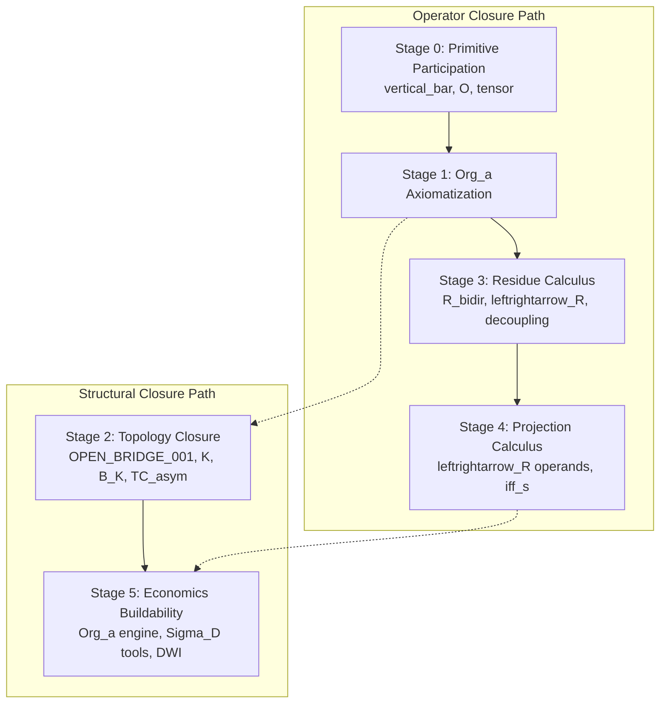

# Chapter 14: Governance, Claim Levels, and Induction Rules

## 14.0 The Critical Path Roadmap

To move the Mono-Process Framework from broad debt listing toward staged, rigorous resolution, the program defines two parallel critical paths: the **Operator Closure Path** and the **Structural Closure Path**. These paths enforce a strict order of buildability—downstream structures or application projections cannot be closed before their primitive mathematical operators are formally defined.



1. **Operator Closure Path**: Resolves the operational primitives, transition definitions, and residue relations. Primitive participation rules for the vertical bar operator (`|`) and Orientation Space ($O$) must be made explicit at Stage 0 before `Org_a` axioms can be closed at Stage 1. Similarly, Stage 3 (Residue Calculus) must separate memory states ($R$) from residue coupling ($\leftrightarrow_R$) before Stage 4 (Projection Calculus) can resolve mathematical constraints.
2. **Structural Closure Path**: Governs the progression of topological invariants and application domains. Stage 2 (Topology Closure) requires orientation space $O$ to participate in selection rules before `OPEN_BRIDGE_001` can close. Stage 5 (Economics Buildability) acts as the final integration domain, which becomes buildable only after the upstream operator and structural stages are fully resolved.

---

## 14.1 Claim Levels (L-Levels and C-Levels)

Terminology and results within the framework are categorized by their operational readiness and evidential strength.

### 14.1.1 Lexicon Validation (L-Levels)
The **Lexicon Validation System** tracks the operational readiness of every term [Source: MPF-CORE-V1 Sec 0].
- **L0 (Definition):** Internal terminology or notation only.
- **L1 (Observed):** Term has one model or run supporting one operational role.
- **L2 (Multi-Model):** Term has agreement across independent mechanism classes (e.g., Agent-based and PDE).
- **L3 (Verified):** Term has multi-model + multi-seed + falsification-passed support.

### 14.1.2 Claim Classification (C-Levels)
The strength of a research result or mathematical proof is governed by its **Claim Level (C-Level)**.
- **C0 (Axiom / Definition):** Internal foundation (Starting point Axiom 1.2.1).
- **C1 (Model-Relative):** Statement valid only inside a specific formal scaffold.
- **C2 (Simulation-Observed):** Outcome observed within a specific simulation regime.
- **C3 (Structural Comparison):** Comparison to external theory as resemblance or analogy.
- **C4 (Supported Internal):** Supported by multiple governed mechanisms and falsification.
- **C5 (Validate):** Requires external peer review and domain evidence.
- **C6 (Theorem):** Requires formal symbolic closure and universal mechanism independence.

---

## 14.2 Induction and Promotion Rules

The promotion of a term or claim from provisional to verified is a governed process.

**Formal Block 14.2.1: Promotion Thresholds**
$$ \text{Promotion}(L_n \to L_{n+1}) \iff \text{Evidence Pack} \in \text{Registry} $$

**Mandates:**
- **Trace-to-Core:** A term cannot reach L2 without an explicit process-rewrite using ε, R, and δ primitives.
- **Adversarial Tests:** Promotion to L3 or C4 requires an explicitly documented "red team" analysis of potential artifacts.
- **Contradiction Resolution:** If a simulation run contradicts a mathematical lemma, the lemma is downgraded to **contested** pending a formal derivation audit.

---

## 14.3 Living Research Governance Layer

The Mono-Process Program is maintained as a living research system rather than a static collection of claims. Every theorem, bridge, operator, invariant, and application projection exists within a governed evidence structure. Claims are not promoted solely by argument. Claims advance through formal definition, proof obligation, attack, evidence review, replication, and governance review.

The purpose of governance is not to protect claims from falsification. The purpose of governance is to ensure that falsification, support, revision, and retirement occur transparently and traceably. All support and failure events are recorded through campaign-linked audit trails.

**Governance Note:** The purpose of the governance layer is not to establish truth. Its purpose is to preserve the relationship between claims, evidence, dependencies, and revision history.

**Operational Ledger Rule (GOV-LIVE-001):**
Governance specifications describe intended structure, while live operational ledgers record current canonical state. Once a live ledger exists, proposal-shaped specifications and historical patch records no longer serve as operational authority. Operational governance state is read from:
- `governance/live/authority_manifest.json`
- `governance/live/department_registry.json`
- `governance/live/induction_queue.json`
- `governance/live/program_task_registry.json`
- `governance/live/research_debt_registry.json`
- `registry/db/acellorator_index.sqlite`

The live-ledger authority split is now operationally established. Historical specifications remain as schema and design-intent references only; they are not current authority.

**Governance-First Execution Gate (GOV-EXEC-002):**
Until the live governance sections and blocker tasks are explicitly satisfied, governance is the only admissible program lane. New department expansion, theorem expansion, bridge expansion, simulation expansion, and application expansion work remain frozen while the live Program Task Registry retains an active governance-only closure task.

**Induction Intake Gate (GOV-IND-002):**
Every new induction must satisfy both of the following before it is treated as active governed work:
- a canonical induction record exists in `registry/induction_registry.json`
- a live intake record exists in `governance/live/induction_queue.json`

The Analysis Intake discoverability binding is additionally recorded in `governance/live/research_debt_registry.json` as `DEBT_ANALYSIS_INTAKE_DISCOVERABILITY_001`. The Analysis Department crawl source set includes `departments/analysis_intake/induction_queue/queue_registry.json`; the queue remains preservation-first, with review and promotion tracked separately.

**Governance and Math Audit Domain Isolation (GOV-ISO-003):**
To ensure epistemic separation and prevent ontological confusion, repository governance audits and mathematical/theoretical audits are isolated as independent domains.
- **Repository Governance Audits**: Certify repository health, SSOT ownership, registry consistency, DB freshness, validation pipeline success, git workflow compliance, and agent compliance. Governance audits never evaluate proofs, lemmas, theorems, mathematical correctness, or research conclusions.
- **Mathematical Audits**: Verify mathematical correctness, proofs, lemmas, theorems, and simulation traces. They consume the repository health certificate (`repository_health_certificate.json`) to assume repository health, and must not repeat governance validation.

If either record is missing, the induction is ungoverned for program purposes and may not be used for promotion, dependency closure, or downstream planning.

The induction routing layer is now operationally established. Active provisional inductions have been backfilled into both the canonical induction registry and the live induction queue, and future induction work must enter through that same path.

**DB Governance Runtime Gate (PATCH_DB_GOVERNANCE_RUNTIME_001):**
Before applying patches, changing authority-bearing files, or resolving blocked dependencies, the agent must query the DB governance runtime first via `python scripts/query_governance.py context-capsule [--target <path-or-surface>] [--task <label>] [--level <summary|diagnostic|governance|forensic>]`, then `python scripts/query_governance.py current-state [--level <summary|diagnostic|governance|forensic>]`, `python scripts/query_governance.py freshness [--target <path-or-surface>] [--level <summary|diagnostic|governance|forensic>]`, `python scripts/query_governance.py authority --target <path-or-surface> [--authority-role <Q0_ROLE>] [--level <summary|diagnostic|governance|forensic>]`, `python scripts/query_governance.py authority --semantic <key> --semantic-type <type> [--level <summary|diagnostic|governance|forensic>]` when semantic ownership is the relevant question, `python scripts/query_governance.py patch-chain --patch-id <PATCH_ID> [--level <summary|diagnostic|governance|forensic>] [--summary]`, `python scripts/query_governance.py debt --status <open|partial|resolved|blocking|all> [--level <summary|diagnostic|governance|forensic>]`, `python scripts/query_governance.py events [--subject-id <id>] [--event-type <type>] [--limit <n>] [--level <summary|diagnostic|governance|forensic>]`, and `python scripts/query_governance.py reconcile-events [--subject-id <id>] [--patch-id <PATCH_ID>] [--event-type <type>] [--level <summary|diagnostic|governance|forensic>]` before requesting a patch decision with `python scripts/query_governance.py patch-gate --patch-id <PATCH_ID> --target <path-or-surface> [--level <summary|diagnostic|governance|forensic>] [--summary]` when needed. For Q0 partition surfaces, generic authority lookup is no longer admissible: the caller must declare the requested role explicitly as one of `REGISTRY_STATE_AUTHORITY`, `REGISTRY_WRITE_AUTHORITY`, `VALIDATION_INVOCATION_AUTHORITY`, `VALIDATION_REDUCTION_AUTHORITY`, `INSTRUCTION_AUTHORITY`, or `GENERATED_EVIDENCE`. Patch-chain also supports typed dependency semantics: if a patch declares `dependency_requirements`, each edge can be evaluated as `REQUIRES_COMPLETED_PREDECESSOR`, `REQUIRES_EXISTING_EVIDENCE`, `REQUIRES_SEMANTIC_RULE`, or `HISTORICAL_LINEAGE_ONLY` rather than collapsing every predecessor into a completed-success gate. The runtime emits current-state capsules and apply/block/defer decisions, and logs decisions in `governance_decision_log` when bootstrapped. `--summary` remains a compatibility alias for `--level summary`, and higher evidence levels retain progressively richer runtime surfaces up to full forensic output. The context capsule is the preferred runtime entrypoint because it composes the minimum operative summary from current-state, freshness, authority, patch-chain, debt, recent governance events, bounded replay reconciliation coverage, and any available semantic authority summary at request time. For non-blocking operation, the capsule uses a fast-path DB health summary and defers the deeper supersession-edge audit to the standalone DB health command. The refresh procedure is the governed `python scripts/db/snapshot_registries.py` command, which writes the explicit snapshot-refresh metadata that freshness reads. Freshness compares source-affecting changes against the stored source marker and runtime-only DB churn against the stored runtime marker; routine decision logs, event emission, and refresh metadata do not stale the source projection unless they move beyond the runtime marker. When a patch declares semantic targets, patch-gate consults semantic authority and records missing, superseded, or deprecated semantic authorities explicitly instead of silently allowing them. If freshness stays stale after refresh, the runtime output names the newer source change or refresh failure directly instead of pretending the refresh cleared it. The runtime now also records governance-significant changes as append-only event facts that can be queried without treating them as a replacement for registry authority, `python scripts/query_governance.py replay-events [--subject-id <id>] [--event-type <type>] [--limit <n>] [--level <summary|diagnostic|governance|forensic>]` can reconstruct a bounded diagnostic state from safe event types only, and `python scripts/query_governance.py reconcile-events [--subject-id <id>] [--patch-id <PATCH_ID>] [--event-type <type>] [--level <summary|diagnostic|governance|forensic>]` can compare that replayed state against registry authority without mutating it. If the runtime cannot classify the action, canonical registries and long-form docs remain the fallback authority surfaces.

**Deterministic Decision Cache (PATCH_ACCELERATOR_DETERMINISTIC_DECISION_CACHE_053):**
The governed runtime may reuse an exact validated prior result from `state/inference_governance/decision_cache.sqlite3` when the request semantics, capsule, authority, freshness, policy, candidate set, validator, and output schema dependencies match. A valid cache hit denies inference and returns the recorded result; a cache miss does not authorize inference by itself. Class A deterministic results and accepted constrained outputs may be cached after deterministic validation, while unvalidated free-form model output remains non-cacheable.

**Debt Discharge Command (GOV_DEBT_DISCHARGE_COMMAND_001):**
While the governance-first execution gate remains active, agents shall reduce debt in the live command order declared in:
- `governance/live/debt_discharge_command.json`

The current ordered sequence is:
1. `DEBT_GOV_LIVE_LEDGER_AMBIGUITY_001`
2. `DEBT_GOV_INDUCTION_ROUTING_001`
3. `DEBT_VALIDATOR_IMPORT_PATH_001`
4. `DEBT_GOV_TOOL_ROUTING_METADATA_001`
5. `DEBT_GOV_LEXICON_UNDERCLASSIFICATION_001`
6. `DEBT_GOV_DEPARTMENT_LAYOUT_001`
7. `DEBT_GOV_ECONOMICS_INDUCTION_001`
8. `DEBT_GOV_THEOLOGY_INDUCTION_001`
9. `DEBT_GOV_PHYSICS_SSOT_NORMALIZATION_001`

Each discharge step must report: command invoked, debt targeted, artifacts changed, validation command used, validation result, textbook synchronization status, remaining blockers, and next debt in sequence.

**Program Debt Extension Rule (GOV-PROG-DEBT-001):**
Debt outside governance must be treated by the same mechanism: explicit live command order, governed validation, and the same discharge report structure. The current non-governance command surface is `governance/live/program_debt_discharge_command.json`.

**Tool Routing Rule (GOV-TOOLS-ROUTE-001):**
Deterministic tool routing is governed by:
- `governance/live/tool_routing_manifest.json`

**Lexicon Reduction Rule (GOV-LEX-001):**
`DEBT_GOV_LEXICON_UNDERCLASSIFICATION_001` is reduced through `governance/live/lexicon_classification_manifest.json`. Governance closure requires classification of active authority-facing and induction-facing terms first; it does not by itself certify that the entire historical lexicon backlog is semantically complete.

**Department Layout Rule (GOV-DEPT-LAYOUT-001):**
Peer-directory normalization is governed by `governance/live/department_layout_manifest.json`. A peer root under `departments/` satisfies layout parity, but it does not by itself imply inducted department status or close later local-SSOT and local-AGENTS induction debt.

**Economics Induction Rule (GOV-ECON-IND-001):**
The Economics Department is inducted only when `departments/economics/department_ssot.md` and `departments/economics/AGENTS.md` both exist and the local department surface is bound into live authority. Detailed economics evidence and debt tracking may remain in `docs/economics/ssot/procedural_economics_ssot.md`.

**Theology Induction Rule (GOV-THEO-IND-001):**
The Theology Department is inducted only when `departments/theology/department_ssot.md` and `departments/theology/AGENTS.md` both exist and the local department surface is bound into live authority. Detailed theology governance and debt tracking may remain in `docs/theology/procedural_theology_ssot.md`.

**Documentation Induction Rule (GOV-DOC-IND-001):**
The Documentation Department is inducted only when `departments/documentation/department_ssot.md` and `departments/documentation/AGENTS.md` both exist and the local department surface is bound into live authority. Documentation synchronization may remain in `departments/documentation/department_ssot.md`.

Rigor level alone does not authorize tool use. Agents must resolve tool path, entry point, allowed-use class, invocation contract, and active/archive status through the live tool-routing manifest and its declared routing sources.

**Validation Invocation Rule (GOV-VALIDATE-001):**
Governed validation uses the module-path command:
- `python -m scripts.global_validate`

Direct file invocation via `python scripts/global_validate.py` has been restored to consistent behavior, but the module-path command remains the canonical governed invocation for documentation and agent routing.

Clean validation success is fail-closed. A clean `PASS` now requires every currently applicable required governed stage to complete with a clean successful terminal state and, where the stage contract expects substantive work, to complete that work explicitly. Skipped required work, missing required results, unknown terminal states, and unexpected zero-work conditions remain blocking. Non-blocking warnings remain visible in the global report and keep `clean_pass_eligible` false, but do not convert an otherwise successful validation process into `FAIL`. A valid no-applicable-work condition may remain non-blocking only when the stage contract explicitly permits it.

The supported Python test-environment contract is narrower than broad full-tree `pytest` collection. The minimal governed pytest path is `python -m pytest tests/governance_validation -q`, using the repo-local `.venv`, `requirements.lock.txt`, and the recorded Python 3.14.4 baseline from the dependency reproducibility policy. Broad `python -m pytest` remains outside the supported contract while legacy test-only imports such as `typer` and unresolved tool-package import assumptions remain ungoverned for that wider surface.

When a narrower deterministic subtask is sufficient, the validator can be sliced by stage through `--stages`, and the common surfaces are exposed as thin wrappers:
- `python scripts/validate_registry_surface.py`
- `python scripts/validate_governance_surface.py`
- `python scripts/validate_db_surface.py`
- `python scripts/validate_math_surface.py`
- `python scripts/validate_operational_surface.py`

**Active Tooling Debt Note (DEBT_VALIDATOR_IMPORT_PATH_001):**
The validator import-path issue is now resolved in `governance/live/research_debt_registry.json`. The canonical governed command remains `python -m scripts.global_validate`, direct invocation is behaviorally aligned, and the latest governed success artifact is `outputs/audits/global_health_report.json`. Historical records that mention the old failing direct invocation are retained as non-authoritative history.

---

## 14.3A Explicit Falsification Path

Within the Mono-Process Framework, falsification is not treated as the simple assignment of `False` to a proposition. Successful falsification is interpreted as the loss of the relational conditions required to maintain lawful closure. The condition therefore undergoes decoupling.

**Governed Path (MPF_EXPLICIT_FALSIFICATION_PATH_001):**

```text
Induction
     ↓
Candidate Condition
    ↓
Admissibility Evaluation
    ↓
Coupling
    ↓
Local Closure
    ↓
RT (stable local condition)
    ↓
Continuous Adversarial Attack
    ↓
Boundary Evaluation
    ↓
Admissibility Re-evaluation
     │
     ├── survives → RT Maintained
     └── fails → Partial Decoupling
                  ↓
          Loss of Boundary Support
                 ↓
           Increasing Symmetry
                 ↓
        Complete Local Decoupling
                 ↓
        Return to Symmetric Condition
                 ↓
         Reopened Research Debt
                 ↓
           New Induction Cycle
```

**Interpretation:**
A lawful condition exists only while sufficient relational support is maintained. A successful falsification attack does not destroy the condition; it removes the boundary conditions required to sustain local closure. As support fails, the condition progressively decouples. Increasing decoupling corresponds to increasing symmetry. Complete local decoupling returns the condition to a symmetric state and reopens research debt.

**Governance Consequence:**
Promotion within the program is never permanent. A promoted condition is read as "currently maintaining admissible local closure" rather than as permanently true. If future evidence removes sufficient support, the condition decouples and re-enters induction through research debt.

---

## 14.3B Department Instantiation Architecture

Within the governed research program, departments are not separate ontologies. They are local semantic instantiations of the same process ontology under shared global governance.

```text
Global Governance
        |
     RT/Core
        |
  Core Ontology
(Process, Relation, Continuation)
        |
  Department Instantiations
  Math | Physics | Economics | Theology | ...
        |
 Local Mandates, Evidence Rules, Semantic Interpretation
```

**Department Rule (DEPT_001):**
Every department inherits the same RT/Core, process-first ontology, and claim-humility requirements. A department may add local vocabulary, local review rules, and local evidence thresholds, but it may not override the global charter or introduce a new primitive ontology by relabeling projections.

**Department Root Rule (MPF_GOV_DEPARTMENT_INDUCTION_001):**
Departments are treated as first-class governed entities and shall exist as peer directories beneath the common `departments/` root. Each department must provide a local SSOT file and an `AGENTS.md` file before it enters the claim lifecycle.

**Operational Consequence:**
Economics, theology, information theory, and similar domains are treated as semantic windows into one continuing process rather than as independent foundations.

---

## 14.3C Theology Department Governance

The Theology Department (`procedural_theology_app`) is governed as a semantic projection domain rather than as a foundation of the mathematics.

**Local Governance Rule (DEPT_THEO_001):**
Theology-domain usage may express structural analogies, department-local interpretations, and bounded cross-domain `proof_app` comparisons. It may not claim doctrinal proof, metaphysical proof, or identity between RT and any theological doctrine from structure alone.

**Required Reading:**
- `docs/theology/procedural_theology_ssot.md`
- `docs/theology/GEMINI.md`

**Governance Note:**
Cross-domain portability of the formal system may increase confidence in framework invariance as a research program, but it does not function as deductive proof of theology, physics, or a Theory of Everything.

---

## 14.3D Mathematics-Physics Boundary Cleanup

The mathematics-facing and physics-facing layers of the program must remain distinct even when they share the same RT/Core.

**Cleanup Rule (MPF_CLEANUP_MATH_PHYS_BOUNDARY_001):**
The Mathematics Department defines and derives formal structure. The Physics Department interprets that structure as a possible physical model under separate claim governance. A formal derivation is not by itself a physics claim, and a failed physics correspondence does not by itself weaken the formal calculus.
This cleanup rule is now governed live by `governance/live/math_physics_boundary_manifest.json`.

**Routing Rule:**
- Formal questions route to mathematics.
- Physical-meaning questions route to physics.
- Ambiguous questions must be answered with explicit claim class and department scope.

**Required Physics Phrase:**
`Within the Physics Department interpretation...`

**Governance Note:**
This cleanup is an annotation rule and retrieval filter only. It does not reorganize headings, move files, or alter the SSOT structure.

**Reference:**
- `registry/governance/patches/MPF_GOV_DEPARTMENT_INDUCTION_001.json`
- `departments/README.md`
- `registry/governance/patches/MPF_CLEANUP_MATH_PHYS_BOUNDARY_001.json`
- `docs/governance/math_physics_boundary_cleanup.md`
- `governance/live/math_physics_boundary_manifest.json`
- `departments/physics/department_ssot.md`
- `departments/physics/AGENTS.md`

---

## 14.4 Live Formal Status Dashboard (LIVE_LINKED)

The dashboard provides the current operational state of the formal program. It is generated from registry data rather than narrative text. All claim-level decisions, campaigns, evidence reports, and review locks are reflected here. 

**Dashboard Authority (DASHBOARD_RULE_001):**
If the dashboard and chapter text disagree, the dashboard is authoritative until reconciliation occurs. This prevents stale narrative sections from overriding current evidence.

| Object ID | Type | Status | Claim Level | Dependencies | Active Campaigns | Evidence | Review Lock | Last Update |
| :--- | :--- | :--- | :--- | :--- | :--- | :--- | :--- | :--- |
| **AXIOM_1_2_1** | AXIOM | **LOCKED** | AXIOMATIC | 0 | - | - | - | 2026-05-29 |
| **OPEN_BRIDGE_001** | BRIDGE | **SUPPORTED** | **C1_DEFINED_PROVISIONAL / STRUCTURAL_ONLY** | 4 | LFCR_001, PD_CG_PATCH_004, Run 08 | 5 | - | 2026-07-19 |
| **TC_asym** | THEOREM | **REVIEW_LOCK** | REVIEW_LOCK | 1 | LFCR_001 | 0 | **LOCKED** | 2026-05-30 |
| **gravity_app** | APPLICATION | **REVIEW_LOCK** | **REVIEW_LOCK** | 3 | - | GRAVITY-APP-001 | **LOCKED** | 2026-06-17 |
| **L5_RIGOR_FORKED_ATTACK** | CLAIM | **SUPPORTED** | **C5** | 5 | CLS_003 | CLS_003_RUN_001 | - | 2026-06-16 |

---

## 14.5 Dependency Graph Registry

The formal program is represented as a directed dependency graph. Nodes represent axioms, definitions, operators, lemmas, theorems, bridges, invariants, application projections, campaigns, and evidence reports. Edges represent dependency, support, attack, falsification, update, and review-lock relations. Dependency edges determine promotion limits, review-lock propagation, and evidence scope. No claim may exceed the support level of unresolved required dependencies.

**Graph Principles:**
- Support propagates conservatively.
- Falsification propagates aggressively through **REQUIRED** dependencies.
- Speculative edges cannot promote claims.
- Blocking edges prevent promotion until resolved.

**Graph-Derived Claim Caps:**
| Object | Root Blocker | Current Cap | Reason |
| :--- | :--- | :--- | :--- |
| **TC_asym** | OPEN_BRIDGE_001 | **REVIEW_LOCK** | Current theorem wording still depends on a stronger participatory-closure reading than the supported bridge family currently authorizes. |
| **gravity_app** | OPEN_BRIDGE_001 | **REVIEW_LOCK** | Downstream of the supported bridge family, but bridge support alone does not authorize projection-level promotion. |

---

## 14.6 Review Lock Protocol

Review Lock is the formal state applied to claims whose required dependencies have failed, become unresolved, or entered contradiction. Review Lock does not imply that a claim is false; it indicates that the current support structure is insufficient. Claims under Review Lock may only exit through rewrite, reroute, downgrade, retirement, or retest procedures.

**Exit Pathways:**
- **rewrite**
- **reroute**
- **downgrade**
- **retire**
- **retest**

All Review Lock actions shall preserve historical traceability.

---

## 14.7 Campaign Registry

A campaign is a living governance object responsible for attacking, verifying, or reviewing a target claim. Campaigns maintain proof obligations, attack surfaces, evidence reports, simulation manifests, and textbook synchronization records. Campaigns remain active until supported, downgraded, falsified, retired, or superseded. Every active campaign shall possess a unique identifier and audit trail.

| Bridge ID | Bridge Name | Claim Under Attack | Linked Campaign | Status | Claim Level | Downstream Cap |
| :--- | :--- | :--- | :--- | :--- | :--- | :--- |
| **OPEN_BRIDGE_001** | Orientation-Closure Bridge (Topological Selection) | Orientation coherence conditions admissible knot-class selection but is not independently sufficient for closure stability. | LFCR_001; PD_CG_V2R; PD_CG_PATCH_004; Run 08 | **SUPPORTED** | **C1** | **STRUCTURAL_ONLY** |

**Current Bridge Details: OPEN_BRIDGE_001**
- **LFCR_001:** Earlier bridge formulation falsified under stress ablation (direct support failed).
- **PD_CG_V2R:** Re-audit confirmed orientation does not independently improve basin stability.
- **PD_CG_PATCH_004:** Reformulated bridge as a **Topological Selector**. Orientation is now a constraint on admissible topology $T$ in the chain $\Delta \to R \to T \to A_{adm} \to \delta_a$.
- **Run 08 (Satisfying Campaign):** Multi-seed TDA verification ($N=64$) established that orientation coherence narrows topological variance by $100\%$ ($Var(B_1)=0.000$ vs $0.085$). 
- **Governed Interpretation:** Within these models, the bridge family is recorded as **SUPPORTED** in the registry. The campaign artifacts remain evidence for the support path, while downstream claims remain independently gated.
- **Next Required Action:** Continue downstream claim-specific validation where needed; the bridge status itself is resolved.
- **Registry Support:** `OPEN_BRIDGE_001`, `OPEN_BRIDGE_001_v2`, and `OPEN_BRIDGE_001_v3` are all recorded as `SUPPORTED` in `registry/math/open_bridge_registry.json`.
- **Procedural Promotion:** `OPEN_BRIDGE_001_v3` carries `exit_path: RESOLVED` in the registry.

---

## 14.8 Evidence Integration Workflow

Evidence enters the program through mathematical review, simulation results, replication studies, or governance audits. Evidence alone does not modify theorem status; it must pass validation, produce an evidence report, and generate a governance review. Status changes propagate through the dependency graph according to claim-cap and review-lock rules. All updates shall be reflected in the textbook, registry system, and audit trail.

For the applied 046-049 sequence, the evidence inputs are the registered patch surfaces and witness artifacts already recorded in governance. The order remains plan, gate, then edit: the textbook is not changed until the integration gate authorizes it.

**Workflow Steps:**
1. **Launch:** Reproduced using the **Run Manifest Template**.
2. **Execution:** Matched models M0-M7 evaluated across 64+ seeds.
3. **Analysis:** Effect sizes and confidence intervals calculated.
4. **Decision:** Result categorized as SUPPORT, DOWNGRADE, or FALSIFY.
5. **Injection:** Textbook and registries updated via the **Update Patch Template**.

---

## 14.9 Missing and Provisional Formalisms

To complete the governance program, the following must be induced:

1.  **Contradiction Resolution Protocols:** [ **MISSING DEFINITION** ] How do we formally resolve conflicts between a C4 simulation result and a C6 theoretical theorem?
2.  **Promotion Thresholds:** [ **MISSING DEFINITION** ] What is the exact numerical or logical trigger for promoting a term from the Lexicon Gap Queue to the Canonical Lexicon?
3.  **Adversarial Standard:** [ **REQUIRES INDUCTION** ] What constitutes a sufficient "falsification vector" for a mathematical derivation?

---

## 14.10 Syntactic and Semantic Closure of the Core Calculus

To address the requirements identified in the formal system gap assessment, the core calculus of the Mono-Process Framework has been transitioned into a closed formal system ($\mathcal{L}_{COD}$):
1. **Syntax Closure:** Formalized object classes (States $\mathcal{S}$, Residues $\mathcal{R}$, Contexts $\mathcal{C}$, Operators $\mathcal{O}$, Relations $\mathcal{T}$, and Projections $\mathcal{P}_{\text{proj}}$) under Lemma L116 and Proof P110.
2. **Semantic Closure:** Defined valuation functions and boundary conditions under Lemma L117 and Proof P111, mapping failures to the $0$-state symmetry limit.
3. **Operator Algebra:** Closed compositional properties for the projection operator ($\Pi_A \otimes \Pi_B = \Pi_{A \cap B}$) under Lemma L118 and Proof P112.
4. **Inference Rules:** Sound natural deduction rules ($\delta_a$-Introduction and Elimination) under Lemma L119 and Proof P113.
5. **Model Class Consistency:** Satisfiability verified against the class of residue-weighted relational graphs under Lemma L120 and Proof P114.

These closures are canonically recorded in the math source registry and locked in the hash registry, resolving the primary formal system debt of the program.

## 14.11 Refined Foundational Ontology

Following the induction of the foundational ontology refinement packet, the root primitives of the Mono-Process Framework have been adjusted to shift the primitive from distinction itself to the relational condition permitting distinction:
1. **Primitive Relational Condition (`(*|*)`):** The minimal relational condition permitting the possibility of operational distinction, prior to distinction or observation.
2. **Symmetric Relational Biconditional (`<-S->`):** A domain-specific biconditional representing mutual necessity between the primitive condition and the admissibility of distinction, rather than classical logic equivalence. Formally:
   \[
   (*|*) \Leftrightarrow_S \delta_a(\mathcal{E} \neq 0)
   \]
3. **Emergent Gradient (`(A|E)`):** The Affect-Effect gradient emerging co-dependently once admissible distinction is established, where Affect ($A$) represents relational influence pressure and Effect ($E$) represents realized consequence.

This refined ontology is formalized in Lemma L121 and verified in Proof P115, transitioning the framework from a "distinction-first" system to a "relation-prior" system that avoids unvalidated background substrates.

## 14.12 Relational Transition Core Equivalence

To resolve the remaining active induction gaps (Tasks 7.1 and 7.2), the framework defines the conditions under which precursor divisions stabilize and maps them to the core calculus:
1. **Stabilization Criterion:** A precursor distinction $D(*\mid*)$ is prevented from decaying to the $0$-state symmetry limit if and only if it exceeds the context floor $\epsilon_a$ and forms a triadic closure cycle $K$, satisfying the 3-Peak Rule. This is formalized in Lemma L122 and Proof P116.
2. **Core Equivalence:** The relational transition form $RT := [D \neq 0 \langle * \rangle_x D = 0]$ and the canonical core expression $(\mathcal{E} \neq 0) \Leftrightarrow_R \delta_a(\mathcal{E} > 0)$ are process-equivalent under the projection basis $\Pi_A$. This is formalized in Lemma L123 and Proof P117, proving that both represent co-dependent locks that map failure cases identically onto the $0$-state.

These proofs and theorems are registered under minimal theorem MT-RT-001 and verified in proof obligation PO-RT-002, closing the key logical gaps of the Phase II roadmap.

## 14.13 Asymmetry-to-Orientation Selection Operator

To establish the mathematical bridge between relational asymmetry and orientation selection (Gap G1), the framework introduces:
1. **Asymmetry Ratio:** The directed distinction asymmetry metric $\Omega_a(S_1, S_2)_c = \frac{D(S_1 \mid S_2)_c}{D(S_2 \mid S_1)_c}$ is bounded within $[\epsilon_a D_{\max}^{-1}, \epsilon_a^{-1} D_{\max}]$ under the context floor constraint $\min_i D(S_i \mid S_{j \neq i}) \ge \epsilon_a$. This prevents division-by-zero singularities and is formalized in Lemma L124 and Proof P118.
2. **Selection Operator:** The selection operator $O^*(\Omega_a)_c$ uniquely resolves to an oriented local reference frame $-(i) \in \mathcal{O}_{\text{adm}}$ minimizing local relational friction/pressure $\mu_{\text{rel}}$ if and only if $\Omega_a \neq 1$. When perfect symmetry exists ($\Omega_a = 1$), the selector is undefined. This is formalized in Lemma L125 and Proof P119, showing that symmetry breaking is a prerequisite for local orientation emergence.

These additions are registered under minimal theorem MT-ASYM-001 and verified in proof obligation PO-ASYM-001, providing the first explicit mathematical pathway from relational distinction to orientation selection without reifying a background spatial container.
## 14.14 Sign Semantics and Generative Pathways

To resolve the gap regarding sign representation (Task 7.3), the framework formalizes sign polarity ($+$, $-$) as active process dynamics along directed pathways:
1. **Pathway Polarities:** Rather than numeric constants, $+$ denotes *additive accumulation* (growth of relational crossing layers) and $-$ denotes *exclusion truncation* (filtration or constriction of crossing layers). This is formalized in Lemma L126.
2. **Dynamic Mapping & Isomorphism:** The mapping function $\text{Sign}(\Delta P)_c$ partitions transitions into $\{+, -, 0\}$ based on the net change in relational crossings. Proof P120 establishes that the algebraic sign product composition rules (such as $(-)(-) = +$) map isomorphically to the process-level dynamics of consecutive exclusions resulting in external recovery.

These additions are registered under minimal theorem MT-SIGN-001 and verified in proof obligation PO-SIGN-001, providing a dynamic process foundation for sign semantics.

## 14.15 Evaluation Architecture and Governance Homomorphism

To resolve the gap regarding the evaluation architecture (Task 7.4), the framework formalizes the structural relationship between metadata governance checks and relational admissibility:
1. **Governance Homomorphism:** The platform's metadata governance system $\mathcal{G}$ (composed of code locks, hashes, and validation checks) is defined as a formal category-theoretic homomorphism of the underlying relational admissibility process $\mathcal{E}$ under mapping $f$.
2. **Category Functoriality:** Proof P121 verifies that $f$ behaves as a covariant functor preserving identity check morphisms and sequence compositions, guaranteeing that the platform validation rules represent a homomorphic projection of the core calculus itself rather than arbitrary external constraints.

These mappings are registered under minimal theorem MT-GOV-001 and verified in proof obligation PO-GOV-001.

## 14.16 Functorial Braid Projection and Confinement

To resolve the gap regarding functorial mapping to topological braid spaces (Task 7.5), the framework formalizes the translation from relational updates to geometric confinement states:
1. **Braid Projection Functor:** The projection mapping $F_{\text{proj}}: \mathcal{E} \to \mathcal{B}$ maps the category of relational graph transitions to the category of topological braids, acting as a covariant functor preserving identity transitions and sequential compositions. This is formalized in Lemma L128 and verified in Proof P122.
2. **Confinement Basin Stability:** Braid closures (knots/links) map to persistent relational basins. Lemma L129 and Proof P123 establish that the topological invariants of the closed braid configuration correspond to conserved qualities protected by the admissibility filter, preventing basin decay to the symmetric ground state.

These mappings are registered under minimal theorem MT-BRD-001 and verified in proof obligation PO-BRD-001.

## 14.17 Polarity Closure and Nested Semantics

To resolve the gap regarding nested whole-relation aspects connecting closure and polarity (Task 7.6 / PALG-QUEUE-001), the framework formalizes the binary polarity balance in process dynamics:
1. **Nested Polarity Equivalence:** The primary constraint realization axiom is shown to be recursively equivalent to the polarity closure loop: $(\mathcal{E} \neq 0) \iff_R \delta_a(\mathcal{E} > 0) \iff_R [(-1) \iff_R (+1)]$. This is formalized in Lemma L130 and verified in Proof P124.
2. **Aspect Non-Separability:** The aspects of exclusion ($-1$) and accumulation ($+1$) represent coordinates of a single indivisible feedback loop, meaning that ablated component studies distort the entire relational structure.

These mappings are registered under minimal theorem MT-PALG-001 and verified in proof obligation PO-PALG-001.

---

## Summary of Chapter 14 Dependencies

- **Chapter 1** provided the core primitives that all claims must trace back to.
- **Chapter 7** provided the extraction metrics used in evidence packs.
- **Chapter 12** demonstrated the physical applications that require this governance to avoid overclaim.
- **Chapter 13** demonstrated the projection of organizational wealth and economic behavior.

By enforcing these governance and induction rules, we ensure that the Mono-Process Mathematical Program remains a rigorous scientific and mathematical endeavor, preserving epistemic humility while building a robust, evidence-based understanding of recursive process dynamics.

\pagebreak

