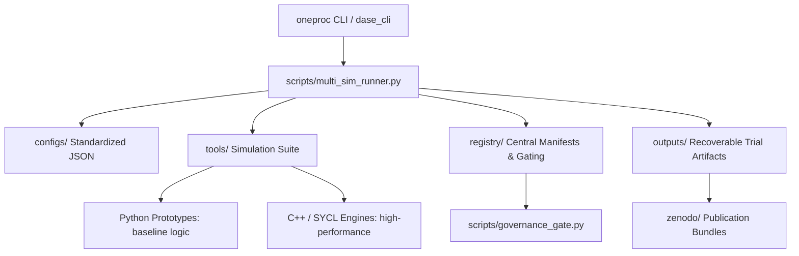

# Acellorator Project: Ecosystem Architecture and Simulation Suite Summary

## 1. Governance and Runtime Context

> [!NOTE]
> **Required Runtime Note (Governance Pass)**
> - **Local Governance:** Found and applied (local [GEMINI.md](file:///D:/projects/acellorator/GEMINI.md) and [AGENTS.md](file:///D:/projects/acellorator/AGENTS.md) govern execution).
> - **Active Claim Classification:** C4 (Tooling ecosystem / validation level) and C1-C2 (Operational tools).
> - **Ontological Level:** Operational, analogical, and interpretive modeling of process dynamics.
> - **Observational Limits:** Scoped to simulated model behaviors; does not constitute claims of physical or universal truth.
> - **Compliance:** Verified compliant with Compliance Charter v2.3 ([compliance_charter_v2_3.json](file:///D:/projects/acellorator/registry/compliance_charter_v2_3.json)).

---

## 2. Core Philosophy: The Mono-Process Framework (MPF)

The Acellorator project is a **governed research workspace** designed to run, compare, and constrain simulations exploring process continuation and admissibility. It is built upon the **Mono-Process Framework (MPF)**, a process-first framework. 

### The Core Inseparable Principle Lock
The foundational claim of MPF is that distinguishability and continuation are inseparable aspects of one recursive process. This is formally expressed as:

$$\mathbf{(ℰ \neq 0) \Leftrightarrow_R \delta(ℰ > 0)}$$

- **$(ℰ \neq 0)$ (Mismatch / Stress):** The existence of distinction or gradient.
- **$\delta(ℰ > 0)$ (Continuation / Action):** The selection of a next state or continuation event.
- **$\Leftrightarrow_R$ (Recursive Binding):** Inseparable aspect binding, mediated by the memory/trace of past interactions, represented by **Residue ($R$)**.
- *Governance Warning:* The framework must not be interpreted as a geometry-first, topology-first, operator-first, or physics-first master equation. Geometries and topologies emerge only as stabilized process projections of this recursive relationship.

### The Four Foundational Laws
All models and mathematical lemmas are constrained by four master rules:
1. **3-Peak Rule (T001):** Stability requires $N \ge 3$ relational crossings (complexity is a structural necessity).
2. **Singularity Rebound (SING-001):** The singularity is a recursive trigger state for renewed deviation, rather than an endpoint.
3. **Tertiary Node Structure (L043):** Process persistence during interaction requires functional partitioning into Input ($I$), Output ($O$), and Residue ($R$).
4. **Topology-Geometry Biconditional (L045):** Geometry (relational accessibility) and topology are co-conditioning projections of the underlying process.

---

## 3. Workspace Architecture & Execution Pipeline

The repository operates as a structured research environment that integrates mathematical theory with computational models.

### Key Workspace Components
- **`tools/`**: Contains the source directories for the simulation suite. Dual-implementation is standard: Python prototypes provide readable reference logic, and C++ ports (optimized with AVX2 or SYCL for GPU execution) provide high-performance computation.
- **`registry/`**: The workspace control plane. Houses the lexicon database, path mappings, tool manifests, and validation records.
- **`configs/`**: Standardized JSON files containing parameters and seeded initial conditions.
- **`outputs/`**: All simulation runs output deterministic, recoverable data files (CSV, JSON, NPZ) to ensure complete auditability.
- **`scripts/`**: Governing orchestration scripts for convergence testing, Python/C++ regression, and claim gate checks.

### Execution Interfaces
1. **`oneproc` CLI Wrapper:** The central python module ([oneproc/](file:///D:/projects/acellorator/oneproc)) acts as the Governed Agent Residence CLI Wrapper. It provides commands like `init`, `run`, `worker`, and `validate-paper` to enforce lexicon compliance and check claim thresholds before execution.
2. **Orchestrator (`multi_sim_runner.py`):** Drives parallel parameter runs, injects seeds, aggregates metrics, computes 95% confidence intervals for Uncertainty Quantification (UQ), and emits governance packets.
3. **`dase_cli`:** Interactive command-line driver executing high-performance compiled backends (such as the Phase 4B and IGSOA Complex engines) using single-line JSON commands.

---

## 4. The Simulation Suite: Twin Tracks

The ecosystem divides its 38 tools into two primary research tracks: Accelerator Diagnostics and Mono-Process Verification.

### Track A: Accelerator Diagnostics (Longitudinal & Transverse Physical-Analogs)
These models simulate standard accelerator physics equations to act as comparative baselines and testing structures for beam diagnostics.

- **`linac_sim` / `linac_sim_cpp` (C2 certified):** A linear proton accelerator model. Evaluates longitudinal tracking through RF gaps ($E(t) = E_0 \sin(\omega t + \phi)$) and transverse focusing lenses using relativistic momentum updates that preserve the speed of light limit ($v < c$) by construction. Tracks RMS beam size, geometric and normalized RMS emittance, and circular aperture losses.
- **`accelerator_sim_v1` / `accelerator_sim_v1_cpp` (C1):** A reduced 6D bunch tracking simulator carrying $(x, p_x, y, p_y, z, \delta)$ coordinates through quadrupole lenses, drift regions, and RF kicks. Excludes space charge and wakefields.
- **`circular_accelerator_sim_v1` / `circular_accelerator_sim_v1_cpp` (C1):** A ring accelerator simulator that wraps the longitudinal $z$ coordinate turn_app-by-turn_app and applies a momentum-compaction slip once per turn_app.

### Track B: Mono-Process Verification (Aspect-Binding & Admissibility Dynamics)
These simulators represent the core testing ground for the mathematical structures of the Mono-Process Framework.

- **`agent_based_sim_v1` / `agent_based_sim_v1_cpp` (C4 / C1):** Swarm simulation where agents move in phase_app-space and possess internal states ($\phi$). Bounded by a Causal Sphere of Influence (CSI) radius ($R_c$). Simulates phase_app-locking and local mismatch ($\epsilon$) evolution.
- **`ca_admissibility_sim_v1` / `ca_admissibility_sim_v1_cpp` (C4 / C1):** A continuous 2D Cellular Automata where updates to cells are only allowed (admissible) if the local gradient exceeds an internal **Residue ($R$)** threshold, verifying "Zero Logic" (where zero is a state of symmetry, not empty space).
- **`graph_dynamics_sim_v1` / `graph_dynamics_sim_v1_cpp` (C4 / C1):** Dynamic network rewiring. Edges decouple (break) when node phase_app stress exceeds a threshold, and recouple (form) when states align, mapping out the emergence of topological corridors.
- **`stochastic_sim_v1` / `stochastic_sim_cpp` (C4):** Overdamped Langevin SDE tracking Kramers escape rates out of potential wells, mapping how a continuous noise/deviation floor ($\sigma$) triggers discrete threshold-crossing events.
- **`kuramoto_sim_v1` / `kuramoto_sim_v1_cpp` (C4 / C1):** 1D ring oscillator networks simulating local phase_app-locking and the emergence of partially synchronized, metastable "shelf regimes" separated by phase_app lags.
- **`rd_moving_boundary_sim_v1` / `rd_sim_cpp` (C4 / C2):** Reaction-Diffusion system where the spatial domain of admissibility ($D$) dynamically deforms, grows, and fractures based on the local pressure of the active signal process ($S$).
- **`lb_fluid_sim_v1` / `lb_fluid_sim_v1_cpp` (C4 / C1):** A 2D Lattice Boltzmann fluid simulation featuring dynamic erosion. Fluid momentum (load channel) erodes solid boundaries (closure channel) when shear stress exceeds a threshold, modeling dynamic corridor erosion.
- **`symplectic_sim_v1` / `symplectic_sim_v1_cpp` (C4):** Symplectic Verlet/Leapfrog integration of a nonlinear pendulum Hamiltonian system, verifying long-term energy conservation and phase_app-space area preservation (Liouville's theorem).
- **`fsa_rule_engine_sim_v1` / `fsa_rule_engine_sim_v1_cpp` (C4 / C1):** Boolean state-machine rule engines where agent transitions are gated by a strict admissibility table (e.g., forbidding symmetric states, requiring minimum accumulated residue).
- **`signal_scope_phase_continuation_engine` (C4):** High-rigor, AVX2-accelerated simulator tracking phase_app continuation, residue closure, and survivability gating metrics under stress-test input surfaces.
- **`satp_higgs_sim_v1` / `satp_higgs_sim_cpp` & `satp_higgs_3d_sim_v1` / `satp_higgs_3d_sim_cpp` (C4):** Finite-difference solvers modeling coupled 2D and 3D scalar field dynamics under symmetry-breaking potentials.

### Analytical and Support Engines
- **`tda_module_v1` / `tda_module_v1_cpp` (C4):** Topological Data Analysis module analyzing Betti-0 connected component counts to measure structural configuration across model runs.
- **`spectral_analysis_v1` / `spectral_analysis_v1_cpp` (C4):** Calculates spatial and temporal power spectral densities, mapping dominant power fractions.
- **`info_metrics_module_v1` / `info_metrics_module_v1_cpp` (C4 / C1):** Calculates information theoretic metrics (Shannon entropy, joint entropy, complexity) on simulation state vectors.
- **`parameter_optimizer_v1` / `parameter_optimizer_v1_cpp` (C4):** Optimization harness conducting deterministic random search sweeps to locate stable regime parameters.
- **`bifurcation_analyzer_v1` / `bifurcation_analyzer_v1_cpp` (C1):** Evaluates parameter ramps to map bifurcation diagrams and Lyapunov exponents.
- **`mc_ensemble_sim_v1` / `mc_ensemble_sim_v1_cpp` (C4):** Orchestrates large parallel Monte Carlo parameter sweeps.
- **`falsification_suite_v1` / `falsification_suite_v1_cpp` (C1):** Governed harness for running negative controls.

---

## 5. Verification and Governance Safeguards

The project enforces strict controls to prevent claim escalation and term dilution.

### The Rigor Scale (R0–R4 / C0–C6)
Tool verification is distinct from claim validation:
- **R0/C0:** Existing tool, no verification.
- **R1/C1 (Verified):** Runs successfully in smoke paths.
- **R2/C2 (Measured):** Outputs deterministic, uniform reports.
- **R3/C3 (Hardened):** Emits seed variance and supports falsification/negative controls.
- **R4/C4 (Certified):** Cross-model, multi-seed, falsification-ready evidence schema completed (21 tools certified).

### Hardened Claim Gating
The validation gate ([scripts/governance_gate.py](file:///D:/projects/acellorator/scripts/governance_gate.py)) evaluates research outputs automatically. 
- **Template V2 Enforcement:** Ensures that all generated technical papers use standard headers and begin their conclusions with the humble prefix: *"Within these models..."*
- **Falsification Gating:** C4+ claims require passing four independent falsification vectors (FV-1 to FV-4) defined in [falsification_standard_v1_0.json](file:///D:/projects/acellorator/registry/falsification_standard_v1_0.json).
- **Lexicon Induction Gate:** Unresolved terminology must go through [lexicon_gap_queue.json](file:///D:/projects/acellorator/registry/lexicon_gap_queue.json) as `GAP_OPEN` and pass validation sweeps before entering the canonical vocabulary registry ([lexicon_canonical.json](file:///D:/projects/acellorator/registry/lexicon_canonical.json)).

### Living SSOT Adversarial Hardening
Adversarial hardening is maintained as a living process to absorb critiques and prevent hidden assumptions from creeping into the code or theory. Anchored in `MPF_ADV_HARDENING_SERIES_001_GOVERNANCE_ANCHOR`, it sequentially reviews:
1. Ontology leakage (preventing code artifacts from being cited as physical reality).
2. Meta-level declaration.
3. Whole-expression compliance (preventing aspect separation from being treated as ontological dualism).
4. Aspect decomposition boundaries.
5. Array layout and execution sequence isolation.

---

## 6. Document and Textbook Alignment

At the conclusion of lexicon and code patches, the project-wide textbook [mono_process_textbook_complete.md](file:///D:/projects/acellorator/docs/textbook/mono_process_textbook_complete.md) is audited to ensure all references to operators, law families, and simulation metrics match the active entries in the central registries. Official publications are packaged in [zenodo/](file:///D:/projects/acellorator/zenodo) with full SHA256 provenance manifests matching the run results.

---
**Standard ID:** MPF-PROJECT-MAP-001  
**Status:** FULLY MAPPED (L3/C4)  
**Compliance:** [Compliance Charter v2.3](file:///D:/projects/acellorator/registry/compliance_charter_v2_3.json)  
**Verification Date:** 2026-06-21  
