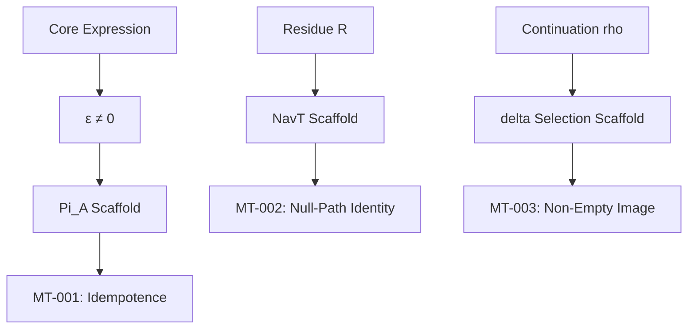

# Atlas: Derivation Graph

This document maps the logical derivation chains within the Mono-Process Framework, tracing the steps from foundational expressions to theorem candidates.

## Scope & Governance
- **Claim level**: mathematical cartography only.
- **Non-claims**: no theorem elevation, no global closure, no physics validation.
- **Failure modes preserved**: graph implies unproven closure; dependency direction reversal; hidden theorem elevation.

## Core Derivation Chains

### 1. Admissibility Chain (Pi_A)
- `Foundation: Core Expression` -> `Constraint: ε ≠ 0` -> `Scaffold: Pi_A Mapping` -> `Theorem: MT-001 (Idempotence)`.

### 2. Transport Chain (NavT)
- `Foundation: Residue R` -> `Scaffold: NavT Transport` -> `Proposition: MT-002 (Null-Path Identity)`.

### 3. Existence Chain (delta)
- `Foundation: Continuation rho` -> `Scaffold: delta Selection` -> `Lemma: MT-003 (Non-Empty Image)`.

## Logical Step Map

## Cross-References
- Codex master index: `docs/math/codex_master_index.md`
- Codex theorem program: `docs/math/codex_volume_4_theorem_program.md`
- Minimal theorems registry: `registry/math/minimal_theorems_registry.json`
- META004 registry: `registry/math/meta004_derivation_graph_atlas_registry.json`

---
[Back to Codex Master Index](codex_master_index.md)
