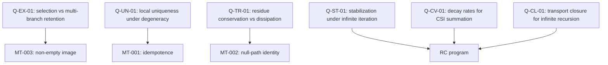

# Atlas: Open Question Dependency Map

This document maps **open questions** to the local theorem program and campaign topology. It is a navigation artifact; it does not suppress open questions or imply formal resolution.

## Scope & Governance
- **Claim level**: mathematical cartography only.
- **Non-claims**: no theorem elevation, no global closure, no physics validation.
- **Failure modes preserved**: open question suppression; hidden theorem elevation; graph implies unproven closure.

## Question → Theorem Anchors

## Question → Campaign Topology
- Stability/convergence questions typically route through RC011–RC031 (selection/transport refinement and structural formalization).
- Operator dynamics questions cross-cut MT-001..MT-003 and the proof-elevation campaign (obligation handling without automatic promotion).

## Cross-References
- Open questions narrative map: `docs/math/open_questions_map.md`
- Codex open frontiers: `docs/math/codex_volume_5_counterexample_and_open_frontiers.md`
- Codex theorem program: `docs/math/codex_volume_4_theorem_program.md`
- META004 registry: `registry/math/meta004_derivation_graph_atlas_registry.json`

---
[Back to Codex Master Index](codex_master_index.md)
