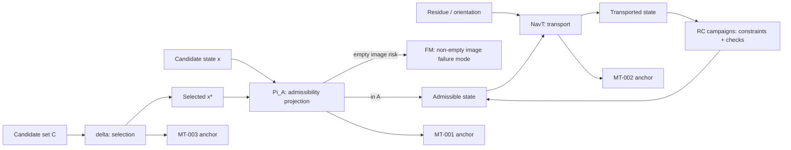

# Atlas: Operator Flow Map

This document provides a **cartographic** view of how core operators and constraint checks flow through the local theorem and campaign layers. It is a navigation artifact only.

## Scope & Governance
- **Claim level**: mathematical cartography only.
- **Non-claims**: no theorem elevation, no global closure, no physics validation.
- **Failure modes preserved**: operator overgeneralization; hidden theorem elevation; validation governance bypass.

## Operator Flow (High Level)

## Atlas Notes (Non-Normative)
- `Pi_A` constrains states into an admissibility window; MT-001 concerns idempotence under stable admissibility.
- `NavT` transports residue/orientation; MT-002 concerns identity on null-path transport.
- `delta` selects from candidate sets; MT-003 requires non-empty admissible image for continuation events.

## Cross-References
- Codex master index: `docs/math/codex_master_index.md`
- Codex theorem program: `docs/math/codex_volume_4_theorem_program.md`
- Operator relationship overview: `docs/math/operator_relationship_overview.md`
- Minimal theorems registry: `registry/math/minimal_theorems_registry.json`
- META004 registry: `registry/math/meta004_derivation_graph_atlas_registry.json`

---
[Back to Codex Master Index](codex_master_index.md)
