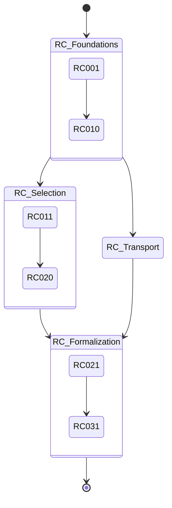

# Atlas: Recursive Campaign Topology

This document maps the topological structure and chronological progression of the Recursive Convergence (RC) program.

## Scope & Governance
- **Claim level**: mathematical cartography only.
- **Non-claims**: no theorem elevation, no global closure, no physics validation.
- **Failure modes preserved**: false topological completion; open question suppression; validation governance bypass.

## Topological Phases

### Phase 1: Foundational Stability (RC001 - RC010)
- **Focus**: Derivation closure, fixed-point scaffolds.
- **Topology**: Linear progression with local feedback loops for stability.

### Phase 2: Selection & Transport (RC011 - RC020)
- **Focus**: Branch explosion limits, selection drift.
- **Topology**: Branching structure with aggressive pruning rules.

### Phase 3: Structural Formalization (RC021 - RC031)
- **Focus**: Nonlocal transport closure, multi-branch composition.
- **Topology**: Complex networked dependencies between transport and selection.

## Campaign Flow

## Cross-References
- Codex RC volume: `docs/math/codex_volume_3_recursive_constraint_campaigns.md`
- META004 registry: `registry/math/meta004_derivation_graph_atlas_registry.json`

---
[Back to Codex Master Index](codex_master_index.md)
