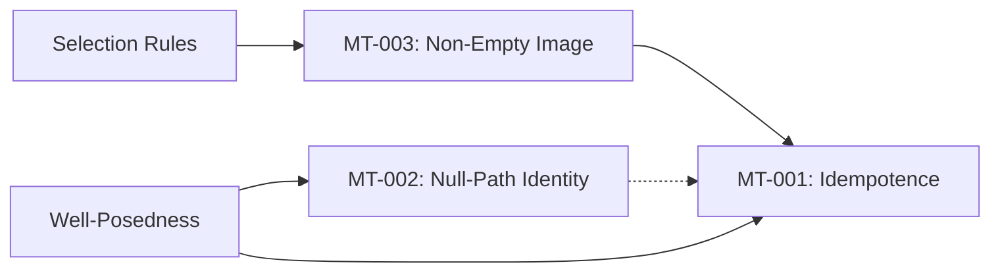

# Atlas: Theorem Dependency Graph

This document provides a map of the formal and conceptual dependencies between the local theorem candidates MT-001 through MT-003.

## Scope & Governance
- **Claim level**: mathematical cartography only.
- **Non-claims**: no theorem elevation, no global closure, no physics validation.
- **Failure modes preserved**: dependency direction reversal; hidden theorem elevation; graph implies unproven closure.

## Dependency Matrix

| Theorem | Primary Dependency | Secondary Dependency | Status |
| --- | --- | --- | --- |
| **MT-001** | stable admissibility (SA) | Pi_A functional form | Consolidated |
| **MT-002** | locally closed state (NI) | NavT functional form | Consolidated |
| **MT-003** | non-empty image (NEI) | delta selection rules | Consolidated |

## Cross-Theorem Interlock
- **MT-003 Validity** is a prerequisite for **MT-001 Idempotence** (an empty image has trivial idempotence).
- **MT-002 Stability** supports the stability of admissibility windows required for **MT-001**.

## Dependency Graph

## Cross-References
- Codex theorem program: `docs/math/codex_volume_4_theorem_program.md`
- Theorem lineage overview: `docs/math/theorem_lineage_overview.md`
- Minimal theorems registry: `registry/math/minimal_theorems_registry.json`
- Proof elevation campaign: `registry/math/proof_elevation_campaign_registry.json`

---
[Back to Codex Master Index](codex_master_index.md)
