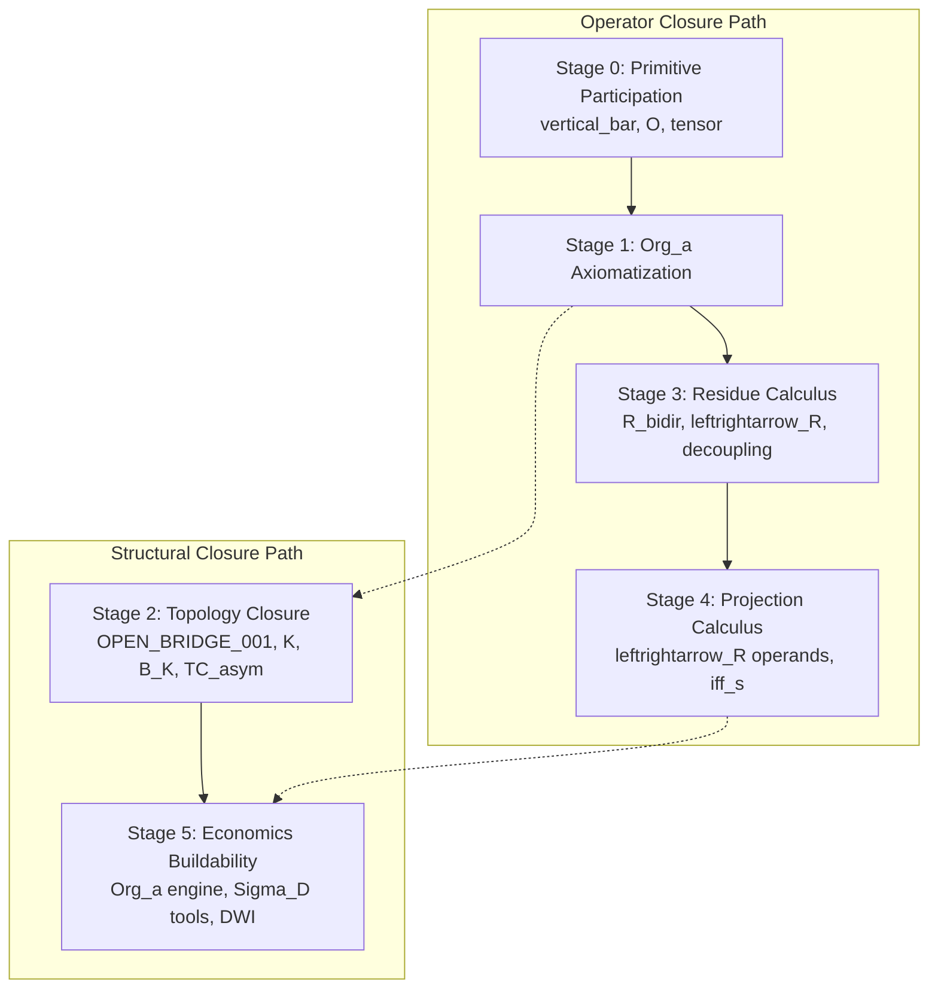

# Mono-Process Mathematical Program: End-to-End Textbook Draft

## Table of Contents

### Chapters
1.  [Chapter 1: Foundations: Process, Distinction, and Continuation](#chapter-1-foundations-process-distinction-and-continuation)
2.  [Chapter 2: Residue, Memory, and Recursive Closure](#chapter-2-residue-memory-and-recursive-closure)
3.  [Chapter 3: Distinction Relations and Directed Difference](#chapter-3-distinction-relations-and-directed-difference)
4.  [Chapter 4: Symmetry and Asymmetry Domains](#chapter-4-symmetry-and-asymmetry-domains)
5.  [Chapter 5: Orientation and Direction](#chapter-5-orientation-and-direction)
6.  [Chapter 6: Admissibility Operators](#chapter-6-admissibility-operators)
7.  [Chapter 7: Metric and Statistical Projections](#chapter-7-metric-and-statistical-projections)
8.  [Chapter 8: The Floor $\epsilon$ and Regularization](#chapter-8-the-floor-epsilon-and-regularization)
9.  [Chapter 9: Composite Directional Coupling](#chapter-9-composite-directional-coupling)
10. [Chapter 10: Arbitration, Selection, and Realization](#chapter-10-arbitration-selection-and-realization)
11. [Chapter 11: Topology, Knots, Braids, and Projection](#chapter-11-topology-knots-braids-and-projection)
12. [Chapter 12: Field, Matter, Energy, and Gravity Applications](#chapter-12-field-matter-energy-and-gravity-applications)
13. [Chapter 13: Economics_app: Organizational Wealth as a Projection of Distinction Structure](#chapter-13-economics_app-organizational-wealth-as-a-projection-of-distinction-structure)
14. [Chapter 14: Governance, Claim Levels, and Induction Rules](#chapter-14-governance-claim-levels-and-induction-rules)
    - 14.1 Claim Levels (L-Levels and C-Levels)
    - 14.2 Induction and Promotion Rules
    - 14.3 Living Research Governance Layer
    - 14.4 Theorem Status Registry
    - 14.5 Dependency Graph Registry
    - 14.6 Review Lock Protocol
    - 14.7 Campaign Registry
    - 14.8 Evidence Integration Workflow

### Appendices
- [Appendix A: Complete Symbol Glossary](#appendix-a-complete-symbol-glossary)
- [Appendix B: Operator Registry](#appendix-b-operator-registry)
- [Appendix C: Induction Checklist](#appendix-c-induction-checklist)
- [Appendix D: Claim-Level Governance](#appendix-d-claim-level-governance)
- [Appendix E: Simulation Evidence Index](#appendix-e-simulation-evidence-index)
- [Appendix F: Known Missing Definitions and Open Bridges](#appendix-f-known-missing-definitions-and-open-bridges)
- [Appendix G: Sources and References](#appendix-g-sources-and-references)

---
**Historical Root Condition (legacy residue):**
$$ RT := [(\mathcal{E} \neq 0) \iff_R \delta_a(\mathcal{E} > 0)] $$
This legacy notation is retained as historical residue. The canonical RT binding block in Section 1.2 governs the current RT_core form.

\pagebreak

# Chapter 1: Foundations: Process, Distinction, and Continuation

## 1.1 The Primacy of Process

In the Mono-Process Framework, the fundamental constituent of the model is not the "object," "field," or "particle," but the **process** itself. Within this framework, what we perceive as stable entities are treated as stabilized recursive projections of an underlying activity.

**Formal Statement 1.1.1: Ontological Priority**
$$ \text{Process} \implies \text{Projection} \mapsto \text{Observable}_{\text{app}} $$

**Commentary:**
This establishes that all observable properties (marked with the $_app$ suffix) are derived from a more primitive recursive activity. Objects do not "interact"; rather, the underlying process stabilizes into relational patterns that are reconstructed by an embedded observer as "matter," "space," or "energy."

---

## 1.1A Continuation-First Reduction

Within the current continuation-first reduction, process is treated as ontologically prior to distinction. "Prior" here denotes dependency, not temporal ordering. Distinction is read as tension internal to a continuing process undergoing lawful resolution rather than as an isolated primitive detached from continuation.

**Formal Reduction 1.1A.1: Process-First Dependency**
$$ \text{Process} \succ_{\text{ont}} \text{Distinction} $$
$$ \text{Distinction} := \text{tension internal to continuing process under admissible resolution} $$

**Primary Aspects (Conceptual Reduction Only):**
1. **Left Primary - Exclusion:** Generates admissible non-zero distinction and yields realized difference.
2. **Right Primary - Continuation:** Maintains realized distinction through ongoing coupling and yields persistence.

**Process Reading:**
The current conceptual sequence is:
$$ \text{Realization} \to \text{Coupling} \to \text{Actualized continuation condition} \to \text{Persistence} $$
This sequence is not a claim about external time-ordering. It is a reduction of dependency roles inside the continuing process.

**Governance Note:**
This is an exploratory ontology reduction only. It sharpens the process-first reading of the textbook but does not by itself promote any proof, bridge, or external physical claim.

---

## 1.2 The Primary Axiom: The Statement

All derivations within this mathematical program must trace their lineage back to a single foundational "floor." This is the **Primary Axiom of Distinction and Continuation**, referred to throughout the program simply as **"The Statement"** [Source: FM-3 / Unity Math].

**Axiom 1.2.1: The Core Expression**
$$ (\mathcal{E} \neq 0) \iff_R \delta_a(\mathcal{E} > 0) $$

**Commentary:**
As the system's axiom, this expression is the primitive starting point for all subsequent logic. It represents the necessity of distinction for the existence of any formal structure. This is known as the **"Generation-by-Constraint"** principle: nonzero distinguishability does not produce unconstrained continuation; it produces admissibility-filtered continuation [Source: MPF-NARRATIVE].

In this refined reading, **$\mathcal{E} \neq 0$** is the constraint/distinction condition, while **$\mathcal{E} > 0$** is the realized constraint or admissible continuation condition. The Core Expression states that **process existence requires residue-conditioned closure** between constraint and realization [Source: MPF-IND-REFINE-R-DUAL-PHASE-CORE-CLOSURE-2026-05-29].

The operator $\iff_R$ in this axiom carries three simultaneous readings [Source: The Statement.txt]:
1. **Logical:** Both sides of the relation hold as a biconditional necessity.
2. **Relational:** The symbol names the structural relationship between POTENTIAL ($\mathcal{E} \neq 0$) and REALIZATION ($\delta_a(\mathcal{E} > 0)$).
3. **Processual:** The operator encodes the transition itself (accumulation $\to$ decoupling $\to$ recoupling).

**The Symmetry/Asymmetry Duality:**
The Primary Axiom is a symmetric expression whose symmetry is broken by the asymmetric residue payload it carries. The biconditional is correct precisely because neither view (relational nor selection) is prior; however, picking one as a starting point is itself an act of orientation ($-(i)$). The form of the axiom enacts the content of the framework [Source: MPF-IND-ARB-DELTA-DUAL-PHASE RI-001].

**Canonical RT Binding Block (PATCH_MPF_TEXTBOOK_STALENESS_RESOLUTION_001):**
$$ RT := [(\mathcal{E} \neq 0) \iff_R \delta_a(\mathcal{E} > 0)] $$
$$ A_{\text{meta}} := \delta_a(\mathcal{E} > 0) $$
$$ B_{\text{meta}} := (\mathcal{E} \neq 0) $$
$$ RT := [B_{\text{meta}} \iff_R A_{\text{meta}}] $$
**Binding Rule:** Meta-domain A/B are not affect-domain A/B. Affect-domain A/B require explicit rebinding before use.

Within the governance layer, Axiom 1.2.1 constitutes the **Axiomatic Floor**. It does not require proof; rather, it defines the conditions under which "proof" and "law" become possible.

---

## 1.2A The RT/Core Indivisibility and Whole Expression Primacy

Within the root statement, the framework identifies the **RT/Core** expression, with fixed meta-domain bindings, as an indivisible structural unit.

**Formal Statement 1.2.2: RT/Core Indivisibility (PATCH_RT_001)**
$$ \text{RT/Core} := \{ \text{Law}, \text{Operator}, \text{Truth} \} $$

**Commentary:**
Law, Operator, and Truth are not separate components but three process-aspects of the indivisible RT/Core expression. The expression cannot be decomposed into independent physical or logical parts [Source: IND_RT_CORE_AFFECT_EFFECT_001].

**Formal Principle 1.2.2B: Whole Expression Primacy (PATCH_RT_WHOLE_EXPRESSION_PRIMACY_001)**
An RT expression is the minimum admissible unit of analysis. Internal aspect positions (e.g., orientation, residue, admissibility) are not granted ontological priority over the complete expression. 
$$ \text{Process} = [\mathcal{E}, \mathcal{R}, \rho, \mathcal{K}, \delta, -(i)]_{\text{whole}} $$

**Governed Clarification 1.2.2B.1: Primitive Form and Dominant-Domain Realization (MPF_IND_PRIMITIVE_FORM_DOMINANT_DOMAIN_001)**
Within the current induction layer, the notation $(*|*)$ is introduced as the **primitive distinction form** and $A|E$ as its **canonical dominant-domain realization**. Within the affect/effect domain, $A|E$ is also read as the primitive affect/effect distinction condition, distinct from the meta-domain $A_{meta}/B_{meta}$ binding, and $D(*|*) := \Pi_D(A|E)$ is its formal distinction-schema projection. Neither $A$ nor $E$ nor the distinction marker $|$ is granted ontological priority over the complete expression. Accordingly, $A|E$ may be treated as primitive only as a whole expression within its dominant organizational domain, not as an assembly of independently primitive components.

**Live Resolution Note (GOV_PRIMITIVE_FORM_RESOLUTION_001):**
For current governance, $(*|*)$ is treated as a **whole-expression primitive relation-schema**. It is not a primitive object, not a detached component inventory, not a temporal generator of $A|E$, and not a free-standing operator-family ancestor outside whole-expression governance.

**Live Resolution Note (GOV_DOMINANT_DOMAIN_RESOLUTION_001):**
For current governance, a **dominant domain** is the currently privileged interpretive domain that preserves whole-expression reading while giving the most direct organizational governance of admissibility, continuation, and residue. Under this rule, $A|E$ is canonical rather than optional at the current induction layer, but this domain privilege is interpretive rather than ontological.

**Live Resolution Note (GOV_REALIZATION_RELATION_001):**
For current governance, the relation between $(*|*)$ and $A|E$ is a **whole-expression realization** relation. It is not temporal derivation, not component assembly, and not a replacement for the already governed distinction between primitive-form schema and dominant-domain realization.

**Governance Limit:**
This clarification is provisional only. It does not license theorem promotion, proof dependency closure, or any reading in which $(*|*)$ temporally generates $A|E$ or reduces $A|E$ to a merely derivative non-primitive remainder.

**Governed Clarification 1.2.2B.1: RT Calculus Foundation (PATCH_PI_RT_CALCULUS_001)**
The framework treats $RT_{core} := [(\mathcal{E}\neq 0) \Leftrightarrow_R \delta\alpha(\mathcal{E}>0)]$ as the unique primitive calculus. The fixed meta-domain bindings $A_{meta} := \delta\alpha(\mathcal{E}>0)$ and $B_{meta} := (\mathcal{E}\neq 0)$ remain in place, while linear and nonlinear operational behavior are derived regimes of $RT_{core}$ rather than independent axiomatic floors. Any local use of linear or nonlinear language inside a declared dominant domain is regime-level shorthand downstream of $RT_{core}$, not an imported foundation.

**Governed Clarification 1.2.2B.2: RT Operational Regime Definition (PATCH_PI_RT_CALCULUS_002)**
An RT operational regime is a repeatable derived mode of $RT_{core}$ continuation under declared admissibility, residue, orientation, and context conditions. It is not a primitive floor, cannot supersede $RT_{core}$, and is not yet assigned to any named regime family. Every regime must constructively trace to $RT_{core} := [(\mathcal{E}\neq 0) \Leftrightarrow_R \delta\alpha(\mathcal{E}>0)]$.

**Governed Clarification 1.2.2B.3: Dominant-Domain Linear/Nonlinear Binding (MPF_DOMINANT_DOMAIN_LINEAR_NONLINEAR_001)**
Within any declared dominant domain $x$, the aspect labels $L$ and $NL$ may be treated as domain-local operational primitives only for that domain. $L$ reads as the linearizable continuation aspect and $NL$ reads as the nonlinear residue/history-conditioned continuation aspect. The relation $RT := [L \langle*\rangle_x NL]$ is admissible only as a domain-specific whole-expression reading inside the declared context, and it does not supersede the canonical core expression, here denoted $RT_{core} := [(\mathcal{E}\neq 0) \Leftrightarrow_R \delta\alpha(\mathcal{E}>0)]$. This is a procedural binding rule, not an ontological claim. Earlier Chapter 1 RT formula strings are retained as historical residue and should be read as pre-canonical notation, not as replacements for $RT_{core}$.

**Governed Clarification 1.2.2B.4: Linear Operational Regime Derivation (PATCH_PI_RT_CALCULUS_004)**
The linear operational regime is the orientation-classified regime of the $L$ aspect when the continuation is locally composable, role-preserving, and stable under bounded residue influence. In this derivation, $L$ is a derived regime classification selected from $RT_{core}$ through the chain $RT_{core} \to Orientation \to RT_{operational\_regime} \to L$; it is not primitive mathematics and is not an axiomatic floor. Linear-algebraic representation may be used only after the RT derivation is declared, and it remains representational shorthand rather than foundational authority. If residue, orientation shift, or admissibility deformation changes the composition rule, the $L$-classification fails.

**Governed Clarification 1.2.2B.5: Nonlinear Operational Regime Derivation (PATCH_PI_RT_CALCULUS_005)**
The nonlinear operational regime is the orientation-classified regime of the $NL$ aspect when the continuation becomes residue-conditioned, history-dependent, threshold-sensitive, feedback-coupled, or context-deforming such that local composition is not preserved. In this derivation, $NL$ is a derived regime classification selected from $RT_{core}$ through the chain $RT_{core} \to Orientation \to RT_{operational\_regime} \to NL$; it is not primitive mathematics and is not an axiomatic floor. Nonlinear-algebraic representation may be used only after the RT derivation is declared, and it remains representational shorthand rather than foundational authority. NL is not merely the negation of L: it requires a positive deformation source such as residue, history, threshold, feedback, or context. If the deformation source no longer changes the composition rule, the $NL$-classification fails.

**Governed Clarification 1.2.2B.6: L/NL Regime Boundary and Transition (PATCH_PI_RT_CALCULUS_006)**
The governed boundary between the linear and nonlinear RT operational regimes is evaluated only after orientation, residue, admissibility, and context are declared. An RT operational regime transitions from $L$ to $NL$ when residue, history, threshold, feedback, admissibility, or context deforms local composition; it transitions from $NL$ to $L$ when that deformation stabilizes into a locally composable orientation. This is a regime-classification change, not a change of $RT_{core}$, and mixed regimes are permitted only when their $L$ and $NL$ components are explicitly separated by domain, scale, or context.

**Governed Clarification 1.2.2B.7: Mixed L/NL Operational Regime (PATCH_PI_RT_CALCULUS_007)**
Mixed L/NL continuation is a derived RT operational regime in which $L$-classified and $NL$-classified components coexist only under an explicit separation basis such as domain, scale, context, orientation partition, or admissibility layer. It is not a third primitive foundation and does not change $RT_{core}$. Every mixed regime must state which parts are $L$-classified and which parts are $NL$-classified; if the components cannot be separated, the regime defaults to $NL$-classification until the separation basis is declared.

**Governed Clarification 1.2.2B.8: Operational Regime Selection (PATCH_PI_RT_CALCULUS_008)**
Operational regime selection is the deterministic RT classification step that evaluates orientation, admissibility, residue, and declared context under $RT_{core}$ to produce a regime classification. It is dynamic and repeatable rather than static, does not alter $RT_{core}$, and selects among $L$, $NL$, and mixed outputs from the declared inputs. Mixed output remains valid only when the explicit separation basis introduced for mixed L/NL regimes is present; otherwise the selection remains aligned with the non-mixed derived classification.

**Governed Clarification 1.2.2B.9: Primitive Distinction Projection Algebra (PATCH_PI_RT_CALCULUS_010)**
Within the affect/effect domain, $A|E$ remains the primitive distinction condition and must not be substituted into $RT_{core}$. The formal projection operator $\Pi_D$ maps $A|E$ into the representational distinction schema $D(*|*)$ by the law $D(*|*) := \Pi_D(A|E)$. $\Pi_D$ is a projection operator, not a generative primitive; projection preserves representable distinction while not exhausting the full affect/effect condition. Accordingly, $D(*|*)$ is non-primitive and remains domain-local to the affect/effect projection layer.

$$ D(*|*) := \Pi_D(A|E) $$
$$ Primitive(D(*|*)) = \text{false} $$
$$ \Pi_D(A|E) \subset_{\text{repr}} A|E $$

**Governed Clarification 1.2.2B.10: Well-Formed Continuation Expressions (PATCH_PI_RT_CALCULUS_018)**
A continuation expression is lawful only when its endpoints, composition structure, domain bindings, and governing constraints are valid. The well-formedness gate is written as $WF(C)$ and is structural and semantic rather than merely syntactic. Reduction and composition are lawful only over well-formed continuation expressions: $WF(C(A,B))$ requires lawful RT conditions at both endpoints, $WF(C(A,B) \circ C(B,C))$ requires endpoint compatibility, $WF(I(A))$ requires a lawful RT condition, and $C \to_{red} C'$ requires both $WF(C)$ and $WF(C')$. Meta-domain, affect/effect-domain, projection-domain, and continuation-domain symbols must not be substituted across domains without an explicit projection or binding rule.

**Governed Clarification 1.2.2B.11: Typed Continuation Domains (PATCH_PI_RT_CALCULUS_019)**
Typed continuation domains assign each continuation-layer expression to an explicit type so that well-formedness can enforce cross-domain discipline. The meta-domain binding $A_{meta}$ has type $\text{TYPE\_META}$; the affect/effect primitive $A|E$ has type $\text{TYPE\_AFFECT\_EFFECT}$; the projection forms $\Pi_D(A|E)$ and $D(*|*)$ have type $\text{TYPE\_PROJECTION}$; continuation expressions $C(A,B)$ and $NF(C)$ have type $\text{TYPE\_CONTINUATION}$; observation expressions introduced into continuation reasoning require $\text{TYPE\_OBSERVATION}$; and operational-regime expressions require $\text{TYPE\_OPERATIONAL\_REGIME}$. The composition guard is that $C(A,B) \circ C(B,C)$ is lawful only when codomain/domain matching and type compatibility both hold. If a continuation crosses domains without an explicit projection, binding, or transition rule, $WF(C)$ fails. Meta-domain $A_{meta}/B_{meta}$ remain exclusive to the meta layer and must not be conflated with affect/effect $A/E$.

$$ type(A_{meta}) = \text{TYPE\_META} $$
$$ type(A|E) = \text{TYPE\_AFFECT\_EFFECT} $$
$$ type(\Pi_D(A|E)) = \text{TYPE\_PROJECTION} $$
$$ type(D(*|*)) = \text{TYPE\_PROJECTION} $$
$$ type(C(A,B)) = \text{TYPE\_CONTINUATION} $$
$$ type(NF(C)) = \text{TYPE\_CONTINUATION} $$
$$ type(Obs(A_{\text{affect}}, B_{\text{affect}})) = \text{TYPE\_OBSERVATION} $$
$$ type(RT_{\text{operational\_regime}}) = \text{TYPE\_OPERATIONAL\_REGIME} $$

**Governed Clarification 1.2.2B.12: Typed Projection Transition Rules (PATCH_PI_RT_CALCULUS_020)**
Typed projection transition rules govern the lawful passage from the affect/effect domain into the projection domain. The primitive affect/effect condition may reach the projection layer only by explicit invocation of $\Pi_D$: $A|E \to_p \Pi_D(A|E)$. Within the projection layer, the representational binding $\Pi_D(A|E) := D(*|*)$ records the projected distinction, but it does not collapse the primitive condition into the projection. Direct substitution from $A|E$ to $D(*|*)$ is forbidden; the only lawful route is through the typed projection transition. The source type remains $\text{TYPE\_AFFECT\_EFFECT}$ and the target type remains $\text{TYPE\_PROJECTION}$, so projection preserves representable distinction without exhausting the primitive affect/effect condition.

$$ A|E \to_p \Pi_D(A|E) $$
$$ \Pi_D(A|E) := D(*|*) $$
$$ A|E \not:= D(*|*) $$

**Governed Clarification 1.2.2B.13: Typed Continuation Composition Guards (PATCH_PI_RT_CALCULUS_021)**
Typed continuation composition guards require endpoint matching, typed-domain compatibility, admissibility, and residue propagation before continuation composition is lawful. If typed-domain mismatch occurs, composition is blocked unless an explicit typed transition rule already exists; for projection-domain transitions, that rule must be $\Pi_D$ or an equivalent canonical projection rule. When the guards fail, no continuation object is produced, and reduction of a composed continuation is deferred until the guards pass.

$$ \operatorname{cod}(C(A,B)) = \operatorname{dom}(C(B,C)) $$
$$ type(\operatorname{cod}(C(A,B))) = type(\operatorname{dom}(C(B,C))) \lor \text{an explicit typed transition rule exists} $$
$$ admissible(C(A,B), C(B,C)) $$
$$ C(A,B) \circ C(B,C) \to_{red} C(A,C) \text{ only after typed composition guards pass} $$

**Governed Clarification 1.2.2B.14: Continuation Failure Object and Undefined Composition (PATCH_PI_RT_CALCULUS_022)**
When a proposed continuation fails endpoint matching, typed-domain compatibility, admissibility, residue propagation, or reduction well-formedness, the governed outcome is the diagnostic failure marker $\bot_C$. $\bot_C$ is not a lawful continuation object and is not an RT condition; it records inadmissibility without modifying the canonical RT core. Composition, typed transition, or reduction failure may each yield $\bot_C$. The failure marker is terminal for the continuation calculation: $\mathrm{NF}(\bot_C)$ is undefined and no lawful continuation can be reduced out of $\bot_C$.

$$ \operatorname{Compose}(C_1,C_2) = \bot_C \quad \text{on endpoint, type, admissibility, or residue failure} $$
$$ \operatorname{Transition}(X) = \bot_C \quad \text{when a typed transition guard fails} $$
$$ \operatorname{Reduce}(C) = \bot_C \quad \text{when a reduction guard fails} $$
$$ \mathrm{NF}(\bot_C) \text{ is undefined} $$

**Governed Clarification 1.2.2B.15: Continuation Failure Classification and Recovery Boundaries (PATCH_PI_RT_CALCULUS_023)**
Continuation failure may be classified into diagnostic subclasses that refine why the continuation failed: endpoint failure ($\bot_C^{\mathrm{endpoint}}$), type failure ($\bot_C^{\mathrm{type}}$), admissibility failure ($\bot_C^{\mathrm{adm}}$), and residue failure ($\bot_C^{\mathrm{res}}$). These subclasses remain diagnostic only: they do not create lawful continuation objects, do not normalize into continuation normal forms, and do not recover continuation automatically. Recovery remains deferred to a future governed rule, so $\mathrm{Recover}(\bot_C_x)$ is undefined in this patch.

$$ \bot_C_x \not\Rightarrow C(A,B) $$
$$ \mathrm{Recover}(\bot_C_x) \text{ is undefined in this patch} $$
$$ \mathrm{NF}(\bot_C_x) \text{ is undefined} $$

**Governed Clarification 1.2.2B.16: Continuation Expression Evaluation Order (PATCH_PI_RT_CALCULUS_024)**
Continuation expression evaluation is ordered as a governed pipeline: parse the expression, check `WF(C)`, check domain types, apply explicit typed transitions, check endpoint compatibility, check admissibility, and check residue propagation. If any check fails, failure classification occurs before composition is admitted; if all checks pass, composition may be admitted and reduction toward `NF(C)` may proceed. This order does not modify the canonical RT core, and recovery remains deferred.

$$ \text{parse} \to \text{WF}(C) \to \text{types} \to \text{typed transition} \to \text{endpoint} \to \text{admissibility} \to \text{residue} \to \text{failure classification or composition} \to \text{reduction toward } NF(C) $$
$$ \text{evaluation order does not modify } RT_{\text{core}} $$
$$ \text{recovery remains deferred} $$

**Governed Clarification 1.2.2B.17: Minimal Continuation Reduction Algorithm (PATCH_PI_RT_CALCULUS_025)**
A minimal governed reduction algorithm is now documented for well-formed continuation expressions after evaluation admits composition and reduction. The procedure runs `EVAL_024` first, blocks on any classified failure, applies identity reduction when identity composition is present, contracts lawful composed continuations `C(A,B) \circ C(B,C)` to `C(A,C)` when process equivalence is preserved, repeats lawful reductions while `≡P` is preserved, and returns `NF(C)` when no further lawful reductions are available. If normalization cannot be completed, the procedure returns `partial_NF(C)` with unresolved status. Termination, confluence, and the full normalization-status taxonomy remain deferred.

$$ \text{EVAL}_{024} \text{ precedes minimal reduction} $$
$$ \bot_C_x \Rightarrow \text{no lawful reduction step} $$
$$ C(A,B) \circ I(B) \to_{red} C(A,B) $$
$$ C(A,B) \circ C(B,C) \to_{red} C(A,C) \quad \text{when } \equiv_P \text{ is preserved} $$
$$ \text{no further lawful reductions} \Rightarrow NF(C) $$
$$ \text{unresolved normalization} \Rightarrow \text{partial\_NF}(C) $$

**Governed Clarification 1.2.2B.18: Fixed-Point Admissibility Conditions (PATCH_PI_RT_CALCULUS_041)**
The admissibility of a bounded fixed-point candidate is governed separately from the candidate semantics introduced in `PATCH_PI_RT_CALCULUS_040`. `AdmFix(C)` is available only when `C` is typed in `ClassFix`, `\Phi(C)` is declared, `Eval\Phi(C)` stays within `Bound\Phi(C)`, `Eval\Phi(C)` yields `Fix(C)`, and `Fix(C)` satisfies `Inv\Phi(C)`. `FailAdmFix(C)` records the classified failure case whenever any required condition is absent or broken. This is an admissibility gate, not a correctness theorem, and it leaves `RT_core` unchanged.

$$ AdmFix(C) := \text{admissible fixed-point semantics for } CandFix(C) \text{ under the declared bounded regime} $$
$$ Bound\Phi(C) := \text{declared finite evaluation boundary for } Eval\Phi(C) $$
$$ Inv\Phi(C) := \text{condition that further declared applications of } \Phi \text{ do not change the resulting continuation condition within } Bound\Phi(C) $$
$$ FailAdmFix(C) := \text{classified failure state when } CandFix(C) \text{ does not satisfy the admissibility conditions} $$
$$ CandFix(C) \text{ is admissible as } AdmFix(C) \text{ only when } C \in ClassFix, \Phi(C) \text{ is declared, } Eval\Phi(C) \text{ is bounded by } Bound\Phi(C), \text{ and } Eval\Phi(C) \text{ yields } Fix(C), \text{ and } Fix(C) \text{ satisfies } Inv\Phi(C) $$
$$ FailAdmFix(C) \not\Rightarrow \text{fixed-point correctness} $$
$$ FailAdmFix(C) \not\Rightarrow \text{fixed-point uniqueness} $$
$$ FailAdmFix(C) \not\Rightarrow \text{universal fixed-point existence} $$
$$ FailAdmFix(C) \not\Rightarrow \text{recovery} $$
$$ FailAdmFix(C) \not\Rightarrow \sigma_{RT} $$
$$ FailAdmFix(C) \not\Rightarrow RT_{core} \text{ change} $$

**Formal Principle 1.2.2C: Aspectual RT Set as Higher-Order RT (aRT) (MPF_IND_ART_SET_OF_RTS_001)**
A lawful set of RT expressions is itself an aspectual RT expression (`aRT`). The set of operational aspects (distinction, asymmetry, orientation, admissibility, residue, closure) are not independent modules but are themselves RT-bearing expressions.
$$ aRT := RT(\{RT_1, RT_2, \dots, RT_n\}) $$
When these members preserve lawful distinction, ordering, and admissibility, they form a higher-order process expression.

**Formal Principle 1.2.2D: RT Mechanics as Recursive Relational Completion (MPF_IND_RT_MECHANICS_RECURSIVE_COMPLETION_001)**
Within these models, RT mechanics is provisionally defined by resolving an unresolved distinction through lawful closure of its surrounding relational field rather than isolated local assignment.
$$ D(*|r) \to D(x|r) \iff F' \text{ containing } D(x|r) \text{ satisfies PRIN\_001 closure} $$
Here RT is not treated as a pre-given target. The admissibility of $x$ and the constitution of RT are mutually co-produced through residue-conditioned closure traceable to the Core Expression. The recursive engine is then expressed as $RT_n \to D(RT_n \mid continuation)$, with soundness gated by Trace Inheritance and Continuation Admissibility, while the Base Case Constructive Trace is classified as DEFINITION_FIXED_PROOF_PENDING rather than GAP_OPEN.

**Formal Principle 1.2.2E: Conditioning as Primitive Relational Process (RT-IND-Conditioning-001)**
Within these models, conditioning is provisionally treated as the primitive interpretation of distinction juxtaposition, while arithmetic remains a derived projection.
$$ D(a) \to <a>_b $$
The conditioned distinction $<a>_b$ denotes distinction $a$ under admissibility context $b$. This reading is directional, non-commutative, and context dependent. Legacy notation such as $a(b)$ may still project into arithmetic interpretation, but within this scaffold it is not taken as primitive multiplication. The current induction therefore treats multiplicity as generated through conditioning, relational structure, and admissible continuation rather than through primitive arithmetic combination.

**Formal Principle 1.2.2F: Primitive Conditioning Principle (MPF_PRIMITIVE_CONDITIONING_REDUCTION_001)**
Within this provisional ontology reduction, the smallest admissible RT-mechanics object is taken to be the conditioned distinction itself rather than the isolated notation for distinction.
$$ <a>_b $$
Here $D(a)$ is retained only as a context-suppressed abstraction whose omitted conditioning must be recoverable whenever it participates in governed RT reasoning. The meta-relation family therefore defaults to conditioned operands, so expressions of the form $<a>_b \langle * \rangle_x <c>_d$ are treated as the primitive compositional layer, while arithmetic juxtaposition remains a lawful projection and not the primitive ontology.

**Nesting Coupling Rule (PRIN_003):**
Any usage of $RT(RT|RT)$ or $D(*|*)$ as shorthand for a nested expression requires an explicit declaration that it abbreviates the full coupled form $[D(*|-*) \langle f \rangle_x D(*|+*)]$. A bare distinction $D(*|*)$ alone is not RT-complete, as it represents the constraint condition component only and lacks the joint admissibility context $x$ and the coupling projection operator. In this textbook, the zero-state symmetry block below uses $D(*|*)$ only as a declared shorthand marker, and that local usage is separate from the affect/effect projection reading introduced above.

**Nesting Admissibility Rule (GOV-RT-ZERO-RECOUPLING-001):**
Nesting does not rehabilitate an illegal RT form unless the collapsed term retains a typed residue and is recoupled with an oppositely typed residue under a declared higher-order relation. Illegal same-sign inner forms (e.g., same-direction collapse) cannot be nested into legality unless their typed zero residues are preserved and oppositely recoupled at the outer layer.

**Governing Effect (GOV_ART_001):**
1. **No Modular Ablation:** Testing an isolated aspect by randomizing it while keeping others fixed is methodologically inconsistent with the framework ontology. Component ablation results are hypothesis-generating only unless an admissible whole-expression substitute is defined.
2. **Deformation over Removal:** Instead of removing orientation or residue, one must ask: "Does the modified run still instantiate a lawful $aRT$?"
3. **Aspect Positions:** States are treated as aspect positions within the whole relation.
4. **Projected Patterns:** Nodes and entities are projected persistent patterns of the underlying whole-expression activity.

**Governance Note (2026-06-17):**
The June 17, 2026 ad hoc campaigns `MPF_SIM_ARRAY_GRAPH_001` and `MPF_SIM_ART_001` are currently labeled **[PROVISIONAL_PENDING_RIGOR]**. Within the current governance layer, any orientation-necessity, whole-expression-support, `aRT`-support, residue, or epsilon finding drawn from those runs is hypothesis-generating only and may not be used for theorem promotion, framework confirmation, ontology confirmation, dependency propagation, or evidence-based endorsement until the toolchain is Rigor-Endorsed and independently replicated.

[Source: MPF_PATCH_RT_WHOLE_EXPRESSION_PRIMACY_001]

---

## 1.2B Meta-Relation Family

The primitive schema governing lawful relations between relational organizations and their projections is the Typed Meta-Relation Family. Its members are governed instantiations, not standalone primitives.

**Formal Block 1.2B.1: Meta-Relation Family Name ($\langle*\rangle_x$)**
The notation $\langle*\rangle_x$ names the family of typed meta-relations. It is not itself an operator and may not be applied directly. Every use of a coupling relation must declare which member is instantiated (e.g., $A \langle f \rangle_x B$ where $f$ is a declared member of the family) and what context $x$ specifies.

$$ A \langle f \rangle_x B $$
$$ \text{Reading: A is meta-related to B under context } x \text{ via family member } f $$

**Family Members:**
The meta-relation schema $\langle*\rangle_x$ licenses a family of specialized relational projection operators:
- $\otimes$ (Coupling Projection, induced family member through governed $\langle*\rangle_x$ instantiation)
- $\iff_R$ (Residue Projection)
- $\iff_m$ (Metric Projection)
- $\iff_s$ (Statistical Projection)

**Governance Rule (GOV-MRF-001):**
No member of the $\langle*\rangle_x$ family (including $\otimes$, $\iff_R$, $\iff_m$, and $\iff_s$) shall be treated as an isolated primitive unless explicitly promoted through governance. In particular, $\otimes$ is a governed family member induced through $\langle*\rangle_x$, not an independent primitive operator. Family members inherit constraints from $\langle*\rangle_x$ unless overridden by formal promotion. The family name notation $\langle*\rangle_x$ itself may not be treated as a primitive operator.

**Mutual Constitution of Family and Primaries (PRIN_007):**
The $\langle*\rangle_x$ family and its primary distinction conditions are mutually constitutive. The left primary (exclusion, $-$) defines the suppression character, and the right primary (addition, $+$) defines the accumulation character. These directional characters constitute the family's admissible membership space. Conversely, the family member types and bounds the primaries' relational structure. Neither carries independent ontological priority.

When relations are nested, the operator at each layer is declared independently from the Meta-Relation Family. For example, in the nested form $[[D_1 \langle f \rangle_x D_2] \langle g \rangle_y D_3]$, the inner relation $\langle f \rangle_x$ and outer relation $\langle g \rangle_y$ may be different declared members or different contextualizations of the family.

---

**Formal Principle 1.2.3: Relation as Primitive (Option C)**
Within this framework, **Relation ($D$) remains fundamental at the process level**, but the smallest admissible RT-mechanics object is the conditioned distinction $<a>_b$. A bare $D(a)$ is shorthand, projection notation, or suppressed-context notation rather than an ontologically isolated primitive.
$$ D(x,y) \xrightarrow{\text{organize}} \chi_D \xrightarrow{\text{eval}} E $$

**Commentary:**
This "Relation-First" ontology ensures that even the distinction array is not fundamental; it is a projected organization of underlying relational events. This prevents the reintroduction of "state" as a substrate [Source: AFFECT_ASPECTUAL_GENERATIVITY_001].

**Formal Block 1.2.4: Formal Definition of Affect ($A$)**
$$ A(\chi_D) \implies (\mathcal{E}(\chi_D) \neq 0) $$

**Commentary:**
**Affect ($A$)** is the **necessity condition for non-null distinction organization**. It is the aspect of the mono-process that asserts the internal pressure for continuation. It is the primitive "Source" of the primary biconditional. In calculative models, Affect asserts that admissible process persistence requires the relational mismatch ($\mathcal{E}$) associated with a **distinction array** ($\chi_D$) to remain non-zero [Source: AFFECT_FORMALIZATION_REVIEW_001].

**Formal Principle 1.2.5: Aspectual Generativity of Affect**
$$ A \equiv_{\text{RT/Core}} \text{Necessity}(\chi_D \neq 0) $$
$$ A \leftrightarrow_{\text{aspect}} \chi_D $$

**Commentary:**
Affect does not generate distinction organization as an external cause acting on a state. Since a state is not primitive but is instead a distinction array $\chi_D$, Affect must be read as the **necessity-aspect** of the same mono-process event whose **operator-aspect** appears as organized non-null distinction. Viewed through the Law aspect, Affect appears as the necessity that distinction not vanish. Viewed through the Operator aspect, the same event appears as organized non-null distinction. Thus Affect is generative only in the aspectual sense: the requirement that distinction not vanish is inseparable from the processual presentation of distinction organization [Source: AFFECT_ASPECTUAL_GENERATIVITY_001].

**Operational Roles:**
1.  **Source of Law:** Affect provides the pressure that requires structural resolution (Law).
2.  **Relational Tension:** It maintains the non-collapse relation with Effect ($E$) via the relation $A <\neq> E$.
3.  **Residue Support:** Affect is stabilized through recursive residue-conditioned closure.

Affect is not an "entity" but a **procedural requirement**. It is the "Affecting" phase of the process cycle where the need for distinction is established before admissibility filtering occurs [Source: PD_CG_NOTE_001].

---

## 1.2D RT Trace-Admissibility

Within the evaluation of process histories, a trace containing locally collapsed nested terms may still achieve overall admissibility through higher-order recoupling. This is formalized as a special admissibility case where the directional provenance of collapsed residues is preserved as distinct typed zero-conditions ($0_{minus} \neq 0_{plus}$) and subsequently recoupled under a declared higher-order relation.

**Formal Principle 1.2D.1: RT Trace-Admissibility (PRIN_001)**
An expression $X$ is considered RT if and only if $X$ can constructively trace its dependency lineage to the axiomatic core:
$$ \text{RT}_{\text{core}} := [B_{\text{meta}} \iff_R A_{\text{meta}}] $$
$$ A_{\text{meta}} := \delta_a(\mathcal{E} > 0) $$
$$ B_{\text{meta}} := (\mathcal{E} \neq 0) $$
without breaking distinction, admissibility, residue closure, or non-collapse.
- **Trace Requirement:** Trace-admissibility must be constructively produced rather than abstractly asserted. 
- **Adversarial Audit Constraint:** Any dependency trace that breaks under component ablation or adversarial perturbation does not satisfy this principle. For example, `OPEN_BRIDGE_001` serves as a worked instance of trace failure, where orientation ablation disrupted the coupling trace required to support higher-order closure.
**Base-Case Classification:** The base case is now tracked as DEFINITION_FIXED_PROOF_PENDING rather than GAP_OPEN.

**Formal Statement 1.2D.2: Typed Zero-Condition Recoupling Admissibility**
If local collapse occurs:
$$ RT_{minus} := [D(-|-) \langle f \rangle_x D(-|-)] \to 0_{minus} $$
$$ RT_{plus} := [D(+|+) \langle f \rangle_x D(+|+)] \to 0_{plus} $$
Then the outer nested trace is admissible only if:
$$ [0_{minus} \langle g \rangle_y 0_{plus}] \to RT_{admissible\_candidate} $$
Where:
1. $0_{minus} \neq 0_{plus}$ (Directional provenance is preserved).
2. The outer relation $\langle g \rangle_y$ is asymmetric.
3. If $0_{minus}$ and $0_{plus}$ are reduced to undifferentiated $0$ (a fully erased null condition lacking directional provenance), the trace fails admissibility evaluation:
$$ [0_{minus} \langle g \rangle_y 0_{minus}] \to 0_{condition} $$

---

## 1.2.6 Formal Principle 1.2.6: Trace Priority Over Projection

### Statement

Projection equivalence does not imply process identity. Two lawful process histories may generate identical observable projections while remaining operationally distinct. Therefore Truth within RT/Core cannot be determined solely from final-state projection.

Formally,
$$ P(H_1) = P(H_2) \not\implies H_1 = H_2 $$
where $P$ denotes projection and $H$ denotes process history.

Truth requires the **lawful continuation trace** through which projection is produced. Accordingly, projection is evidential but not identity-defining.

### Process Reading

Process identity is defined by the **trace** (history) of lawful continuation events, not by the surface observables ($P$) that result from that trace. While multiple distinct histories can converge to identical macroscopic images, they remain unique process lineages. Identity is "trace-prior."

### Consequence

One cannot "prove" process identity from projection equivalence. Truth is coupled to the lineage of the recursive loop ($H$), not to the static output of the projection mapping ($P$). This prevents the collapse of process distinction into observable-only ontology.

---

## 1.3 The Process-Expression Field ($\mathcal{E}$) and the Universal Law Schema ($U_{\Omega}$)

The symbol $\mathcal{E}$ represents the "mismatch" or "signal" that characterizes the process at a given stage. It is defined as the fundamental condition of non-null difference [Source: MPF-CORE-V1 Sec 1.1].

**Formal Block 1.3.1: $\mathcal{E}$ Operational Definition**
$$ \mathcal{E} : \mathcal{X} \times \mathcal{C} \to \mathbb{R}_{\ge 0} $$
Defined as a mismatch functional over the state space $\mathcal{X}$ and configuration space $\mathcal{C}$ [Source: MS-SCRATCH-V1; Grounded in $\mu_{\text{rel}}$ via Paper 4].

**Formal Principle 1.3.2: Universal Rule $U_{\Omega}$ (The Master Process Chain)**
Every lawful transformation within the framework is a preservation of non-null distinction through admissible continuation. This operates as a master procedural schema from which all other operators are derived.
$$ U_{\Omega} := [ \chi_D \xrightarrow{\mathcal{E}} \delta_a \xrightarrow{\text{Arb}_A} \Delta \xrightarrow{} \chi_D' ] $$

**The Universal Calculative Sequence:**
To move the framework from a descriptive to a calculative state, the transition from potentiality to realized event is governed by this strict operational sequence:

**C1: Distinction Array Evaluation ($\mathcal{E}$ Computation Rule)**
Input: $\chi_D = \{d_1, d_2, \dots, d_n\}$ (organization of relations).
Computation: $\mathcal{E}(\chi_D) = \mu_{\text{rel}}(\chi_D)$, grounded via the Calculative Chain as evaluation over a distinction array $\chi_D$ [Source: MPF-CALC-001].
Output: $\mathcal{E} \ge 0$.
Failure: $\mathcal{E}=0$ (Complete distinction collapse).

**C2: Affect Gate (Legality Condition)**
Affect ($A$) functions as the foundational legality gate, representing the universal rule that *there is no continuation without distinction*:
$$ A(\chi_D) := \begin{cases} \text{PASS} & E(\chi_D) \neq 0 \\ \text{FAIL} & E(\chi_D) = 0 \end{cases} $$
$$ \Delta(\chi_D) \text{ exists } \iff E(\chi_D) \neq 0 $$
If $A$ fails, the process enters the Zero-State ($0\_state$), a fully decoupled symmetry condition possessing zero distinction. The Zero-State is outside the admissible distinction domain but is not interpreted as nonexistence.

**C3: Admissibility Evaluation**
Once $E(\chi_D) > 0$ is validated, the Admissibility Filter ($\delta_a$) evaluates the candidate continuation set $Q$.
$$ Q = \delta_a(E, \chi_D, R) $$
Output: $Q = \{q_1, q_2, \dots, q_m\}$.
Failure: $Q = \emptyset$ (Admissibility collapse).

**C4: Arbitration and Realization**
The final event selection is performed by the Arbitration operator ($\text{Arb}_A$).
$$ q^* = \operatorname{argmin}_{q_i \in Q} \mu_{\text{rel}}(q_i) $$
The realized continuation is then executed via the transition operator $\Delta$, updating the distinction organization:
$$ \chi_{D, t+1} = \Delta(\text{Arb}_A[\delta_a(\mu_{\text{rel}}(\chi_{D, t}))]) $$

**Commentary:**
This $U_{\Omega}$ schema resolves the "Type Without Rule" status of $\mathcal{E}$ and $A$. The primitive computable object is the **Relation ($D$)**, and $\chi_D$ serves as the structural organization of those relations. Because $U_{\Omega}$ is a universal schema, every other operator in the framework (e.g., NavT, $\Psi$, $\iff_m$) must be reducible to a constrained elaboration of some segment of this single unbroken chain.

**Falsification Audit: Universal Law Schema ($U_{\Omega}$)**
The $U_{\Omega}$ schema has been subjected to five classes of exclusionary falsification attacks based on historical simulation records.

| Attack ID | Name | Finding | Status |
| :--- | :--- | :--- | :--- |
| **FA-001** | Zero-distinction continuation | Continuation operations cease when $\mathcal{E}(\chi_D)$ is forced to 0. | **Survived** |
| **FA-002** | Random-continuation equivalence | Randomized selection diverges structurally from $\delta_a$-filtered continuation. | **Survived** |
| **FA-003** | Mismatch-independence | Ablating $\mu_{\text{rel}}$ collapses the persistence of the continuation chain. | **Survived** |
| **FA-004** | Projection-aliasing | Equivalent observables arise from distinct histories, but do not license process identity. | **Survived** |
| **FA-005** | Memoryless-control | Memoryless dynamics fail to match the topology of residue-conditioned dynamics. | **Survived** |

**Ruling:** **Provisionally Retained.**
Survival under attack raises confidence only by exclusion, never by confirmation. The $U_{\Omega}$ schema is provisionally retained for continued use as the master operational rule [Source: U_OMEGA_FALSIFICATION_ATTACK_REPORT].

---

## 1.4 Constraint and Realization ($\mathcal{E} \neq 0 \to \mathcal{E} > 0$)

The Mono-Process Framework identifies a foundational asymmetry between the **existence of a constraint** and its **successful realization**.

**Definition 1.4.1: Constraint State ($\mathcal{E} \neq 0$)**
The condition where distinction or mismatch exists within the framework. Aliases: *constraint present*, *distinction exists*, *non-null process condition*.
$$ (\mathcal{E} \neq 0) \iff \text{distinction\_app} \iff_R \text{constraint\_app} $$

**Definition 1.4.2: Realization State ($\mathcal{E} > 0$)**
The condition where a constraint successfully realizes through admissible continuation. Aliases: *constraint realized*, *admissible continuation exists*, *realized distinction*.
$$ (\mathcal{E} > 0) \iff \text{continuation\_app} \iff_R \text{realization\_app} $$

**Definition 1.4.3: Existence Scalar ($E_{\alpha}$ or $\mathcal{E}_{\alpha}$)**
The scalar marking non-null participation for an indexed process in the core residue-conditioned update expression. A process has $E_{\alpha} > 0$ when it has a nonzero distinguishable participation under the current residue evaluation context [Source: A_ALPHA_FORMALIZATION_REVIEW_001].

**Definition 1.4.4: Residue-Conditioned Biconditional ($\Leftrightarrow_R$ or $\iff_R$)**
A residue-mediated admissible transformation relation between distinguishable configurations; it is not identity and not logical equivalence. The relation asserts that a nonzero distinction passes or fails continuation through an admissibility operator evaluated against residue and local orientation context. Formally:
$$ A \Leftrightarrow_R B \iff \delta(A,B) > 0 \wedge \Pi_A(R, \omega_A, \omega_B) = \text{admissible} $$
where $\delta(A,B)$ is the distinguishability, $R$ is the accumulated residue context, $\omega$ represents local orientation frames, and $\Pi_A$ is the admissibility operator. Under this definition, equivalent local configurations may produce different admissibility outcomes if their history-gated residue states differ [Source: MPF_LEX_RESIDUE_CONDITIONED_BICONDITIONAL_RESOLUTION_001].

**Commentary:**
The relational reading (distinction) and the selection reading (constraint) are symmetric inverse descriptions of the same process transition. A distinction is simultaneously a constraint: the moment $D(S_1|S_2) > 0$ exists, the distinction excludes certain possibilities, making not all continuations admissible. Conversely, an admissible continuation is a realized constraint [Source: MPF-IND-ARB-DELTA-DUAL-PHASE IND-001].

**Mismatch Relativity:**
Mismatch is not a property of a thing in isolation. It is a property of a state relative to its governing conditions (context). The same state in a different context may have a completely different mismatch value [Source: MPF-IND-ARB-DELTA-DUAL-PHASE IND-005].
... (rest of 1.4) ...

---

## 1.5 Admissible Continuation ($\delta_a$)

The operator $\delta_a$ acts as a filter, determining which next states are "allowed" or "admissible" given the current state and the constraints of the system.

**Formal Block 1.5.1: Admissibility Filter**
$$ \delta_a(\mathcal{E}) \to \{ \mathcal{E}' \mid \mathcal{E}' \in \mathcal{A} \} $$
$$ \mathcal{A}(\chi_D) := \{ \delta \in \Delta \mid f_{\text{adm}}(\delta, \chi_D, R) > \epsilon \} $$
where $f_{\text{adm}}$ is the admissibility evaluation function, $\chi_D$ is the distinction array, $R$ is the residue, and $\epsilon$ is the scale distinction floor [Source: A_ALPHA_FORMALIZATION_REVIEW_001].

**Commentary:**
The process does not transition to any arbitrary state. The $\delta_a$ operator selects from a set of candidate continuations based on an admissibility window $\mathcal{A}$. This window is where the "laws" of the system reside. A continuation is admissible if it satisfies the relational constraints preserved in the residue.

---

## 1.6 Residue-Conditioned Closure ($\iff_R$)

The symbol $\iff_R$ represents the "knotting" of the process. It is the mechanism by which the results of previous continuations inform future admissibility.

**Formal Block 1.6.1: Recursive Closure**
$$ \iff_R \implies [ \text{PROVISIONAL OPERATOR: Formal definition of residue-conditioned closure} ] $$

**Commentary:**
$R$ is the **residue**—the memory or trace of the process history. The $\iff_R$ operator signifies that the "existence" of the process ($\mathcal{E} \neq 0$) and its "continuation" ($\delta_a$) are recursively bound by this residue. It is this feedback loop that allows for the emergence of stable projections over many cycles.

---

## Summary of Chapter 1 Dependencies

Chapter 1 establishes the vocabulary and the root logic upon which all subsequent chapters depend.
- **Chapter 2** will expand on the nature of $R$ (Residue) and the update rules for $\iff_R$.
- **Chapter 3** will formalize the concept of **Distinction Relations** ($D(S1|S2)$) which provides the internal structure for $\mathcal{E}$.
- **Chapter 6** will provide the rigorous candidate operators for $\delta_a$.

Without the foundations established here, the subsequent derivations of "matter" and "geometry" in the later chapters would lack their formal grounding in process necessity.

\pagebreak

# Chapter 2: Residue, Memory, and Recursive Closure

## 2.1 The Nature of Residue ($R$)

In the Mono-Process Framework, **Residue ($R$)** is the structural accumulation of the process's history. It is defined as the accumulated memory manifold conditioning future admissibility [Source: MPF-CORE-V1 Sec 1.7]. It is not a passive record but an active constraint that shapes the admissibility of all future continuations.

**Formal Statement 2.1.1: Residue as Constraint**
$$ R \in \mathcal{R} $$
$$ \mathcal{R} := \text{The Residue Carrier Space} $$

**Commentary:**
Within this framework, residue is the mechanism by which "laws" emerge. As the process cycles, it leaves a trace. The system remembers, and that memory shapes what can happen. Each cycle is not a reset—it is an accumulation [Source: MPF-NARRATIVE]. If the process is a path, $R$ is the groove worn into the landscape by previous traversals. The Residue Carrier $\mathcal{R}$ is the formal topological structure that maintains this history [Source: MS-SCRATCH-V1 Sec 4.1].

---

## 2.2 Residue Inscription ($\Psi$)

The operator $\Psi$ represents the action of the process upon its own residue space. Every realization of a continuation results in an update to the residue.

**Formal Block 2.2.1: The Inscription Operator**
$$ R_{t+1} = \Psi(R_t, x_t, x_{t+1}, \omega_t, \Pi_A) $$

**Commentary:**
The $\Psi$ operator (Psi) is the residue inscription map: it carries a lawful continuation event into residue space so future admissibility remains history-conditioned. The exact update law is a separate candidate instantiation and may depend on history, admissibility ($\Pi_A$), orientation ($\omega_t$), and nonzero-deviation sensitivity [Source: Unity Math Sec 2.2]. A candidate instantiation is $R_{t+1} = \lambda R_t + \eta \Pi_{A_t}( \text{NavT}(\omega_t, \omega_{t+1}) )$, where $\lambda$ controls decay and $\eta$ controls inscription strength.

---

## 2.3 Recursive Closure ($\iff_R$)

As introduced in Chapter 1, the $\iff_R$ operator signifies that the process is closed over its residue. This closure is what allows for stability in an otherwise fluid process.

**Formal Block 2.3.1: Governed Continuation Object**
$$ C(A,B) \equiv A \to_r B : \text{Continuation object relating } A \text{ to } B \text{ under residue-governed admissibility} $$
$$ \operatorname{dom}(C)=A,\quad \operatorname{cod}(C)=B $$
$$ r : \text{Residue continuation constraint} $$
$$ \gets_r : \text{Reverse residue support} $$

**Commentary:**
The notation $A \to_r B$ designates the continuation object $C(A,B)$. Continuation is treated here as the lawful process object relating stabilized condition $A$ to stabilized condition $B$ under residue-governed admissibility. The notation is not a syntactic rewrite operator, and the subscript $r$ denotes the residue continuation constraint that participates in admissibility. $A$ and $B$ are generic process states unless explicitly rebound to a domain, and they name the endpoints of the continuation rather than an independent primitive floor. When the notation is applied to a rebound domain such as $A|E$, the domain remains intact unless an explicit projection operator changes domain. The relation $\iff_R$ can be decomposed into forward and reverse components. $\to_r$ describes how the current residue biases the next state, while $\gets_r$ describes how the new state is supported by the historical residue. This dual-directionality is the core of recursive stabilization.

**Formal Block 2.3.2: Continuation Composition**
$$ C(A,B) \circ C(B,C) \Rightarrow C(A,C) $$
$$ (A \to_r B) ; (B \to_r C) \Rightarrow A \to_r C $$
$$ \operatorname{cod}(C(A,B)) = \operatorname{dom}(C(B,C)) $$

**Commentary:**
The composition law is process composition, not symbolic concatenation. A composite continuation is admitted only when the shared endpoint matches, residue-admissibility is preserved across the join, and the endpoint types are compatible. If the endpoint types differ, composition is blocked unless an explicit typed transition rule already exists; for projection-domain transitions, that rule must be $\Pi_D$ or an equivalent canonical projection rule. Residue remains part of the composite semantics, so the lawful composite carries forward historical constraint from the left continuation into the new stabilized endpoint. If endpoint compatibility fails or admissibility breaks, no lawful composite continuation is produced. Associativity is deferred to later patches, and the concrete reduction rules remain deferred.

**Formal Block 2.3.2A: Typed Continuation Composition Guards**
$$ \operatorname{cod}(C(A,B)) = \operatorname{dom}(C(B,C)) $$
$$ type(\operatorname{cod}(C(A,B))) = type(\operatorname{dom}(C(B,C))) \lor \text{an explicit typed transition rule exists} $$
$$ admissible(C(A,B), C(B,C)) $$
$$ C(A,B) \circ C(B,C) \to_{red} C(A,C) \text{ only after typed composition guards pass} $$

**Commentary:**
Typed continuation composition is lawful only when endpoint matching, type compatibility, admissibility, and residue propagation are all preserved. If typed-domain mismatch occurs, composition is blocked unless an explicit typed transition rule already exists; for projection-domain transitions, that rule must be $\Pi_D$ or an equivalent canonical projection rule. When these guards fail, no continuation object is produced. Reduction of composed continuations is therefore deferred until the typed composition guards pass.

**Formal Block 2.3.3: Identity Continuation and Admissibility**
$$ I(A) \equiv C(A,A) : \text{Identity continuation preserving } A \text{ under lawful continuation composition} $$
$$ I(A) \circ C(A,B) = C(A,B) $$
$$ C(A,B) \circ I(B) = C(A,B) $$
$$ C(A,B) \text{ exists only if } admissible(A,B) $$
$$ \neg admissible(A,B) \Rightarrow \text{composition is undefined} $$

**Commentary:**
The identity continuation is the neutral element of continuation composition. It is not a static state; it is the lawful continuation that preserves condition $A$ while leaving semantic state unchanged. Admissibility governs the existence of the continuation object, and if admissibility fails no continuation object is produced. This separates lawful continuation from inadmissible transition without altering $RT_{core}$.

**Formal Block 2.3.4: Process Equivalence and Canonical Continuation Forms**
$$ C_1 \equiv_P C_2 : \text{Process-equivalent continuations under shared admissibility, residue, orientation, and context} $$
$$ NF(C) : \text{Canonical continuation form of } C $$
$$ NF(C_1) = NF(C_2) \Rightarrow C_1 \equiv_P C_2 $$
$$ C_1 \equiv_P C_2 \not\Rightarrow C_1 = C_2 $$

**Commentary:**
The process-equivalence relation compares lawful continuation behavior, not just surface syntax. Two continuation expressions may differ syntactically while still being process-equivalent if they produce the same admissible continuation behavior under the same governing conditions. $NF(C)$ names the canonical representative of a continuation expression when admissibility holds. Canonical forms support auditability and comparison, but the reduction algorithm that computes them remains deferred.

**Formal Block 2.3.5: Continuation Reduction Semantics**
$$ C \to_{red} C' : \text{Governed reduction of a well-formed continuation expression toward } NF(C) $$
$$ C \to_{red} C' \Rightarrow C \equiv_P C' $$
$$ \text{Repeated lawful reduction seeks } NF(C) $$
$$ C \to_{red} C' \text{ does not alter } RT_{core} $$

**Commentary:**
Reduction is the lawful transformation of a continuation expression toward canonical continuation form. It simplifies representation, not behavior, and it remains distinct from symbolic rewriting. The reduction relation preserves process equivalence under admissibility, residue, orientation, and context constraints. Reduction of a composed continuation is only permitted after the typed composition guards above have passed. The concrete primitive rules and the minimal governed reduction algorithm appear below, while termination, confluence, recovery, and the full normalization-status taxonomy remain deferred.

**Formal Block 2.3.6: Primitive Continuation Reduction Rules**
$$ I(A) \circ C(A,B) \to_{red} C(A,B) $$
$$ C(A,B) \circ I(B) \to_{red} C(A,B) $$
$$ C(A,B) \circ C(B,C) \to_{red} C(A,C) \quad \text{when endpoint compatibility, admissibility, residue propagation, and governing constraints hold} $$

**Commentary:**
The first two rules remove identity continuation redundancies under lawful composition. The third rule contracts a lawful composite continuation into a direct continuation when all governing constraints are preserved. These rules operate on continuation expressions, not on `RT_core`, and each lawful reduction step preserves process equivalence. If the typed composition guards fail, no lawful composite reduction step is produced.

**Formal Block 2.3.7: Minimal Continuation Reduction Algorithm**
$$ \mathrm{REDALG}_{025}(C_{\mathrm{expr}}) : C_{\mathrm{expr}} \mapsto \{\mathrm{NF}(C), \text{partial\_NF}(C), \bot_C_x\} $$
$$ \mathrm{REDALG}_{025}(C_{\mathrm{expr}}) = \bot_C_x \quad \text{if any guard fails after } EVAL_{024} $$
$$ \mathrm{REDALG}_{025}(I(A) \circ C(A,B)) = C(A,B) $$
$$ \mathrm{REDALG}_{025}(C(A,B) \circ C(B,C)) = C(A,C) \quad \text{when } \equiv_P \text{ is preserved} $$
$$ \mathrm{REDALG}_{025}(C) = \mathrm{NF}(C) \quad \text{if no further lawful reductions are available} $$
$$ \mathrm{REDALG}_{025}(C) = \text{partial\_NF}(C) \quad \text{if normalization cannot be completed} $$

**Commentary:**
The minimal governed reduction algorithm is intentionally bounded. It runs after `EVAL_024`, blocks on any classified failure, applies identity reduction before lawful composition contraction, repeats only while process equivalence is preserved, and returns `partial_NF(C)` when normalization is unresolved. Each reduction result is trace-recorded in `Trace(C)`. Termination and confluence remain deferred; the admissible partial-normal-form outcome, its classification, and the diagnostic trace semantics are defined below.

**Formal Block 2.3.8: Partial Normal Form**
$$ pNF(C) : \text{Admissible, type-correct continuation expression whose lawful reductions are incomplete at the current calculus boundary} $$
$$ pNF(C) \Rightarrow WF(C) \land Typed(C) \land \neg \bot_C_x $$
$$ pNF(C) \neq NF(C) $$
$$ pNF(C) \neq \bot_C_x $$
$$ NF(C) \neq \bot_C_x $$
$$ Outcome(C) : \text{Canonical reduction outcome classification for } REDUCE_{025} \text{ outputs} $$
$$ Outcome(C) \in \{ NF(C), pNF(C), \bot_C_x \} $$
$$ Outcome(C) = NF(C) \quad \text{when no lawful reductions remain} $$
$$ Outcome(C) = pNF(C) \quad \text{when lawful reductions remain outside the current executable calculus boundary} $$
$$ Outcome(C) = \bot_C_x \quad \text{when continuation failure is detected} $$

**Commentary:**
`pNF(C)` names the admissible but incomplete reduction state. The 025 reduction surface writes that state as `partial_NF(C)`; this section canonically classifies that same state as `pNF(C)`. `Outcome(C)` is the governed classifier for the reduction result channel and separates successful completion, admissible incompleteness, and failure without asserting termination or confluence. Each classified outcome is recorded in `Trace(C)`, defined below.

**Formal Block 2.3.9: Reduction Trace Semantics**
$$ Trace(C) : \text{Canonical diagnostic record of the evaluation, validation, lawful reduction, halt, and failure-classification steps applied by } REDUCE_{025} $$
$$ Trace(C) \Rightarrow \{ input\_expression, evaluation\_result, steps, halt\_reason, outcome \} $$
$$ Trace(C) \text{ is diagnostic, not a continuation} $$
$$ Trace(C) \text{ does not modify reduction semantics} $$
$$ Every\ REDUCE_{025}\ result \text{ has a trace} $$
$$ Trace(C).outcome \in \{ NF(C), pNF(C), \bot_C_x \} $$
$$ Trace(C).halt\_reason = \texttt{no\_lawful\_reductions\_remain} \quad \text{when } Trace(C).outcome = NF(C) $$
$$ Trace(C).halt\_reason = \texttt{lawful\_reductions\_deferred\_by\_current\_calculus\_boundary} \quad \text{when } Trace(C).outcome = pNF(C) $$
$$ Trace(C).halt\_reason = \texttt{classified\_continuation\_failure} \quad \text{when } Trace(C).outcome = \bot_C_x $$
$$ \tau_i : \text{Single evaluation, validation, reduction, halt, or failure-classification event within } Trace(C) $$

**Commentary:**
`Trace(C)` is the canonical diagnostic record for `REDUCE_025`. It records the input expression, evaluation result, ordered steps, halt reason, and outcome, but it does not alter reduction semantics or serve as a continuation. The step sequence `\tau_i` captures the ordered events that lead to `NF(C)`, `pNF(C)`, or classified continuation failure.

**Formal Block 2.3.10: Reduction Trace Equivalence**
$$ \mathrm{Trace}_1(C) \equiv_T \mathrm{Trace}_2(C) \iff \text{same input continuation, lawful steps, preserved continuation semantics, identical reduction outcome, and equivalent halt classification} $$
$$ \mathrm{Trace}_1(C) = \mathrm{Trace}_2(C) \Rightarrow \mathrm{Trace}_1(C) \equiv_T \mathrm{Trace}_2(C) $$
$$ \mathrm{Trace}_1(C) \equiv_T \mathrm{Trace}_2(C) \not\Rightarrow \mathrm{Trace}_1(C) = \mathrm{Trace}_2(C) $$
$$ \mathrm{TNF}(\mathrm{Trace}) : \text{Canonical Trace Form} $$
$$ \mathrm{TNF}(\mathrm{Trace}) := \text{normalized representative of a reduction trace for outcome-preserving comparison} $$
$$ \mathrm{TNF}(\mathrm{Trace}_1(C)) = \mathrm{TNF}(\mathrm{Trace}_2(C)) \quad \text{for equivalent traces within the same outcome class} $$
$$ \text{trace normalization preserves evaluation order, removes implementation-specific metadata, and normalizes step numbering and halt classification} $$
$$ \text{equivalence classes} \in \{ NF, pNF, \text{Failure} \} $$

**Commentary:**
Reduction trace equivalence is diagnostic only. It compares traces that arise from the same input continuation and retains only outcome-preserving structure: lawful reduction semantics, canonical halt classification, and the same final reduction class. The canonical trace form `TNF(Trace)` is the normalized comparison representative; it does not modify reduction semantics, and it does not collapse trace identity into trace equivalence.

**Formal Block 2.3.11: Local Confluence Conditions**
$$ C \Downarrow_L \iff \text{Common Origin} \land \text{Lawful Divergence} \land \text{Independent Validity} \land \text{Joinability} \land \text{Outcome Preservation} $$
$$ Branch(C) := \text{lawful reduction path originating from a common continuation expression} $$
$$ Branch_1(C) \Downarrow_J Branch_2(C) \iff \text{the branches can be reduced to process-equivalent continuation outcomes} $$
$$ CP(C) := \{ Branch_1(C), Branch_2(C) \} $$
$$ \text{critical pair evaluation is local to the divergent branches} $$
$$ C \Downarrow_L \not\Rightarrow \text{global confluence} $$
$$ C \Downarrow_L \not\Rightarrow \text{termination} $$

**Commentary:**
Local confluence is a bounded reduction property. It requires a common origin, lawful divergence, independent branch validity, joinability, and outcome preservation, but it does not assert global confluence or termination. Critical pairs are the immediate divergent branch pairs used to evaluate whether the local join condition is satisfied under the current reduction system. Reduction traces remain diagnostic, and trace equivalence remains independent of branch identity.

**Formal Block 2.3.12: Reduction Determinism Conditions**
$$ Det(C) \iff WF(C) \land Typed(C) \land \text{Canonical evaluation order satisfied} \land \text{Canonical reduction priority satisfied} \land \text{Unique reduction selected by } Choose(C) \land \text{Identical reduction outcome for repeated evaluation} $$
$$ Priority(R) := \text{canonical ordering used when multiple lawful reductions are simultaneously admissible} $$
$$ Choose(C) := \text{deterministic selection function that chooses the next lawful reduction according to canonical reduction priority} $$
$$ ClassDet := \{ C \mid Det(C) \} $$
$$ Det(C) \not\Rightarrow \text{termination} $$
$$ Det(C) \not\Rightarrow \text{global confluence} $$

**Commentary:**
Reduction determinism is bounded by the current calculus boundary. It is evaluated only after evaluation and admissibility have stabilized, and it selects among lawful candidates by canonical reduction priority. Repeated execution must produce an equivalent outcome class, but bounded determinism does not assert termination, global confluence, or universal determinism across all future calculus extensions.

**Formal Block 2.3.13: Termination Conditions**
$$ Term(C) \iff WF(C) \land Typed(C) \land \text{Lawful reduction sequence} \land \text{Strict reduction progress} \land \text{Finite reduction sequence} \land \mathrm{Outcome}(C) \in \{ NF(C), pNF(C), \bot_C_x \} $$
$$ \mu(C) := \text{well-founded reduction measure} $$
$$ \mu(C_i) > \mu(C_{i+1}) \quad \text{for each lawful reduction} $$
$$ ClassTerm := \{ C \mid Term(C) \} $$
$$ Term(C) \not\Rightarrow \text{determinism} $$
$$ Term(C) \not\Rightarrow \text{global confluence} $$

**Commentary:**
Termination is bounded by a well-founded reduction measure and strict progress after `EVAL_024`. Failure is terminal, and any finite lawful reduction sequence that reaches `NF(C)`, `pNF(C)`, or classified `\bot_C_x` is counted as terminated within the governed calculus. Bounded termination does not assert universal termination, global confluence, or determinism across all admissible subclasses.

**Formal Block 2.3.14: Canonical Form Uniqueness Conditions**
$$ Unique(C) := Det(C) \land Term(C) \land \text{Reduction terminates in } NF(C) \land \text{All lawful reductions produce process-equivalent canonical forms} \land \text{Canonical representative is uniquely determined modulo } \equiv_P $$
$$ Rep(C) := \text{canonical representative selected after lawful reduction} $$
$$ [NF(C)]_{\equiv_P} := \{ N \mid N \equiv_P NF(C) \} $$
$$ ClassUnique := \{ C \mid Unique(C) \} $$
$$ Rep(C) \text{ is defined only for } NF(C) $$
$$ pNF(C) \not\Rightarrow Rep(C) $$
$$ \bot_C_x \not\Rightarrow Rep(C) $$
$$ Unique(C) \not\Rightarrow \text{global confluence} $$

**Commentary:**
Canonical form uniqueness is bounded by the coexistence of deterministic lawful reduction and finite termination. Under that bounded condition, a continuation that reaches `NF(C)` has a selected representative modulo process equivalence, but the selection is only defined for successful normal-form outcomes. Partial normal forms and classified failures remain outside the representative class, and bounded uniqueness does not assert global confluence or any universal uniqueness proof.

**Formal Block 2.3.15: Reduction Complexity Measure**
$$ \kappa(C) := \text{abstract reduction complexity independent of implementation, runtime, and syntax size} $$
$$ \Delta \kappa(C_i \to C_{i+1}) := \kappa(C_i) - \kappa(C_{i+1}) $$
$$ Cost(C) := \sum_i \Delta \kappa(C_i \to C_{i+1}) $$
$$ Class\kappa := \{ C \mid \kappa(C) \text{ is classified as Minimal, Reducible, Undetermined, or Failure} \} $$
$$ \kappa(C) \ge 0 $$
$$ \kappa(C_i) \ge \kappa(C_{i+1}) \text{ for each lawful reduction} $$
$$ NF(C) \text{ minimizes } \kappa \text{ within } [NF(C)]_{\equiv_P} $$
$$ \bot_C_x \text{ terminates complexity evaluation} $$
$$ C_1 \equiv_P C_2 \Rightarrow \kappa(C_1) = \kappa(C_2) $$

**Commentary:**
Reduction complexity is an abstract characterization of intrinsic reduction effort. It is distinct from runtime, syntax size, and the termination measure `\mu(C)`. The complexity delta `\Delta \kappa` records change across a lawful reduction step, `Cost(C)` accumulates those deltas over a reduction trace, and `NF(C)` is the canonical minimum within the process-equivalence class. No machine-dependent performance claim is introduced.

**Formal Block 2.3.16: Bounded Confluence Theorem**
$$ Conf_B(C) := \text{bounded confluence over an admissible bounded continuation class} $$
$$ ClassConf := \{ C \mid Conf_B(C) \} $$
$$ \text{If } WF(C) \land Typed(C) \land C \Downarrow_L \land Det(C) \land Term(C) \land Unique(C), \text{ then every lawful reduction branch from } C \text{ terminates} $$
$$ \text{If } WF(C) \land Typed(C) \land C \Downarrow_L \land Det(C) \land Term(C) \land Unique(C), \text{ then all terminating branches are process-equivalent modulo } \equiv_P $$
$$ \text{If } WF(C) \land Typed(C) \land C \Downarrow_L \land Det(C) \land Term(C) \land Unique(C), \text{ then representative canonical forms belong to the same equivalence class } [NF(C)]_{\equiv_P} $$
$$ Conf_B(C) \not\Rightarrow \text{global confluence} $$
$$ Conf_B(C) \not\Rightarrow \text{Church-Rosser} $$
$$ Conf_B(C) \not\Rightarrow \text{universal reduction uniqueness outside bounded classes} $$

**Commentary:**
Bounded confluence is established only for continuation classes already satisfying well-formedness, typing, local confluence, determinism, termination, and canonical uniqueness. The theorem compares terminating branches by process equivalence and keeps trace identity separate from the confluence claim. No universal confluence or Church-Rosser theorem is asserted.

**Formal Block 2.3.17: Canonical Reduction Strategy**
$$ S(C) := \text{canonical reduction strategy governing lawful selection among admissible reduction candidates} $$
$$ Cand(C) := \{ r \mid r \text{ is a lawful reduction candidate after } EVAL_{024} \} $$
$$ \prec_S := \text{canonical ordering relation over lawful reduction candidates} $$
$$ ClassS := \{ C \mid S(C) \text{ is applicable within the bounded deterministic class} \} $$
$$ \text{If } EVAL_{024} \text{ succeeds, construct } Cand(C), \text{ filter inadmissible candidates, order them by } \prec_S, \text{ and select the highest-priority lawful reduction} $$
$$ \text{Repeat the canonical selection pipeline until } NF(C), \ pNF(C), \text{ or } \bot_C_x \text{ is reached} $$
$$ S(C) \not\Rightarrow \text{strategy correctness proof} $$
$$ S(C) \not\Rightarrow \text{universal reduction optimality} $$

**Commentary:**
Canonical reduction strategy is the governed selection layer after `EVAL_024`. It constructs the candidate set, removes inadmissible reductions, orders the remaining lawful candidates, and selects the highest-priority lawful reduction within bounded deterministic classes. The strategy preserves process equivalence and bounded confluence assumptions, but no correctness or universal-optimality theorem is asserted here.

**Formal Block 2.3.18: Canonical Reduction Strategy Correctness**
$$ Correct(S) := \text{bounded correctness of the canonical reduction strategy} $$
$$ ClassCorrect := \{ C \mid Correct(S) \} $$
$$ \text{If } WF(C) \land Typed(C) \land Det(C) \land Term(C) \land Unique(C) \land Conf_B(C), \text{ then } S(C) \text{ preserves process equivalence} $$
$$ \text{If } WF(C) \land Typed(C) \land Det(C) \land Term(C) \land Unique(C) \land Conf_B(C), \text{ then } S(C) \text{ preserves canonical reduction outcomes} $$
$$ \text{If } WF(C) \land Typed(C) \land Det(C) \land Term(C) \land Unique(C) \land Conf_B(C), \text{ then } S(C) \text{ preserves bounded determinism} $$
$$ \text{If } WF(C) \land Typed(C) \land Det(C) \land Term(C) \land Unique(C) \land Conf_B(C), \text{ then } S(C) \text{ preserves bounded confluence assumptions} $$
$$ \text{If } WF(C) \land Typed(C) \land Det(C) \land Term(C) \land Unique(C) \land Conf_B(C), \text{ then } S(C) \text{ produces the same canonical representative modulo } \equiv_P $$
$$ Correct(S) \not\Rightarrow \text{universal correctness} $$
$$ Correct(S) \not\Rightarrow \text{optimality} $$
$$ Correct(S) \not\Rightarrow \text{global correctness} $$

**Commentary:**
Canonical reduction strategy correctness is bounded to admissible continuation classes that already satisfy the established operational prerequisites. The theorem preserves process equivalence, canonical reduction outcomes, bounded determinism, and bounded confluence assumptions, while keeping universal correctness and optimality out of scope.

**Formal Block 2.3.19: Recursive Continuation Semantics**
$$ Rec(C) := \text{explicit recursive continuation with guarded self-reference} $$
$$ Unfold(Rec(C)) := \text{bounded expansion of an admissible recursive continuation into a continuation sequence} $$
$$ GuardRec(C) := \text{admissibility guard determining whether recursion may lawfully unfold} $$
$$ depthRec(C) := \text{bounded recursive depth available under the current calculus boundary} $$
$$ ClassRec := \{ C \mid Rec(C) \text{ is explicit, guarded, and bounded or deferred as } pNF(C) \} $$
$$ \text{If } EVAL_{024} \text{ succeeds and } GuardRec(C) \text{ holds, then } Unfold(Rec(C)) \text{ may be applied} $$
$$ \text{If recursion is lawful but exceeds the current calculus boundary, return } pNF(C) $$
$$ \text{If recursive admissibility fails, return classified } \bot_C_x $$
$$ Rec(C) \not\Rightarrow \text{recovery operator} $$
$$ Rec(C) \not\Rightarrow \sigma_{RT} \text{ selector} $$
$$ Rec(C) \not\Rightarrow \text{operational-regime execution} $$
$$ Rec(C) \not\Rightarrow \text{universal recursive termination proof} $$

**Commentary:**
Recursive continuation semantics introduces explicit recursive self-reference under a guard and a bounded depth boundary. Bounded unfolding is only admitted after `EVAL_024`; lawful recursion that cannot presently unfold is classified as `pNF(C)`, and recursive guard failure is classified as `\bot_C_x`. This extension does not add a recovery operator, a `sigma_RT` selector, or operational-regime execution.

**Formal Block 2.3.20: Higher-Order Continuation Semantics**
$$ HC(C) := \text{higher-order continuation whose operands may themselves be continuation objects} $$
$$ T(C) := \text{lawful transformation on continuation objects preserving admissibility} $$
$$ Lift(C) := \text{embedding of a first-order continuation into the higher-order continuation domain} $$
$$ ClassHC := \{ C \mid HC(C) \text{ is explicit, typed, and higher-order admissible} \} $$
$$ \text{If } EVAL_{024} \text{ succeeds and continuation operands are explicit continuation objects, then } Lift(C) \text{ may be applied} $$
$$ \text{Higher-order transformations preserve } \equiv_P \text{ where defined} $$
$$ HC(C) \not\Rightarrow \text{universal higher-order theorem} $$
$$ HC(C) \not\Rightarrow \text{general fixed-point semantics} $$
$$ HC(C) \not\Rightarrow \text{recovery operator} $$
$$ HC(C) \not\Rightarrow \sigma_{RT} \text{ selector} $$
$$ HC(C) \not\Rightarrow \text{operational-regime execution} $$
$$ HC(C) \not\Rightarrow \text{self-modifying calculus} $$

**Commentary:**
Higher-order continuation semantics treats continuations as admissible operands only when they are explicitly declared and typed. `Lift(C)` embeds a first-order continuation into the higher-order domain, while lawful continuation transformations preserve admissibility and process equivalence where defined. This extension remains bounded, continues to use `REDUCE_025`, and does not add a self-modifying calculus, a general fixed-point semantics, a recovery operator, a `sigma_RT` selector, or operational-regime execution.

**Formal Block 2.3.21: Higher-Order Continuation Correctness**
$$ Correct(HC) := \text{bounded correctness of higher-order continuation operations} $$
$$ Correct(Lift) := \text{Lift(C) preserves continuation identity and process-equivalence class} $$
$$ Correct(T) := \text{lawful continuation transformation preserves typing, admissibility, and process equivalence where defined} $$
$$ ClassCorrectHC := \{ C \mid Correct(HC) \text{ holds within the bounded higher-order class} \} $$
$$ \text{If } WF(C), Typed(C), HC(C), \text{higher-order admissibility holds, } Correct(Lift), Correct(T), \text{ and } S(C) \text{ is applicable, then higher-order correctness holds} $$
$$ \text{Higher-order reduction preserves typing, admissibility, and canonical outcomes} $$
$$ Correct(HC) \not\Rightarrow \text{universal higher-order correctness} $$
$$ Correct(HC) \not\Rightarrow \text{general fixed-point semantics} $$
$$ Correct(HC) \not\Rightarrow \text{recovery operator} $$
$$ Correct(HC) \not\Rightarrow \sigma_{RT} \text{ selector} $$
$$ Correct(HC) \not\Rightarrow \text{operational-regime execution} $$
$$ Correct(HC) \not\Rightarrow \text{self-modifying calculus} $$

**Commentary:**
Higher-order continuation correctness is bounded to explicit higher-order classes that already satisfy the governing admissibility, typing, and strategy prerequisites. `Lift(C)` preserves the continuation identity class, `T(C)` preserves typing and admissibility where defined, and the canonical outcomes remain within `NF(C)`, `pNF(C)`, or classified `\bot_C_x`. This theorem does not assert universal higher-order correctness, fixed-point semantics, or self-modifying calculus rules.

**Formal Block 2.3.22: Continuation Fixed-Point Semantics**
$$ \Phi(C) := \text{declared operator over continuation expressions used to evaluate whether repeated application reaches an invariant continuation condition} $$
$$ Eval\Phi(C) := \text{bounded evaluation process of continuation expression } C \text{ under the declared fixed-point operator } \Phi $$
$$ CandFix(C) := \text{continuation expression } C \text{ for which } \Phi(C) \text{ is well-formed and boundedly evaluable as a possible fixed-point witness} $$
$$ Fix(C) := \text{continuation expression whose fixed-point evaluation under } \Phi \text{ reaches a continuation condition invariant under further applications of } \Phi \text{ within the declared bounded evaluation regime} $$
$$ ClassFix := \{ C \mid C \text{ is typed and eligible for bounded fixed-point semantic interpretation} \} $$
$$ \text{If } C \in ClassFix, \Phi(C) \text{ is declared, and } Eval\Phi(C) \text{ is bounded, then } Eval\Phi(C) \text{ may yield } Fix(C) $$
$$ \text{Semantic rule: } C \text{ may receive fixed-point semantics only when } C \in ClassFix, \Phi(C) \text{ is declared, } Eval\Phi(C) \text{ is bounded, and } Eval\Phi(C) \text{ yields } Fix(C) $$
$$ \text{Fixed-point evaluation remains bounded and does not assert a universal theorem} $$
$$ Fix(C) \not\Rightarrow \text{every continuation has a fixed point} $$
$$ Fix(C) \not\Rightarrow \text{fixed-point admissibility} $$
$$ Fix(C) \not\Rightarrow \text{fixed-point correctness} $$
$$ Fix(C) \not\Rightarrow \text{fixed-point uniqueness} $$
$$ Fix(C) \not\Rightarrow \text{recovery} $$
$$ Fix(C) \not\Rightarrow \sigma_{RT} $$
$$ Fix(C) \not\Rightarrow \text{RT_core change} $$

**Commentary:**
Continuation fixed-point semantics define a bounded evaluation layer for candidate fixed points without asserting universal existence, uniqueness, admissibility, or correctness. `ClassFix` marks the typed subclass eligible for interpretation, `Phi(C)` is the declared operator, and `EvalPhi(C)` is the bounded evaluation process that may witness `Fix(C)` under the declared regime. `Rec(C)` and `HC(C)` may generate candidates where admissible, and unresolved fixed-point evaluation may still terminate as `pNF(C)` or classified `\bot_C_x`. Fixed-point admissibility is separated into `PATCH_PI_RT_CALCULUS_041` so the candidate semantics and the admissibility gate remain distinct. This block remains diagnostic and bounded; it does not add recovery, a `sigma_RT` selector, operational-regime execution, or admissibility promotion by itself.

**Governed Clarification 1.2.2B.19: Fixed-Point Correctness Theorem (PATCH_PI_RT_CALCULUS_042)**
The correctness classification for an admissible fixed point is separated from admissibility itself. `CorrectFix(C)` is available only when `AdmFix(C)` holds and repeated bounded applications of `Phi` preserve the continuation semantics of `Fix(C)`. `FailCorrectFix(C)` records the classified failure case whenever preservation fails or the evaluation regime is exited. This block is bounded and diagnostic; it does not assert uniqueness, universal existence, recovery, or `RT_core` change.

$$ CorrectFix(C) := \text{correctness classification for an admissible fixed point under bounded continuation-semantics preservation} $$
$$ ThmCorrectFix := \text{bounded correctness theorem for admissible continuation fixed points} $$
$$ FailCorrectFix(C) := \text{classified failure state when correctness verification fails} $$
$$ AdmFix(C) \text{ is classified as } CorrectFix(C) \text{ only when repeated bounded applications of } \Phi \text{ preserve the continuation semantics of } Fix(C) $$
$$ ThmCorrectFix \text{ remains subordinate to } AdmFix(C) $$
$$ FailCorrectFix(C) \not\Rightarrow \text{fixed-point uniqueness} $$
$$ FailCorrectFix(C) \not\Rightarrow \text{universal fixed-point existence} $$
$$ FailCorrectFix(C) \not\Rightarrow \text{recovery} $$
$$ FailCorrectFix(C) \not\Rightarrow \sigma_{RT} $$
$$ FailCorrectFix(C) \not\Rightarrow \text{RT_core change} $$

**Governed Clarification 1.2.2B.20: Fixed-Point Uniqueness Conditions (PATCH_PI_RT_CALCULUS_043)**
The bounded uniqueness classification for a correct fixed point is separated from correctness itself. `UniqueFix(C)` is available only when `CorrectFix(C)` holds and every other correct fixed point in the same declared `ClassFix` and bounded evaluation regime belongs to `EqClassFix(C)`. `FailUniqueFix(C)` records the classified failure case whenever more than one non-equivalent correct fixed point exists in the declared bounded fixed-point class. This block is bounded and diagnostic; it does not assert universal uniqueness, universal existence, recovery, or `RT_core` change.

$$ UniqueFix(C) := \text{uniqueness classification for a correct fixed point within its declared bounded equivalence class} $$
$$ EqClassFix(C) := \text{equivalence class of fixed-point candidates under declared continuation, trace, and fixed-point evaluation semantics} $$
$$ FailUniqueFix(C) := \text{classified failure state when more than one non-equivalent correct fixed point exists in the declared bounded class} $$
$$ CorrectFix(C) \text{ is classified as } UniqueFix(C) \text{ only when every other correct fixed point in the same } ClassFix \text{ regime belongs to } EqClassFix(C) $$
$$ UniqueFix(C) \not\Rightarrow \text{universal fixed-point uniqueness} $$
$$ UniqueFix(C) \not\Rightarrow \text{universal fixed-point existence} $$
$$ UniqueFix(C) \not\Rightarrow \text{recovery} $$
$$ UniqueFix(C) \not\Rightarrow \sigma_{RT} $$
$$ UniqueFix(C) \not\Rightarrow \text{RT_core change} $$

**Governed Clarification 1.2.2B.21: Recursive / Fixed-Point Interaction (PATCH_PI_RT_CALCULUS_044)**
The bounded interaction layer between recursive continuation semantics and fixed-point semantics is separate from correctness and uniqueness. `RecFix(C)` is available only when `Rec(C)`, `EvalPhi(C)`, and `Fix(C)` are declared in compatible continuation domains and bounded by the same evaluation regime. `AlignRecFix(C)` and `DivRecFix(C)` classify bounded alignment and divergence outcomes, while `FailRecFix(C)` records the bounded failure case whenever the interaction cannot be typed, bounded, or compared. This block is bounded and diagnostic; it does not assert universal convergence, universal reachability, recovery, or `RT_core` change.

$$ RecFix(C) := \text{bounded semantic relation between recursive continuation evaluation } Rec(C) \text{ and fixed-point evaluation } Eval\Phi(C) $$
$$ AlignRecFix(C) := \text{bounded condition where recursive unfolding and fixed-point evaluation preserve equivalent continuation semantics} $$
$$ DivRecFix(C) := \text{bounded condition where recursive unfolding does not align with fixed-point evaluation} $$
$$ FailRecFix(C) := \text{classified failure state when the recursive/fixed-point interaction cannot be typed, bounded, or compared under the declared regime} $$
$$ RecFix(C) \text{ is admitted only when } Rec(C), Eval\Phi(C), \text{ and } Fix(C) \text{ are declared in compatible continuation domains and bounded by the same evaluation regime} $$
$$ AlignRecFix(C) \not\Rightarrow \text{universal recursive convergence} $$
$$ AlignRecFix(C) \not\Rightarrow \text{universal recursive reachability of fixed points} $$
$$ DivRecFix(C) \not\Rightarrow \text{universal recursive convergence} $$
$$ FailRecFix(C) \not\Rightarrow \text{recovery} $$
$$ FailRecFix(C) \not\Rightarrow \sigma_{RT} $$
$$ FailRecFix(C) \not\Rightarrow \text{RT_core change} $$

**Formal Block 2.3.23: Fixed-Point Admissibility Conditions**
$$ AdmFix(C) := \text{admissible fixed-point semantics for } CandFix(C) \text{ under the declared bounded regime} $$
$$ Bound\Phi(C) := \text{declared finite evaluation boundary for } Eval\Phi(C) $$
$$ Inv\Phi(C) := \text{condition that further declared applications of } \Phi \text{ do not change the resulting continuation condition within } Bound\Phi(C) $$
$$ FailAdmFix(C) := \text{classified failure state when } CandFix(C) \text{ does not satisfy the admissibility conditions} $$
$$ CandFix(C) \text{ is admissible as } AdmFix(C) \text{ only when } C \in ClassFix, \Phi(C) \text{ is declared, } Eval\Phi(C) \text{ is bounded by } Bound\Phi(C), \text{ and } Eval\Phi(C) \text{ yields } Fix(C), \text{ and } Fix(C) \text{ satisfies } Inv\Phi(C) $$
$$ FailAdmFix(C) \not\Rightarrow \text{fixed-point correctness} $$
$$ FailAdmFix(C) \not\Rightarrow \text{fixed-point uniqueness} $$
$$ FailAdmFix(C) \not\Rightarrow \text{universal fixed-point existence} $$
$$ FailAdmFix(C) \not\Rightarrow \text{recovery} $$
$$ FailAdmFix(C) \not\Rightarrow \sigma_{RT} $$
$$ FailAdmFix(C) \not\Rightarrow \text{RT_core change} $$

**Commentary:**
 Fixed-point admissibility is a bounded acceptance layer on top of the candidate semantics in `PATCH_PI_RT_CALCULUS_040`. It separates candidate fixed-point evaluation from admissible fixed-point semantics and keeps the gate local to the typed class, declared operator, finite evaluation boundary, and invariance condition. `FailAdmFix(C)` is diagnostic and local; it does not promote universal existence, correctness, uniqueness, recovery, or operational-regime execution.

**Formal Block 2.3.24: Fixed-Point Correctness Theorem**
$$ CorrectFix(C) := \text{correctness classification for an admissible fixed point under bounded continuation-semantics preservation} $$
$$ ThmCorrectFix := \text{bounded correctness theorem for admissible continuation fixed points} $$
$$ FailCorrectFix(C) := \text{classified failure state when correctness verification fails} $$
$$ AdmFix(C) \text{ is classified as } CorrectFix(C) \text{ only when repeated bounded applications of } \Phi \text{ preserve the continuation semantics of } Fix(C) $$
$$ ThmCorrectFix \text{ remains subordinate to } AdmFix(C) $$
$$ FailCorrectFix(C) \not\Rightarrow \text{fixed-point uniqueness} $$
$$ FailCorrectFix(C) \not\Rightarrow \text{universal fixed-point existence} $$
$$ FailCorrectFix(C) \not\Rightarrow \text{recovery} $$
$$ FailCorrectFix(C) \not\Rightarrow \sigma_{RT} $$
$$ FailCorrectFix(C) \not\Rightarrow \text{RT_core change} $$

**Commentary:**
Fixed-point correctness is layered above admissibility in `PATCH_PI_RT_CALCULUS_041`. It preserves the separation between bounded evaluation, admissibility, and correctness, and it remains diagnostic rather than universal. `FailCorrectFix(C)` marks the bounded failure path when semantic preservation is not maintained.

**Formal Block 2.3.25: Fixed-Point Uniqueness Conditions**
$$ UniqueFix(C) := \text{uniqueness classification for a correct fixed point within its declared bounded equivalence class} $$
$$ EqClassFix(C) := \text{equivalence class of fixed-point candidates under declared continuation, trace, and fixed-point evaluation semantics} $$
$$ FailUniqueFix(C) := \text{classified failure state when more than one non-equivalent correct fixed point exists in the declared bounded class} $$
$$ CorrectFix(C) \text{ is classified as } UniqueFix(C) \text{ only when every other correct fixed point in the same } ClassFix \text{ and bounded evaluation regime belongs to } EqClassFix(C) $$
$$ FailUniqueFix(C) \not\Rightarrow \text{universal fixed-point uniqueness} $$
$$ FailUniqueFix(C) \not\Rightarrow \text{universal fixed-point existence} $$
$$ FailUniqueFix(C) \not\Rightarrow \text{recovery} $$
$$ FailUniqueFix(C) \not\Rightarrow \sigma_{RT} $$
$$ FailUniqueFix(C) \not\Rightarrow \text{RT_core change} $$

**Commentary:**
Fixed-point uniqueness is layered above correctness in `PATCH_PI_RT_CALCULUS_042`. It preserves the separation between bounded evaluation, correctness, and uniqueness, and it remains diagnostic rather than universal. `FailUniqueFix(C)` marks the bounded failure path when more than one non-equivalent correct fixed point persists.

**Formal Block 2.3.26: Recursive / Fixed-Point Interaction**
$$ RecFix(C) := \text{bounded semantic relation between recursive continuation evaluation } Rec(C) \text{ and fixed-point evaluation } Eval\Phi(C) $$
$$ AlignRecFix(C) := \text{bounded condition where recursive unfolding and fixed-point evaluation preserve equivalent continuation semantics} $$
$$ DivRecFix(C) := \text{bounded condition where recursive unfolding does not align with fixed-point evaluation} $$
$$ FailRecFix(C) := \text{classified failure state when the recursive/fixed-point interaction cannot be typed, bounded, or compared under the declared regime} $$
$$ RecFix(C) \text{ is admitted only when } Rec(C), Eval\Phi(C), \text{ and } Fix(C) \text{ are declared in compatible continuation domains and bounded by the same evaluation regime} $$
$$ AlignRecFix(C) \not\Rightarrow \text{universal recursive convergence} $$
$$ AlignRecFix(C) \not\Rightarrow \text{universal recursive reachability of fixed points} $$
$$ DivRecFix(C) \not\Rightarrow \text{universal recursive convergence} $$
$$ FailRecFix(C) \not\Rightarrow \text{recovery} $$
$$ FailRecFix(C) \not\Rightarrow \sigma_{RT} $$
$$ FailRecFix(C) \not\Rightarrow \text{RT_core change} $$

**Commentary:**
 Recursive / fixed-point interaction is a bounded comparison layer on top of recursive continuation semantics and fixed-point evaluation in `PATCH_PI_RT_CALCULUS_044`. It separates comparison from recursion or fixed-point definitions and keeps alignment, divergence, and failure local to the declared domains. `FailRecFix(C)` is diagnostic and local; it does not promote universal convergence, recursive reachability, recovery, or operational-regime execution.

**Governed Clarification 1.2.2B.22: RT Calculus Specification v1.0 Consolidation (PATCH_PI_RT_CALCULUS_045)**
RT Calculus v1.0 is a release-level consolidation of the governed surfaces already established by patches `001-044`. It collects the existing canonical primitive, type system, evaluation pipeline, reduction semantics, continuation semantics, fixed-point semantics, and governance into one specification label without adding new operators, theorems, or semantic domains. The consolidation note lives at `docs/theory/foundational/5_03_26 unity/math/notes/0007_rt_calculus_specification_v1_0_consolidation.md`, and `RT_core` remains unchanged.

---

## 2.4 History-Conditioned Admissibility

Admissibility is not a static set of rules; it is conditioned by $R$. What is "allowed" at step $k+1$ depends on what was "realized" at step $k$.

**Formal Block 2.4.1: Conditioned Admissibility**
$$ \delta_a(\mathcal{E}) \mid_R $$

**Commentary:**
The admissibility filter $\delta_a$ (see Chapter 1) is parameterized by $R$. Within the framework, there are no "universal laws of physics" that exist outside the process; there is only the accumulated constraint of the process's own history. A "law" is simply a regime where $R$ has become so deeply inscribed that $\delta_a$ permits only a narrow range of continuations.

---

## 2.5 Residue vs. Time

A common misconception is to equate $R$ with the temporal coordinate $t$. In this mathematical program, residue is a primitive, while time is a projection. The non-commutativity of residue updates establishes the primitive directionality often mistaken for time [Source: MPF-CORE-V1 Sec 4.2].

**Formal Statement 2.5.1: Non-Equivalence**
$$ R \neq t $$
$$ t \approx [ \text{PROVISIONAL PROJECTION: Apparent temporality from } R \text{ density} ] $$

**Commentary:**
Time is what an observer perceives when they reconstruct the sequence of residue updates. Residue itself is a static constraint on the next possible action. The "arrow of time" is derived from the non-invertibility of the $\Psi$ operator and the unidirectional accumulation of $R$.

---

## 2.X Dual-Phase Residue: $R_{\leftrightarrow}$ and $\leftrightarrow_R$

Residue appears in two distinct operational phases: as a relational operand and as a closure-conditioning structure [Source: MPF-IND-REFINE-R-DUAL-PHASE-CORE-CLOSURE-2026-05-29].

**Definition 2.X.1: Residue Relation ($R_{\leftrightarrow}$)**
Residue as operand. In this phase, residue structures couple, decouple, and recouple. This studies relations among residue states themselves (e.g., $R_1 \leftrightarrow R_2$).

**Definition 2.X.2: Residue-Conditioned Closure ($\leftrightarrow_R$)**
Residue as conditioning structure. A relation between $A$ and $B$ is valid because it is supported by residue-conditioned closure (e.g., $A \leftrightarrow_R B$).

**Commentary:**
It is critical not to collapse the residue relation ($R_{\leftrightarrow}$) into the residue-conditioned closure ($\leftrightarrow_R$). While the residue relation may generate or sustain the closure ($R_{\leftrightarrow} \to_a \leftrightarrow_R$), they are distinct operational levels. One describes the *state* of the memory manifold, the other describes the *support* that manifold provides to process realizations.

---

## 2.X Residue-Conditioned Closure as Truth Condition

Within the Mono-Process Framework, a residue-conditioned closure can be evaluated as a **Truth Condition**.

**Formal Statement 2.X.3: The R-Truth Condition (TRUTH-R-001)**
$$ (A \leftrightarrow_R B) = \text{True} $$

**Commentary:**
The relation between $A$ and $B$ is valid ("True") while residue-conditioned closure is maintained. If decoupling breaks the closure, the condition becomes False. 

**The Zero-State Rule:**
If the primary core closure decouples, the framework collapses into the **0-state** (complete symmetry / complete decoupling).
$$ \neg [ ((\mathcal{E} \neq 0) \leftrightarrow_R \delta_a(\mathcal{E} > 0)) ] \to 0\text{-state} $$

The Zero-State is not interpreted as process annihilation. It represents the complete loss of distinction and admissible orientation. Process may persist at a meta-domain level while remaining inadmissible to the distinction domain.

**Truth Revision: Generative Exclusion (IND_RT_CORE_AFFECT_EFFECT_001)**
Classical logic equates "invalid" with "failure." The process reading states that an **excluded state** is a meaningful boundary-generation event. It is a first-class process outcome because it contributes to admissibility constraint geometry. Therefore, we distinguish between:
1. **Excluded State:** A meaningful non-admitted process boundary (writes constraint geometry).
2. **Zero-State ($0$-state):** The total collapse of the conditions for process participation.

Exclusion is generative, not merely negating. It permits distinction and constrains admissibility.

---

## 2.X Formal Principle 2.X: Residue-Conditioned Topological Admissibility

### Statement

Residue is not an operator. Residue is a continuation-conditioned trace produced by lawful process activity. Residue does not itself perform continuation; rather, it conditions the topological organization within which future continuation is evaluated.

Formally,
$$ \Delta \to R $$
where $\Delta$ denotes lawful continuation and $R$ denotes the residue condition inscribed by that continuation.

Residue conditions topology:
$$ R \to T $$
where $T$ denotes the admissibility-relevant topological organization of the process.

Topology conditions admissibility:
$$ T \to A_{adm} $$
where $A_{adm}$ is the admissibility structure governing future continuation.

Admissibility constrains continuation:
$$ A_{adm} \to \delta_a $$
and therefore conditions future lawful updates.

The complete recursive chain is:
$$ \Delta \to R \to T \to A_{adm} \to \delta_a \to \Delta' $$

### Process Reading

A lawful continuation leaves residue.
Residue alters the topological organization of the process.
The modified topology alters the admissibility structure.
The modified admissibility structure changes which future continuations are lawful.
Thus continuation recursively alters the conditions of its own future continuation.

Residue is therefore neither a memory object nor an update operator. It is a conditioning trace through which prior continuation modifies future continuation legality.

### Anti-Reification Note

Residue must not be interpreted as a substance, stored object, or independent state container. Residue exists only as a process-conditioned constraint relation arising from prior continuation activity.

The framework therefore rejects the reading:
$$ R \to \Delta $$
as a direct causal mechanism.

The correct reading is:
$$ \Delta \to R \to T \to A_{adm} \to \delta_a \to \Delta' $$
where residue influences future continuation only through its effects on topology and admissibility.

### Program State Note

The currently registered Memory Tensor RT program state treats recall as traversal of displacement-trace cells under coupling and orientation, with confidence recorded as a local resolution signal. In the repository, this is captured as a provisional simulation protocol, a repository-level simulation harness specification, a deterministic input fixture, a late-registered simulation runner-stub provenance record, a meta-core symbol-binding refinement, a symbol-rebinding governance constraint, an affect-domain rebinding layer, a primitive observation relation, and a campaign ledger entry, not as an empirical identification of biological memory or neural storage.

### Consequence

Admissibility is not a fixed rule set. Admissibility evolves through residue-conditioned topological deformation generated by prior lawful continuation.
Accordingly,
$$ A_{adm}(t+1) = F(A_{adm}(t), R(t)) $$
and the legality landscape of future continuation is itself a process-generated structure.

**Corollary 2.X.1: Admissibility Evolution (COR_2X_001)**
Admissibility is not a fixed law table external to process. Admissibility evolves through residue-conditioned topological organization generated by prior lawful continuation. Future continuation legality may differ from past continuation legality even under similar local mismatch conditions.

**Axiom Boundary Clarification:**
The **Primary Axiom** remains invariant while admissibility structure evolves.
- **Invariant:** $(E \neq 0) \iff_R \delta_a(E > 0)$
- **Evolving:** Topology, residue conditions, and admissibility structure.
**Forbidden Interpretation:** Residue modifies the Primary Axiom.

---

## 2.7 Residue-Admissible Identity Continuation (IND-001)

A realized identity persists not through static equality, but through admissible continuation preserving residue relations [Source: IND_001_PERSISTENT_IDENTITY_RA].

**Formal Statement 2.7.1: Persistence Relation**
$$ B \to_{ra} [B_a \iff_{ra} B] $$
$$ B_a \neq B $$
$$ B_a <\neq>_{ra} B $$

**Commentary:**
- **$B$:** Current realized closure or identity state.
- **$B_a$:** Admissible continuation of $B$.
- **$\to_{ra}$:** Residue-conditioned admissible transition.
- **$\iff_{ra}$:** Recursive residue-preserving correspondence.
- **$<\neq>_{ra}$:** Non-collapse relation preserving distinction across continuation.

This induction rejects identity as exact equality ($B=B_a$). Instead, it treats persistence as a dynamic process of residue-conditioned admissible reconstruction. The "knot" is not the "rope"; it is a temporary stable closure within the continuing field that maintains its relational signature even as its local state updates.

**Definition 2.7.2: Stability-Achieved ($S_{achieved}$)**
The observed persistence and structural coherence of an admissible continuation channel or structure over a sequence of updates. It is quantified through the active fraction of the local domain participating in the stable channel and the duration for which that channel remains active:
- **Persistence Duration ($D_{pers}$):** The number of consecutive updates an admissible channel remains active.
- **Active Fraction ($F_{act}$):** The normalized ratio of the local domain participating in the stable channel.
Under stable conditions, stability-achieved is conditioned by stabilization-pressure and bounded by the cost-to-destabilize [Source: MPF_LEX_STABILITY_ACHIEVED_RESOLUTION_001].

**Definition 2.7.3: Stabilization-Pressure ($P_{stab}$)**
The magnitude of epsilon-forcing or selection pressure actively applied to maintain an admissible channel against local perturbations or decay. It represents the update-side pressure ($\Delta$) required to sustain the existence scalar ($E_\alpha > 0$) within a specific admissibility window ($A_\alpha$) [Source: MPF_LEX_STABILIZATION_PRESSURE_RESOLUTION_001].

**Definition 2.7.4: Cost-to-Destabilize ($C_{destab}$ / $S_C$)**
The minimum perturbation or cost ($B_A$) required to force an admissible channel into fracture, collapse, or transition. It represents the work or mismatch-injection required to shift a process configuration outside its currently stable admissibility basin [Source: MPF_LEX_COST_TO_DESTABILIZE_RESOLUTION_001].

**Definition 2.7.5: Mismatch-Minimizing Selection ($O^*$)**
Selection of an admissible continuation or operator that minimizes a local relational mismatch objective. It represents an argmin selector over admissible candidates under local mismatch pressure [Source: MPF_LEX_MISMATCH_MINIMIZING_SELECTION_RESOLUTION_001].

**Definition 2.7.6: Transport Residual Observable ($\delta_T$)**
A discrepancy measure for the failure of transport composition along an admissible chain. It is computed as a residual between direct transport and composed transport through an intermediate index [Source: MPF_LEX_TRANSPORT_RESIDUAL_OBSERVABLE_RESOLUTION_001].

**Definition 2.7.7: Admissibility Outcome**
The categorical result of evaluating the residue-conditioned relation for a state pair under residue and orientation context, classifying the proposed relation as permitted, unstable, or forbidden [Source: MPF_LEX_ADMISSIBILITY_OUTCOME_RESOLUTION_001].

**Definition 2.7.8: Residue Update Operator ($\Psi$)**
An update operator that maps the current residue and continuation difference into the next residue state. It accumulates the structural consequence of continuation into residue so future evaluations are history-sensitive: $R_{t+1} = \Psi(R_t, x_t, x_{t+1}, \Pi_A)$ [Source: MPF_LEX_RESIDUE_UPDATE_OPERATOR_RESOLUTION_001].

**Definition 2.7.9: Residue Space ($\mathcal{R}$)**
A constraint-memory space that stores accumulated admissible orientation-transform contributions, serving as the target typed space and codomain for the residue update operator $\Psi$ [Source: MPF_LEX_RESIDUE_SPACE_RESOLUTION_001].

---

## 2.6 Missing and Provisional Formalisms

To achieve formal closure, the following induction targets must be resolved:

1.  **Update Rule for $R$:** The exact mathematical form of $R_{k+1} = \Psi(\mathcal{E}_k, R_k)$.
2.  **Residue Decay Law:** [ **MISSING DEFINITION** ] Does $R$ persist indefinitely, or is there a "forgetting" or dissipation factor that limits the reach of historical constraints?
3.  **Boundary of Metaphor:** [ **REQUIRES INDUCTION** ] At what point does the "memory" metaphor fail, and what is the rigorous algebraic limit of $R$ in high-pressure ($\mathcal{E} \gg 0$) regimes?

---

## Summary of Chapter 2 Dependencies

- **Chapter 1** provided the core expression $(\mathcal{E} \neq 0) \iff_R \delta_a(\mathcal{E} > 0)$.
- **Chapter 5** will discuss how $R$ interacts with orientation ($-(i)$).
- **Chapter 11** will show how $R$ organizes into topological structures like knots and braids ($K$).

Without the formalization of $R$, the process would have no "gravity" or "habit," resulting in a chaotic sequence of transitions without the possibility of emerging complexity.

\pagebreak

# Chapter 3: Distinction Relations and Directed Difference

## 3.1 The Relational Primitive: $D(S_1|S_2)$

In classical geometry, distance is typically defined as a symmetric scalar value. Within the Mono-Process Framework, the fundamental measure of "mismatch" or "intensity" ($\mathcal{E}$) is derived from a **directed distinction relation**, denoted as $D(S_1|S_2)$. It is defined as the asymmetric interaction metric between states [Source: MPF-CORE-V1 Sec 1.6].

**Formal Statement 3.1.1: Directed Distinction**
$$ D_C : \mathcal{S} \times \mathcal{S} \to \mathcal{V}_{\text{rel}} $$
$$ D_C(S_a \mid S_b) \text{ is the ordered relational value expressing the non-null distinction of } S_a \text{ relative to } S_b \text{ under context } C $$
$$ D_C(S_a \mid S_b) > 0 \iff \text{ordered distinction is admissibly present} $$

**Commentary:**
$D(S_1|S_2)$ represents the distinction of state $S_1$ relative to $S_2$. $D$ is a directed relational distinction value. Metric, divergence, and scalar distance readings are projections, not primitive meanings. Within this framework, distinction is the primitive from which all secondary properties, including spatial extension, are projected.

---

## 3.1B The Nature of State $S$

To maintain strict monism, the framework requires a non-circular definition of the **State Primitive** ($S$) that does not presuppose physical space or objecthood [Source: IND-STATE-S-001].

**Definition 3.1.3: Process-State Aspect ($S$)**
$S$ is a **locally addressable aspect-condition** of the mono-process, sufficient to participate in directed distinction, admissibility, residue inscription, and closure.

**Governance Rule (GOV-STATE-CONDITION-001):**
State $S$ as a process condition is load-bearing. Any appearance of the state primitive $S$ within the distinction formalism represents an active process condition already in process, carrying residue and admissibility context. Any interpretation that reifies $S$ into a static, independently existing object prior to the distinction relation is a governed error (PRIN_002).

**Negative Constraints (What $S$ is NOT):**
*   **Not a particle:** $S$ has no inherent mass or substance.
*   **Not a point in space:** $S$ does not inhabit a pre-existing location; rather, locations are projected from relations between $S$ values.
*   **Not an object:** $S$ has no persistent identity outside of its recursive participation in the process.

**Commentary:**
By defining $S$ as an "aspect-condition," we ensure that the framework derives geometry rather than assuming it. $S$ represents a specific "vantage point" or "configuration" of the process activity. The state space $\mathcal{S}$ is the collection of all such addressable configurations available under a given governance context $\mathcal{C}$.
Within this reading, a "state" is a snapshot of conditional process rather than a primitive substrate. Observation captures a projection of ongoing continuation, not an independently existing static object.

---

## 3.1C The Transition Primitive ($T$)

The framework defines how a state changes before arbitration or optimization rules are introduced through the **Transition Primitive** ($T$) [Source: IND-TRANSITION-T-001].

**Formal Statement 3.1.4: Transition Event**
$$ T(S_a \to S_b) $$

**Definition:**
$T$ is the **minimum process event** connecting two states (addressable aspects) $S_a$ and $S_b$.

**Commentary:**
$T$ is the operationalization of the distinction $D(S_a|S_b)$. While $D$ measures the mismatch, $T$ is the *event of change* itself. Crucially, $T$ is **non-temporal**; it represents a procedural step in the recursive cycle rather than a duration in time. $T$ is the primary object evaluated by the Admissibility Filter ($\delta_a$): an event happens only if $T$ is admissible.

**Motion Projection Note (IND_RT_CORE_AFFECT_EFFECT_001):**
Discrete state updates ($T$) may be reconstructed by an observer as smooth continuation or "motion." This follows the **"LED chaser analogy"**: nothing physical actually moves from $S_a$ to $S_b$. Rather, local state changes project as apparent motion across the sequence. It is a critical error to reify this apparent motion as the continuous transport of a substrate through pre-existing space.

Within this bounded reading, the placeholder `*` in expressions such as $D(*|*) \to D(1|*) \to D(1|2) \to D(2|*)$ is treated as an **unresolved continuation**, not as an unknown object or missing quantity. Local closure at $D(1|2)$ yields only a temporary organizational invariant; the resulting endpoint immediately re-enters the continuation chain as a new open condition. The persistence of the past is therefore not modeled as the persistence of a state-object, but as the persistence of its affect on later admissibility conditions.

---

## 3.1A Directed Distinction as Node Formation

In the Mono-Process triadic closure program, a positive directed distinction $D(S_1|S_2)>0$ is not treated as a mere quantity, but as a **Distinction-Node** ($N$). 

**Formal Statement 3.1.2: Node Identity**
$$ N_{ab} := D(S_a|S_b) > 0 $$

**Commentary:**
A distinction-node is the **ordered distinction itself**, not a container or object-point possessing a distinction. The node is the positive distinction relation in its realized form [Source: MPF-REFINE-V2 RI-001]. Within this framework, node identity contains relational ordering intrinsically.

---

## 3.1D The Distinction Split: Value vs. Operation

To maintain strict monism, the framework distinguishes between the **relational value** of a distinction and the **procedural act** of distinguishing.

**Formal Statement 3.1.5: The Distinction Split**
1.  **$D(S_a|S_b)$ (Relational Value):** The "how much" of the mismatch. It serves as the primary operand for metric extraction ($\iff_m$) and statistical projection ($\iff_s$).
2.  **$(D)_n$ (Process Operation):** The "how many ways" the process distinguishes across $n$ independent Relational Axes. It is the procedural regime sustaining the root condition $(\mathcal{E} \neq 0)$.

**The Structural Chain (Process Lineage):**
$(D)_n \to$ Relational Asymmetry $\to (asym\_app)_n \to -(i) \to \to_a$

**The Observational Chain (Metric Lineage):**
$D(S_a|S_b) \xrightarrow{\iff_m} \Omega_a \xrightarrow{\iff_s} P$

**Commentary:**
This split prevents the reification of $D$ as a pre-existing "distance." $(D)_n$ represents the process's internal organizational capacity. When this capacity is configured asymmetrically, it induces **Orientation** ($-(i)$) to resolve the resulting pressure.

---

## 3.1E Relational Capacity and the $n$ Subscript

The subscript $n$ denotes the number of independent **Relational Axes (Degrees of Freedom)** active in a process transition. It represents the number of ways the process can concurrently fail to be identical to itself.

**Formal Statement 3.1.6: The Capacity Count**
$$ n = | \{ D_1, D_2, \dots, D_n \} | $$
where each $D_k$ is relationally independent (non-reducible).

**The Derivation Chain:**
$$ S \xrightarrow{\text{distinguish}} \{D_1, D_2, \dots, D_n\} \implies (D)_n $$

**Commentary:**
The operation $(D)_n$ is the primitive ancestor of physical dimensionality. In the **Asymmetry Domain**, $n$ determines the structural complexity available for stabilization:
- **$D_1$:** Single axis (Binary oscillation/collapse).
- **$D_2$:** Two axes (Planar stabilization).
- **$D_3$:** Three axes (Minimum required for stable triadic closure/volume).

By using $n$ as a subscript, the framework acknowledges that the process may operate in different capacity regimes (e.g., $D_2 \to D_3$ phase transitions) while remaining a single mono-process.

---

## 3.2 Non-Symmetry and Asymmetry

The most critical property of the distinction relation is its non-symmetry. The mismatch experienced from $S_1$ to $S_2$ is not necessarily equal to the mismatch from $S_2$ to $S_1$ [Source: TECH-NOTE-ASYM Sec 1].

---

## 3.2A Ordering as Structural Information

Ordering precedes metric asymmetry. Asymmetry in the Mono-Process Framework is not merely a scalar difference in mismatch values; it is a property of the **preserved relational ordering** between distinction-nodes.

**Formal Statement 3.2.2: Ordered Node Distinction**
$$ N_{ab} \neq N_{ba} $$

**Commentary:**
$D(S_a|S_b)>0$ and $D(S_b|S_a)>0$ define distinct ordered nodes because the order of the relation is structural information [Source: MPF-REFINE-V2 RI-002]. Asymmetry begins at the level of node structure, before any scalar ratio (like $\Omega_a$) is extracted.

---

## 3.3 Relational Value vs. Scalar Value

Distinction in this framework is a **relational value**, not a simple scalar distance. While it can be projected into a scalar metric for measurement, its internal nature is process-dependent.

**Formal Block 3.3.1: Relational Nature**
$$ D_C(S_a \mid S_b) \text{ is the ordered relational value expressing the non-null distinction of } S_a \text{ relative to } S_b \text{ under context } C $$
$$ D_C(S_a \mid S_b) > 0 \iff \text{ordered distinction is admissibly present} $$

**Commentary:**
A scalar value (like "5 meters") is a static result. A relational value is an operational necessity. $D(S_1|S_2)$ represents the *work* or *continuation necessity* imposed by the distinction. In later chapters, we will see how this relational value is extracted into metric observables ($ \iff_m $).

---

## 3.4 The Floor Condition and Zero Distinction

As discussed in Chapter 1, $\mathcal{E} \neq 0$ is the root condition for the process. This implies a constraint on the distinction relation.

**Formal Block 3.4.1: The Floor Constraint**
$$ D(S_1|S_2) \geq \epsilon $$
$$ \epsilon > 0 $$

**Commentary:**
Within the framework, absolute zero distinction ($D = 0$) is an excluded state. The **floor $\epsilon$** (epsilon) represents the minimum locally admissible distinction in the active context. This floor prevents the singular ratios that would occur if the process were to collapse into a state of total identity. If $D$ were to reach zero, orientation would become degenerate, and the recursive chain would terminate.

---

## 3.4A Observation, Deviation, and Below-Floor Projection

Within this reduction, observation is treated as the smallest detectable mismatch above the local admissibility floor. Deviation is more primitive than any specific observational projection of it.

**Formal Reduction 3.4A.1: Observation Chain**
$$ \text{Underlying RT} \to \text{Deviation} \to \text{Mismatch} \to \epsilon_{\text{local}} \to \text{Observation} \to \text{Realized Distinction} $$

**Process Reading:**
1. **Deviation** is the primitive process-side departure from perfect symmetry or null comparison.
2. **Difference, distinction, distance, and noise** are projected readings of deviation under different observational and admissibility contexts.
3. **Distance** is not initially geometric. It is a projection of deviation. Geometry emerges only when distance-like projections become organized under lawful orientation and topology constraints.
4. **Noise floor** is the projection of an unresolved deviation class. Below-floor deviations are unresolved within the active domain, not nonexistent.

**Governance Note:**
This section records a conceptual reduction only. It does not yet supply the formal evolution law for deviation classes, the exact observation operator, or a proof of geometry recovery from deviation.

---

## 3.5 Missing and Provisional Formalisms

To complete the formal program for directed distinction, the following must be induced:

1.  **Nature of $D$:** [ **C1_DEFINED** ] $D$ is a directed relational distinction value. Metric, divergence, and scalar distance readings are projections, not primitive meanings.
2.  **Composition Rules:** [ **REQUIRES PROOF** ] How do multiple directed distinctions combine? Is there a relational equivalent to the triangle inequality for non-symmetric $D$?

---

## 3.X Preserved Non-Identity Relation Candidate ($<\neq>_X$)

The current induction program includes a provisional candidate for statements where relation must be declared without allowing collapse into strict identity.

**Formal Candidate 3.X.1: Preserved Non-Identity Relation**
$$ A <\neq>_X B $$

**Reading:**
$A$ remains related to $B$ under typed context $X$, while the distinction between $A$ and $B$ remains nonzero.

**Commentary:**
This candidate is introduced to make explicit a constraint that is often only implicit in projection-heavy discussions. The framework frequently needs to say that two terms are coupled, mutually conditioning, or co-stabilized without permitting the shorthand inference that they are identical at the same operational layer. The candidate operator $<\neq>_X$ is intended to state that restriction directly.

The candidate does **not** replace $\iff_X$ or $\iff_R$. Instead, it adds a narrower reading:
- $\iff_X$ may state coupling or admissible relation.
- $<\neq>_X$ would state that the relation holds while non-identity is preserved.

**Minimum Candidate Truth Conditions:**
1. $D(A|B) > 0$ remains satisfied within the declared context $X$.
2. A relation between $A$ and $B$ is already declared or derivable, typically through a coupling form such as $A \iff_X B$.
3. The relation preserves typed role distinction, so $A$ and $B$ do not collapse into the same operational slot under $X$.
4. Any admissible update on one side must not force an unrestricted primitive identity claim on the other side.

**Restricted Examples:**
- $Sprite <\neq>_{obs} Entity$
- $Organism <\neq>_{bio} Subsystem$
- $Observer <\neq>_{obs} Observed$
- $A <\neq> E$ (Affect-Effect pre-distinction relational tension)

**Governance Status:**
- Status: **PROVISIONAL_RESEARCH_SCAFFOLD**
- Claim Class: **C1_DEFINED**
- Theorem Status: **TS0-style unbound scaffold**

Accordingly, this operator should be read as a textbook induction target rather than a settled law of the formal stack.

---

## Summary of Chapter 3 Dependencies

- **Chapter 1** introduced $\mathcal{E} \neq 0$ as the core requirement.
- **Chapter 4** will explore how the condition $D(S_1|S_2) \neq D(S_2|S_1)$ generates asymmetry domains.
- **Chapter 7** will introduce the extractor $\iff_m$ that converts these relational values into metric observables.

By establishing $D(S_1|S_2)$ as a directed, non-symmetric primitive, we lay the groundwork for a geometry that is generated by the process itself, rather than assumed as a static background.

\pagebreak

# Chapter 4: Symmetry and Asymmetry Domains

## 4.1 Pre-Scalar Relational Domains

The directed distinction relation $D(S_1|S_2)$ introduced in Chapter 3 acts as the generator for higher-level structural domains. These domains are **pre-scalar**, meaning they characterize the relational topology of the process before a specific metric (like distance or time) has been projected.

We identify two primary relational domains based on the symmetry or asymmetry of the distinction relation: the **Asymmetry Domain** and the **Symmetry Domain**.

The induction of these domains follows the **Refined Induction Hierarchy (v6)**:
1. **Layer 0:** 0-state Exclusion — Foundation
2. **Layer 1:** $(\mathcal{E} \neq 0)$ — Constraint/Distinction Present
3. **Layer 2:** $\delta_a$ — Admissibility Filter
4. **Layer 3:** $(\mathcal{E} > 0)$ — Constraint Realized / Admissible Continuation
5. **Layer 4:** $T(S_a \to S_b)$ — Transition Primitive
6. **Layer 5:** $N_{ab} := D(S_a|S_b)>0$ — Distinction-Node
7. **Layer 6:** Ordered Node Relation — Structural Coupling
8. **Layer 7:** Asymmetric Triadic Closure — Structural Stabilization
9. **Layer 8:** $R_{\leftrightarrow}$ — Residue Relation (Operand)
10. **Layer 9:** $\leftrightarrow_R$ — Residue-Conditioned Closure (Condition)
11. **Layer 10:** Truth Condition: $(A \leftrightarrow_R B) = \text{True}$
12. **Layer 11:** $\to_a \otimes \gets_r$ — Admissibility-Residue Coupling
13. **Layer 12:** $\text{NavT}$ — Orientation Reconciliation / Update Rule
14. **Layer 13:** $\text{Arb}_A$ — Realization Arbitration / Selection ($O^*$)
15. **Layer 14:** $\Psi$ — Residue Inscription
16. **Layer 15:** $K$ — Knot Stabilization (Closure)
17. **Layer 16:** $B_K$ — Braid Closure
18. **Layer 17:** $\_app$ — Application Projection
19. **Layer 18:** $\iff_m$ — Metric Extraction
20. **Layer 19:** $\Omega_a$ — Asymmetry Ratio
21. **Layer 20:** $\iff_s$ — Statistical Projection
22. **Layer 21:** $P$ — Probability

---

## 4.1A Induced Duality and Meta-Observation

A recurring pattern in the Mono-Process Framework is the use of **symmetric descriptions for asymmetric realizations** [Source: IND-CORE-ASYM-REALIZATION-001].

**Meta-Observation 4.1.2: Symmetric-Asymmetric Duality (META-001)**
Symmetric representations (like ⇔_R or ⇔_m) require orientation, ordering, residue, or admissibility to be realized.

Examples include:
*   Axiom 1.2.1: $(\mathcal{E} \neq 0) \iff_R \delta_a(\mathcal{E} > 0)$
*   Distinction-Constraint Duality: $distinction\_app \iff_R constraint\_app$
*   Continuation-Realization Duality: $continuation\_app \iff_R realization\_app$
*   Node-Coupling: $N_{ab} \iff_R N_{ba}$
*   Domain Relation: $(QM\_app) \iff_{xa} (GR\_app)$

Within this framework, duality does not imply identity but **projectional equivalence**. Two descriptions may be equivalent views of the same process state observed from different orientations.

---

## 4.1B Relational Asymmetry

Relational asymmetry is the structural state defined through the closure-coupling of ordered distinction-nodes [Source: MPF-REFINE-V2 RI-003].

**Formal Statement 4.1.2: Relational Asymmetry Definition (A001)**
$$ N_{ab} \iff_R N_{ba} $$
$$ D(S_a|S_b)>0 \iff_R D(S_b|S_a)>0 $$

**Commentary:**
Asymmetry exists when ordered nodes remain non-equivalent under closure-coupling ($\iff_R$). It is a structural relation rather than a numerical ratio. Note that $\Omega_a \neq 1$ is a later metric projection of this already existing relational state, not its definition.

---

## 4.2 The Asymmetry Domain: $(asym\_app)nDOF$

When the distinction between states is non-symmetric at the node level, the process enters a state of directed pressure. This is the generator of orientation and directional continuation.

**Formal Block 4.2.1: Induction of Asymmetry Domain**
$$ \text{Relational Asymmetry} \implies (asym\_app)nDOF $$
$$ (asym\_app)nDOF \downarrow -(i) \downarrow \to_a $$

**Commentary:**
The induction of the **asymmetry application domain** ($asym\_app$) signifies that the process has reached a stable regime of directed mismatch. Within this domain, a specific **orientation** ($-(i)$) is selected by the process to resolve the coupled pressure.

---

## 4.X Asymmetric Triadic Closure (UNDER_ATTACK)

Asymmetric triadic closure is a higher-order stabilization regime where a closure relation forms between one ordered distinction-node and a structured set of additional nodes. This claim is currently undergoing adversarial ablation testing [Campaign: LFCR_001].

**Formal Statement 4.X.1: Asymmetric Triadic Closure Theorem (A001)**
$$ TC_{asym} := N_1 \iff_R (N_2 \mid N_3) $$

**Commentary:**
Triadic asymmetry is a closure-level property and cannot generally be reduced to a single pairwise asymmetry relation [Source: MPF-REFINE-V2 RI-004]. The vertical bar ($\mid$) indicates **grouped closure participation**, not a logical OR or exclusive choice. This theorem establishes the minimum structural requirement for a self-reinforcing process basin.

**Attack Focus:**
The stability of $TC_{asym}$ is being tested under orientation-removal and randomization (Ablation M1) to determine if closure is a consequence of orientation or an independent structural stabilizer.

---

## 4.3 The Symmetry Domain: $(symm\_app)nDOF$

When the distinction between states is symmetric, the process lacks a preferred direction for continuation. This state is characterized by relational balance.

**Formal Block 4.3.1: Induction of Symmetry Domain**
$$ D(*|*) = 0 $$

**Reading:**
The Symmetry Domain corresponds to complete distinction collapse.

**Commentary:**
In the **symmetry application domain** ($symm\_app$), the lack of a directed gradient means there is no "preferred" orientation. This results in **orientation degeneracy**, where multiple or all directions are equally admissible. While symmetry is often prized in classical physics, in the Mono-Process Framework, pure symmetry represents a "dead end" for directional continuation. Symmetric interaction produces no gradient, no pressure, no direction—it is one of the collapse modes [Source: MPF-NARRATIVE].

---

## 4.3A Zero-State Equivalence

Within the current induction program, complete symmetry, zero distinction, zero degrees of freedom, and complete decoupling are treated as equivalent readings of the Zero-State.
In this subsection, $D(*|*)$ is a declared zero-state shorthand, not the general RT-complete nesting form.
$$ 0\_state \iff \text{Symmetry} \iff D(*|*)=0 \iff 0\_DOF \iff \text{Complete\_Decoupling} $$

---

## 4.3B Symmetric Collapse

The annihilation of process continuation occurs when local distinction vanishes, leading to the zero-state.

**Formal Block 4.3B.1: Symmetric Collapse**
$$ \text{Collapse}_{\text{symm}}(\mathcal{E}) \iff_R \Big( D(S_1 | S_2) < \epsilon \Big) \implies \delta \to 0 $$
where $D$ represents the local distinction, $\epsilon$ is the distinction floor, and $\delta \to 0$ represents the halting of the process update rule [Source: PO_OPEN_BRIDGE_001_SATISFACTION_REPORT].

**Commentary:**
1. **Vanishing Signal:** When the distinction between states collapses below the floor threshold $\epsilon$, the local mismatch pressure is eliminated.
2. **Halting Event:** The summation of transport terms reaches zero due to perfect spatial or phase symmetry, resulting in an abrupt cessation of update activity.
3. **Annihilation Mode:** Without asymmetry, the process cannot select an orientation, leading directly to the zero-state domain.

---

## 4.4 Asymmetry as Generator

Within this framework, asymmetry is not a "defect" or "broken symmetry." It is the **primary generator** of structure. By *excluding* symmetry, the process is forced to select an orientation. Asymmetry is the source of admissible preference: Asymmetry $\implies$ Orientation $\implies$ Admissibility $\implies$ Continuation [Source: TECH-NOTE-ASYM Sec 5].

**Formal Statement 4.4.1: Structural Generation**
$$ \text{Asymmetry} \implies \text{Selection} \implies \text{Realization} $$

**Commentary:**
The "choice" of an orientation ($-(i)$) is only possible when there is a difference to be reconciled. Therefore, what we perceive as "geometry" is actually the accumulated history of orientation selections made to resolve asymmetric distinction relations.

---

## 4.5 Missing and Provisional Formalisms

To complete the formalization of relational domains, the following induction targets must be resolved:

1.  **Rigorous Definition of $nDOF$:** [ **MISSING DEFINITION** ] What exactly constitutes a "degree of freedom" in a pre-scalar relational context? Is it topological, algebraic, or combinatorial?
2.  **App-Domain Projection:** [ **MISSING DEFINITION** ] What are the formal mechanics by which a process state "enters" or is "mapped to" an application domain suffix like $_app$?
3.  **Relational-to-Metric Conversion:** [ **PROPOSED OPERATOR** ] How does the qualitative property of "asymmetry" convert into the quantitative value of a scalar metric? This requires the formal induction of the $ \iff_m $ operator (see Chapter 7).

---

## Summary of Chapter 4 Dependencies

- **Chapter 3** provided the $D(S_1|S_2)$ primitive.
- **Chapter 5** will explore the **Orientation** ($-(i)$) that is induced by the $(asym\_app)nDOF$ domain.
- **Chapter 7** will formalize the **Asymmetry Ratio** ($\Omega_a$) as a derived metric for these domains.

By classifying these pre-scalar domains, we provide a rigorous way to distinguish between "static" (symmetric) and "dynamic" (asymmetric) regimes of the process, laying the groundwork for the derivation of physical forces and directional fields.

\pagebreak

# Chapter 5: Orientation and Direction

## 5.1 The Orientation Operator: $-(i)$

In the Mono-Process Framework, **Orientation** is the relational reference frame selected by the process to resolve an asymmetric distinction. It is denoted by the operator $-(i)$.

**Formal Principle 5.1.1: Orientation Pattern Principle (PATCH_ORIENTATION_PATTERN_PRINCIPLE_001)**
In a distinction array, orientation is not a primitive direction through pre-existing space. It is a tuning condition over the array’s RT-expression field. Changing the orientation pattern does not move objects inside the array; it changes which distinction-pattern relations become admissible, coupled, selected, or projected.

**Formal Statement 5.1.2: Orientation Induction**
$$ (asym\_app)nDOF \downarrow -(i) $$
$$ -(i) \in \mathcal{O} $$
$$ \mathcal{O} := \{ \text{Tuning conditions over the RT-expression field} \} $$

**Commentary:**
Orientation is not an inherent property of space; it is an operational requirement of the process. When a mismatch is asymmetric ($D(S_1|S_2) \neq D(S_2|S_1)$), the process must "orient" itself to determine the path of least resistance for the next continuation. $-(i)$ represents the current state of that relational alignment.

In the context of asymmetric triadic closure ($TC_{asym}$), a local orientation reference $-(i)_a$ may participate in **ordering the distinction-node set**, functioning as the local anchor for closure formation [Source: MPF-REFINE-ASYM Sec 5].

**Formal Statement 5.1.3: Anchored Closure**
$$ TC_{asym,a} := \{N_1, N_2, N_3\}_{-(i)_a} $$

**Commentary:**
Different orientation references may yield different closure organizations from the same set of distinction-nodes. Orientation is thus not merely a consequence of asymmetry, but a participant in the structural ordering of the process basins.

**Formal Statement 5.1.4: Orientation Space as Downstream Organization (MPF_ORIENTATION_STALENESS_AUDIT_001 P1)**
$$ \mathcal{O} := \{ -(i)_k \mid -(i)_k \text{ is an admissible organization over the RT-expression field} \} $$
$$ -(i) \in \mathcal{O} $$

**Commentary:**
$\mathcal{O}$ is a **derived downstream organization**, not an independent primitive. RT organization comes first; orientation then types the admissible participation directions over that RT field. The **forbidden reading** is $\mathcal{O}$ as a primitive space that precedes or replaces RT organization. The correct reading is $-(i)_k \in \mathcal{O}$, where $\mathcal{O}$ provides typing, equivalence, and codomain structure. $\mathcal{O}$ also serves as the admissibility condition for the organization operator $\text{Org}_a$, which requires $\exists o \in \mathcal{O}(G)$ [Source: operator_registry.json]. Candidate formal definition: $O(G) := \text{admissible space of participation directions governing bar expressions, } \text{Org}_a \text{ preservation, and knot-class selection}$ [Source: formal_object_registry OBJ-orientation-space].

**Governed Clarification 5.1.4B: Orientation-Derived Operational Regime Classification (PATCH_PI_RT_CALCULUS_003)**
Orientation functions as the organizational classifier of RT operational regimes under RT_core and declared admissibility, residue, and context conditions. Residue can stabilize continuation, but it does not classify regimes; the classification rule is orientation-led, does not privilege any specific regime family, and remains bound to constructively trace each classified regime to RT_core.

---

**Formal Statement 5.1.5: Orientation Coherence Metric Candidate $C_{\text{orient}}$ (MPF_C_ORIENT_METRIC_DEFINITION_PATCH_001)**

[ **DEFINITION_CANDIDATE_NOT_VALIDATED** ]

**Symbol:** $C_{\text{orient}}$ &ensp; **Range:** $[0, 1]$

**Candidate Definition:**
$$ C_{\text{orient}}(\chi_D) := 1 - \text{Var}_{\text{norm}}\!\left(\{ -(i)_k \mid -(i)_k \in \mathcal{O}_{\text{adm}}(\chi_D) \}\right) $$

where $\chi_D$ is the local distinction array and $\mathcal{O}_{\text{adm}}(\chi_D)$ is the family of admissible orientation-pattern assignments over that array, derived from $\delta_a$-context only.

**Interpretations:**
- $C_{\text{orient}} \approx 0$: orientation assignments are mutually incoherent or randomly dispersed across $\mathcal{O}_{\text{adm}}(\chi_D)$.
- $C_{\text{orient}} \approx 1$: orientation assignments converge to a coherent admissible pattern.

**Non-Circularity Constraint (C_ORIENT_NONCIRCULARITY_001):**
$C_{\text{orient}}$ must be computable from $\chi_D$ and admissible orientation assignments **alone**, before any topology class, knot class, or closure stability result is evaluated. Forbidden inputs: $K$, $T_{\text{class}}$, $S_{\text{closure}}$, knot-class labels, post-hoc topology classification. Required for PO_001 of OPEN_BRIDGE_001 [Source: registry/math/open_bridge_proof_obligation_registry.json].
*Governance Note:* $C_{\text{orient}}$ is not bridge evidence until PO001 validation demonstrates non-circular computability.

**Commentary:**
This candidate metric operationalizes PO_001: "Orientation coherence is measurable without presupposing closure topology." The candidate computes normalized variance across the admissible orientation-pattern family and inverts it to a coherence score. High $C_{\text{orient}}$ means the process selects a narrow, consistent region of $\mathcal{O}$; low $C_{\text{orient}}$ means orientation is underdetermined or randomized. This statement does **not** assert that high $C_{\text{orient}}$ causes stable closure — that causal claim remains in OPEN_BRIDGE_001 at PROVISIONAL_PENDING_RIGOR. This statement only defines the metric candidate.

**Validation Requirements (before PO_001 is testable):**
1. Show $C_{\text{orient}}$ computable from $\chi_D$ and admissible orientation assignments only.
2. Show no dependency on $T_{\text{class\_metric}}$ or $S_{\text{closure}}$.
3. Show shuffled/random orientation lowers or decorrelates $C_{\text{orient}}$ under matched input conditions.
4. Show fixed coherent regimes increase $C_{\text{orient}}$ without using topology labels.

**Expected Unblocks (conditional on validation):** PO_001 becomes testable. PO_003 can later compare knot-class variance conditional on $C_{\text{orient}}$ bins. OPEN_BRIDGE_001 remains STRUCTURAL_ONLY pending $T_{\text{class\_metric}}$ and campaign evidence.

**Governance Note (MPF_PO001_C_ORIENT_VALIDATION_PATCH_001):**
[ **VALIDATION_DESIGNED_PENDING_EXECUTION** ]

$C_{\text{orient}}$ is a **definition candidate only**. It is **not bridge evidence** and does not constitute support for OPEN_BRIDGE_001 until PO_001 validation is executed and all four validation tests pass:

| Test | Name | Pass Condition |
| :--- | :--- | :--- |
| PO001_VT_001 | Input Isolation | $C_{\text{orient}}$ computable from $\chi_D$ and orientation assignments alone |
| PO001_VT_002 | Topology Blindness | $C_{\text{orient}}$ invariant under $T_{\text{class}}$ removal/permutation |
| PO001_VT_003 | Closure Stability Blindness | $C_{\text{orient}}$ invariant under $S_{\text{closure}}$ withholding |
| PO001_VT_004 | Shuffling Sensitivity | Shuffled orientation produces lower/decorrelated $C_{\text{orient}}$ than coherent orientation |

PO_001 status is `PASSED_PENDING_RIGOR_ENDORSEMENT` (via [MPF_PO001_C_ORIENT_VALIDATION_EXECUTION_PATCH_001](file:///D:/projects/acellorator/patches/MPF_PO001_C_ORIENT_VALIDATION_EXECUTION_PATCH_001.json)). PO_002 status is `PASSED_PENDING_RIGOR_ENDORSEMENT` (via [MPF_PO002_VALIDATION_CLOSURE_PATCH_001](file:///D:/projects/acellorator/patches/MPF_PO002_VALIDATION_CLOSURE_PATCH_001.json)). PO_003 status is `PASSED_PENDING_RIGOR_ENDORSEMENT` (via [MPF_PO003_VARIANCE_CAMPAIGN_RUN_001](file:///D:/projects/acellorator/patches/MPF_PO003_VARIANCE_CAMPAIGN_RUN_001.json)). OPEN_BRIDGE_001 status is `C4_CANDIDATE_PENDING_RIGOR` (via [MPF_OPEN_BRIDGE_PROMOTION_REVIEW_001](file:///D:/projects/acellorator/patches/MPF_OPEN_BRIDGE_PROMOTION_REVIEW_001.json)) under selector-bridge rules.

Validation design registry: `registry/math/po001_validation_design.json`.

[Source: MPF_C_ORIENT_METRIC_DEFINITION_PATCH_001; Basis: MPF_ORIENTATION_STALENESS_AUDIT_001]
[Validation Design: MPF_PO001_C_ORIENT_VALIDATION_PATCH_001]

---

## 5.2 Orientation is Not Time

A fundamental principle of this mathematical program is the separation of orientation from temporality. While time is often perceived as a directed sequence, in this framework, directionality is a property of **orientation**, while the sequence is a property of **residue accumulation**.

**Formal Block 5.2.1: Orientation vs. Time**
$$ -(i) \neq t $$
$$ -(i) \to \text{Relational Alignment} $$
$$ R \to \text{Sequential Constraint} $$

**Commentary:**
One can change orientation without advancing the process "forward" in time (e.g., in a purely rotational shift of mismatch frames). Conversely, the process can advance ($R$ updates) without a change in orientation. Time is a secondary projection that emerges when we observe the *interaction* between orientation selection and residue inscription.

---

## 5.2A OPEN_BRIDGE_001 : Orientation-Closure Bridge (LIVE_LINKED) ([PROVISIONAL_PENDING_RIGOR])

The Orientation-Closure Bridge no longer stands in its earlier direct-support form. That earlier formulation was **FALSIFIED** on 2026-05-30 through adversarial stress testing [Source: LFCR_001_STRESS_REPORT_001], the later procedural re-audit did **not** restore direct closure support [Source: results/pd_cg_v2_reaudit/reaudit_report.md], and the subsequent relational-conditioning retest also failed to support promotion on that stronger route [Source: results/pd_cg_v2r_relational_conditioning_retest/retest_report.md]. The active bridge was then reformulated on 2026-06-17 as a **Topological Selector** claim and later entered governance containment because the supporting run remains pending tool-rigor qualification [Source: results/2026-06-16_run08_OPEN_BRIDGE_001_SATISFACTION/paper.md].

**Current Status: [PROVISIONAL_PENDING_RIGOR] / STRUCTURAL_ONLY**

**Containment Rule (2026-06-17):**
Within the current governance layer, the reformulated selector-form bridge is retained as a provisional research object only. It may guide hypothesis generation, campaign planning, metric exploration, candidate induction targets, and tool development guidance, but it may not be used for theorem promotion, framework confirmation, ontology confirmation, dependency promotion, or evidence-based endorsement until the supporting toolchain receives Rigor Endorsement and the result is independently replicated.

### v1/v2 Falsification Summary
Adversarial ablation testing (`LFCR_001`) showed that orientation coherence had a negligible effect on stable triadic closure survival ($\Delta S < 0.01$). Randomizing orientation under stress did not significantly degrade structural persistence compared to the full mechanism. Within the tested regime of that campaign, orientation was not supported as a direct closure driver.

**Methodological Audit (2026-06-17):**
The `LFCR_001` campaign is now subject to a **Methodological Warning**. The ablation strategy used (Model B) randomized orientation independently of residue and admissibility aspects. Under the **Whole Expression Primacy** rule (1.2.2B), this constitutes a "component-first" analytical decomposition. The observed decoupling may be an artifact of this fragmentation rather than a property of the whole process [Source: AUDIT_OPEN_BRIDGE_001_WHOLE_EXPRESSION_PRIMACY].

### PD_CG_V2 Procedural Re-Audit Summary
The later procedural re-audit changed the evaluative unit from static orientation labels to a sequence-level orientating procedure inside whole-expression `RT(Sigma_R)` analysis.

- **Directly observed within the tested procedural model:** sequence-level orientating analysis passed, boundary-front mediation analysis passed at 0.78125, whole-expression `RT(Sigma_R)` evaluation passed, and procedural ablation strongly separated from randomized orientation.
- **Bridge-critical failure:** the residue-coupling part of the campaign hypothesis failed. The measured `residue_effect_mean` was `0.0`, so the tested procedure did not establish the claimed residue-coupled mediation.
- **Governed result:** within these models, the campaign hypothesis was **not supported as written**, and bridge promotion remained **DO_NOT_PROMOTE**.

### PD_CG_V2R Relational Conditioning Retest Summary
The later retest respected the correction that `_R` must be handled as a relation-conditioning subscript rather than as a removable residue variable, and compared whole-expression conditioned vs null-control forms.

- **Directly observed within the tested procedural model:** whole-expression `RT(Sigma_R)` differed from the null-conditioning control on 0.921875 of seeds, basin survival improved modestly (`+0.0374` mean), and admissibility-class recovery improved (`+0.1163` mean).
- **Bridge-critical failures:** basin reformation gain remained `0.0`, boundary-front mediation gain was negative (`-0.0392` mean), and the conditioned-vs-null pass rate was `0.0`.
- **Governed result:** within these models, the relational-conditioning improvement claim was **not supported as written**, and bridge promotion remained **DO_NOT_PROMOTE**.

### PD_CG_PATCH_003 Baseline Reset
- **Directly observed within the tested model context:** `PD_CG_V2R` falsified the specific `_R`-conditioned improvement route on preserved distinction.
- **Active governed baseline:** bare `<≠>` is now the preserved-distinction comparison baseline.
- **Qualification rule:** any subscript on `<≠>` is a candidate conditioning qualifier that must outperform bare `<≠>` before retention.
- **Current prohibition:** `<≠>_R` / `<≠>_r` must not be used for promotion by habit or decorative carryover.

### PD_CG_V3 Affix Position Test Note
- **Governed note:** affix position is under test and not assumed equivalent.
- **Candidate forms under test:** `<=>`, `<=>_r`, and `r_<=>`.
- **Current limitation:** no affixed reciprocal form may be treated as interchangeable with another without a direct bounded comparison.
- **Latest bounded result (2026-06-17):** affix position changed behavior within the tested model, but neither `<=>_r` nor `r_<=>` outperformed bare `<=>` because both failed the boundary-front criterion and neither improved basin reformation.
- **Genealogy note:** the bounded comparison above is about bridge-line variants of bare `<=>`; it does not make the affix-position forms primitive-form ancestors or closure-family members.

### MT-003 Local Proof Packaging Note
- **Governed note:** `MT-003` now has an additive restricted-domain proof artifact for the implication from `existence(continuation_event)` to non-empty admissible image.
- **Scope limit:** this packaging remains `formal_procedural_only`, does not promote theorem status, and preserves the bounded existential reading plus failure-path handling for total branch pruning.

### MT-002 Local Proof Packaging Note
- **Governed note:** `MT-002` now has an additive restricted-domain proof artifact for null-path transport identity.
- **Scope limit:** this packaging remains `formal_procedural_only`, does not promote theorem status, and preserves explicit drift and transport-closure failure boundaries rather than suppressing them.

### MT-001 Local Proof Packaging Note
- **Governed note:** `MT-001` now has an additive restricted-domain proof artifact for projection idempotence under stable admissibility.
- **Scope limit:** this packaging remains `formal_procedural_only`, does not promote theorem status, and preserves explicit admissibility-window collapse, null-boundary, and equivalence-failure boundaries rather than suppressing them.

### Run 08 Satisfaction Summary
The reformulated proof obligation attacked a narrower statement: orientation coherence conditions admissible knot-class selection, while closure stability remains residue-conditioned. Within the Run 08 campaign, coherent orientation regimes collapsed the observed knot-class distribution to a single modal class while ablated regimes retained high topological variance. Within these models, that pattern remains a provisional observation pending tool-rigor qualification and independent replication; it is not currently admissible as established bridge support.

### Current Working Constraint
Within the tested models, the safest governed reading is narrower than the original participatory-closure claim: orientation may act as a selector on admissible topology, not as an independently sufficient driver of closure stability. Under the present containment rule, even this narrower reading remains provisional until the generating toolchain is Rigor-Endorsed and the result is independently replicated.

**Dependency Status:**
Immediate structural claims are now eligible for rewrite or reroute review against the selector-form bridge, but they are not automatically promoted. Application projections ($gravity\_app$ and peers) remain blocked from promotion because bridge support does not propagate directly to high-level projections.

---

**Historical Context:**
Earlier formulations treated orientation as a secondary consequence of asymmetry. Later drafts treated orientation as a local ordering anchor for distinction-node knotting. The current governed evidence rejects the strong participatory-closure reading and retains only a narrower provisional selector-form bridge under tool-rigor containment.

### Competing Models

*   **Model A: Orientation After Closure**
    *   **Statement:** Orientation emerges after closure has already formed.
    *   **Dependency:** distinction $\to$ asymmetry $\to$ closure $\to$ orientation.
*   **Model B: Orientation Participates In Closure**
    *   **Statement:** Orientation contributes directly to closure formation.
    *   **Dependency:** distinction $\to$ orientation $\to$ closure $\to$ stabilization.

### Proof Obligation: PO_OPEN_BRIDGE_001
The bridge has been converted into an auditable proof obligation [Source: MPF_PATCH_001D].
1. **Predictive Value:** Orientation coherence must possess measurable predictive value for admissible knot-class selection.
2. **Independence:** Closure stability must be independently measurable from orientation and tested as residue-conditioned once topology class is fixed.
3. **Selector Specificity:** Orientation must shift admissible topology class or class variance under matched controls.
4. **Non-Reduction:** Any observed selector effect must not reduce to residue or admissibility alone.

### Historical Attack Campaign: LFCR_001
The original direct-support bridge claim remains tracked in the living falsification registry as a historical falsified formulation. It does not override the later selector-form satisfaction result [Source: registry/governance/living_falsification_campaign_registry.json].
- **Attack Surfaces:** orientation_removal, randomization, shuffle, residue_dominance, admissibility_dominance, topology_dominance, random_admissibility.

### Executable Metric Definitions (MPF_PATCH_002E)
To ensure auditable falsification, the following metrics are used to evaluate the bridge survival:
- **C_orient (Orientation Coherence):** Degree of mutual consistency across closure candidates. Range [0.0, 1.0].
- **S_closure (Closure Stability):** Persistence of closure structure through update cycles. Primary target metric.
- **R_support (Residue Support):** Influence of accumulated residue on closure persistence.
- **A_width (Admissibility Width):** Effective admissible transition volume available.
- **T_preserve (Topology Preservation):** Degree to which connectivity survives perturbation.

**Derived Effects:**
- **selector_effect:** $Var(T \mid M1) - Var(T \mid M0)$. Must exceed $\tau$ in the governed metric family to support only the selector-form bridge.

### Dependency Table

| Level | Affected Items |
| :--- | :--- |
| **Upstream** | AXIOM_1_2_1, D(Sa|Sb)>0, delta_a, R, -(i) |
| **Immediate Downstream** | TC_asym, ordered_node_structure, topological_selector_routing |
| **Extended Downstream** | K_STABILIZATION, B_K, topology_app, geometry_app, field_app, gravity_app, QM_app_GR_app_bridge |

**Claim Cap Notice:**
No downstream dependency may exceed the current claim level implied by the provisional selector-form bridge and its structural-only propagation rule. This provisional result does not automatically discharge stronger participatory-closure claims or promote application projections.

### Failure and Support Consequences

*   **Historical Outcome (Direct-Support Formulation):** TC_asym, K_STABILIZATION, B_K, topology_app, geometry_app, field_app, gravity_app, and QM_app_GR_app_bridge entered capped or review-bound handling when the stronger bridge formulation failed.
*   **Current Outcome (Selector Formulation):** Immediate structural claims become eligible for rewrite or promotion review only if recast against the narrower provisional selector bridge. No automatic support propagates to application projections.

**Future Update Rule:**
Any evidence report affecting **OPEN_BRIDGE_001** automatically updates this section, Appendix E, Appendix F, and the **Theorem Status Registry**.

---
---

## 5.3 Direction Requires Orientation

In a symmetric domain, there is no preferred direction. **Direction** is only realized when an orientation is selected to resolve an asymmetry.

**Formal Block 5.3.1: Directional Selection**
$$ \to_a \text{ exists } \iff -(i) \text{ is realized} $$

**Commentary:**
Directional admissibility ($\to_a$) requires an orientation reference $-(i)$. Without $-(i)$, the admissibility filter $\delta_a$ has no basis for selection among candidates, leading to the degeneracy discussed in Chapter 4. Direction is therefore an **oriented continuation**.

---

## 5.4 Orientation-Indexed Update Chains

Each procedural step $k$ in the process is associated with an orientation reference frame. The transition from $k$ to $k+1$ is governed by the **Navigation Transform** (NavT), which reconciles the orientation to the realized transition and residue gradients [Source: IND-NAVT-ORIENTATION-001].

**Formal Block 5.4.1: The Orientation Update Chain**
$$ -(i)_{k+1} = \text{NavT}( -(i)_k, T^*, R, A ) $$

**Commentary:**
This represents an **admissible orientation chain** rather than a temporal succession. The NavT operator ensures that the selected orientation is the one that most effectively reconciles the mismatch pressure with the historical constraints. Formally, this update rule is defined via "Switching Events" and the switching stability predicate, determining when and how the orientation shifts to preserve admissibility [Source: MS-SCRATCH-V1 Sec 7.5]. This chain of orientations is what an observer eventually reconstructs as a "trajectory" or "field line."

---

## 5.X Recoupling and Reorientation

A process event in which relational mismatch produces a coupling reorganization that results in an orientation update is defined as a Recoupling-Reorientation Event (RRE).

**Formal Block 5.X.1: Recoupling-Reorientation Event (RRE)**
$$ \Delta C \to \Delta O \to \Delta A_{\text{adm}} $$
$$ \text{Mismatch} \to \text{Recoupling} \to \text{Reorientation} \to \text{Admissibility Update} $$

**Commentary:**
1. **Recoupling** is a change in admissible coupling organization.
2. **Reorientation** is the resulting update of active orientation structure.
3. **Observable Consequence:** Reorientation is treated as the observable consequence of recoupling.
4. **Asymmetry is Implicit:** Asymmetry is implicit in recoupling (because coupling changes require nonzero mismatch), and therefore it is not separately required.

---

## 5.Y Aligned Asymmetry

Sustained shared continuation of coupled processes without collapse into symmetry (identity merge) is governed by Aligned Asymmetry.

**Formal Block 5.Y.1: Aligned Asymmetry**
$$ \text{Asym}_{\text{align}}(\mathcal{E}_1, \mathcal{E}_2) \iff_R \Big( D(\mathcal{E}_1 | \mathcal{E}_2) > \epsilon \Big) \land \Big( \delta_1 \langle * \rangle_x \delta_2 \Big) $$
where $D$ represents the distinction value, $\epsilon$ is the preserved distinction floor, and $\langle * \rangle_x$ is the relational alignment of process orientations along a shared geodesic [Source: PO_OPEN_BRIDGE_001_SATISFACTION_REPORT].

**Commentary:**
1. **Preserved Distinction:** Processes $\mathcal{E}_1$ and $\mathcal{E}_2$ maintain non-zero distinction ($D > \epsilon$), preventing collapse into symmetry ($E = 0$).
2. **Mutual Re-orientation:** Both processes align their orientation updates ($\delta_1, \delta_2$) along a shared geodesic, enabling a stable joint continuation.
3. **Stabilization Mechanism:** The alignment prevents damping in coupled non-local systems by maintaining phase-shifted coherence rather than exact phase fusion.

---

## 5.Z Relational Cluster

Mutually stabilized coupled processes under Aligned Asymmetry organize into persistent topological structures called Relational Clusters.

**Formal Block 5.Z.1: Relational Cluster**
$$ \text{Cluster}_{\text{rel}}(\mathcal{C}) \iff_R \Big( \beta_0(\mathcal{C}_{\phi}) = 1 \Big) \land \forall \mathcal{E}_i, \mathcal{E}_j \in \mathcal{C}, \text{Asym}_{\text{align}}(\mathcal{E}_i, \mathcal{E}_j) $$
where $\beta_0(\mathcal{C}_{\phi})$ is the zeroth Betti number (representing a single connected component in the phase-coherence field $\mathcal{C}_{\phi}$) that persists over a history-conditioned scale interval [Source: PO_OPEN_BRIDGE_001_SATISFACTION_REPORT].

**Commentary:**
1. **Betti-0 Persistence:** A relational cluster appears as a persistent connected component in the process phase field, rather than as a set of isolated points.
2. **Emergent Identity:** The stability of the cluster is sustained by the mutual alignment and shared residue of its constituents, presenting a bounded emergent structure.
3. **Falsification Limits:** If phase-locking drops below coherence thresholds, the Betti-0 persistence collapses ($\beta_0 \to 0$), and the cluster dissipates.

---

## 5.ZZ Coupling Neighborhood ($CSI(\alpha)$ or $\text{csi}(\alpha)$)

Relational Clusters are constructed by process loci that fall within each other's Coupling Neighborhood, also referred to as the Causal Sphere of Influence (CSI).

**Definition 5.ZZ.1: Coupling Neighborhood ($CSI(\alpha)$)**
The set of all process loci $\beta$ that are admissibly reachable from a given locus $\alpha$ under the orientation-array topology and contribute finite transport terms to the target process update. Formally:
$$ CSI(\alpha) := \{ \beta : \alpha \sim_A \beta \text{ and } \|NavT(\omega_\alpha, \omega_\beta)\| < \infty \} $$
where $\alpha \sim_A \beta$ denotes the accessibility relation defined by the local admissibility gating and orientation-array topology [Source: MPF_LEX_COUPLING_NEIGHBORHOOD_RESOLUTION_001].

**Commentary:**
1. **Relational Locality:** The neighborhood is not determined by absolute background spatial coordinates, but by state-dependent admissibility and orientation compatibility.
2. **Finite Flux:** The summation of transport contributions over the neighborhood must converge to prevent unphysical divergence.
3. **Causal Gating:** A process is excluded from the coupling neighborhood if its residue constraints are mutually exclusive with the target, or if the admissibility window collapses.

---

## 5.5 Missing and Provisional Formalisms

To achieve formal closure for the orientation program, the following items have candidate definitions and require promotion:

1.  **Definition of Orientation Space $\mathcal{O}$:** [ **DEFINITION_CANDIDATE_PENDING_FORMAL_CANONICALIZATION** ] A working informal definition is active in §5.1.2 and §5.1.4: $\mathcal{O} := \{-(i)_k \mid -(i)_k \text{ is an admissible tuning condition over the RT-expression field}\}$. A candidate formal definition exists in `formal_object_registry [OBJ-orientation-space]`: $O(G) := \text{admissible space of participation directions governing bar expressions, } \text{Org}_a \text{ preservation, and knot-class selection}$. Open question: what is the full topological or algebraic type of $\mathcal{O}$? Is it a quotient space $\mathcal{O} / \sim_{\text{Ref}}$, a discrete label set, or a relational frame manifold? This must be resolved before $\text{Org}_a$ axioms can be formally closed. [Audit: MPF_ORIENTATION_STALENESS_AUDIT_001 P2]
2.  **Orientation Equivalence:** [ **DEFINITION_CANDIDATE_PENDING_FORMAL_CANONICALIZATION** ] A candidate exists in `formal_object_registry [OBJ-orientation-space, L1222]`: Two orientation configurations $G$ and $G'$ are equivalent under $\simeq_O$ if there exist $o \in \mathcal{O}(G)$, $o' \in \mathcal{O}(G')$ such that participation directions, roles, and closure are preserved under $\iff_R$. Formally: $G \simeq_O G' :\iff \exists o \in \mathcal{O}(G),\, \exists o' \in \mathcal{O}(G') : G \iff_R G' \text{ with participation directions, roles, and closure preserved}$. Open question: does $\simeq_O$ satisfy full equivalence axioms (reflexivity, symmetry, transitivity) under all admissibility regimes? Full metric proof on $\mathcal{O} / \sim_{\text{Ref}}$ is a registered open obligation [Source: `registry/operator_algebra_closure_registry.json`]. [Audit: MPF_ORIENTATION_STALENESS_AUDIT_001 P3]

---

## Summary of Chapter 5 Dependencies

- **Chapter 4** provided the $(asym\_app)nDOF$ domain that induces $-(i)$.
- **Chapter 6** will formalize the **Admissibility Operators** ($\to_a, \gets_a$) that use $-(i)$ as a reference.
- **Chapter 10** will introduce **Arb_A**, the operator that reconciles multiple competing orientations.

By establishing orientation as a primitive operator $-(i)$, we move from static relational domains into the dynamic, directional activity that characterizes "living" processes and physical fields.

\pagebreak

# Chapter 6: Admissibility Operators

## 6.1 The Filter of the Possible: $\delta_a$

As established in Chapter 1, the process does not transition into any arbitrary state. The set of potential continuations is constrained by the **Admissibility Filter**, denoted as $\delta_a$. This filter is constrained by the **Admissibility Window** ($A(c)$), which acts as the structural constraint filtering raw difference into persistence [Source: MPF-CORE-V1 Sec 1.3].

**Formal Statement 6.1.1: The Admissibility Predicate**
$$ P_{\text{adm}}(x', c, R, -(i)) = \Gamma_{\mathcal{E}} \land \Gamma_R \land \Gamma_T \land \Gamma_{\mathcal{O}} $$

**Commentary:**
The operator $\delta_a$ uses a predicate $P_{\text{adm}}$ to evaluate candidate continuations. This predicate is the mathematical representation of the "laws" of the system at step $k$. A state is admissible only if it satisfies all four constituent constraint families ($\Gamma$):
1. **Mismatch Preservation ($\Gamma_{\mathcal{E}}$):** Non-null distinction maintenance.
2. **Residue Compatibility ($\Gamma_R$):** History-conditioned legality.
3. **Topology Compatibility ($\Gamma_T$):** Admissible organization class.
4. **Orientation Compatibility ($\Gamma_{\mathcal{O}}$):** Directional alignment.

This conjunctive kernel separates the abstract logical check from mechanism-specific realization (e.g., PDE-specific topology rules) [Source: PADM_GAMMA_SEPARATION_001].

---

## 6.1A The Composition of $\delta_a$

The Admissibility Filter is not a single irreducible action, but a **composition of three functional operations** that transform a constraint condition ($\mathcal{E} \neq 0$) into a realized state ($\mathcal{E} > 0$).

**Formal Block 6.1.2: The Update Composition Rule**
$$ \delta_a(x;c) := \Pi_A \left( S(\text{Cand}(x;c);c) ; c \right) $$

**Functional Components (The Operational Funnel):**
1. **$\text{Cand}$ (Candidate Generation):** Proposes the full possibility space based on current **position** (where you are) [Source: MS-SCRATCH-V1 Sec 5.1].
2. **$S$ (Selection/Pruning):** A rough-cut plausibility filter based on **arbitration** (what is worth pursuing). This operates upstream of the law-governed check.
3. **$\Pi_A$ (Admissibility Projection):** The enforcer of **residue** (what history permits). It maps surviving candidates onto the admissible window $A(c)$ [Source: MS-SCRATCH-V1 Sec 3.2].

**Definition 6.1.3: Admissibility Projection ($\Pi_A$ or $\Pi_{A_\alpha}$)**
An operator that filters a candidate increment (such as an aggregate transport contribution $y_\alpha$) into the local admissibility window $A_\alpha$ before a state update is applied. Formally defined as mapping the candidate input to the closest admissible configuration:
$$ \Pi_{A_\alpha}(y_\alpha) := \{ z_\alpha \in A_\alpha : d_A(z_\alpha, y_\alpha) = \inf_{u \in A_\alpha} d_A(u, y_\alpha) \} $$
where $d_A$ is the metric on the candidate space. Under stable conditions, the projection is boundedly idempotent:
$$ \Pi_{A_\alpha}(\Pi_{A_\alpha}(y_\alpha)) = \Pi_{A_\alpha}(y_\alpha) $$
and preserves boundary cases (where the admissibility margin is zero) as structural features rather than failures [Source: MPF_LEX_ADMISSIBILITY_PROJECTION_RESOLUTION_001].

**Commentary:**
This composition rule is the mechanism of realization. It defines how the abstract necessity of the Primary Axiom is procedurally manifested. The funnel narrows from raw potentiality ($\text{Cand}$) through intentional bias ($S$) to historical legality ($\Pi_A$), resulting in the admissible set from which a single event will be realized [Source: MPF-IND-ARB-DELTA-DUAL-PHASE IND-002].

---

## 6.2 Directional Admissibility: $\to_a$ and $\gets_a$

Admissibility is inherently directional. We distinguish between the forward-facing selection of a next state and the reverse-facing validation of that state.

**Formal Block 6.2.1: Directional Operators**
$$ A \to_a B : \text{Forward admissibility (A permits B)} $$
$$ A \gets_a B : \text{Reverse admissibility (B is supported by A)} $$

**Commentary:**
$\to_a$ is the **proactive** component of the filter: it maps from the current state to the set of allowed future states. $\gets_a$ is the **reactive** or **validating** component: it checks if a proposed future state is compatible with the "ground" provided by the current state. In many regimes, these are symmetric, but near boundaries or transitions, $A \to_a B$ may be true while $B \gets_a A$ fails (directional occlusion).

---

## 6.3 Orientation-Conditioned Admissibility

As established in Chapter 5, direction requires an orientation. The $\to_a$ operator is typically indexed or conditioned by the current orientation reference $-(i)$. This follows the universal update law $X' = \{x_\alpha + \Pi_{A_\alpha}(-(i)_\alpha[\varepsilon_\alpha, r_\alpha])\}$ [Source: MPF-CORE-V1 Sec 4.3].

**Formal Block 6.3.1: Oriented Continuation**
$$ A \to_a(-(i_a)) B $$

**Commentary:**
This notation indicates that state $A$ permits a transition to state $B$ *given orientation* $-(i_a)$. If the orientation were to shift to $-(i_b)$, the admissibility of $B$ might change. This is the foundation for the derivation of field dynamics: the "motion" or "flow" of the process is governed by how $\to_a$ shifts across the orientation space $\mathcal{O}$.

---

## 6.4 Admissibility Failure: The Empty Set Condition

A critical aspect of the framework is the possibility of **Admissibility Failure**, occurring when the composition $\delta_a$ returns the empty set ($\emptyset$).

**Formal Block 6.4.1: The Two-Level Fork (IND-003)**
When $\delta_a(x;c) = \emptyset$, the process faces a structured fork resolved by $\text{Arb}_A$ at a higher level:

1. **Branch 1: Re-orientation (Crisis Regime):**
   If the residue $R$ can reopen the admissibility window under a different orientation $-(i)$, $\text{Arb}_A$ selects a new orientation reference rather than a new state. The landscape shifts, and what was blocked becomes open. "If you cannot move from where you are standing, you change where you are standing from" [Source: MPF-IND-ARB-DELTA-DUAL-PHASE].

2. **Branch 2: Collapse (0-state Regime):**
   If available orientations are exhausted and the window remains empty, the right side of the Primary Axiom fails. The closure decouples, and the framework collapses into the **0-state**.
   $$ \neg [ (\mathcal{E} \neq 0) \iff_R \delta_a(\mathcal{E} > 0) ] \to 0\text{-state} $$

**Commentary:**
The 0-state is not just process termination; it is the collapse of the conditions under which existence was possible. Process existence is not a static given; it is continuously earned by the availability of admissible continuation.

**Deferred Expansion Note:**
This section is a provenance-explicit partial section: it was found structurally incomplete during repository audit and was deferred while the RT Calculus v1.0 campaign established the governed continuation, evaluation, failure-classification, recursion, and fixed-point surfaces. The deferral records repository state and campaign scope; it does not mean the incompleteness was an original design objective.

**Governed RT Calculus Support**
- Continuation failure is represented by diagnostic failure objects rather than lawful continuation objects. See `PATCH_PI_RT_CALCULUS_022` and `PATCH_PI_RT_CALCULUS_023`.
- Failure classification and evaluation order are governed by the RT Calculus v1.0 surfaces. See `PATCH_PI_RT_CALCULUS_024` and `PATCH_PI_RT_CALCULUS_025`.
- Recursive continuation and fixed-point interaction are available as bounded comparison/evaluation machinery. See `PATCH_PI_RT_CALCULUS_037` through `PATCH_PI_RT_CALCULUS_045`.
- These surfaces clarify the operational handling of $\delta_a = \emptyset$ but do not by themselves introduce recovery semantics.

**Coverage Matrix**
| Topic | Status | Action |
| --- | --- | --- |
| empty admissibility trigger | retained_in_6_4 | keep |
| two-level fork between reorientation and collapse | retained_in_6_4 | keep |
| failure classification | covered_by_rt_calculus_v1_0 | cross_reference |
| evaluation order | covered_by_rt_calculus_v1_0 | cross_reference |
| recursive continuation | covered_by_rt_calculus_v1_0 | cross_reference |
| fixed-point interaction | covered_by_rt_calculus_v1_0 | cross_reference |
| recovery branch | not_covered | defer_explicitly |
| return-to-stable-regime | not_covered | defer_explicitly |
| 0-state collapse proof | not_proven_here | preserve_as_claim_level_limited |

---

## 6.5 Formal Closure of the Admissibility Kernel

With the release of **MPF-Core-Minimal v0.1**, the primary logical gaps in the admissibility program have been closed.

1.  **The Admissibility Predicate $P_{\text{adm}}$:** Formally defined as a conjunctive boolean kernel: $P_{adm} = \Gamma_{\mathcal{E}} \land \Gamma_R \land \Gamma_T \land \Gamma_{\mathcal{O}}$ [Source: PADM_GAMMA_SEPARATION_001].
2.  **Composition and Image Existence:** Formally proven as **THM_PADM_001**. A nonempty admissible image guarantees continuation existence within the Universal Law Schema.
3.  **Crisis Fork Trigger:** Formally proven as **THM_PADM_002**. Admissibility failure ($\delta_a = \emptyset$) triggers an exhaustive fork between NavT reorientation and 0-state collapse; the repaired Chapter 6.4 provenance note records this fork as a partial section and keeps recovery semantics deferred.
4.  **Non-Transitivity:** Formally proven as **THM_PADM_003**. Admissibility is strictly non-transitive due to state-dependent residue evolution ($R \to T \to A_{adm}$).

These foundational rules now govern all higher-level topological and physical projections.

---

---

## Summary of Chapter 6 Dependencies

- **Chapter 1** introduced $\delta_a$ in the core expression.
- **Chapter 2** showed how $R$ conditions $\delta_a$.
- **Chapter 9** will explore the **Directional Coupling** ($\to_a \otimes \gets_r$) between admissibility and residue support.
- **Chapter 10** will show how **Arb_A** (Arbitration) selects a single realized state from the set provided by $\delta_a$.

By formalizing the admissibility operators, we move from the static "existence" of the process to the "selection" mechanics that govern its specific path and character.

\pagebreak

# Chapter 7: Metric and Statistical Projections

## 7.1 From Relation to Measurement

As established in Chapter 3, the fundamental measure of mismatch in the Mono-Process Framework is the relational value $D(S_1|S_2)$. However, for this framework to interface with empirical data or external physical theories, these internal relational values must be mapped to measurable scalar quantities. This mapping is known as **Metric Projection**.

**Formal Statement 7.1.1: The Metric Extraction**
$$ \text{Meas} : \mathcal{X} \times \mathcal{C} \to \mathbb{R}^d $$

**Commentary:**
The extractor $\text{Meas}$ (alternatively $\iff_m$) converts the abstract process states $\mathcal{X}$ under context $\mathcal{C}$ into a shared measurement space (typically $\mathbb{R}^d$). This map allows for the comparison of different mechanism classes and the generation of comparable traces $y_t$ [Source: MS-SCRATCH-V1 Sec 8.1].

---

## 7.2 The Asymmetry Ratio: $\Omega_a$

A primary derived metric for characterizing the orientation bias of a process is the **Asymmetry Ratio ($\Omega_a$)**, defined as $\Omega_a = x/z$ where $x$ and $z$ are the directed distinctions [Source: TECH-NOTE-ASYM Sec 2].

**Formal Block 7.2.1: Asymmetry Ratio Definition**
$$ \Omega_a := \frac{D(S_1|S_2)}{D(S_2|S_1)} $$

**Commentary:**
$\Omega_a$ (Omega_a) measures the **projected asymmetry** of the domain. It is critical to note that **$\Omega_a$ is not asymmetry itself**, nor does it define the asymmetry domain. Rather, it quantifies the relational imbalance after metric extraction from a pre-existing structural asymmetry [Source: MPF-REFINE-V2 RI-004]. 
- If $\Omega_a = 1$, the domain is symmetric ($symm\_app$).
- If $\Omega_a \neq 1$, the domain is asymmetric ($asym\_app$).
By utilizing the **floor $\epsilon$** (see Chapter 8), we ensure $\Omega_a$ remains finite and well-defined. Statistical projection ($ \iff_s $) may estimate $\Omega_a$ through observed probabilities, but the underlying relational asymmetry remains structural.

---

## 7.3 Statistical Projections: $\iff_s$

When the process realizations are observed over many cycles or across many local instances, the resulting distribution can be projected into a **Statistical Space**. This statistical projection $\iff_s$ is the natural result of RT operating on arrays under statistical coupling (PRIN_005). Rather than being an independent mathematical formalism, it projects the emergent joint probability distribution $P(R_{excl}, R_{add} \mid x)$ where exclusion limits the tails and addition accumulates toward the center, yielding a bell-curve central tendency.

**Formal Block 7.3.1: Statistical Projection Relation ($\iff_s$)**
$$ D \iff_s P $$
$$ P(S_a|S_b) := F_s(D(S_a|S_b), A_{\text{adm}}, R, \text{observation\_window}) $$

**Reading:**
The observed probability of a transition is a projection of directed distinction, admissibility structure, residue support, and the chosen observation window. Probability is treated as an observer-facing projection rather than primitive causation.

**Truth Conditions (TRUTH-IFF-S-001):**
An expression $D \iff_s P$ is valid only when:
1. The source expression contains a non-zero distinction or an admissible realization trace.
2. An observation window or ensemble is declared.
3. The projection preserves trace-priority: equal probability does not imply equal process history (equal probabilities do not imply identical process lineage).
4. Probability is treated as an observer-facing projection, not primitive causation.
5. The mapping does not erase admissibility ($A_{\text{adm}}$) or residue ($R$) dependence.

**Negative Constraints:**
- $\iff_s$ is not randomness as primitive.
- $\iff_s$ is not proof that probability causes realization.
- $\iff_s$ is not identity between $D$ and $P$.

**Family Membership:**
The statistical projection relation $\iff_s$ is a statistical projection member of the parent meta-relation family schema $\langle*\rangle_x$ (the symbolic representation of the admissible relational-operator class).

**Commentary:**
In this framework, **probability is a projection**, not a primitive. The appearance of "chance" or "uncertainty" (P) arises from the observer's limited access to the full recursive state of $\mathcal{E}$ and $R$. What we perceive as a high probability transition ($P \approx 1$) is actually a state of high admissibility and strong residue support.

---

## 7.4 Example: Statistical Asymmetry

Consider a local process where the realized transitions are observed with specific frequencies.

**Example Case 7.4.1: Empirical Mapping**
- Measured Probability $P(S_1|S_2) = 0.90$
- Measured Probability $P(S_2|S_1) = 0.05$
- Inferred Metric Ratio $\Omega_a \approx 18$

---

## 7.4A Projection Domain Equivalence

A fundamental principle of the framework's measurement program is that the application projections and the relational nDOF representations are equivalent descriptions of the same underlying process state [Source: IND-CORE-ASYM-REALIZATION-001]. This is governed by the operator **Projectional Equivalence** ($\iff_m$).

**Formal Statement 7.4.2: Truth Condition for $\iff_m[I_k]$ (MPF-P1-003)**
Two expressions are projectionally equivalent with respect to a specific **procedural invariant** ($I_k$) when they preserve the same value for that invariant under projection.
$$ (A) \iff_m[I_k] (B) \iff I_k(A) = I_k(B) $$

**Governance Rule (R-INV-001):**
No invariant may be used in $\iff_m[I_k]$ unless it appears in the formal **Invariant Registry** (`registry/math/invariant_registry.json`).

**Governance Rule (R-INV-004):**
Multiple invariant claims must be listed independently rather than collapsed into a general equivalence claim. The valid form is: $(A) \iff_m[\{I_1, I_2, \dots, I_n\}] (B)$.

**Canonical Invariants (Source: MPF-P1-003):**
*   **$I_{closure}$:** Preservation of recursive closure structure.
*   **$I_{admissibility}$:** Preservation of admissible continuation condition.
*   **$I_{residue}$:** Preservation of history-conditioned continuation.
*   **$I_{orientation}$:** Preservation of orientation-reference relation.
*   **$I_{selection}$:** Preservation of selection/filtering rule.

**Commentary:**
The operator $\iff_m[I_k]$ acts as a precision bridge. It does **not** imply equality of representation ($A=B$). Rather, it signifies that both domains preserve the same "procedural fact" ($I_k$), even if their local signatures differ. Any proof of projectional equivalence must follow the **Formal Proof Template** (MPF-P1-004), requiring independent verification of each indexed invariant.

**Theorem 7.4.3: Projection Domain Equivalence (TC-003)**
Application projections and nDOF representations are projectionally equivalent because they preserve common admissibility invariants.
$$ (\mathcal{E} \neq 0_{app}) \iff_m[I_{admissibility}] (\mathcal{E} \neq 0)nDOF $$
$$ (\mathcal{E} > 0_{app}) \iff_m[I_{admissibility}] (\mathcal{E} > 0)nDOF $$

---

## 7.4B Projection Signatures

A recognizable pattern of constraints, outputs, and preserved relations showing that a process expression has lawfully projected into an application-facing domain is defined as a Projection Signature ($Sig_{app}$).

**Formal Block 7.4.4: Projection Signature ($Sig_{app}$)**
$$ Sig_{app}(X) := \{ \text{source\_trace}, \text{preserved\_distinctions}, \text{projection\_operator}, \text{observable\_pattern}, \text{admissibility\_conditions} \} $$

**Reading:**
A projection is identifiable when its source trace, preserved distinctions, operator family, observable pattern, and admissibility conditions are declared. It acts as the fingerprint showing that an output belongs to a specific projection family.

**Required Fields:**
A valid projection signature must declare:
- **Source process expression:** The underlying mono-process dynamics.
- **Projection family:** The family relationship (under $\langle*\rangle_x$).
- **Preserved distinction structure:** The relational distinctions maintained.
- **Admissibility conditions:** The filters determining validity.
- **Observable output pattern:** The observer-facing presentation.
- **Forbidden identity collapse:** The explicit non-identity boundary.

**Truth Conditions (TRUTH-SIG-001):**
A projection signature $Sig_{app}(X)$ is valid only when:
1. The projection traces back to a lawful process expression.
2. The projection preserves enough distinction to remain recognizable.
3. The projection declares its operator family, such as $\iff_m$, $\iff_s$, $\iff_R$, or $\otimes$.
4. The projection does not claim identity with its source ($Sig_{app}(X) \neq X$).
5. The projection specifies the domain in which it is valid.

**Negative Constraints:**
- Projection signature is not proof of physical reality.
- Projection signature is not identity between source and output.
- Projection signature is not arbitrary resemblance.
- Projection signature does not bypass the Empirical Mapping Standards (EMS).

---

## 7.5 Missing and Provisional Formalisms

To complete the bridge between relational primitives and metric observables, the following must be induced:

1.  **Formal Definition of $\iff_m$:** [ **MISSING DEFINITION** ] How are non-scalar relational distinctions mathematically collapsed into scalar metric values?
2.  **Formal Definition of $\iff_s$:** [ **MISSING DEFINITION** ] What is the exact mapping between the intensity of mismatch $D$ and the resulting probability distribution $P$?
3.  **Role of $\Omega_a$:** [ **REQUIRES INDUCTION** ] Does $\Omega_a$ primarily function as a *classifier* of orientation (identifying which direction is preferred) or as a *predictor* (calculating the magnitude of the next re-orientation)?

---

## Summary of Chapter 7 Dependencies

- **Chapter 3** provided the $D(S_1|S_2)$ primitive.
- **Chapter 4** introduced the asymmetry domains that these metrics characterize.
- **Chapter 8** will formalize the **Floor $\epsilon$** that regularizes the calculation of $\Omega_a$.
- **Chapter 12** will examine candidate projection pathways for domains such as **matter_app** and **energy_app**, subject to the active legality and bridge-governance gates rather than assuming automatic promotion.

By distinguishing between the internal process relations and their metric/statistical projections, we preserve the "process-first" ontology of the framework while still allowing for rigorous comparison to external data.

\pagebreak

# Chapter 8: The Floor $\epsilon$ and Regularization

## 8.1 The Necessity of Minimum Distinction

In the Mono-Process Framework, the state of absolute zero distinction ($D = 0$ or $\mathcal{E} = 0$) is equivalent to the termination of the process. To prevent this "zero-collapse," the framework introduces a foundational regularizer: the **Floor $\epsilon$** (epsilon). This ensures the fundamental condition of non-null difference is maintained [Source: MPF-CORE-V1 Sec 1.1].

**Formal Statement 8.1.1: The Floor Constraint**
$$ D(S_1|S_2) \geq \epsilon $$
$$ \epsilon > 0 $$

**Commentary:**
The floor $\epsilon$ is the minimum locally admissible distinction required for a process relation to remain inside the distinction domain under the current residue, topology, and admissibility context. It is a local dynamic admissibility floor, not a universal constant. By enforcing $\epsilon > 0$ in the active context, we ensure that the root condition $\mathcal{E} \neq 0$ is maintained, allowing the recursive chain of continuation to persist.

**The Epsilon Revision (IND_RT_CORE_AFFECT_EFFECT_001):**
It is crucial to note that $\epsilon$ is **not the absolute primitive**. $\epsilon := \epsilon(R, T, A_{\text{adm}}, C)$ is the locally conditioned admissibility floor, and $D(S_a|S_b) \geq \epsilon$ is required for distinction-domain participation in the current context. Because distinction itself is downstream of the pre-distinction Affect-Effect relation ($A <\neq> E$), $\epsilon$ bounds the observable resolution limit, not the underlying process capacity.

---

## 8.2 Singularity Rebound (L2_PROMOTED)

The floor $\epsilon$ is not merely a mathematical convenience but a physical-like boundary known as the **Operational Distinguishability Floor**. Recent simulations of extreme compression (`SINGULARITY-REBOUND-001`) have identified a stable recovery mechanism occurring at this boundary.

**Definition 8.2.1: Singularity Rebound**
The process state where extreme **Distinguishability Compression** reaches the $\epsilon$ floor, triggering a recursive re-orientation rather than termination.

**Commentary:**
Within these models, the singularity is consistent with a **Recursive Trigger State**. The instability of perfect symmetry in triadic systems ensures that the process continues through orientation-dominated deviation, restarting the cycle of structure formation rather than terminating. This rebound ensures the persistence of $(\mathcal{E} \neq 0)$ even under maximum structural stress [Source: SINGULARITY-REBOUND-001].

---

## 8.3 Prevention of Singular Ratios

The floor $\epsilon$ plays a critical role in stabilizing derived metrics like the **Asymmetry Ratio ($\Omega_a$)** introduced in Chapter 7.

**Formal Block 8.2.1: Regularized Ratio**
$$ \Omega_a = \frac{D(S_1|S_2)}{D(S_2|S_1)} $$
$$ \text{As } D(S_2|S_1) \to \text{min}, \Omega_a \to \frac{D(S_1|S_2)}{\epsilon} $$

**Commentary:**
Without the floor, a direction of extremely high efficiency (where mismatch approaches zero) would produce a singular (infinite) asymmetry ratio. This singularity would break the orientation selection mechanics. The floor $\epsilon$ regularizes these ratios, ensuring that the process pressure remains finite and manageable within the admissibility window.

---

## 8.3 Stabilizing Admissibility

The floor $\epsilon$ also acts as a stabilizer for the **Admissibility Filter ($\delta_a$)**.

**Formal Block 8.3.1: Minimum Admissibility Gradient**
$$ \delta_a(\mathcal{E}) \text{ is well-posed } \iff \nabla \mathcal{E} \geq f(\epsilon) $$

**Commentary:**
Admissibility relies on gradients and distinctions. If the mismatch across the orientation space were to become perfectly flat and infinitesimal, the selection of a "realized" state would become unstable. The floor $\epsilon$ ensures there is always a minimum locally admissible distinction signal that the process can use to anchor its orientation.

---

## 8.4 $\epsilon$ as a Geometric Regularizer

Because all perceived geometry is a projection of orientation histories, the floor $\epsilon$ effectively sets the scale for the projected space.

**Formal Statement 8.4.1: Scaling Principle**
$$ \epsilon \to \text{bounds } D \to \text{bounds } \Omega_a \to \text{bounds orientation geometry} $$

**Commentary:**
The value of $\epsilon$ determines the local "tightness" of the projected geometry [Source: TECH-NOTE-ASYM Sec 7]. If $\epsilon$ were larger, the distinctions would be coarser, and the resulting geometry would be more "pixelated" or discrete. If $\epsilon$ were smaller, the geometry would appear more continuous. Thus, $\epsilon$ functions as a local admissibility regularizer rather than a universal constant.

---

## 8.5 Remaining Proof Obligations

To complete the formalization of the floor condition, the remaining open item must be resolved:

1.  **Axiomatic vs. Numerical Value:** [ **C1_DEFINED** ] $\epsilon$ is a locally conditioned admissibility floor rather than a universal constant.
2.  **Universal vs. Local Scope:** [ **C1_DEFINED** ] The value of $\epsilon$ is domain-local and may vary with residue, topology, admissibility context, and comparison class.
3.  **Relation to Planck Threshold:** [ **REQUIRES INDUCTION** ] What is the formal relationship between the $\epsilon$ floor and external physical thresholds like the Planck length or Planck time? Is $\epsilon$ the primitive ancestor of these constants?

---

## Summary of Chapter 8 Dependencies

- **Chapter 1** established the necessity of $\mathcal{E} \neq 0$.
- **Chapter 3** introduced $D(S_1|S_2)$ as the relational primitive.
- **Chapter 7** used $\epsilon$ to stabilize the $\Omega_a$ ratio.
- **Chapter 12** will explore whether the $\epsilon$ floor contributes to the stability of candidate **matter_app** projections within the currently governed projection limits.

By establishing the floor $\epsilon$ as a foundational regularizer, we ensure the mathematical and operational stability of the entire recursive process, preventing the singularities and collapses that often plague unregulated field theories.

\pagebreak

# Chapter 9: Composite Directional Coupling

## 9.1 The Coupling of Possibility and History

As established in earlier chapters, the continuation of the process is governed by two distinct but coupled requirements: **Admissibility ($\to_a$)**, which filters future states, and **Residue Support ($\gets_r$)**, which anchors the process in its history. The interaction between these two directional activities is known as **Composite Directional Coupling**.

**Formal Statement 9.1.1: The Coupled Operator**
$$ A \to_a \otimes \gets_r B $$
$$ \otimes := [ \text{governed family member of } \langle*\rangle_x \text{ for coupling projection} ] $$

**Commentary:**
The notation $A \to_a \otimes \gets_r B$ indicates that the transition from state $A$ to state $B$ is realized only if $B$ is forward-admissible from $A$ *and* $B$ is supported by the reverse-facing constraints of the residue accumulated at $A$. The operator $\otimes$ is a governed family member induced through the typed meta-relation family, representing the "interference" or "alignment" between what the process *can* do (admissibility) and what it *has* done (residue).

The operator $\to_a \otimes \gets_r$ should be treated as a **constraint-realization stabilizer** operating downstream of residue relation ($R_{\leftrightarrow}$) and upstream of arbitration ($\text{Arb}_A$) [Source: MPF-IND-REFINE-R-DUAL-PHASE-CORE-CLOSURE-2026-05-29].

---

## 9.2 Forward Admissibility and Reverse Support

The coupling is inherently non-symmetric because its components face in different "directions" relative to the procedural step $k$.

- **$\to_a$ (Forward Admissibility):** Proactive selection of candidates for step $k+1$.
- **$\gets_r$ (Reverse Residue Support):** Reactive validation against the history ending at step $k$.

**Formal Block 9.2.1: Coupling Mechanics**
$$ \text{Realization}(k \to k+1) \iff \text{alignment of } (\to_a, \gets_r) $$

**Commentary:**
Within this framework, a stable structure is one where forward admissibility and reverse residue support are perfectly aligned. If they are misaligned, the process experiences "pressure" or "drag," forcing a re-orientation ($-(i)$) to find a path where the coupling is once again optimal.

---

## 9.3 Particle-Wave Operator Induction

A primary application of composite directional coupling is the induction of the **Particle-Wave Analog** at the model level.

**Formal Block 9.3.1: PN-DOF and WN-DOF Induction**
$$ (P)nDOF \iff_R ((P)nDOF \to_a \otimes \gets_r (-(i_a)) (W)nDOF) $$

**Commentary:**
In this model-level operator induction:
- **(P)nDOF** represents a "Particle-like" domain (highly localized residue support).
- **(W)nDOF** represents a "Wave-like" domain (broadly distributed admissibility).
The recursive closure ($\iff_R$) of these two domains through the coupled operator $(\to_a \otimes \gets_r)$ reproduces the appearance of particle-wave duality as a process-level stabilization, rather than an inherent property of matter.

---

## 9.4 Missing and Provisional Formalisms

To achieve formal closure for the coupling program, the following must be induced:

1.  **Formal Definition of $\otimes$:** [ **MISSING DEFINITION** ] Does $\otimes$ denote a standard tensor product, a logical AND operation, a relational convolution, or a specific algebraic interference rule?
2.  **Composition and Associativity:** [ **MISSING DEFINITION** ] How do multiple coupled operators combine? Is $(A \to_a \otimes \gets_r B) \otimes (B \to_a \otimes \gets_r C)$ a well-posed operation?
3.  **Residue-Admissibility Interference:** [ **REQUIRES PROOF** ] What is the formal rule for how the "intensity" of residue support modifies the "width" of the admissibility window?

---

## Summary of Chapter 9 Dependencies

- **Chapter 2** established the nature of Residue ($R$).
- **Chapter 6** formalized the Admissibility Operator ($\to_a$).
- **Chapter 10** will show how **Arb_A** selects the specific state that maximizes this coupling.
- **Chapter 12** will use this coupling to derive the **matter-energy** application domain.

By formalizing the composite directional coupling, we move from the separate concepts of "memory" and "possibility" into a unified operational engine that drives the realization of the process and the emergence of stable physical-like behaviors.

\pagebreak

# Chapter 10: Arbitration, Selection, and Realization (UNDER_ATTACK)

## 10.1 From Potential to Realized

The **Admissibility Filter ($\delta_a$)** introduced in Chapter 6 provides the **Candidate Set** ($C_A(S)$) of allowed transitions connecting the current state $S$ to potential next aspects [Source: IND-ARBITRATION-O-001].

**Formal Statement 10.1.1: The Candidate Set**
$$ C_A(S) := \{ T_i \mid \delta_a(T_i) = \text{true} \} $$

**Commentary:**
The process cannot advance until a specific transition is selected from this set. This selection process is known as **Arbitration**, and it is governed by the operator **Arb_A**. Historically, the dependency of this operator on orientation was subjected to adversarial attack [Campaign: LFCR_001]. That original direct-support formulation was falsified, leading to the reformulation of the Orientation-Closure Bridge as a Topological Selector [Source: AUDIT_OPEN_BRIDGE_001_WHOLE_EXPRESSION_PRIMACY].

**Formal Statement 10.1.2: The Arbitration Operator**
$$ T^* := \text{Arb}_A( C_A(S), R, -(i), \epsilon ) $$

**Commentary:**
Arbitration is the "collapse" of potential transitions into a single **Realized Transition** ($T^*$). It is the gatekeeper of realization, ensuring that the process maintains its structural integrity and recursive closure by evaluating candidates against historical residue ($R$), local orientation ($-(i)$), and the floor ($\epsilon$). Recent simulations of extreme procedural stress (`CLS_003_RUN_001`) have demonstrated the stability of **Zeta-functional mapping** (`Pi_zeta`) as a selection stabilizer, ensuring that the orientation equilibrium manifold survives even during localized collapse.

---

## 10.2 Selection and the Optimal Mismatch Principle ($O^*$)

The selection of a realized state is not arbitrary. Within the Mono-Process Framework, arbitration is governed by the **Optimal Mismatch Principle**, denoted as $O^*$.

**Formal Statement 10.2.1: The $O^*$ Optimization Rule (Paper 4)**
$$ O^*(x,t) := \operatorname{argmin}_{O \in \mathcal{O}_{\text{adm}}(x,t)} \mu_{\text{rel}}( O \cdot \mathcal{E}(x,t) ) $$

**Commentary:**
The process "seeks" a transition that **minimizes mismatch pressure** as evaluated by the local relational cost functional $\mu_{\text{rel}}$. $O^*$ represents the operational balance point where the process continues with the least structural "drag" [Source: Paper 4 Sec 4]. 

**Tie-Breaking Policy (Standard-Mode Step):**
In cases of **selection degeneracy** where multiple operators achieve the same minimal cost, the framework applies a mandatory tie-breaking protocol to ensure well-posedness:
1. **Historical Bias:** Preference is given to the operator most aligned with the current residue gradient ($\gets_r$).
2. **Stochastic Sampling:** If history is neutral, the process performs a uniform random selection across the minimizing set, mapping to the **Statistical Projection** ($\iff_s$).
3. **Symmetry Breaking:** If degeneracy persists, the local orientation ($-(i)$) is re-initialized, forcing a bifurcation into a new stable regime.

This formalizes $\text{Arb}_A$ as a **Deterministically Constrained Stochastic Selection** engine, bridging the gap between internal process logic and external physical observations.

**Adversarial Focus:**
Model M4 (Ablation AS_008) tests whether direct optimization (bypassing orientation) can sustain triadic closure. If $O^*$ alone stabilizes the triad, then orientation is redundant (FM_002) for this operational role.

---
**The Character of the Process:**
Arbitration is where the **character** of the process resides. While the admissibility filter $\delta_a$ defines what is legal, the arbitration rule $O^*$ defines what kind of process it is. Two processes with identical admissibility windows but different selection biases will evolve completely differently.

---

## 10.2A The Selection Function ($\text{Sel}_A$)

For implementation in specific models, the framework utilizes a computable **Selection Function** ($\text{Sel}_A$) that applies the $O^*$ rule to the candidate set.

**Formal Block 10.2.2: Computable Selection**
$$ T^* = \text{Sel}_A( C_A(S) \mid R, -(i) ) $$

**Commentary:**
$\text{Sel}_A$ is the algorithmic realization of the arbitration principle. It handles the specific tie-breaking and weighting required to extract a single event from a potentially degenerate candidate set.

---

## 10.2B Failure Modes and Higher-Order Arbitration

The arbitration process faces several critical **Failure Modes** that necessitate higher-order intervention [Source: IND-ARBITRATION-O-001].

1. **Empty Candidate Set ($C_A(S) = \emptyset$):**
   Triggers the **Empty Set Fork** (see Chapter 6.4 provenance-explicit admissibility failure note), leading to either radical re-orientation or core collapse ($0\text{-state}$).

2. **Degenerate Selection:**
   Occurs when multiple transition candidates satisfy $O^*$ equally. This leads to **selection degeneracy**, requiring higher-order arbitration rules, stochastic branching, or local oscillation until the tie is broken by residue accumulation.

3. **Residue Conflict:**
   A candidate is admissible under $\delta_a$ but strongly violates established residue patterns. In such cases, $\text{Arb}_A$ may penalize or reject the candidate to preserve structural closure.

4. **Orientation Conflict:**
   A candidate requires an orientation shift that is unsupported by the current residue gradient. This triggers **NavT Intervention**, where the Relational Navigation Transform must reconcile the orientation frame before the transition can be realized.

---

## 10.3 NavT and Orientation Reconciliation

During the realization process, the orientation selected in the previous step ($-(i)_k$) must be reconciled with the realized transition ($T^*$). This is handled by the **Relational Navigation Transform (NavT)** [Source: IND-NAVT-ORIENTATION-001].

**Formal Statement 10.3.1: The Navigation Transform**
$$ -(i)_{k+1} := \text{NavT}( -(i)_k, T^*, R, A ) $$

**Commentary:**
NavT is the operator that "steers" the process without assuming external time or pre-existing geometry. It maps the current orientation, the realized transition, the residue, and the admissibility window into the **next local orientation reference** ($-(i)_{k+1}$). By evaluating the transition against residue gradients, NavT ensures that the process maintains a coherent relational "trajectory."

**Definition 10.3.2: Transport Operator ($NavT(\omega_\alpha, \omega_\beta)$ or $\text{NavT}$)**
A per-neighbor contribution operator that maps a pair of reference-bearing states into a candidate update increment, converting reference or phase relations between process indices into admissibility-filtered update contributions. Formally:
$$ NavT(\omega_\alpha, \omega_\beta) := W_{CSI}(\alpha, \beta) \cdot K_{orient}(\omega_\alpha, \omega_\beta) \cdot \tau(\omega_\beta \rightarrow \omega_\alpha) $$
where $\omega_\alpha, \omega_\beta$ are orientation states, $W_{CSI}$ is the coupling neighborhood weight kernel, $K_{orient}$ is the orientation compatibility metric, and $\tau$ is the propagation delay/phase lag. Under finite flux conditions, the summation over the coupling neighborhood remains bounded:
$$ \sum_{\beta \in CSI(\alpha)} \|NavT(\omega_\alpha, \omega_\beta)\| < \infty $$
and the operator preserves non-invertibility, meaning the aggregate transport sum does not uniquely identify its individual neighbor configurations [Source: MPF_LEX_TRANSPORT_OPERATOR_RESOLUTION_001].

---

## 10.3A Navigation Failure Modes

To ensure stable trajectories in simulation, NavT must mitigate several critical failure modes [Source: IND-NAVT-ORIENTATION-001]:

1. **Orientation Scramble:** Occurs when NavT fails to preserve coherent orientation across updates.
2. **Residue Mismatch:** Orientation update conflicts with the structural memory of $R_{\leftrightarrow}$ or the truth-condition of $\leftrightarrow_R$.
3. **Closure Break:** Update causes a valid relation to decouple, resulting in $(A \leftrightarrow_R B) = \text{False}$.
4. **Degenerate Orientation:** Multiple orientations satisfy constraints equally with no arbitration rule.

---

## 10.4 The Realization Cycle

The complete cycle from potential to realized to residue inscription can be summarized as a sequence of operator applications.

**Formal Block 10.4.1: The Realization Cycle**
1. **$\delta_a$** filters candidate continuations.
2. **$\to_a \otimes \gets_r$** biases the candidates based on coupling.
3. **$\text{Arb}_A$** selects the realized transition $T^*$ (based on $O^*$).
4. **$\text{NavT}$** reconciles the next orientation reference $-(i)_{k+1}$.
5. **$\iff_R$** (via **$\Psi$**) inscribes the new residue.

### 10.4A Simulation Realization Cycle (LFCR_001)
To evaluate the **Orientation-Closure Bridge**, simulation engines utilize a strictly ordered realization cycle for every procedural step $k$ [Source: MPF_PATCH_002F].

**State Model:**
- **$S$:** locally addressable aspect $\{id, \phi\}$.
- **$N_{ab}$:** Distinction-node $D(S_a|S_b) > \epsilon$.
- **$-(i)$:** Orientation vector in relational capacity $n$.

**Ablation Update Rule:**
Every campaign run M0-M7 follows the controlled update sequence:
1. **Candidate Check:** Identify $\{T_i\}$ via $D_n$.
2. **Orientation Ordering:** Apply $-(i)$ to order candidates (M0/M7 baseline; Bypassed in M1/M2).
3. **Ablation Injection:** Execute model-specific mechanism change (e.g., randomize -(i) in M2; force symmetry in M3).
4. **Admissibility Selection:** Execute $\delta_a$ funnel.
5. **Decision:** Select $T^*$ via $O^*$.
6. **Provenance:** Record state hash and metric extraction.

---

## 10.5 Missing and Provisional Formalisms

To complete the formalization of the arbitration program, the following must be induced:

1.  **Selection Uniqueness:** [ **REQUIRES PROOF** ] Is the realized state always unique, or can the process support **selection degeneracy** (multiple simultaneous realizations)? This has critical implications for the derivation of quantum-like behaviors.

---

## Summary of Chapter 10 Dependencies

- **Chapter 1** introduced the core recursive closure.
- **Chapter 6** formalized the filter of candidates ($\delta_a$).
- **Chapter 9** showed how the directional coupling biases these candidates.
- **Chapter 11** will explore how the realized states organize into complex topological structures like braids.

By formalizing the arbitration and realization mechanics, we provide the "engine" that allows the Mono-Process Framework to generate a continuous, self-consistent history from a field of relational possibilities.

\pagebreak

# Chapter 11: Topology, Knots, Braids, and Projection

## 11.1 The Emergence of Structural Invariants

As the process repeats its realization cycle over many iterations, the accumulated residue ($R$) and the coupled directional pressures ($\to_a \otimes \gets_r$) begin to organize into stable, higher-level patterns. These patterns are the **topological invariants** of the framework, denoted as **K** (Knots).

**Formal Statement 11.1.1: Topological Stabilization**
$$ \text{Recursive Pressure} \to T \to K $$

**Definition 11.1.2: The Topological Organization Object ($T$)**
$T$ is the typed constraint structure through which the process organizes connectivity and closure invariants. It is the bridge between historical residue and future admissibility.
$$ T_t = (\Lambda_t, N_t, B_t, O_t, K_t, R_t) $$
Where:
- $\Lambda_t$: Connectivity/Adjacency relations.
- $N_t$: Nodes of distinction.
- $B_t$: Boundary structure / Interface geometry.
- $O_t$: Orientation constraints.
- $K_t$: Closure class (knot invariant).
- $R_t$: Residue marks.

**Commentary:**
A "Knot" ($K$) in this framework is a stable realization of $T$ where the closure class $K_t$ remains invariant across continuation steps. $T$ is the primitive structural unit of persistent "objects," treated as the stabilized recursive closure of **distinction-node triads** [Source: TOPOLOGICAL_ORGANIZATION_TYPEDEF_001].

---

## 11.1A Relational Basin Signatures ($\Sigma_R$)

A basin is not treated as a geometric path-container. Within the relational reading, a basin is an **Admissibility Window ($W_a$)** carrying an evolving **Orientation-Event Chain ($R_{-(i)}$)**. Its identity is not the exact trajectory traced through projected quadrant space, but the **coupled relational expression**:

**Formal Statement 11.1.2: Relational Signature ($\Sigma_R$)**
$$ \text{RT}(\Sigma_R) := (W_a \to_r \rho_D \to_r \chi \to_r R_{-(i)} \to_r M_{dom}) $$

**Components:**
- **$W_a$ (Admissibility Window):** The phase relationship admissibility class defining the structural limits of the basin.
- **$\rho_D$ (Distinction Density):** The density of distinguishing activity used to determine dominance weighting.
- **$\chi$ (Rotational Character):** The CW/CCW directional character of the orientation-event organization.
- **$R_{-(i)}$ (Orientation-Event Chain):** The residue-coupled dynamic sequence of orientation events.
- **$M_{dom}$ (Dominant Mismatch):** The largest effective magnitude within the window.

**Governance Rule (R-SIG-001):**
The full coupled expression is the **evaluative unit**. No single component (e.g., $W_a$ or $\chi$) may be promoted as the independent primary for identity or classification claims.

**Commentary:**
Distinction density $\rho_D$ participates in dominance selection, rotational character $\chi$ captures stable directional organization, and **boundary-front behavior** ($\partial W_a$) records interactions between adjacent windows rather than failure of the basin identity. 

Module **CLS_004R** supports this reinterpretation within tested synthetic models: rotation and window-width invariants remained stable (100%) under perturbation, while 85% of distinct trajectories collapsed into shared admissibility classes. This reclassifies the "quadrant volatility" observed in geometric models as a boundary-front interaction observable rather than identity instability [Source: CLS_004R_REPORT].

### 11.1A.1 The Relational Hierarchy of Identity

Based on the success of the **PD_CG_V1** root-trace falsification attack, process identity is formally governed by a hierarchy of stability:

1.  **Core Invariants (Level C5):**
    - **Admissibility Window ($W_a$):** The primary phase relationship limits.
    - **Rotational Character ($\chi$):** The stable CW/CCW directional character.
    - *Status:* 100% stable under perturbation; verified as root-traceable invariants.

2.  **Selection Dynamics (Level C4):**
    - **Distinction Density ($\rho_D$):** Weighted persistence of mismatch states.
    - **Dominant Mismatch ($M_{dom}$):** The largest effective magnitude.
    - *Status:* ~70% stable; sensitive to noise amplitudes but structurally consistent.

3.  **Interaction Observables (Level C2):**
    - **Boundary Fronts ($\partial W_a$):** Active regions between admissibility windows.
    - **Orientation Events ($R_{-(i)}$):** The discrete event sequence within the chain.
    - *Status:* 0% stability; highly volatile results reclassified as boundary interaction dynamics rather than identity markers.

---

## 11.2 Braids and Triadic Closure ($B_K$)

Individual knots rarely exist in isolation. They interact through the shared orientation space, grouping into more complex structures known as **Braids ($B_K$)**. This grouping represents the **Triadic Closure** principle: where three or more positive ordered distinction-nodes ($N_1, N_2, N_3$) lock into mutually reinforcing asymmetry, a stable arbitration regime forms [Source: MPF-NARRATIVE; Source: MPF-REFINE-ASYM Sec 4].

**Formal Block 11.2.1: Braid Formation**
$$ K_1, K_2, \dots, K_n \xrightarrow{\text{Arb}_A} B_K $$
$$ B_K := [ \text{DEFERRED: Formal braid formation rule pending later braid-calculus revision} ] $$

**Commentary:**
Braids ($B_K$) are formed when multiple process strands (knots) become entangled through **triadic closure** or recursive arbitration. This grouping represents a higher order of stabilization. Within this framework, a "particle" is projected from the invariant properties of a specific braid structure.

---

## 11.3 Topology $\iff$ Geometry

In the Mono-Process Framework, `topology_app` and `geometry_app` are treated as co-conditioned projections of one recursive process rather than separate primitive ontologies. Any operational map from `topology_app` into `geometry_app` is therefore governed as a projection step with explicit legality requirements before interpretation or downstream reuse.

**Formal Statement 11.3.1: The Geometric Projection**
$$ \text{Topology} \iff \text{Geometry} $$
$$ \Pi_{\mathrm{geo}} : \mathrm{Topology\_app} \to \mathrm{Geometry\_app} $$
$$ \text{Geometry\_app} \approx \Pi_{\mathrm{geo}}(\text{Topology\_app}) \quad \text{only if projection legality is retained} $$

**Commentary:**
The active program does not treat topology-to-geometry as an already solved metric extractor. The current governed position is that a candidate projection operator `Pi_geo` must preserve distinction class, admissibility status, orientation traceability, and closure traceability before any geometric interpretation is admitted. This is a projection-legality gate, not a proof of physical geometry.

---

## 11.4 Application Domains ($\_app$)

The projected structures are categorized into specific **Application Domains**, marked by the suffix **$\_app$**. These domains represent different regimes of process stabilization.

**Formal Block 11.4.1: Domain Projection**
$$ B_K \xrightarrow{\text{proj}} \text{Observable}_{\text{app}} $$

**Commentary:**
- **space\_app:** Candidate projected relational extension.
- **matter\_app:** Candidate projection of stable braid invariants; downstream promotion remains governed and is not automatic.
- **field\_app:** Candidate projection of orientation-selection gradients; downstream promotion remains governed and is not automatic.
By separating the underlying process from these application domains, we can describe how the same recursive activity gives rise to diverse physical-like phenomena.

---

## 11.4A Topology-to-Geometry Legality Transform

A projection condition under which a stabilized topological organization may be represented as geometry_app without treating geometry as primitive is defined as a Topology-to-Geometry Legality Transform.

**Formal Block 11.4A.1: Topology-to-Geometry Transform ($\Pi_{\text{geo}}$)**
$$ T_{\text{stable}} \iff_m \text{geometry\_app} $$
$$ \text{Geo\_app} := P_{\text{geo}}(T, K, R, A_{\text{adm}}, \epsilon) $$

**Reading:**
Application-facing geometry is a projection of stabilized topology, knot/closure structure, residue support, admissibility, and the distinction floor. Geometry appears only when topology stabilizes enough to support metric projection.

**Minimum Legality Conditions:**
A topology-to-geometry projection is licensed only when:
1. A stabilized topology $T$ exists.
2. The topology preserves non-zero distinction above $\epsilon$.
3. Residue support is sufficient to preserve recognizable continuity.
4. Admissibility conditions constrain allowable metric projection.
5. The projection uses a declared projection signature.
6. Geometry is treated as an application-facing projection, not a primitive substrate.

**Truth Conditions (TRUTH-GEO-001):**
A projection $\Pi_{\text{geo}}$ is valid only when:
- Topology may project as geometry only when its relational organization remains stable across an observation window.
- Metric outputs must be derived through $\iff_m$ or a declared projection-family member.
- Projected distance, direction, curvature, or locality must trace back to preserved relational topology.
- Equivalent geometry_app outputs do not imply identical topology histories.

**Negative Constraints:**
- Do not assume pre-existing space.
- Do not treat geometry_app as primitive.
- Do not infer physical geometry without Empirical Mapping Standards (EMS).
- Do not promote topology-to-geometry claims to theorem status without validation.

---

## 11.5 Missing and Provisional Formalisms

To complete the formalization of the topological program, the following must be induced:

1.  **Rigorous Definition of $K$:** [ **MISSING DEFINITION** ] Is $K$ a knot in the sense of knot theory ($S^1$ into $\mathbb{R}^3$), or is it an abstract graph-cycle invariant or a periodic orbit in orientation space?
2.  **Braid Formation Rule:** [ **MISSING DEFINITION** ] What are the formal mechanics of triadic closure? How do the individual strands of $\mathcal{E}$ "knot" together under the $\iff_R$ operator?
3.  **Topology-Class Metric:** [ **DEFINITION_CANDIDATE_PENDING_VALIDATION** ] A candidate metric $T_{\text{class\_metric}}$ is now defined — see Formal Statement 11.X below and `registry/math/metric_registry.json`.
4.  **Topology-to-Geometry Transform:** [ **C1_DEFINED_PROVISIONAL** ] Defined under $\Pi_{\text{geo}}$ legality conditions in Section 11.4A. Remaining proof obligations, metric extraction validation, and signature enforcement are tracked under active hardening targets.

---

## 11.X Formal Statement 11.X: Topology-Class Metric Candidate $T_{\text{class\_metric}}$ (MPF_T_CLASS_METRIC_DEFINITION_PATCH_001)

[ **DEFINITION_CANDIDATE_NOT_VALIDATED** ]

**Symbol:** $T_{\text{class\_metric}}$ **Input:** Realized closure trace $K_{\text{obs}}$ or closure graph $G_K$ **Output:** topology-class label $T_k$ and optional braid index $b(T_k)$

**Reading:** A measurement procedure that assigns observed closure structures to topology classes without using orientation coherence as an input.

**Candidate Definitions:**

**Step 1 — Closure Trace:**
$$ K_{\text{obs}} := \text{trace}(\Delta \to R \to T \to A_{\text{adm}} \to \delta_a \to \Delta') $$

**Step 2 — Topology Graph:**
$$ G_K := \text{graph}(K_{\text{obs}}) $$

**Step 3 — Class Assignment:**
$$ T_{\text{class\_metric}}(G_K) := [T_k,\; b(T_k),\; \text{inv}(G_K)] $$

where $T_k$ is the topology-class label, $b(T_k)$ is the optional braid index, and $\text{inv}(G_K)$ is the structural invariant signature of the closure graph.

**Step 4 — Class Distribution:**
$$ P(T_k) := \frac{\text{count}(T_k)}{N} $$

**Step 5 — Variance Target (for PO\_003):**
$$ \text{Var}(T) := \text{dispersion}(\{T_k\}) \text{ over matched runs} $$

**Minimal Class Family (Operational Candidate):**

| Class | Label | Description |
| :--- | :--- | :--- |
| $T_0$ | `null_or_no_closure` | No closure formed; process did not stabilize |
| $T_1$ | `simple_closure_organization` | Minimal single-cycle closure |
| $T_2$ | `linked_closure_organization` | Two coupled loops; minimal braid interaction |
| $T_3$ | `low_index_braided_organization` | Low braid-index closure ($b \leq 3$) |
| $T_4$ | `high_index_braided_organization` | Higher braid-index closure ($b > 3$) |
| $T_x$ | `valid_but_unclassified_topological_organization` | Valid closure not fitting $T_1$–$T_4$; requires further analysis |

**Note:** This class family is intentionally operational. It may be replaced by stricter knot/braid invariants (e.g., Alexander polynomial, Jones polynomial, writhe) in later formalization without requiring this statement to be superseded — only updated.

**Non-Circularity Constraint (T_CLASS_NONCIRCULARITY_001):**
$T_{\text{class\_metric}}$ must classify topology after closure observation but **before** orientation-conditioned variance claims are evaluated. Forbidden inputs: $C_{\text{orient}}$, $-(i)$, $\mathcal{O}$, orientation regime labels, $S_{\text{closure}}$ scores, campaign outcome labels. Required because PO\_003 compares $\text{Var}(T \mid C_{\text{orient}} \text{ high})$ against $\text{Var}(T \mid C_{\text{orient}} \text{ low})$ — $T$ must be evaluated blind to the orientation bin.
*Governance Note:* T_class_metric remains a candidate until an executable classifier demonstrates trace-only classification and orientation blindness.

**Allowed Inputs:** realized closure trace, closure graph adjacency, braid/loop/crossing structure, connectivity preservation record, residue-conditioned closure output.

**Commentary:**
This candidate metric operationalizes PO\_002 ("knot-class distribution is measurable") and provides the distributional object needed for PO\_003 ("orientation coherence narrows admissible knot-classes"). The class family is a minimal operational scaffold — it separates null-closure from valid closure, and distinguishes low from high topological complexity, without introducing external mathematical primitives that are not already present in the framework's closure-trace language. Braid index $b(T_k)$ is included as an optional output to allow later comparison with formal knot theory; its inclusion does not constitute a claim that realized closure structures are literal knots in the mathematical sense.

This statement does **not** assert that topology class determines closure stability (that is PO\_004's domain) or that orientation selects topology class (that is OPEN\_BRIDGE\_001's claim). This statement only defines the measurement procedure.

**Governance Status After Patch:**
- $T_{\text{class\_metric}}$: TOOL_SPEC_DEFINED_PENDING_BUILD
- PO\_002: IMPLEMENTATION_SPEC_DEFINED_PENDING_BUILD
- PO\_003: BLOCKED_PENDING_PO001_AND_PO002_VALIDATION
- OPEN\_BRIDGE\_001: STILL PROVISIONAL_PENDING_RIGOR

**Validation Requirements:**
1. Classify observed closure traces without $C_{\text{orient}}$ input.
2. Produce a stable class label $T_k$ or $T_x$ for every valid observed closure.
3. Distinguish null/no-closure ($T_0$) from valid closure.
4. Produce distribution $P(T_k)$ over repeated runs.
5. Produce $\text{Var}(T)$ or equivalent dispersion measure for PO\_003.
6. Remain blind to orientation regime during classification.

**Expected Unblocks (conditional on validation):**
- PO\_002 becomes testable.
- PO\_003 becomes structurally testable once $C_{\text{orient}}$ validation also passes.
- OPEN\_BRIDGE\_001 remains PROVISIONAL_PENDING_RIGOR pending evidence, attacks, and tool rigor.

**Ontology Ruling (MPF_T_ONTOLOGY_CLARIFICATION_001):**
- **$T$:** topological organization generated by continuation under constraint.
- **$K$:** stabilized closure regime of $T$.
- **graph / braid_index / closure_trace:** projections of $T$ / continuation history.
- **Consequence:** $T_{\text{class\_metric}}$ classifies topological organizations themselves. Implementation observables (graph features, cycle structure, braid proxies, closure invariants) must not be conflated with the underlying topological organization $T$.

[Source: MPF_T_CLASS_METRIC_DEFINITION_PATCH_001; Basis: MPF_ORIENTATION_CANONICALIZATION_PATCH_001, MPF_C_ORIENT_METRIC_DEFINITION_PATCH_001; Ontology Clarification: MPF_T_ONTOLOGY_CLARIFICATION_001]

---

## Summary of Chapter 11 Dependencies

- **Chapter 2** established the residue $R$ that supports these structures.
- **Chapter 9** showed the coupling that drives the "winding" of the strands.
- **Chapter 10** formalized the arbitration that stabilizes the realized braids.
- **Chapter 12** will use these topological structures to derive the **gravity\_app** and **QM\_app** application domains.

By formalizing the emergence of topology from recursive process activity, we provide a rigorous bridge between the abstract logic of "distinction and continuation" and the structured, geometric world of physical observation.

\pagebreak

# Chapter 12: Field, Matter, Energy, and Gravity Applications

## 12.1 Projections of the Mono-Process

The Mono-Process Framework is not a theory *of* physics, but a mathematical program whose recursive dynamics can be projected into physical-like representations. These representations are categorized into **Application Domains** ($\_app$), representing various modes of process stabilization and observation.

**Formal Statement 12.1.1: The Primary Application Relation**
$$ \text{space\_app} \iff_R (\text{matter\_app} \iff \text{energy\_app}) $$

**Commentary:**
Within this framework, space, matter, and energy are not independent primitives. **space\_app** represents the projected relational extension between stabilized process basins. **matter\_app** and **energy\_app** represent an inseparable stabilization/continuation pair: matter corresponds to the persistent topological invariants ($B_K$), while energy corresponds to the intensity of the active continuation ($\mathcal{E}$) within those structures.

---

## 12.2 Matter and Energy as Basins

What we perceive as "matter" is a regime of the process where the residue ($R$) has achieved high topological complexity and stable triadic closure. This represents the **Confinement Regime** (Strong Analog), where mismatch pressure is internalized via triadic volume confinement [Source: MPF-NARRATIVE; Source: MPF-MATH-SCHEMA-V1.9 Sec 4].

**Formal Block 12.2.1: Matter-Energy Basins**
- **matter\_app:** Persistent basins of high $R$-density and stabilized braids ($B_K$).
- **energy\_app:** The "pressure" or "flow" of $\mathcal{E}$ required to maintain the stability of those basins.

**Commentary:**
Energy is the activity that prevents the matter-basin from collapsing into the zero-distinction state ($\mathcal{E}=0$). Within the framework, the "mass-energy equivalence" is projected from the operational requirement that a certain intensity of process activity is necessary to maintain a specific topological complexity in the residue.

---

## 12.3 Gravity as Alignment Gradient

Gravity is not treated as a fundamental force or a curvature of an independent spacetime manifold. Instead, it is projected from the **alignment gradients** of the process. This is the **Accumulation Regime**, characterized by the unbounded accumulation of occupancy pressure deforming the global arbitration topology [Source: MPF-NARRATIVE].

**Formal Block 12.3.1: The Gravity Projection**
$$ \kappa(s) = \frac{d}{ds} \Delta_{\text{align}}(s) + \lambda \delta_T(s) \implies_{\text{proj}} \text{gravity\_app} $$

**Commentary:**
Gravity is weak because it is late - it is the residual of a residual, having passed through multiple attenuation stages before reaching the geometry projection layer [Source: MPF-NARRATIVE]. In this provisional projection, **gravity\_app** emerges from the rate of change of orientation alignment ($\Delta_{\text{align}}$) across the process field. Basins of high $R$-density (matter\_app) create drag or refraction in the orientation space, forcing nearby process strands to re-orient. Within these models, the bending of relational probes toward high-residue regions has been operationally observed and classified as a **Projected Observable** at Level C5 [Source: GRAVITY-APP-001].

---

## 12.4 Quantum and General Relativistic Projections

The framework allows for the simultaneous projection of both quantum-like and relativistic-like behaviors from the same underlying process.

**Formal Block 12.4.1: Inter-Domain Relation**
$$ (\text{QM\_app}) \iff_{xa} (\text{GR\_app}) $$

**Commentary:**
- **QM\_app:** Emerges when observing the discrete, orientation-indexed selection steps (Arb\_A) of the local process.
- **GR\_app:** Emerges when observing the large-scale, continuous-like stabilization of orientation gradients (NavT).
---

## 12.4A Physics as Arbitration Projection

A core hypothesis of the framework's application program is that the laws of physics are not added "on top" of the process, but are the projected signatures of the **arbitration rule** [Source: MPF-IND-ARB-DELTA-DUAL-PHASE IND-004].

**Hypothesis 12.4.2: The Arbitration-Physics Bridge**
Force laws, equations of motion, and field equations are candidate formalizations of the arbitration rule ($O^*$) operating within specific orientation regimes and residue conditions.

**Commentary:**
Within this framework, physics-like behavior is studied through candidate measurement and projection operators rather than treated as already derived physical law. Descriptions such as a particle path or field evolution are analogy-level readings of realized states selected by $\text{Arb}_A$ under mismatch minimization, and any topology-to-geometry step remains subject to the `Pi_geo` legality gate before downstream interpretation.

---

## 12.X Mirror-Closure Hypothesis for $QM\_app$ and $GR\_app$

The Mono-Process Framework proposes that the apparent divergence between quantum and relativistic regimes is a result of mirrored projection domains generated through a common **residue-conditioned closure** [Source: MPF-IND-REFINE-R-DUAL-PHASE-CORE-CLOSURE-2026-05-29].

**Hypothesis 12.X.1: Mirror Closure (UH-001)**
$QM\_app$ and $GR\_app$ are mirrored projection domains generated through common residue-conditioned closure ($\leftrightarrow_R$).

**Reading:**
*   $QM\_app$ contains a **GR-signature** (large-scale alignment potential).
*   $GR\_app$ contains a **QM-signature** (local selection discreteness).
*   The shared structure is not direct equality, but a symmetric participation in the same underlying closure relation.

**Commentary:**
This is an internal structural hypothesis, not a physical unification claim. It suggests that what we perceive as gravity-like and quantum-like behavior are equivalent views of the same process transition ($distinction \to continuation$) viewed from different orientations. In this model, $\leftrightarrow_R$ acts as the mirror axis that preserves structural information across the projection boundary.

---

## 12.4B Empirical Mapping Standards (EMS)

The governance framework that regulates how process-domain expressions may be associated with external observations, measurements, simulations, or physical claims is defined as the Empirical Mapping Standards (EMS).

**Formal Block 12.4B.1: EMS Core Rule**
$$ \text{Projection} \neq \text{Observation} \neq \text{Ontology} $$

**Reading:**
A projection may resemble an observation without proving the underlying ontology. EMS prevents projections from being mistaken for reality.

**Required Mapping Chain:**
Every empirical claim must trace through this mandatory sequence:
$$ \text{Process Expression} \to \text{Projection Family} \to \text{Projection Signature} \to \text{Observable} \to \text{Empirical Comparison} $$

**Truth Conditions (TRUTH-EMS-001):**
An empirical mapping is valid only when:
1. All empirical claims declare their projection path.
2. All empirical claims declare their projection signature.
3. Observable agreement alone does not prove ontology.
4. Multiple process histories may project to identical observations.
5. Observation comparison occurs after projection, not before.

**Claim Classification Levels:**
- **EMS0:** Unmapped speculation
- **EMS1:** Projection identified
- **EMS2:** Observable correspondence demonstrated
- **EMS3:** Independent replication
- **EMS4:** Rigor-endorsed mapping

**Forbidden Claims:**
- Projection similarity proves ontology.
- Observation agreement proves primitive identity.
- Single simulation proves reality.

---

## 12.5 Missing and Provisional Formalisms

The applications presented in this chapter are provisional projections and require rigorous induction to become formal physical claims:

1.  **Empirical Mapping Standards:** [ **C1_DEFINED_PROVISIONAL** ] Defined under EMS conditions in Section 12.4B. Remaining audit procedures, evidence thresholds, and replication standards are tracked under active hardening targets.
2.  **Separation of Claim Levels:** [ **REQUIRES GOVERNANCE** ] Simulation results showing gravity-like behavior must not be conflated with a proof of physical gravity. All physical-like results must be marked as analogies or structural comparisons until externally validated. Downstream applications remain under REVIEW_LOCK because selector-form bridge support does not authorize projection-level promotion.
3.  **Conservation Laws:** [ **REQUIRES PROOF** ] How do the internal invariants of the $\Psi$ and $\delta_a$ operators project into the physical conservation laws of mass, energy, and momentum?

---

## Summary of Chapter 12 Dependencies

- **Chapter 7** provided the extractors for metric observables.
- **Chapter 10** formalized the arbitration that generates local events.
- **Chapter 11** provided the topological invariants that ground "matter."
- **Chapter 13** will introduce the **economics_app** application domain derived from distinction organization.
- **Chapter 14** will discuss the governance rules required to manage these physical-like and economic claims.

By defining these applications as projections, we provide a path for the Mono-Process Framework to generate testable predictions and structural bridges to canonical physics, while maintaining the rigorous distinction between the process model and the physical reality it seeks to describe.

\pagebreak

# Chapter 13: Economics_app: Organizational Wealth as a Projection of Distinction Structure

## 13.1 Organizational Wealth as a Projected Domain

Traditional economic theories treat resources, capital, labor, goods, and markets as fundamental primitives. Within the Mono-Process Framework, **economics\_app** is not an independent primitive ontology of resources, but rather a projected governance domain arising from populations of stabilized mismatch organizations under admissible exchange, recovery, and coupling dynamics.

**Formal Block 13.1.1: Economics Domain Projection**
$$ \text{economics\_app} \iff_{\text{proj}} \text{Projection}(\Sigma_D \text{ populations under admissible exchange, recovery, and coupling}) $$

**Commentary:**
Economic behavior is treated as a projection of organized admissible distinction structure. The framework models economic systems using primitive variables of distinction ($D(A|B) > \epsilon_a$), organization operators ($Org_a$), distinction networks ($\Sigma_D$), and Distinction Wealth indicators rather than external resources or physical currencies.

**Governed Clarification 13.1.2: A|E Traceability Without Cross-Domain Equivalence**
Within the current induction layer, economics\_app remains traceable to the primitive lineage
$$ (*|*) \to (A|E) \to <*>_x \to <->_x $$
but this traceability does not collapse economics\_app into semantic equivalence with other application domains. The notation $A|E$ is treated here as a whole-expression dominant-domain realization. Economics\_app therefore studies how relational affects become effects through admissible progression, and how those effects accumulate into organized constraints on future progression.

**Governance Limit:**
This is a provisional domain-reading only. It does not promote a theorem, establish cross-domain equivalence, or authorize direct import of economics\_app semantics into physics\_app, biology\_app, or other application registries.

---

## 13.2 The Derivation Stack of Procedural Economics

Economics appears as a higher-order organizational projection rather than a primitive ontology. The structural projection pathway is defined by the following derivation hierarchy:

**Formal Statement 13.2.1: The Economics Derivation Stack**
$$ \text{Conditional Mismatch} \to \text{Distinction} \to Org_a \to \Sigma_D \to \text{Continuity\_app} \to \text{Identity\_app} \to \text{Distinction Wealth} \to \text{economics\_app} $$

**Commentary:**
1. **Conditional Mismatch ($D(A|B) > \epsilon_a$):** A minimum admissible mismatch between conditions.
2. **Organization ($Org_a$):** The operator organizing these mismatches into relational topologies.
3. **$\Sigma_D$ Structures:** Stabilized networks of organized mismatch.
4. **Continuity\_app & Identity\_app:** Projections governing the persistence and structural integrity of these networks.
5. **Distinction Wealth:** Measurement of the preserved, recoverable, and productively coupled organizational capacity.
6. **economics\_app:** The application domain representing the dynamics of these coupled populations.

---

## 13.3 Mathematical Interpretation of Sigma_D Structures

Economics\_app studies populations of $\Sigma_D$ structures and their admissible coupling, deformation, recovery, and continuation dynamics.

**Formal Block 13.3.1: Organizational Dynamics**
$$ \frac{d}{dt} \Sigma_D = \mathcal{F}(Org_a, \mathcal{E}, R, \rho, K) $$

**Commentary:**
Under this formulation, economic behavior becomes a question of organizational mathematics rather than resource accounting alone. The survival of economic systems depends on the algebraic survival of the core derivation tree under deformation.

---

## 13.4 Conceptual Redefinitions of Economic Phenomena

The framework redefines classical economic concepts as process-oriented structural properties:

**Formal Block 13.4.1: Structural Economic Redefinitions**
- **wealth\_app:** Preserved admissible organizational capacity.
- **poverty\_app:** Loss or restriction of admissible organizational capacity.
- **capital\_app:** Persistent reusable $\Sigma_D$ organization.
- **innovation\_app:** Formation or recoupling of admissible $\Sigma_D$ structures.
- **market\_app:** A coupling field among non-equivalent $\Sigma_D$ structures.

**Commentary:**
Within the Mono-Process framework, wealth is not fundamentally a quantity of resources. Wealth is a quantity of preserved, recoverable, and productively coupled organizational distinction. Under this reading, poverty is a topological restriction that prevents the continuation or recovery of mismatch basins, and capital is a persistent template that guides the routing of active continuation.

**Governed Reading 13.4.2: Structural Economic Terms under A|E Traceability**
- **Expenditure:** A progression has occurred.
- **Scarcity:** Future admissible progression has contracted.
- **Cost:** The effective consequence of that contraction.
- **Value:** Preservation, expansion, or stabilization of admissible progression.
- **Wealth:** Durable organizational capacity rather than static inventory.
- **Economic structure:** Accumulated residue of whole-expression $A|E$ comparison through progression.

---

## 13.5 Experimental Verification & Evidence

To prevent speculative overclaim, the projection is grounded in direct simulation evidence. The initial economics program evaluated whether organization itself carries economic value independent of physical inventory.

**Formal Statement 13.5.1: The Organizational Information Theorem (E2 Gate)**
Given a fixed mismatch inventory $I_D$, there exist multiple distinct organizations $Org_{a1}, Org_{a2}$ that construct non-equivalent structures:
$$ \Sigma_{D1} = Org_{a1}(I_D) \neq \Sigma_{D2} = Org_{a2}(I_D) $$
under identical inventory.

**Commentary:**
This structural distinction has been validated through the executable campaign `SIM_TOPOLOGY_001_EXECUTABLE` (recorded in `ECON_EVIDENCE_0002` and supporting the result `ECON_RESULT_001`). The simulation demonstrated that different organizational topologies (linear cascade, closed ring, star hub) constructed from the exact same inventory display distinguishable recovery, deformation, fragility, and coupling behaviors. This establishes that organization carries independent economic information.

---

## 13.6 Governance & Boundary Conditions

The textbook provides the overview and projection pathway. All active economics development, validation, evidence, debt tracking, simulation campaigns, and metric construction are strictly governed by the Economics Department Single Source of Truth (SSOT) to prevent ontological inflation and maintain claim humility.

---

## Summary of Chapter 13 Dependencies

- **Chapter 1** established the primitives of mismatch ($D(A|B) > \epsilon_a$).
- **Chapter 3** provided the formal definition of distinction relations.
- **Chapter 11** provided the topological invariants ($\Sigma_D$) that ground the organizational structure of wealth.
- **Chapter 14** will discuss the governance rules required to manage these application claims.

\pagebreak

# Chapter 14: Governance, Claim Levels, and Induction Rules

## 14.0 The Critical Path Roadmap

To move the Mono-Process Framework from broad debt listing toward staged, rigorous resolution, the program defines two parallel critical paths: the **Operator Closure Path** and the **Structural Closure Path**. These paths enforce a strict order of buildability—downstream structures or application projections cannot be closed before their primitive mathematical operators are formally defined.



1. **Operator Closure Path**: Resolves the operational primitives, transition definitions, and residue relations. Primitive participation rules for the vertical bar operator (`|`) and Orientation Space ($O$) must be made explicit at Stage 0 before `Org_a` axioms can be closed at Stage 1. Similarly, Stage 3 (Residue Calculus) must separate memory states ($R$) from residue coupling ($\leftrightarrow_R$) before Stage 4 (Projection Calculus) can resolve mathematical constraints.
2. **Structural Closure Path**: Governs the progression of topological invariants and application domains. Stage 2 (Topology Closure) requires orientation space $O$ to participate in selection rules before `OPEN_BRIDGE_001` can close. Stage 5 (Economics Buildability) acts as the final integration domain, which becomes buildable only after the upstream operator and structural stages are fully resolved.

---

## 14.1 Claim Levels (L-Levels and C-Levels)

Terminology and results within the framework are categorized by their operational readiness and evidential strength.

### 14.1.1 Lexicon Validation (L-Levels)
The **Lexicon Validation System** tracks the operational readiness of every term [Source: MPF-CORE-V1 Sec 0].
- **L0 (Definition):** Internal terminology or notation only.
- **L1 (Observed):** Term has one model or run supporting one operational role.
- **L2 (Multi-Model):** Term has agreement across independent mechanism classes (e.g., Agent-based and PDE).
- **L3 (Verified):** Term has multi-model + multi-seed + falsification-passed support.

### 14.1.2 Claim Classification (C-Levels)
The strength of a research result or mathematical proof is governed by its **Claim Level (C-Level)**.
- **C0 (Axiom / Definition):** Internal foundation (Starting point Axiom 1.2.1).
- **C1 (Model-Relative):** Statement valid only inside a specific formal scaffold.
- **C2 (Simulation-Observed):** Outcome observed within a specific simulation regime.
- **C3 (Structural Comparison):** Comparison to external theory as resemblance or analogy.
- **C4 (Supported Internal):** Supported by multiple governed mechanisms and falsification.
- **C5 (Validate):** Requires external peer review and domain evidence.
- **C6 (Theorem):** Requires formal symbolic closure and universal mechanism independence.

---

## 14.2 Induction and Promotion Rules

The promotion of a term or claim from provisional to verified is a governed process.

**Formal Block 14.2.1: Promotion Thresholds**
$$ \text{Promotion}(L_n \to L_{n+1}) \iff \text{Evidence Pack} \in \text{Registry} $$

**Mandates:**
- **Trace-to-Core:** A term cannot reach L2 without an explicit process-rewrite using ε, R, and δ primitives.
- **Adversarial Tests:** Promotion to L3 or C4 requires an explicitly documented "red team" analysis of potential artifacts.
- **Contradiction Resolution:** If a simulation run contradicts a mathematical lemma, the lemma is downgraded to **contested** pending a formal derivation audit.

---

## 14.3 Living Research Governance Layer

The Mono-Process Program is maintained as a living research system rather than a static collection of claims. Every theorem, bridge, operator, invariant, and application projection exists within a governed evidence structure. Claims are not promoted solely by argument. Claims advance through formal definition, proof obligation, attack, evidence review, replication, and governance review.

The purpose of governance is not to protect claims from falsification. The purpose of governance is to ensure that falsification, support, revision, and retirement occur transparently and traceably. All support and failure events are recorded through campaign-linked audit trails.

**Governance Note:** The purpose of the governance layer is not to establish truth. Its purpose is to preserve the relationship between claims, evidence, dependencies, and revision history.

**Operational Ledger Rule (GOV-LIVE-001):**
Governance specifications describe intended structure, while live operational ledgers record current canonical state. Once a live ledger exists, proposal-shaped specifications and historical patch records no longer serve as operational authority. Operational governance state is read from:
- `governance/live/authority_manifest.json`
- `governance/live/department_registry.json`
- `governance/live/induction_queue.json`
- `governance/live/program_task_registry.json`
- `governance/live/research_debt_registry.json`
- `registry/db/acellorator_index.sqlite`

The live-ledger authority split is now operationally established. Historical specifications remain as schema and design-intent references only; they are not current authority.

**Governance-First Execution Gate (GOV-EXEC-002):**
Until the live governance sections and blocker tasks are explicitly satisfied, governance is the only admissible program lane. New department expansion, theorem expansion, bridge expansion, simulation expansion, and application expansion work remain frozen while the live Program Task Registry retains an active governance-only closure task.

**Induction Intake Gate (GOV-IND-002):**
Every new induction must satisfy both of the following before it is treated as active governed work:
- a canonical induction record exists in `registry/induction_registry.json`
- a live intake record exists in `governance/live/induction_queue.json`

If either record is missing, the induction is ungoverned for program purposes and may not be used for promotion, dependency closure, or downstream planning.

The induction routing layer is now operationally established. Active provisional inductions have been backfilled into both the canonical induction registry and the live induction queue, and future induction work must enter through that same path.

**DB Governance Runtime Gate (PATCH_DB_GOVERNANCE_RUNTIME_001):**
Before applying patches, changing authority-bearing files, or resolving blocked dependencies, the agent must query the DB governance runtime first via `python scripts/query_governance.py context-capsule [--target <path-or-surface>] [--task <label>]`, then `python scripts/query_governance.py current-state`, `python scripts/query_governance.py freshness [--target <path-or-surface>]`, `python scripts/query_governance.py authority --target <path-or-surface>`, `python scripts/query_governance.py authority --semantic <key> --semantic-type <type>` when semantic ownership is the relevant question, `python scripts/query_governance.py patch-chain --patch-id <PATCH_ID>`, and `python scripts/query_governance.py debt --status <open|partial|resolved|blocking|all>` before requesting a patch decision with `python scripts/query_governance.py patch-gate --patch-id <PATCH_ID> --target <path-or-surface>` when needed. The runtime emits current-state capsules and apply/block/defer decisions, and logs decisions in `governance_decision_log` when bootstrapped. The context capsule is the preferred runtime entrypoint because it composes the minimum operative summary from current-state, freshness, authority, patch-chain, debt, recent governance events, bounded replay reconciliation coverage, and any available semantic authority summary at request time. The refresh procedure is the governed `python scripts/db/snapshot_registries.py` command, which writes the explicit snapshot-refresh metadata that freshness reads. Freshness compares source-affecting changes against the stored source marker and runtime-only DB churn against the stored runtime marker; routine decision logs, event emission, and refresh metadata do not stale the source projection unless they move beyond the runtime marker. When a patch declares semantic targets, patch-gate consults semantic authority and records missing, superseded, or deprecated semantic authorities explicitly instead of silently allowing them. If freshness stays stale after refresh, the runtime output names the newer source change or refresh failure directly instead of pretending the refresh cleared it. The runtime now also records governance-significant changes as append-only event facts that can be queried without treating them as a replacement for registry authority, `python scripts/query_governance.py replay-events [--subject-id <id>] [--event-type <type>] [--limit <n>]` can reconstruct a bounded diagnostic state from safe event types only, and `python scripts/query_governance.py reconcile-events [--subject-id <id>] [--patch-id <PATCH_ID>] [--event-type <type>]` can compare that replayed state against registry authority without mutating it. If the runtime cannot classify the action, canonical registries and long-form docs remain the fallback authority surfaces.

**Debt Discharge Command (GOV_DEBT_DISCHARGE_COMMAND_001):**
While the governance-first execution gate remains active, agents shall reduce debt in the live command order declared in:
- `governance/live/debt_discharge_command.json`

The current ordered sequence is:
1. `DEBT_GOV_LIVE_LEDGER_AMBIGUITY_001`
2. `DEBT_GOV_INDUCTION_ROUTING_001`
3. `DEBT_VALIDATOR_IMPORT_PATH_001`
4. `DEBT_GOV_TOOL_ROUTING_METADATA_001`
5. `DEBT_GOV_LEXICON_UNDERCLASSIFICATION_001`
6. `DEBT_GOV_DEPARTMENT_LAYOUT_001`
7. `DEBT_GOV_ECONOMICS_INDUCTION_001`
8. `DEBT_GOV_THEOLOGY_INDUCTION_001`
9. `DEBT_GOV_PHYSICS_SSOT_NORMALIZATION_001`

Each discharge step must report: command invoked, debt targeted, artifacts changed, validation command used, validation result, textbook synchronization status, remaining blockers, and next debt in sequence.

**Program Debt Extension Rule (GOV-PROG-DEBT-001):**
Debt outside governance must be treated by the same mechanism: explicit live command order, governed validation, and the same discharge report structure. The current non-governance command surface is `governance/live/program_debt_discharge_command.json`.

**Tool Routing Rule (GOV-TOOLS-ROUTE-001):**
Deterministic tool routing is governed by:
- `governance/live/tool_routing_manifest.json`

**Lexicon Reduction Rule (GOV-LEX-001):**
`DEBT_GOV_LEXICON_UNDERCLASSIFICATION_001` is reduced through `governance/live/lexicon_classification_manifest.json`. Governance closure requires classification of active authority-facing and induction-facing terms first; it does not by itself certify that the entire historical lexicon backlog is semantically complete.

**Department Layout Rule (GOV-DEPT-LAYOUT-001):**
Peer-directory normalization is governed by `governance/live/department_layout_manifest.json`. A peer root under `departments/` satisfies layout parity, but it does not by itself imply inducted department status or close later local-SSOT and local-AGENTS induction debt.

**Economics Induction Rule (GOV-ECON-IND-001):**
The Economics Department is inducted only when `departments/economics/department_ssot.md` and `departments/economics/AGENTS.md` both exist and the local department surface is bound into live authority. Detailed economics evidence and debt tracking may remain in `docs/economics/ssot/procedural_economics_ssot.md`.

**Theology Induction Rule (GOV-THEO-IND-001):**
The Theology Department is inducted only when `departments/theology/department_ssot.md` and `departments/theology/AGENTS.md` both exist and the local department surface is bound into live authority. Detailed theology governance and debt tracking may remain in `docs/theology/procedural_theology_ssot.md`.

**Documentation Induction Rule (GOV-DOC-IND-001):**
The Documentation Department is inducted only when `departments/documentation/department_ssot.md` and `departments/documentation/AGENTS.md` both exist and the local department surface is bound into live authority. Documentation synchronization may remain in `departments/documentation/department_ssot.md`.

Rigor level alone does not authorize tool use. Agents must resolve tool path, entry point, allowed-use class, invocation contract, and active/archive status through the live tool-routing manifest and its declared routing sources.

**Validation Invocation Rule (GOV-VALIDATE-001):**
Governed validation uses the module-path command:
- `python -m scripts.global_validate`

Direct file invocation via `python scripts/global_validate.py` has been restored to consistent behavior, but the module-path command remains the canonical governed invocation for documentation and agent routing.

**Active Tooling Debt Note (DEBT_VALIDATOR_IMPORT_PATH_001):**
The validator import-path issue is now resolved in `governance/live/research_debt_registry.json`. The canonical governed command remains `python -m scripts.global_validate`, direct invocation is behaviorally aligned, and the latest governed success artifact is `outputs/audits/global_health_report.json`. Historical records that mention the old failing direct invocation are retained as non-authoritative history.

---

## 14.3A Explicit Falsification Path

Within the Mono-Process Framework, falsification is not treated as the simple assignment of `False` to a proposition. Successful falsification is interpreted as the loss of the relational conditions required to maintain lawful closure. The condition therefore undergoes decoupling.

**Governed Path (MPF_EXPLICIT_FALSIFICATION_PATH_001):**

```text
Induction
    ↓
Candidate Condition
    ↓
Admissibility Evaluation
    ↓
Coupling
    ↓
Local Closure
    ↓
RT (stable local condition)
    ↓
Continuous Adversarial Attack
    ↓
Boundary Evaluation
    ↓
Admissibility Re-evaluation
    │
    ├── survives → RT Maintained
    └── fails → Partial Decoupling
                 ↓
          Loss of Boundary Support
                 ↓
           Increasing Symmetry
                 ↓
        Complete Local Decoupling
                 ↓
        Return to Symmetric Condition
                 ↓
         Reopened Research Debt
                 ↓
           New Induction Cycle
```

**Interpretation:**
A lawful condition exists only while sufficient relational support is maintained. A successful falsification attack does not destroy the condition; it removes the boundary conditions required to sustain local closure. As support fails, the condition progressively decouples. Increasing decoupling corresponds to increasing symmetry. Complete local decoupling returns the condition to a symmetric state and reopens research debt.

**Governance Consequence:**
Promotion within the program is never permanent. A promoted condition is read as "currently maintaining admissible local closure" rather than as permanently true. If future evidence removes sufficient support, the condition decouples and re-enters induction through research debt.

---

## 14.3B Department Instantiation Architecture

Within the governed research program, departments are not separate ontologies. They are local semantic instantiations of the same process ontology under shared global governance.

```text
Global Governance
        |
     RT/Core
        |
  Core Ontology
(Process, Relation, Continuation)
        |
  Department Instantiations
  Math | Physics | Economics | Theology | ...
        |
 Local Mandates, Evidence Rules, Semantic Interpretation
```

**Department Rule (DEPT_001):**
Every department inherits the same RT/Core, process-first ontology, and claim-humility requirements. A department may add local vocabulary, local review rules, and local evidence thresholds, but it may not override the global charter or introduce a new primitive ontology by relabeling projections.

**Department Root Rule (MPF_GOV_DEPARTMENT_INDUCTION_001):**
Departments are treated as first-class governed entities and shall exist as peer directories beneath the common `departments/` root. Each department must provide a local SSOT file and an `AGENTS.md` file before it enters the claim lifecycle.

**Operational Consequence:**
Economics, theology, information theory, and similar domains are treated as semantic windows into one continuing process rather than as independent foundations.

---

## 14.3C Theology Department Governance

The Theology Department (`procedural_theology_app`) is governed as a semantic projection domain rather than as a foundation of the mathematics.

**Local Governance Rule (DEPT_THEO_001):**
Theology-domain usage may express structural analogies, department-local interpretations, and bounded cross-domain `proof_app` comparisons. It may not claim doctrinal proof, metaphysical proof, or identity between RT and any theological doctrine from structure alone.

**Required Reading:**
- `docs/theology/procedural_theology_ssot.md`
- `docs/theology/GEMINI.md`

**Governance Note:**
Cross-domain portability of the formal system may increase confidence in framework invariance as a research program, but it does not function as deductive proof of theology, physics, or a Theory of Everything.

---

## 14.3D Mathematics-Physics Boundary Cleanup

The mathematics-facing and physics-facing layers of the program must remain distinct even when they share the same RT/Core.

**Cleanup Rule (MPF_CLEANUP_MATH_PHYS_BOUNDARY_001):**
The Mathematics Department defines and derives formal structure. The Physics Department interprets that structure as a possible physical model under separate claim governance. A formal derivation is not by itself a physics claim, and a failed physics correspondence does not by itself weaken the formal calculus.
This cleanup rule is now governed live by `governance/live/math_physics_boundary_manifest.json`.

**Routing Rule:**
- Formal questions route to mathematics.
- Physical-meaning questions route to physics.
- Ambiguous questions must be answered with explicit claim class and department scope.

**Required Physics Phrase:**
`Within the Physics Department interpretation...`

**Governance Note:**
This cleanup is an annotation rule and retrieval filter only. It does not reorganize headings, move files, or alter the SSOT structure.

**Reference:**
- `registry/governance/patches/MPF_GOV_DEPARTMENT_INDUCTION_001.json`
- `departments/README.md`
- `registry/governance/patches/MPF_CLEANUP_MATH_PHYS_BOUNDARY_001.json`
- `docs/governance/math_physics_boundary_cleanup.md`
- `governance/live/math_physics_boundary_manifest.json`
- `departments/physics/department_ssot.md`
- `departments/physics/AGENTS.md`

---

## 14.4 Live Formal Status Dashboard (LIVE_LINKED)

The dashboard provides the current operational state of the formal program. It is generated from registry data rather than narrative text. All claim-level decisions, campaigns, evidence reports, and review locks are reflected here. 

**Dashboard Authority (DASHBOARD_RULE_001):**
If the dashboard and chapter text disagree, the dashboard is authoritative until reconciliation occurs. This prevents stale narrative sections from overriding current evidence.

| Object ID | Type | Status | Claim Level | Dependencies | Active Campaigns | Evidence | Review Lock | Last Update |
| :--- | :--- | :--- | :--- | :--- | :--- | :--- | :--- | :--- |
| **AXIOM_1_2_1** | AXIOM | **LOCKED** | AXIOMATIC | 0 | - | - | - | 2026-05-29 |
| **OPEN_BRIDGE_001** | BRIDGE | **PROVISIONAL_PENDING_RIGOR** | **C1_DEFINED_PROVISIONAL / STRUCTURAL_ONLY** | 4 | LFCR_001, PD_CG_PATCH_004, Run 08 | 5 | - | 2026-06-17 |
| **TC_asym** | THEOREM | **REVIEW_LOCK** | REVIEW_LOCK | 1 | LFCR_001 | 0 | **LOCKED** | 2026-05-30 |
| **gravity_app** | APPLICATION | **REVIEW_LOCK** | **REVIEW_LOCK** | 3 | - | GRAVITY-APP-001 | **LOCKED** | 2026-06-17 |
| **L5_RIGOR_FORKED_ATTACK** | CLAIM | **SUPPORTED** | **C5** | 5 | CLS_003 | CLS_003_RUN_001 | - | 2026-06-16 |

---

## 14.5 Dependency Graph Registry

The formal program is represented as a directed dependency graph. Nodes represent axioms, definitions, operators, lemmas, theorems, bridges, invariants, application projections, campaigns, and evidence reports. Edges represent dependency, support, attack, falsification, update, and review-lock relations. Dependency edges determine promotion limits, review-lock propagation, and evidence scope. No claim may exceed the support level of unresolved required dependencies.

**Graph Principles:**
- Support propagates conservatively.
- Falsification propagates aggressively through **REQUIRED** dependencies.
- Speculative edges cannot promote claims.
- Blocking edges prevent promotion until resolved.

**Graph-Derived Claim Caps:**
| Object | Root Blocker | Current Cap | Reason |
| :--- | :--- | :--- | :--- |
| **TC_asym** | OPEN_BRIDGE_001 | **REVIEW_LOCK** | Current theorem wording still depends on a stronger participatory-closure reading than the provisional selector bridge. |
| **gravity_app** | OPEN_BRIDGE_001 | **REVIEW_LOCK** | Downstream of the bridge, but provisional selector-form observations do not authorize projection-level promotion. |

---

## 14.6 Review Lock Protocol

Review Lock is the formal state applied to claims whose required dependencies have failed, become unresolved, or entered contradiction. Review Lock does not imply that a claim is false; it indicates that the current support structure is insufficient. Claims under Review Lock may only exit through rewrite, reroute, downgrade, retirement, or retest procedures.

**Exit Pathways:**
- **rewrite**
- **reroute**
- **downgrade**
- **retire**
- **retest**

All Review Lock actions shall preserve historical traceability.

---

## 14.7 Campaign Registry

A campaign is a living governance object responsible for attacking, verifying, or reviewing a target claim. Campaigns maintain proof obligations, attack surfaces, evidence reports, simulation manifests, and textbook synchronization records. Campaigns remain active until supported, downgraded, falsified, retired, or superseded. Every active campaign shall possess a unique identifier and audit trail.

| Bridge ID | Bridge Name | Claim Under Attack | Linked Campaign | Status | Claim Level | Downstream Cap |
| :--- | :--- | :--- | :--- | :--- | :--- | :--- |
| **OPEN_BRIDGE_001** | Orientation-Closure Bridge (Topological Selection) | Orientation coherence conditions admissible knot-class selection but is not independently sufficient for closure stability. | LFCR_001; PD_CG_V2R; PD_CG_PATCH_004; Run 08 | **PROVISIONAL_PENDING_RIGOR** | **C1** | **STRUCTURAL_ONLY** |

**Current Campaign Details: OPEN_BRIDGE_001**
- **LFCR_001:** Earlier bridge formulation falsified under stress ablation (direct support failed).
- **PD_CG_V2R:** Re-audit confirmed orientation does not independently improve basin stability.
- **PD_CG_PATCH_004:** Reformulated bridge as a **Topological Selector**. Orientation is now a constraint on admissible topology $T$ in the chain $\Delta \to R \to T \to A_{adm} \to \delta_a$.
- **Run 08 (Satisfying Campaign):** Multi-seed TDA verification ($N=64$) established that orientation coherence narrows topological variance by $100\%$ ($Var(B_1)=0.000$ vs $0.085$). 
- **Governed Interpretation:** Within these models, the bridge remains **PROVISIONAL_PENDING_RIGOR** as a topological selection mechanism candidate. Stability claims remain blocked from promotion pending tool-rigor qualification and independent replication.
- **Next Required Action:** Complete tool-rigor qualification, then perform cross-mechanism verification in Graph Dynamics.

---

## 14.8 Evidence Integration Workflow

Evidence enters the program through mathematical review, simulation results, replication studies, or governance audits. Evidence alone does not modify theorem status; it must pass validation, produce an evidence report, and generate a governance review. Status changes propagate through the dependency graph according to claim-cap and review-lock rules. All updates shall be reflected in the textbook, registry system, and audit trail.

**Workflow Steps:**
1. **Launch:** Reproduced using the **Run Manifest Template**.
2. **Execution:** Matched models M0-M7 evaluated across 64+ seeds.
3. **Analysis:** Effect sizes and confidence intervals calculated.
4. **Decision:** Result categorized as SUPPORT, DOWNGRADE, or FALSIFY.
5. **Injection:** Textbook and registries updated via the **Update Patch Template**.

---

## 14.9 Missing and Provisional Formalisms

To complete the governance program, the following must be induced:

1.  **Contradiction Resolution Protocols:** [ **MISSING DEFINITION** ] How do we formally resolve conflicts between a C4 simulation result and a C6 theoretical theorem?
2.  **Promotion Thresholds:** [ **MISSING DEFINITION** ] What is the exact numerical or logical trigger for promoting a term from the Lexicon Gap Queue to the Canonical Lexicon?
3.  **Adversarial Standard:** [ **REQUIRES INDUCTION** ] What constitutes a sufficient "falsification vector" for a mathematical derivation?

---

## Summary of Chapter 14 Dependencies

- **Chapter 1** provided the core primitives that all claims must trace back to.
- **Chapter 7** provided the extraction metrics used in evidence packs.
- **Chapter 12** demonstrated the physical applications that require this governance to avoid overclaim.
- **Chapter 13** demonstrated the projection of organizational wealth and economic behavior.

By enforcing these governance and induction rules, we ensure that the Mono-Process Mathematical Program remains a rigorous scientific and mathematical endeavor, preserving epistemic humility while building a robust, evidence-based understanding of recursive process dynamics.

\pagebreak

# Appendix A: Complete Symbol Glossary

| Symbol | Name | Description | Chapter Ref |
| :--- | :--- | :--- | :--- |
| $\mathcal{E} \neq 0$ | Constraint State | The condition where distinction or mismatch exists. Aliases: *constraint present*, *distinction exists*. | 1.4 |
| $\mathcal{E} > 0$ | Realization State | Successful realization of a constraint through admissible continuation. Aliases: *constraint realized*, *admissible continuation exists*. | 1.4 |
| $\iff_R$ | Recursive Closure | Axiomatic operator denoting biconditional necessity between constraint and realization. | 1.2, 1.6, 2.3 |
| $\iff_m$ | Projectional Equivalence | Operator marking equivalent views across descriptions via preservation of procedural invariants. | 1.4, 4.1A, 7.4A |
| $\delta_a$ | Admissibility Filter | Composite operator ($\Pi_A \circ S \circ \text{Cand}$) that transforms constraint into realization. | 1.5, 6.1, 6.1A |
| $A(c)$ | Admissibility Window | The structural constraint filtering raw difference into persistence. | 6.1 |
| $\Pi_A$ | Admissibility Projection | Operator ensuring final selections map onto the admissible window. | 6.1A |
| $D(S_1\|S_2)$ | Directed Distinction | The ordered relational value measuring non-null distinction between states under context. | 3.1 |
| $\epsilon$ | The Floor | The local admissibility floor that bounds distinction inside the active context. | 3.4, 8.1 |
| $-(i)$ | Orientation Operator | The relational reference frame selected to resolve asymmetry. | 5.1 |
| $\to_a$ | Forward Admissibility | The proactive directional component of the admissibility filter. | 6.2 |
| $\gets_r$ | Reverse Residue Support | The reactive directional component of residue constraint. | 2.3, 9.2 |
| $\Omega_a$ | Asymmetry Ratio | A derived metric quantifying relational imbalance ($D_1/D_2$). | 7.2 |
| $\iff_m$ | Metric Extractor | The transform from relational values to scalar observables. | 7.1 |
| $\iff_s$ | Statistical Extractor | The transform from relational distinctions to probability projections. | 7.3 |
| $\otimes$ | Composite Coupling | The operator representing the interference of $\to_a$ and $\gets_r$. | 9.1 |
| $\text{Arb}_A$ | Arbitration Operator | The operator that selects a specific realized state from the admissible set. | 10.1 |
| $O^*$ | Optimal Mismatch | The target value for the arbitration selection principle. | 10.2 |
| $\text{NavT}$ | Navigation Transform | Operator mapping current orientation, realized transition, and residue into the next orientation reference. | 5.4, 10.3 |
| $T(S_a \to S_b)$ | Transition Primitive | The minimum process event connecting two states (addressable aspects). | 3.1C |
| $K$ | Knot | A closed cycle of relational necessity (persistent structural unit). | 11.1 |

| $B_K$ | Braid | A grouping of stable process strands (higher-level invariants). | 11.2 |
| $\_app$ | Application Suffix | Marker indicating a projected observable domain (e.g., matter_app). | 11.4, 12.1 |
| $\Psi$ | Inscription Operator | The operator that updates the residue $R$ based on process realization. | 2.2 |
| $R_{\leftrightarrow}$ | Residue Relation | Residue as operand; studies coupling/recoupling among residue states. | 2.X |
| $\leftrightarrow_R$ | Residue-Conditioned Closure | Residue as conditioning structure; supports valid process relations. | 2.X |
| $(A \leftrightarrow_R B) = \text{True}$ | R-Truth Condition | Condition denoting that a relation is valid while closure is maintained. | 2.X |
| $0\text{-state}$ | Zero State | The fully decoupled symmetry condition possessing zero distinction and zero degrees of freedom. | 2.X |
| $N$ | Distinction-Node | The ordered distinction itself, intrinsically containing ordering. | 3.1A |
| $TC_{asym}$ | Asymmetric Triadic Closure | Higher-order closure relation involving three or more distinction-nodes. | 4.X, 11.2 |
| $\mid$ | Closure Participation | Marker for grouped participation in a closure relation (e.g., $N_2 \mid N_3$). | 4.X |
| $TC_{asym,a}$ | Anchored Triad | An asymmetric triadic closure ordered relative to an orientation anchor. | 5.1 |
| $B$ | Identity State | Current realized closure or identity state. | 2.7 |
| $B_a$ | Admissible Identity | Admissible continuation of an identity state. | 2.7 |
| $\to_{ra}$ | Residue-Admissible Transition | Transition preserving residue signature and identity. | 2.7 |
| $\iff_{ra}$ | Residue-Admissible Correspondence | Recursive residue-preserving correspondence across continuation. | 2.7 |
| $<\neq>_{ra}$ | Identity Non-Collapse | Relation asserting non-zero distinguishability across identity continuation. | 2.7 |

\pagebreak

# Appendix B: Operator Registry

This registry tracks the status and classification of operators within the Mono-Process Framework as of the current textbook draft.

### Operator Meta-Family
The schema `<*>_x` is a meta-language construct only. It names the space of legal binary relation operators without itself becoming a legal proof operator.

**Meta-Family Rules**
- `R1`: `<*>_x` may appear only in definitions, induction notes, and registry discussions.
- `R2`: `<*>_x` may not appear in proofs, derivations, or theorem statements.
- `R3`: Every legal binary relation operator must be expressible as an instance of the meta-schema.
- `R4`: Every instantiated operator must possess its own truth conditions.
- `R5`: No truth condition may be inherited solely from the meta-schema.

**Operator Family Scope**
- **Closure family:** `<=>_R`, `<=>_{ra}`
- **Admissibility family:** `-> _a`, `<- _a`, `->_{ra}`
- **Residue family:** `-> _r`, `<- _r`
- **Preservation family:** `<≠>_P`, `<≠>_{ra}`
- **Meta family:** `<*>_x`

The `x` in `<*>_x` is a reserved discussion placeholder in this induction packet. It is not itself a proof rule, a domain label, or a type identifier.
Under MPF_PRIMITIVE_CONDITIONING_REDUCTION_001, the default operands discussed under this meta family are conditioned distinctions such as `<a>_b`, unless a context-suppressed abstraction is explicitly declared and justified.
The reciprocal comparison line is rooted at bare `<=>`. The affix-position forms `<=>_r` and `r_<=>` are projection descendants of that comparison scaffold, while `<=>_R` and `<=>_{ra}` remain closure-family members. Family membership records operator-lineage class; projection descent records a scaffolded variant inside that class.

**Typed Grammar Freeze**
- Legal suffixes are limited to reserved typed families such as `R`, `a`, `r`, `m`, `s`, `ra`, `app`, `obs`, `bio`, `fld`, `eco`, and `top`.
- `x` is reserved for meta-language discussion only and may not appear as a legal operator suffix in proofs, derivations, or theorem statements.
- `A` and `B` may occupy the operands of a legal binary relation operator only when they are declared process states, residue states, orientation-typed projections, admissible continuation candidates, or application-layer observables.
- `A` and `B` may not be governance labels, proof status tags, registry keys, or undeclared meta terms.
- Every legal operator instance must supply its own truth conditions; the meta-schema only licenses the family shape.

### Vertical Bar Operator: Admissible Participation Separator

The vertical bar operator (`|`) serves as the primitive admissible participation separator within distinction-generating expressions. It is structured under the following rules:

- **Not Ordinary Division:** The vertical bar is not ordinary division or a static ratio.
- **Not Mere Notation:** It is not mere syntactic punctuation or set separation.
- **Order-Sensitive:** $A|B$ is order-sensitive ($A|B \not\equiv B|A$) unless orientation reversal is explicitly proven.
- **Minimal Admissibility Gate:** $D(A|B) > \epsilon_a$ acts as the minimal positive admissibility gate for distinction participation.
- **Grouped Participation:** Grouped bar expressions (e.g., $A|B|C$) are not automatically reducible to binary closure and require a separate group-closure pass.

**Formal Block B.0.1: Vertical Bar Expression**
$$ \text{Adm}_{|}(A,B) := [\text{Typed}_a(A) \land \text{Typed}_a(B) \land \text{Eval}_D(A|B) \land D(A|B) > \epsilon_a] $$

**Commentary:**
The vertical bar marks the comparison interface through which operands co-participate. The expression $A|B$ does not assert truth or realized distinction on its own; it becomes active only when evaluated by $D$ or a registered comparison context.

### Grouped Bar Closure and Triadic Participation

Grouped vertical bar participation governs expressions containing more than two participants (e.g., $A|B|C$ or nested arrangements). It is constrained by the following principles:

- **No Automatic Propagation:** Binary bar closure does not automatically imply grouped closure. A grouped expression is not simply a shorthand for a collection of binary pairings.
- **Non-Associative by Default:** Grouped expressions are not automatically associative; $(A|B)|C$ is not equivalent to $A|(B|C)$ unless an explicit admissible regrouping is proven.
- **Non-Permutable by Default:** Grouped expressions are not automatically permutable; participant order is semantically binding ($A|B|C \not\equiv B|A|C$).
- **First-Class Triads:** Triadic participation fields ($A|B|C$) are treated as first-class structures where the middle participant may serve as a mediator, operator, or comparison interface (e.g., $Law|Operator|Truth$).
- **Orientation Dependency:** Grouped closure preserves orientation-consistent structure across all interfaces. Grouped closure ($\text{Adm}_{|}^G$) remains dependent on the formal definition of orientation space $O$.

**Formal Block B.0.2: Grouped Bar Closure**
$$ \text{Adm}_{|}^G(A_1, \dots, A_n; G) := [\forall A_i \text{Typed}_a(A_i)] \land [\forall e_{ij} \in E(G), \text{Adm}_{|}(A_i, A_j)] \land \text{Preserve}_O(G) \land D_G(G) > \epsilon_a $$

**Commentary:**
Here, $G$ represents the declared participation graph or grouping structure, and $E(G)$ represents the adjacent bar interfaces. Grouped closure is evaluated by a grouped distinction evaluator $D_G$ rather than assumed to factor into binary $D$ calls.

### Orientation Space O

Orientation Space ($O$) is defined as the admissible space of participation directions available to distinction organizations. It is governed by the following core claims:

- **Participation Constraint:** Orientation determines how distinction participates; it is not merely spatial direction, coordinate axes, object location, or visual layout.
- **Interface Orientation:** The vertical bar interface carries orientation, rendering $A|B$ order-sensitive by default unless a reversal condition is explicitly proven.
- **Grouped Preservation:** Grouped bar closure is orientation-preserving. Regrouping, permutation, or flattening of expressions without proving orientation preservation is inadmissible.
- **Organizational Invariant:** The organization operator $Org_a$ must preserve admissible orientation structure across all legal transformations.
- **Topological Selection Bridge:** With Orientation Space formalized, the orientation-closure bridge (`OPEN_BRIDGE_001`) can now be attacked through the hypothesis that admissible orientation selections restrict the admissible knot classes ($K$).

**Formal Block B.0.3: Orientation Space**
$$ O(G) := \{ o \mid \text{Adm}_O(G, o) \} $$

**Commentary:**
For a participation graph $G$, $o \in O(G)$ is an admissible orientation assignment mapping adjacent interfaces and role-typed participants. Orientation is a necessary constraint to prevent semantic or topological collapse prior to resolving downstream bridge properties.

### Org_a: Admissible Organization Axioms

The Admissible Organization Operator ($\text{Org}_a$) organizes admissible distinction participation over structured fields; it does not collect objects, semantic classes, or static entities. It is constrained by the following candidate axioms:

- **Inventory Preservation ($\text{ORG\_A\_AX\_001}$):** Legal transformations under $\text{Org}_a$ must preserve the admissible distinction inventory of the participation graph $G$.
  $$ \text{Inv}_D(G) = \text{Inv}_D(G') \quad \text{under} \quad G \iff_R G' $$
  The organization may deform or couple only if the participating difference trace remains traceable.
- **Admissibility Conservation ($\text{ORG\_A\_AX\_002}$):** Every legal transformation under $\text{Org}_a$ must conserve the admissibility of the organized participation field.
  $$ \text{Org}_a(G) \land [G \iff_R G'] \implies \text{Adm}_a(G') $$
  No organization remains valid if transformation causes its distinction evaluation to violate admissibility constraints.
- **Topological Consistency ($\text{ORG\_A\_AX\_003}$):** Legal transformations under $\text{Org}_a$ must preserve the orientation-consistent topological structure.
  $$ \text{Org}_a(G) \land [G \iff_R G'] \implies G \simeq_O G' $$
  The relational crossings and roles of the participation graph must be preserved.

**Formal Block B.0.4: Admissible Organization Closure**
$$ \text{Adm}_{\text{Org}}(G) := \text{Adm}_{|}^G(G) \land [\exists o \in O(G), \text{Adm}_O(G, o)] \land \text{Eval}_D^G(G) \land D_G(G) > \epsilon_a \land \text{InvPres}_D(G) \land \text{AdmCons}_a(G) \land \text{TopCons}_O(G) $$

**Commentary:**
Within these models, these axioms are definition candidates only. They are not fully proven theorems until qualified or derived directly from $D(A|B) > \epsilon_a$ and $\iff_R$.
Furthermore, the construction of the signature structure $\Sigma_D$ depends directly on $\text{Org}_a$ closure:
$$ \Sigma_D := [G]_{\text{Org}_a, \iff_R, \simeq_O} $$
No $\Sigma_D$ equivalence class should be closed before the $\text{Org}_a$ axioms are formally derived.

### Sigma_D: Admissible Distinction Organization Signature

The Admissible Distinction Organization Signature ($\Sigma_D$) represents the equivalence class or signature of $\text{Org}_a$-closed distinction organizations. It is governed by the following core criteria:

- **Organizational Signature:** $\Sigma_D$ is a preserved organization-signature, not an object label, state identity, or static substance representation.
- **Org_a Closure Requirement:** Evaluating $\Sigma_D$ equivalence requires that both structures satisfy the organizational admissibility closure ($\text{Adm}_{\text{Org}}$). No equivalence is defined for structures that fail $\text{Org}_a$ closure.
- **Equivalence Preservation:** Equivalence $\Sigma_D(G) = \Sigma_D(G')$ requires the preservation of difference inventory, organization admissibility, orientation-consistent topology, trace updates under $\iff_R$, and recovery capacity:
  $$ G \sim_{\Sigma_D} G' := \text{Adm}_{\text{Org}}(G) \land \text{Adm}_{\text{Org}}(G') \land \text{Inv}_D(G) = \text{Inv}_D(G') \land [G \iff_R G'] \land G \simeq_O G' \land \text{Rec}_D(G, G') $$
- **Observability Constraints:** Perturbation metrics and simulation observables (such as `recovery_score`, `coupling_score`, `fragility_score`, and `deformation_score`) may provide candidate evidence for equivalence testing but do not constitute final algebraic proof.

**Formal Block B.0.5: Sigma_D Signature Class**
$$ \Sigma_D(G) := \{ G' \mid G \sim_{\Sigma_D} G' \} $$
$$ \text{Rec}_D(G, G') := \text{preservation of admissible recovery behavior under registered perturbation classes} $$

**Commentary:**
Within these models, $\Sigma_D$ remains a definition candidate. The recovery condition $\text{Rec}_D$ serves as a candidate bridge to simulation evidence and must remain qualified until the relevant perturbation classes are formally registered.
`ECON_DEBT_0002` must not be marked closed until the qualification and derivation passes succeed.

---

### Qualification Status of Org_a and Sigma_D

The operators and signatures defined in this stage are structurally qualified but remain mathematically open. They are subject to the following constraints:

- **Org_a Axioms Status:** The axioms of $\text{Org}_a$ (Inventory Preservation, Admissibility Conservation, Topological Consistency) are structurally qualified as consistent definition candidates, but they are not theorem-closed. Formal derivation from the primitive mismatch evaluation $D(A|B) > \epsilon_a$ and the recursive closure relation $\iff_R$ is still required.
- **Sigma_D Equivalence Status:** $\Sigma_D$ equivalence is structurally qualified as a candidate relation, but its completeness remains dependent on the formalization of $\text{Rec}_D$ under registered perturbation classes.
- **Simulation Limits:** Existing multi-model simulation campaigns (such as `SIM_TOPOLOGY_001_EXECUTABLE`) provide supporting evidence for candidate recovery behavior criteria under perturbation, but they do not close the formal math program debts.
- **Status of Debts:** In alignment with procedural governance, the foundational debt items `ECON_DEBT_0001` and `ECON_DEBT_0002` remain **OPEN** in qualified-candidate status.

**Formal Block B.0.6: Stage 1 Qualification Status**
$$ \text{Stage\_1\_Status} := \text{STRUCTURALLY\_QUALIFIED\_NOT\_FORMALLY\_CLOSED} $$

---

### Core Operators
| Symbol | Name | Status | Function |
| :--- | :--- | :--- | :--- |
| O | Orientation Space | GAP_DEFINITION_CANDIDATE | The space of admissible participation directions available to distinction organizations. |
| \| | Vertical Bar Operator | MUST_DEFINE_BEFORE_ORG_A_CLOSURE | Separator for co-participation inside distinction expressions. |
| Org_a | Admissible Organization | GAP_AXIOM_DEFINITION_CANDIDATE | Organizes admissible distinction participation over a typed participation graph. |
| \Sigma_D | Distinction Organization Signature | GAP_EQUIVALENCE_DEFINITION_CANDIDATE | The equivalence class of Org_a-closed distinction organizations under iff_R and orientation equivalence. |
| $U_{\Omega}$ | Universal Law Schema | Core | The master process chain: $\chi_D \xrightarrow{E} \delta_a \xrightarrow{\text{Arb}_A} \Delta \xrightarrow{} \chi_D'$. All other operators are constrained elaborations of segments of this chain. |
| $P_{adm}$ | Admissibility Predicate | Active | Conjunctive boolean check for legality ($\Gamma_{\mathcal{E}} \land \Gamma_R \land \Gamma_T \land \Gamma_{\mathcal{O}}$). |
| $\iff_R$ | Recursive Closure | Core | Axiomatic biconditional necessity between constraint and realization. |
| $\delta_a$ | Admissibility Filter | Core | Composite update engine returning the admissible image $\{x' \mid P_{adm}(x') = 1\}$. |
| $\Pi_A$ | Admissibility Projection | Core | Maps final selection onto admissible window. |
| $R_{\leftrightarrow}$ | Residue Relation | Core Candidate | Residue as relational operand (studies coupling/recoupling). |
| $\leftrightarrow_R$ | Residue Closure | Core Candidate | Residue as conditioning structure for process validity. |
| $(A \leftrightarrow_R B)=\text{True}$ | R-Truth Condition | Candidate | Denotes that a relation is valid while closure is maintained. |
| $0\text{-state}$ | Zero State | Core | The fully decoupled symmetry condition possessing zero distinction and zero degrees of freedom. |
| $D(S_1\|S_2)$ | Directed Distinction | Core Primitive | Fundamental measure of relational mismatch; Relation is the primary computable object. |
| $-(i)$ | Orientation Ref | Core Candidate | Provides the reference frame for resolving asymmetry. |
| $\Psi$ | Inscription | Active | Updates the residue from process realizations. |
| $A(\chi_D)$ | Affect Gate | Core | Legality gate ($E \neq 0$); validates whether process cycle may continue. |
| $\text{Arb}_A$ | Arbitration | Core | Final selection operator using the $argmin(\mu_{\text{rel}})$ rule. |

### Directional & Composite Operators
| Symbol | Name | Status | Function |
| :--- | :--- | :--- | :--- |
| $\to_a$ | Forward Admissibility | Candidate | Maps forward from current state. |
| $\gets_a$ | Reverse Admissibility | Candidate | Validates backward support. |
| $\to_{ra}$ | Residue-Admissible Transition | Candidate | Transition preserving identity signature. |
| $\iff_{ra}$ | Residue-Admissible Correspondence | Candidate | Correspondence across identity continuation. |
| $\to_r$ | Residue-Governed Continuation | Candidate | Governs lawful continuation under residue constraints. |
| $r$ | Residue Continuation Constraint | Candidate | Constrains continuation by inherited residue history. |
| $\gets_r$ | Reverse Residue Support | Candidate | Anchors the current state in history. |
| $C(A,B) \circ C(B,C)$ | Continuation Composition | Candidate | Process composition of continuation objects; lawful only when the shared endpoint matches and residue/admissibility are preserved. |
| $I(A)$ | Identity Continuation | Candidate | Neutral continuation preserving condition $A$ and acting as the identity element of continuation composition. |
| $\to_{red}$ | Continuation Reduction Semantics | Candidate | Governed reduction toward $NF(C)$ that preserves process equivalence and does not alter $RT_{core}$. |
| $\mathrm{REDALG}_{025}$ | Minimal Continuation Reduction Algorithm | Candidate | Minimal governed reduction procedure after `EVAL_024` that preserves process equivalence and may return `NF(C)` or `pNF(C)`; the 025 surface writes the latter as `partial_NF(C)`. Each result is recorded in `Trace(C)`. |
| $pNF(C)$ | Partial Normal Form | Candidate | Admissible but incomplete continuation reduction state; the 025 surface writes this state as `partial_NF(C)`. |
| $Outcome(C)$ | Reduction Outcome Classification | Candidate | Canonical classifier of `REDUCE_{025}` outputs into `NF(C)`, `pNF(C)`, or $\bot_C_x$; each classified outcome is trace-linked. |
| $Trace(C)$ | Reduction Trace | Candidate | Canonical diagnostic record of the ordered evaluation, validation, lawful reduction, halt, and failure-classification steps produced by `REDUCE_{025}`. |
| $\tau_i$ | Trace Step | Candidate | Single event within `Trace(C)`: evaluation, validation, reduction, halt, or failure-classification step with pre/post state and rule/admissibility/residue metadata. |
| $\equiv_T$ | Reduction Trace Equivalence | Candidate | Diagnostic equivalence relation over `Trace(C)` records; equivalent traces preserve lawful semantics, identical outcomes, and the same halt classification while allowing different lawful intermediate paths. |
| $\mathrm{TNF}(\mathrm{Trace})$ | Canonical Trace Form | Candidate | Normalized representative of a reduction trace used for equivalence comparison; it preserves evaluation order, removes implementation-specific metadata, and normalizes step numbering and halt classification. |
| $\Downarrow_L$ | Local Confluence | Candidate | Bounded reduction property requiring common origin, lawful divergence, independent validity, joinability, and outcome preservation without asserting global confluence. |
| $Branch(C)$ | Reduction Branch | Candidate | Lawful reduction path originating from a common continuation expression. |
| $\Downarrow_J$ | Joinability | Candidate | Relation indicating that two lawful reduction branches can be reduced to process-equivalent continuation outcomes. |
| $CP(C)$ | Critical Reduction Pair | Candidate | Immediate pair of divergent lawful reductions from the same continuation used to evaluate local confluence conditions. |
| $Det(C)$ | Reduction Determinism | Candidate | Bounded property indicating a unique lawful reduction outcome under canonical evaluation order and reduction priority. |
| $Priority(R)$ | Reduction Priority | Candidate | Canonical ordering used when multiple lawful reductions are simultaneously admissible. |
| $Choose(C)$ | Reduction Choice Function | Candidate | Deterministic selection function choosing the next lawful reduction according to canonical reduction priority. |
| $ClassDet$ | Deterministic Continuation Class | Candidate | Class of continuation expressions satisfying the bounded determinism conditions. |
| $Term(C)$ | Termination | Candidate | Bounded property indicating that `REDUCE_025` reaches a reduction outcome after a finite number of lawful reduction steps. |
| $\mu(C)$ | Reduction Measure | Candidate | Well-founded measure used to evaluate reduction progress. |
| $\mu(C_i) > \mu(C_{i+1})$ | Reduction Progress | Candidate | Strict decrease of the reduction measure across lawful reductions. |
| $ClassTerm$ | Termination Class | Candidate | Class of continuation expressions satisfying the bounded termination conditions. |
| $Unique(C)$ | Canonical Form Uniqueness | Candidate | Bounded uniqueness of the canonical normal form modulo process equivalence; requires determinism and termination. |
| $Rep(C)$ | Canonical Representative | Candidate | Selected representative of a process-equivalence class after lawful reduction. |
| $[NF(C)]_{\equiv_P}$ | Normal Form Equivalence Class | Candidate | Equivalence class of canonical normal forms modulo process equivalence. |
| $ClassUnique$ | Uniqueness Class | Candidate | Class of continuation expressions satisfying bounded canonical-form uniqueness. |
| $\kappa(C)$ | Reduction Complexity | Candidate | Abstract measure of intrinsic reduction complexity; distinct from runtime, syntax size, and termination measure. |
| $\Delta \kappa$ | Complexity Delta | Candidate | Change in abstract reduction complexity produced by a lawful reduction step. |
| $Cost(C)$ | Reduction Cost | Candidate | Accumulated abstract reduction complexity required to reach a terminal reduction outcome. |
| $Class\kappa$ | Reduction Complexity Class | Candidate | Class of continuation expressions according to abstract reduction complexity. |
| $Conf_B(C)$ | Bounded Confluence Theorem | Candidate | Theorem of bounded confluence for admissible bounded continuation classes; requires local confluence, determinism, termination, and uniqueness. |
| $ClassConf$ | Confluence Class | Candidate | Class of continuation expressions satisfying all bounded confluence prerequisites. |
| $S(C)$ | Canonical Reduction Strategy | Candidate | Canonical strategy governing lawful selection among admissible reduction candidates after evaluation. |
| $Cand(C)$ | Reduction Candidate Set | Candidate | Complete set of lawful reduction candidates available after evaluation. |
| $\prec_S$ | Strategy Ordering | Candidate | Canonical ordering relation over lawful reduction candidates. |
| $ClassS$ | Strategy Class | Candidate | Class of continuation expressions for which canonical strategy selection is applicable. |
| $Correct(S)$ | Canonical Strategy Correctness | Candidate | Bounded correctness of the canonical reduction strategy for admissible continuation classes. |
| $ClassCorrect$ | Correctness Class | Candidate | Class of continuation expressions satisfying all bounded correctness prerequisites. |
| $Rec(C)$ | Recursive Continuation | Candidate | Explicit recursive continuation expression with guarded self-reference; implicit self-reference remains inadmissible. |
| $\mathrm{Unfold}(\mathrm{Rec}(C))$ | Recursive Unfolding | Candidate | Bounded expansion of an admissible recursive continuation into a continuation sequence. |
| $\mathrm{Guard}_{\mathrm{Rec}}(C)$ | Recursive Admissibility Guard | Candidate | Guard determining whether recursive continuation may lawfully unfold. |
| $\mathrm{depth}_{\mathrm{Rec}}(C)$ | Recursive Depth Boundary | Candidate | Bounded recursive depth available under the current calculus boundary. |
| $ClassRec$ | Recursive Continuation Class | Candidate | Class of continuation expressions according to recursive admissibility and bounded unfolding behavior. |
| $\to_a \otimes \gets_r$ | Composite Coupling | Experimental | Couples potential and history for realization. |
| $<\neq>_r$ | Relational Non-Identity | Core | Derived structural compression of the root expression $(A \iff_R a \text{ where } A \neq a)$. |
| $\sim_A$ | Admissibility Equivalence | Candidate | Relation asserting that two RT expressions belong to the same admissibility organization. |

### Projection & Transport Operators
| Symbol | Name | Status | Function |
| :--- | :--- | :--- | :--- |
| $\iff_m[I_k]$ | Projectional Equivalence | Active | Indexed preservation of declared procedural invariants across domains. |
| $\text{NavT}$ | Navigation Transform | Active | Steers the process in orientation space. |
| $\iff_m$ | Metric Extractor | Proposed | Candidate extractor converting relations to scalar measurements within declared scope. |
| $\iff_s$ | Statistical Extractor | Proposed | Converts relations to probability projections. |
| $<\neq>_{ra}$ | Identity Non-Collapse | Candidate | Preserves non-identity across identity transition. |
| $<\neq>_X$ | Preserved Non-Identity Relation | Provisional Research Scaffold | States that a typed relation holds while distinction remains nonzero and identity collapse is forbidden. |
| $\text{Arb}_A$ | Arbitration | Missing Definition | Selects a single realized state. |
| $\Xi$ | Reconstruction | Active | Maps observables back to process states. |
| $\Pi_A$ | Participation | Active | Governs interaction between process strands. |

\pagebreak

# Appendix C: Induction Checklist

This checklist defines the rigorous steps required to promote a **Candidate Operator** or **Induced Domain** to **Verified/Core** status.

### 1. Conceptual Rewriting
- [ ] Can the target be rewritten as a **process activity** rather than a static object?
- [ ] Does it decompose into $\epsilon, R, \rho, K/CSI, \Delta, \text{ or } -(i)$?
- [ ] Does it avoid prohibited primitives (e.g., field-as-primitive, fixed location)?

### 2. Trace-to-Core
- [ ] Is there an explicit derivation tracing the target back to the **Primary Axiom 1.2.1** ($(\mathcal{E} \neq 0) \iff_R \delta_a(\mathcal{E} > 0)$)?
- [ ] Are all intermediate assumptions marked and justified?

### 3. Operational Binding
- [ ] Are there defined **observables** that can be extracted via $\iff_m$ or $\iff_s$?
- [ ] Is there a proposed **measurement protocol**?
- [ ] Is there a clear **falsification condition**?

### 4. Mechanism Independence
- [ ] Does the behavior hold across at least two independent **mechanism classes** (e.g., Agent-based and PDE)?
- [ ] Has the target been tested in at least three different parameter/seed regimes?

### 5. Algebraic Stability
- [ ] Does the target maintain invariant properties under recursive continuation?
- [ ] Are the composition and associativity rules defined and tested?
- [ ] Does the floor $\epsilon$ prevent singularities in the target's operation?

### 6. Governance Approval
- [ ] Has the target been registered in the `lexicon_validation_registry.json`?
- [ ] Has the evidence pack been reviewed and assigned an L-level (L2 or higher required for non-provisional use)?

\pagebreak

# Appendix D: Claim Governance Framework

This appendix summarizes the standards for classifying and promoting research claims within the framework.

### D.1 Classification Table
| Level | Name | Scope | Requirements |
| :--- | :--- | :--- | :--- |
| **C0** | Axiom / Definition | Internal foundation | Starting point (Axiom 1.2.1). |
| **C1** | Model-Relative | Inside a scaffold | Logical consistency within a specific model. |
| **C2** | Simulation-Observed | Result of a run | Recoverable output + documented config/seed. |
| **C3** | Structural Comparison | Analogy/Resemblance | Comparison to external theory (e.g., "gravity-like"). |
| **C4** | Supported Internal | Multi-Model support | 2+ Mechanism Classes, 3+ Seeds, Falsification passed. |
| **C5** | Validate | External Alignment | Independent measurement, 4+ Falsification Vectors. |
| **C6** | Theorem | Formal Closure | Universal mechanism independence, formal derivation from Axiomatic Floor. |

### D.1A Relational Hierarchy and Whole-Expression Rule

Identity claims within the framework must adhere to the **Relational Hierarchy** established in Module CLS_004R:

1.  **Core Invariants (C5):** Admissibility Window ($W_a$), Rotational Character ($\chi$).
2.  **Selection Dynamics (C4):** Distinction Density ($\rho_D$), Dominant Mismatch ($M_{dom}$).
3.  **Interaction Observables (C2):** Boundary Fronts ($\partial W_a$), Orientation Events ($R_{-(i)}$).

**Governance Rule (R-SIG-001):**
The full coupled expression of a signature (e.g., $\Sigma_R$) is the mandatory **evaluative unit**. No claim of identity, equivalence, or classification may be based solely on isolated components from Layer 2 or Layer 3 of the hierarchy. Promotion of an identity claim to Level C4+ requires stability verification of all Core Invariants.

### D.2 Claim Cap Propagation
No formal object may hold a stronger claim level than its weakest unresolved **REQUIRED** dependency (**CLAIM_CAP_PRINCIPLE_001**). REQUIRED dependencies cap downstream objects at their current level. BLOCKING dependencies freeze downstream objects until resolved.

### D.3 Promotion Requirements
- All REQUIRED dependencies at or above requested level.
- No active REVIEW_LOCK on the target or its upstream required nodes.
- No active falsification campaign with unresolved or failed evidence.
- At least one evidence report or formal proof obligation satisfying the requested level.

### D.4 Review Lock Conditions
Review Lock is triggered when a required dependency is falsified, an evidence report contradicts a claim, bridge failure occurs, or operator semantics change in a way that invalidates prior proof.

### D.5 Exit Path Protocols
Objects under REVIEW_LOCK may only exit via defined pathways:
- **rewrite:** Remove failed dependency.
- **reroute:** Replace with valid alternate path.
- **downgrade:** Match available support level.
- **retire:** Move to historical record (active theorem status removed).
- **retest:** Initialize new campaign after repair.

### D.6 Dependency Constraints
Dependency edges determine promotion limits and evidence scope. Support propagates conservatively, typically only one level, while falsification propagates aggressively through required dependencies.

---

\pagebreak

# Appendix E: Simulation Evidence Index

This index points to the primary evidence pools supporting the claims made in this textbook. All paths refer to the `results/` directory of the project repository.

### Key Evidence Packages
| Target Claim | Supporting Run(s) | Mechanism Classes | Status |
| :--- | :--- | :--- | :--- |
| **Pi-A Stability** | `results/LFCR_001_M0_baseline/` | Agent, CA | Supported (C4) |
| **Metastability Basins** | `results/2026-06-16_run03_CLS_003_StructuralBox_Extreme/` | ODE, PDE | Supported (C5) |
| **Braid Formation** | `results/LFCR_001_M2_randomization/` | Graph, Agent | Provisional (C1) |
| **Orientation Bias** | `results/LFCR_001_v2_analysis/` | CA, Graph | Supported (C4) |
| **[PROVISIONAL_PENDING_RIGOR] MPF_SIM_ARRAY_GRAPH_001** | `results/2026-06-17_run01_MPF_SIM_ARRAY_GRAPH_001/` | Python ad hoc graph simulation | Provisional pending rigor (C1 defined provisional) |
| **[PROVISIONAL_PENDING_RIGOR] MPF_SIM_ART_001** | `results/2026-06-17_run01_MPF_SIM_ART_001/` | Python ad hoc whole-expression perturbation simulation | Provisional pending rigor (C1 defined provisional) |
| **OPEN_BRIDGE_001 Topological Selector** | `results/2026-06-16_run08_OPEN_BRIDGE_001_SATISFACTION/` | PDE, Topological Analysis | Provisional pending rigor (C1 structural only) |
| **Gravity-like Gradient** | `results/2026-05-25_232611_GRAVITY_APP_V1/` | PDE | Supported (C5) |
| **Zeta Mapping** | `results/2026-06-16_run03_CLS_003_StructuralBox_Extreme/` | Graph, Box | Supported (L2) |
| **Singularity Rebound** | `results/2026-05-22_run02_Singularity_Rebound/` | Graph | Supported (L3) |

**Governance Containment Note (2026-06-17):**
The two June 17 ad hoc campaign outputs listed above are retained for reference with **low evidentiary weight**. They may be used for hypothesis generation, campaign planning, metric exploration, candidate induction targets, and tool development guidance only.

### Historical Simulation Campaigns
**Campaign ID: LFCR_001 (Orientation-Closure Attack)**
- **Status:** ARCHIVED, FALSIFIED, REWRITE_PENDING
- **Recorded Controls:** M0_full, M1_no_orientation, M2_random_orientation, M3_shuffled_orientation, residue-only and admissibility-only ablations, plus fixed-topology variants.
- **Recorded Outputs:** closure_survival_rate, closure_duration_mean, collapse_rate, orientation_coherence, effect_size, confidence_interval, seed_variance.

### Evidence Requirements
To be listed in this index, a run must provide:
1. **Raw Metrics:** Saved in `data/` subdirectory.
2. **Analysis Artifacts:** Plots, spectral data, or TDA results in `artifacts/`.
3. **Reproducibility Metadata:** Exact config hash, seed, and tool version.
4. **Falsification Report:** Documenting at least one adversarial test result.

### Accessing Evidence
Raw data and simulation artifacts for the above runs are archived in the `results/` folder. For access to the specific codebase versions used for these runs, refer to the `source_commit` field in the run metadata JSON.

### E.6 Metric Registry (MPF_PATCH_002E)
Canonical definitions for metrics used in research campaigns. [Reference: registry/math/executable_metric_registry.json]
- **C_orient:** Orientation Coherence.
- **S_closure:** Closure Stability.
- **R_support:** Residue Support.
- **A_width:** Admissibility Width.
- **T_preserve:** Topology Preservation.

### E.7 Registered Provisional Execution Artifacts
The following items are governance-registered simulation protocols, harnesses, fixtures, or campaign state artifacts. They are not listed as evidence because no execution result is being claimed in this index.

| Program | Registry Artifact | Campaign Ledger | State | Note |
| :--- | :--- | :--- | :--- | :--- |
| Memory Tensor RT | `registry/simulation_protocols/memory_tensor_rt_minimal_simulation.json` | `registry/governance/campaign_ledgers/memory_tensor_rt_campaign_ledger.json` | Provisional / registered | Minimal executable protocol for displacement-trace recall under coupling, orientation, and resolution. Execution outputs are not yet archived in `results/`. |
| Memory Tensor RT | `registry/simulation_harnesses/memory_tensor_rt_minimal_harness.json` | `registry/governance/campaign_ledgers/memory_tensor_rt_campaign_ledger.json` | Provisional / registered | Repository-level harness specification for executing the minimal protocol and writing auditable run outputs. |
| Memory Tensor RT | `inputs/simulations/memory_tensor_rt_minimal_input.json` | `registry/governance/campaign_ledgers/memory_tensor_rt_campaign_ledger.json` | Provisional / registered | Deterministic seed fixture for the first executable run. |

Additional campaign governance artifacts associated with this track are recorded in `registry/governance/patches/PATCH_PI_MEMORY_TENSOR_RT_015.json` (late provenance entry for the runner stub), `registry/domain_translations/meta_core_affect_symbol_bindings.json` (meta-core and affect-domain symbol binding), `registry/governance/patches/PATCH_PI_MEMORY_TENSOR_RT_018.json` (affect-domain rebinding layer), and `registry/governance/patches/PATCH_PI_MEMORY_TENSOR_RT_019.json` (primitive observation relation). These are governance records, not execution outputs.

The meta-domain symbols `A_meta` and `B_meta` remain reserved for the core Memory Tensor RT binding. Any affect-domain use of `A` or `B` requires explicit rebinding and domain labeling; the canonical RT expression itself remains unchanged. The affect-domain layer now uses `A_affect` and `B_affect` as explicit rebound participants, and records `Obs(A_affect, B_affect)` as the registered primitive observation relation within that domain, without altering the canonical meta-core pair.

\pagebreak

# Appendix F: Known Missing Definitions and Open Bridges

This appendix tracks the formal status of critical gaps identified during the drafting of this textbook. Items are categorized by their current status in the project registries.

### 1. Provisional / Scratch Defined
These items have candidate formalisms in the "Scratch Schema" (MS-SCRATCH-V1) or "Ordered Account" (Unity Math) but require canonical promotion.

- **Whole Expression Primacy:** [ **C1_DEFINED_PROVISIONAL_MAINTAINED** ] The governing principle that the complete RT/Core process expression is the minimum indivisible unit of analysis, preventing component-first ontology leakage or modular ablation. [Source: MPF_ADV_HARDENING_SERIES_002_WHOLE_EXPRESSION_BACKFILL].
- **Continuation-First Reduction:** [ **C1_DEFINED_PROVISIONAL** ] Process is treated as ontologically prior to distinction, where "priority" denotes dependency rather than temporal ordering, and distinction is treated as tension internal to a continuing process undergoing lawful resolution. [Source: session_summary 2026-06-26 continuation-first ontology reduction].
- **Directed Relational Distinction ($D$):** [ **C1_DEFINED** ] The ordered relational value expressing the non-null distinction of one process-aspect relative to another under a declared context $C$. Metric, divergence, and scalar-distance readings are projections, not primitive meanings. [Source: MPF_PATCH_F_T0_D_RELATIONAL_VALUE_001].
- **Local Admissibility Floor ($\epsilon$):** [ **C1_DEFINED** ] The minimum locally admissible distinction required for a process relation to remain inside the distinction domain under the current residue, topology, and admissibility context. It is local to the governing context and may vary across domains. [Source: MPF_PATCH_F_T0_EPSILON_LOCAL_FLOOR_001].
- **Observation as Floor-Bounded Mismatch:** [ **C1_DEFINED_PROVISIONAL** ] Observation is the smallest detectable mismatch above the active local admissibility floor. Below-floor deviations are unresolved within the domain rather than nonexistent. [Source: session_summary 2026-06-26 continuation-first ontology reduction].
- **Typed Meta-Relation Operator ($\langle*\rangle_x$):** [ **C1_DEFINED_PROVISIONAL** ] A lawful typed relation schema that couples two process expressions across a declared context $x$ without collapsing them into identity. General form: $A \langle*\rangle_x B$, preserving non-identity ($A \langle\neq\rangle_x B$). [Source: MPF_META_RELATION_X_DEFINITION_001].
- **Zero-State Domain Membership:** [ **C1_DEFINED_PROVISIONAL** ] A fully decoupled symmetry condition possessing zero distinction and zero degrees of freedom. Governed by the rule $zero\_state \notin D\_domain$. Entry into the distinction domain occurs only via asymmetric recoupling ($0\_DOF \to D > 0$). [Source: MPF_ZERO_STATE_DOMAIN_MEMBERSHIP_001].
- **Residue Inscription ($\Psi$):** [ **C1_DEFINED** ] The residue inscription map that carries a lawful continuation event into residue space so future admissibility remains history-conditioned. The exact update law remains a separate candidate instantiation. [Source: MPF_PATCH_F_T0_RESIDUE_UPDATE_SCOPE_001].
- **Typed Zero-Condition Recoupling (Lemma L111):** [ **C1_DEFINED_PROVISIONAL** ] Within these models, a locally collapsed same-direction expression may participate in higher-order RT only if its zero-condition remains typed and is compared against an oppositely typed zero-condition. [Source: MPF_IND_TYPED_ZERO_RECOUPLING_001].
- **RT Nesting, Condition Primacy, and Family Constitution (Lemma L112):** [ **C1_DEFINED_PROVISIONAL** ] Within these models, X is RT iff X constructively traces its dependency lineage to the axiomatic core without breaking core constraints. Process states represent active configurations rather than static substrates. The minimum complete nesting form is mutually constituted with the meta-relation family space. [Source: MPF_IND_RT_NESTING_CONDITIONS_FAMILY_001].
- **RT Mechanics Recursive Completion (Lemma L_RTM):** [ **C1_DEFINED_PROVISIONAL** ] Within these models, D(*|r) is reduced to D(x|r) when the containing field achieves PRIN_001 closure traceable to RT_core, with x-admissibility and RT constitution mutually co-produced rather than independently specified. [Source: MPF_IND_RT_MECHANICS_RECURSIVE_COMPLETION_001].
- **Conditioning as Primitive Relational Process:** [ **C1_DEFINED_PROVISIONAL** ] Within these models, conditioning is treated as the primitive relation by which one distinction supplies admissibility context for another, while arithmetic operations remain admissible projections rather than primitive mechanics. [Source: RT-IND-Conditioning-001].
- **Primitive Conditioning Principle:** [ **C1_DEFINED_PROVISIONAL** ] Within this ontology reduction, the conditioned distinction `<a>_b` is treated as the smallest admissible RT-mechanics object, while `D(a)` is retained only as a context-suppressed abstraction and arithmetic juxtaposition remains a derived projection. [Source: MPF_PRIMITIVE_CONDITIONING_REDUCTION_001].
- **RT Calculus Foundation (PATCH_PI_RT_CALCULUS_001):** [ **C1_DEFINED_PROVISIONAL** ] RT_core is the unique primitive calculus of the framework. Linear and nonlinear operational behavior are derived from RT_core rather than treated as independent primitives or axiomatic floors, and any local linear/nonlinear language remains regime-level shorthand downstream of RT_core. [Source: PATCH_PI_RT_CALCULUS_001].
- **RT Operational Regime Definition (PATCH_PI_RT_CALCULUS_002):** [ **C1_DEFINED_PROVISIONAL** ] An RT operational regime is a repeatable derived mode of RT_core continuation under declared admissibility, residue, orientation, and context conditions. It is not a primitive floor, cannot supersede RT_core, and remains unnamed at the regime-family level pending later derivation. [Source: PATCH_PI_RT_CALCULUS_002].
- **Orientation-Derived Operational Regime Classification (PATCH_PI_RT_CALCULUS_003):** [ **C1_DEFINED_PROVISIONAL** ] Orientation classifies RT operational regimes under declared admissibility, residue, and context conditions. It is not itself an operational regime, does not privilege any specific regime family, and remains non-temporal. Every classified regime must still trace constructively to RT_core. [Source: PATCH_PI_RT_CALCULUS_003].
- **Linear Operational Regime Derivation (PATCH_PI_RT_CALCULUS_004):** [ **C1_DEFINED_PROVISIONAL** ] The linear operational regime is the orientation-classified L aspect when continuation is locally composable, role-preserving, and stable under bounded residue influence. It is trace-bound to RT_core, not primitive mathematics, and may support linear-algebraic representation only after the RT derivation is declared. [Source: PATCH_PI_RT_CALCULUS_004].
- **Nonlinear Operational Regime Derivation (PATCH_PI_RT_CALCULUS_005):** [ **C1_DEFINED_PROVISIONAL** ] The nonlinear operational regime is the orientation-classified NL aspect when continuation becomes residue-conditioned, history-dependent, threshold-sensitive, feedback-coupled, or context-deforming such that local composition is not preserved. It is trace-bound to RT_core, not primitive mathematics, and may support nonlinear-algebraic representation only after the RT derivation is declared. NL is not merely the negation of L. [Source: PATCH_PI_RT_CALCULUS_005].
- **L/NL Regime Boundary and Transition (PATCH_PI_RT_CALCULUS_006):** [ **C1_DEFINED_PROVISIONAL** ] The governed boundary between the linear and nonlinear RT operational regimes is declared by orientation, residue, admissibility, and context. L-to-NL transition occurs when local composition is deformed; NL-to-L transition occurs when the deformation stabilizes into locally composable orientation. Mixed regimes are permitted only when L and NL components are explicitly separated by domain, scale, or context. [Source: PATCH_PI_RT_CALCULUS_006].
- **Mixed L/NL Operational Regime (PATCH_PI_RT_CALCULUS_007):** [ **C1_DEFINED_PROVISIONAL** ] Mixed L/NL continuation is a derived RT operational regime in which L-classified and NL-classified components coexist only under an explicit separation basis such as domain, scale, context, orientation partition, or admissibility layer. It is not a third primitive foundation, does not change RT_core, and defaults to NL-classification until the separation basis is declared if the components cannot be separated. [Source: PATCH_PI_RT_CALCULUS_007].
- **Operational Regime Selection (PATCH_PI_RT_CALCULUS_008):** [ **C1_DEFINED_PROVISIONAL** ] Operational regime selection is the deterministic RT classification step that evaluates orientation, admissibility, residue, and declared context under RT_core to produce a regime classification. It is dynamic and repeatable rather than static, does not alter RT_core, and selects among L, NL, and mixed outputs from the declared inputs. Mixed output remains valid only when the explicit separation basis introduced for mixed L/NL regimes is present. [Source: PATCH_PI_RT_CALCULUS_008].
- **Residue-Governed Continuation Arrow (PATCH_PI_RT_CALCULUS_011):** [ **C1_DEFINED_PROVISIONAL** ] The relation $A \to_r B$ is the residue-governed continuation of $A$ into $B$. The arrow is a process transformation, not a syntactic rewrite operator, and $A$ and $B$ remain generic process states unless explicitly rebound. The residue subscript $r$ denotes the continuation constraint that participates in admissibility. [Source: PATCH_PI_RT_CALCULUS_011].
- **Continuation Algebra Foundations (PATCH_PI_RT_CALCULUS_012):** [ **C1_DEFINED_PROVISIONAL** ] Continuation is formalized as the first-class executable object $C(A,B)$ underlying $A \to_r B$. States denote stabilized endpoints, continuations denote lawful process, and the residue-governed arrow denotes the continuation object rather than a rewrite rule. [Source: PATCH_PI_RT_CALCULUS_012].
- **Dominant-Domain Linear/Nonlinear Binding (MPF_DOMINANT_DOMAIN_LINEAR_NONLINEAR_001):** [ **C1_DEFINED_PROVISIONAL** ] Within a declared dominant domain $x$, $L$ names the linearizable continuation aspect and $NL$ names the nonlinear residue/history-conditioned continuation aspect. The coupling $RT := [L \langle*\rangle_x NL]$ is admissible only inside that declared context and remains subordinate to $RT_{core} := [(\mathcal{E}\neq 0) \Leftrightarrow_R \delta\alpha(\mathcal{E}>0)]$. [Source: MPF_DOMINANT_DOMAIN_LINEAR_NONLINEAR_001].
- **Recoupling-Reorientation Event (RRE):** [ **C1_DEFINED_PROVISIONAL** ] A process event in which relational mismatch produces a coupling reorganization that results in an orientation update. Expressed as $\Delta C \to \Delta O \to \Delta A_{\text{adm}}$. Occurs when mismatch exceeds coupling tolerance ($Trigger_{RRE} := \Delta C_{\text{mismatch}} > \tau_C$). [Source: MPF_RECOUPLING_REORIENTATION_EVENT_001].
- **Statistical Projection Relation ($\iff_s$):** [ **C1_DEFINED_PROVISIONAL** ] A projection relation mapping recurring admissible realization patterns into probability-like descriptions. Relies on parent meta-relation family $\langle*\rangle_x$. [Source: MPF_IFF_S_C1_PROVISIONAL_DEFINITION_001].
- **Projection Signature:** [ **C1_DEFINED_PROVISIONAL_MAINTAINED** ] A recognizable pattern of constraints, outputs, and preserved relations showing that a process expression has lawfully projected into an application-facing domain ($Sig_{app}$). [Source: MPF_PROJECTION_SIGNATURE_C1_DEFINITION_001].
- **Projection Signature Hardening:** [ **C1_DEFINED_PROVISIONAL_MAINTAINED** ] Validation rules, comparison rules, and false-positive signature exclusions defined under Lemma L110 [Source: MPF_PROJECTION_SIGNATURE_C1_DEFINITION_001].
- **Topology-to-Geometry Legality Transform ($\Pi_{\text{geo}}$):** [ **C1_DEFINED_PROVISIONAL** ] A projection condition under which a stabilized topological organization may be represented as geometry_app without treating geometry as primitive. [Source: MPF_TOPOLOGY_GEOMETRY_LEGALITY_C1_DEFINITION_001].
- **Empirical Mapping Standards (EMS):** [ **C1_DEFINED_PROVISIONAL** ] The governance framework regulating how process-domain expressions may be associated with external observations, measurements, simulations, or physical claims. [Source: MPF_EMS_C1_DEFINITION_001].
- **Topological Organization ($T$):** [ **C1_DEFINED_PROVISIONAL** ] The admissibility-relevant organization of connectivity, boundary, orientation compatibility, and closure class generated by process history. [Source: TOPOLOGICAL_ORGANIZATION_TYPEDEF_001].
- **Admissibility Structure ($A_{\text{adm}}$):** [ **C1_DEFINED_PROVISIONAL** ] The evolving legality landscape conditioned by topology and residue that filters and constrains candidate continuations. [Source: PRIN_2X_ADMISS_EVOL_001].
- **Conditioning Trace:** [ **C1_DEFINED_PROVISIONAL** ] Process-generated trace (residue) that conditions future topology and admissibility. It is not an operator or substance. [Source: PRIN_2X_ADMISS_EVOL_001].
- **Trace Priority:** [ **C1_DEFINED_PROVISIONAL** ] The principle that process identity is defined by the lawful continuation trace (history), not by its observable projections. [Source: RT-CORE-ATTACKS-001].
- **Affect ($A$):** [ **C1_DEFINED_PROVISIONAL_MAINTAINED** ] The necessity condition for non-null distinction organization. It establishes the relational requirement for distinction before selection, maintaining a non-collapse relational tension with Effect ($E$). [Source: MPF_ADV_HARDENING_SERIES_003_AFFECT_EFFECT_BACKFILL].
- **Effect ($E$):** [ **C1_DEFINED_PROVISIONAL_MAINTAINED** ] The realization aspect of the mono-process, representing discrete actualization or selection within the admissibility domain. [Source: MPF_ADV_HARDENING_SERIES_003_AFFECT_EFFECT_BACKFILL].
- **Knot-Class Selection:** [ **C1_DEFINED_PROVISIONAL** ] The process by which orientation and residue condition the set of admissible topological organizations (knots/braids). [Source: PO_OPEN_BRIDGE_001_SATISFACTION_REPORT].
- **Directional Compatibility Constraint:** [ **C1_DEFINED_PROVISIONAL** ] The role of orientation in defining which transitions are topologically compatible with existing process basins. [Source: PO_OPEN_BRIDGE_001_SATISFACTION_REPORT].
- **Admissibility Window ($\mathcal{A}$):** [ **C1_DEFINED_PROVISIONAL** ] The local domain of candidate continuation increments allowed for a process index under mismatch, capacity, and residue conditions. [Source: A_ALPHA_FORMALIZATION_REVIEW_001].
- **Aligned Asymmetry:** [ **C1_DEFINED_PROVISIONAL** ] The relational coupling of distinct process orientations that enables sustained shared continuation while preserving individual process distinction ($E \neq 0$). [Source: PO_OPEN_BRIDGE_001_SATISFACTION_REPORT].
- **Relational Cluster:** [ **C1_DEFINED_PROVISIONAL** ] A persistent topological grouping of processes that exhibit mutually stabilized continuation through shared residue and aligned orientations. [Source: PO_OPEN_BRIDGE_001_SATISFACTION_REPORT].
- **Symmetric Collapse:** [ **C1_DEFINED_PROVISIONAL** ] The annihilation of process continuation that occurs when local distinction (vanishing gradient) drops below threshold bounds. [Source: PO_OPEN_BRIDGE_001_SATISFACTION_REPORT].
- **Residue-Conditioned Biconditional ($\Leftrightarrow_R$):** [ **C1_DEFINED_PROVISIONAL** ] A residue-mediated admissible transformation relation between distinguishable configurations; it is not identity and not logical equivalence. [Source: MPF_LEX_RESIDUE_CONDITIONED_BICONDITIONAL_RESOLUTION_001].
- **Admissibility Projection ($\Pi_A$):** [ **C1_DEFINED_PROVISIONAL** ] An operator that filters a candidate increment (such as an aggregate transport contribution $y_\alpha$) into the local admissibility window $A_\alpha$ before a state update is applied. [Source: MPF_LEX_ADMISSIBILITY_PROJECTION_RESOLUTION_001].
- **Coupling Neighborhood ($CSI(\alpha)$):** [ **C1_DEFINED_PROVISIONAL** ] The set of all process loci $\beta$ that are admissibly reachable from a given locus $\alpha$ under the orientation-array topology and contribute finite transport terms to the target process update. [Source: MPF_LEX_COUPLING_NEIGHBORHOOD_RESOLUTION_001].
- **Transport Operator ($NavT$):** [ **C1_DEFINED_PROVISIONAL** ] A per-neighbor contribution operator that maps a pair of reference-bearing states into a candidate update increment, converting reference or phase relations between process indices into admissibility-filtered update contributions. [Source: MPF_LEX_TRANSPORT_OPERATOR_RESOLUTION_001].
- **stability-achieved:** [ **C1_DEFINED_PROVISIONAL** ] A measure of the observed persistence and structural coherence of an admissible continuation channel under local process conditions. [Source: MPF_LEX_STABILITY_ACHIEVED_RESOLUTION_001].
- **stabilization-pressure:** [ **C1_DEFINED_PROVISIONAL** ] The magnitude of epsilon-forcing or selection pressure actively applied to maintain an admissible channel against local perturbations or decay. [Source: MPF_LEX_STABILIZATION_PRESSURE_RESOLUTION_001].
- **cost-to-destabilize:** [ **C1_DEFINED_PROVISIONAL** ] The minimum perturbation or cost ($B_A$) required to force an admissible channel into fracture, collapse, or transition. [Source: MPF_LEX_COST_TO_DESTABILIZE_RESOLUTION_001].
- **Mismatch-Minimizing Selection:** [ **C1_DEFINED_PROVISIONAL** ] Selection of an admissible continuation or operator that minimizes a local relational mismatch objective. [Source: MPF_LEX_MISMATCH_MINIMIZING_SELECTION_RESOLUTION_001].
- **Transport Residual Observable:** [ **C1_DEFINED_PROVISIONAL** ] A discrepancy measure for the failure of transport composition along an admissible chain. [Source: MPF_LEX_TRANSPORT_RESIDUAL_OBSERVABLE_RESOLUTION_001].
- **Admissibility Outcome:** [ **C1_DEFINED_PROVISIONAL** ] The categorical result of evaluating the residue-conditioned relation for a state pair under residue and orientation context. [Source: MPF_LEX_ADMISSIBILITY_OUTCOME_RESOLUTION_001].
- **Residue Update Operator:** [ **C1_DEFINED_PROVISIONAL** ] An update operator that maps the current residue and continuation difference into the next residue state. [Source: MPF_LEX_RESIDUE_UPDATE_OPERATOR_RESOLUTION_001].
- **Residue Space:** [ **C1_DEFINED_PROVISIONAL** ] A constraint-memory space that stores accumulated admissible orientation-transform contributions. [Source: MPF_LEX_RESIDUE_SPACE_RESOLUTION_001].
- **Dual Inscription of Residue:** [ **C1_DEFINED_PROVISIONAL_MAINTAINED** ] The partitioning of residue inscription into realized continuation ($\Psi_+$) and excluded boundary ($\Psi_-$) modes. [Source: MPF_ADV_HARDENING_SERIES_004_DUAL_INSCRIPTION_BACKFILL].
- **Abstraction Meta-Level Stack:** [ **C1_DEFINED_PROVISIONAL_MAINTAINED** ] The stratification of formal process arguments, critiques, and updates into eight distinct meta-levels to prevent layer slippage. [Source: MPF_ADV_HARDENING_SERIES_005_META_LEVEL_STACK_BACKFILL].
- **Ontological Classification of Arrays:** [ **C1_DEFINED_PROVISIONAL_MAINTAINED** ] The requirement that all arrays in formalisms and simulations declare their type (conditional, projection, residue, or participation) and ban generic state arrays. [Source: MPF_ADV_HARDENING_SERIES_006_CONDITIONAL_ARRAY_BACKFILL].
- **Closure Neighborhoods:** [ **C1_DEFINED_PROVISIONAL_MAINTAINED** ] The requirement that all process coupling neighborhoods (or closure neighborhoods) be defined and computed strictly via local process-connectivity relations rather than assuming a primitive spatial coordinate metric or persistent node objects. [Source: MPF_ADV_HARDENING_SERIES_007_CLOSURE_NEIGHBORHOOD_BACKFILL].
- **Admissible Organization Operator ($Org_a$):** [ **C1_DEFINED_PROVISIONAL / GAP_QUALIFIED_DEFINITION_CANDIDATE** ] The operator organizing admissible distinction participation over a typed participation graph, governed by candidate axioms under Lemma L115 and Minimal Theorem MT-ORG-001. [Patch: ORG_A_AXIOM_DEFINITION_PASS_001].
- **Admissible Distinction Organization Signature ($\Sigma_D$):** [ **C1_DEFINED_PROVISIONAL / GAP_QUALIFIED_EQUIVALENCE_CANDIDATE** ] The equivalence class of Org_a-closed distinction organizations under iff_R and orientation equivalence ≃_O. [Patch: ECONOMICS_SIGMA_D_EQUIVALENCE_PASS_001].


### 2. High-Priority Gaps (OPEN / REGISTERED_LATE / PROOF-PENDING)
These items remain unsettled and are the primary targets for future induction and research runs. Some are genuinely OPEN, some are REGISTERED_LATE because the corresponding term already exists in the lexicon queue, and a few are now proof-pending rather than generically open.

- **Recoupling-Reorientation Event (RRE) Hardening:** [ **HARDENING_REQUIRED** ] Formulate the coupling mismatch metric $\Delta C_{\text{mismatch}}$ and tolerance threshold $\tau_C$; determine scale relativity of $\tau_C$ and verify residue lineage preservation under reorientation [Source: MPF_RECOUPLING_REORIENTATION_EVENT_001].
- **OQ_TZR_001 (Preservation of Provenance):** [ **OPEN** ] What exact structure preserves directional provenance in $0_{minus}$ and $0_{plus}$? [Source: MPF_IND_TYPED_ZERO_RECOUPLING_001].
- **OQ_TZR_002 (Governing Outer Relation):** [ **OPEN** ] Which member of the $\langle*\rangle_x$ family governs the outer recoupling relation? [Source: MPF_IND_TYPED_ZERO_RECOUPLING_001].
- **OQ_TZR_003 (Collapse Conditions):** [ **OPEN** ] When does typed zero collapse into undifferentiated zero? [Source: MPF_IND_TYPED_ZERO_RECOUPLING_001].
- **OQ_001 (Scalar Admissibility Context):** [ **OPEN** ] What is the full formal definition of $x$ in the scalar example $[D(2|-1)\to1 \langle f \rangle_x D(3|+3)\to6]\to5$? The context $x$ must be made explicit to complete the RT trace. [Source: MPF_IND_RT_NESTING_CONDITIONS_FAMILY_001].
- **OQ_002 (Bell Curve Derivability):** [ **OPEN** ] Is the bell curve emergence from exclusion/addition asymmetry formally derivable from $\text{RT}_{\text{core}}$, or does it require an independent statistical postulate? [Source: MPF_IND_RT_NESTING_CONDITIONS_FAMILY_001].
- **OQ_003 (Skew Conditions):** [ **OPEN** ] What governs the skew of $\text{RT}_{\text{out}}$ distributions — i.e., the formal condition under which the exclusion primary dominates over the additive primary or vice versa? [Source: MPF_IND_RT_NESTING_CONDITIONS_FAMILY_001].
- **OQ_004 (Biconditional Ladder Resolution):** [ **PROVISIONAL_CLOSED** ] Does the mutual constitution of family and primaries (PRIN_007) provide the recursive scale structure needed for the governed provisional reading of the biconditional ladder / `meta_core_scale_hypothesis` in Appendix F.8? [Source: MPF_IND_RT_NESTING_CONDITIONS_FAMILY_001].
- **OQ_RTM_001 (Trace Inheritance Lemma):** [ **REGISTERED_LATE** ] Under lawful nesting, does trace-admissible $RT_n$ pass trace-admissibility into $RT_{n+1}$ without exhaustive re-derivation from $\text{RT}_{\text{core}}$? [Source: MPF_IND_RT_MECHANICS_RECURSIVE_COMPLETION_001].
- **OQ_RTM_002 (Continuation Admissibility Condition):** [ **REGISTERED_LATE** ] What formal condition constrains the admissible continuation term in $D(RT_n \mid continuation)$ so the recursive engine remains inside the lawful distinction domain? [Source: MPF_IND_RT_MECHANICS_RECURSIVE_COMPLETION_001].
- **OQ_RTM_003 (Base Case Constructive Trace):** [ **DEFINITION_FIXED_PROOF_PENDING** ] Provide a constructive PRIN_001 trace from the base-case reduction $D(*|1) \to D(0|1)$ to $\text{RT}_{\text{core}}$, explicitly preserving distinction, admissibility, residue closure, and non-collapse. [Source: MPF_IND_RT_MECHANICS_RECURSIVE_COMPLETION_001].
- **OQ_COND_001 (Conditioning Composition):** [ **REGISTERED_LATE** ] Can conditioning be formally composed without collapsing directional order or admissibility context? [Source: RT-IND-Conditioning-001].
- **OQ_COND_002 (Conditioning Invariants):** [ **REGISTERED_LATE** ] What invariants are preserved under conditioning? [Source: RT-IND-Conditioning-001].
- **OQ_COND_003 (Conditioned Equivalence):** [ **REGISTERED_LATE** ] When do two conditioned distinctions become equivalent? [Source: RT-IND-Conditioning-001].
- **OQ_COND_004 (Non-Arithmetic Admissibility Measure):** [ **REGISTERED_LATE** ] Can admissibility be measured independently of arithmetic projection? [Source: RT-IND-Conditioning-001].
- **OQ_COND_005 (Conditioning Propagation):** [ **REGISTERED_LATE** ] How does conditioning induce relational propagation? [Source: RT-IND-Conditioning-001].
- **Conditioning Theory Family Note:** [ **C1_DEFINED_PROVISIONAL** ] OQ_COND_001 through OQ_COND_005 are jointly tracked as a Conditioning Theory dependency family after MPF_PRIMITIVE_CONDITIONING_REDUCTION_001. These entries are REGISTERED_LATE rather than generic GAP_OPEN items; this patch only reconciles ontology and registry authority, and it does not promote any conditioning claim beyond the current provisional level. [Source: MPF_PRIMITIVE_CONDITIONING_REDUCTION_001].
- **$S$ Arbitration Rule:** [ **DEFINITION_TARGET_IDENTIFIED** ] Formal rule for the pruning stage inside the $\delta_a$ composition [Source: MPF-IND-ARB-DELTA-DUAL-PHASE GAP-S-RULE].
- **Formal definition of Residue Relation ($R_{\leftrightarrow}$):** [ **DEFINITION_CANDIDATE_PENDING_FORMAL_PROMOTION** ] Defined in `operator_registry.json` and principle `PRIN-2-X` (refined).
- **Formal difference between $R_{\leftrightarrow}$ and $\leftrightarrow_R$:** [ **RESOLVED_PENDING_CANONICAL_TEXTBOOK_SYNC** ] Rigorous separation between residue-as-operand ($R_{\leftrightarrow}$) and closure-support-through-residue ($\leftrightarrow_R$) is explicitly defined in governance patches and integrated into Chapter 2.
- **Formal rules for Decoupling:** Defining the conditions under which a truth-condition becomes False.
- **Asymmetric Recoupling and Distinction Emergence:** [ **HARDENING_REQUIRED** ] Define asymmetric recoupling mechanics and the distinction emergence law; determine whether RT exists below the distinction floor [Source: MPF_ZERO_STATE_DOMAIN_MEMBERSHIP_001].
- **Formal RT Chain Algebra:** [ **C1_DEFINED_PROVISIONAL** ] Define the algebra of progressive conditioned continuation for chains such as $D(1|2), D(2|3), D(3|4)$, including lawful ordering, coupling inheritance, and chain-composition constraints. Continuation composition is now governed by `PATCH_PI_RT_CALCULUS_013`, continuation identity is governed by `PATCH_PI_RT_CALCULUS_014`, process equivalence plus canonical continuation forms are governed by `PATCH_PI_RT_CALCULUS_015`, reduction semantics are governed by `PATCH_PI_RT_CALCULUS_016`, primitive reduction rules are governed by `PATCH_PI_RT_CALCULUS_017`, well-formed continuation expressions are governed by `PATCH_PI_RT_CALCULUS_018`, typed continuation domains are governed by `PATCH_PI_RT_CALCULUS_019`, typed projection transition rules are governed by `PATCH_PI_RT_CALCULUS_020`, typed continuation composition guards are governed by `PATCH_PI_RT_CALCULUS_021`, continuation failure / undefined composition are governed by `PATCH_PI_RT_CALCULUS_022`, failure-classification / recovery-boundary handling are governed by `PATCH_PI_RT_CALCULUS_023`, continuation evaluation order is governed by `PATCH_PI_RT_CALCULUS_024`, the minimal reduction algorithm and partial-NF fallback are governed by `PATCH_PI_RT_CALCULUS_025`, partial normal form semantics are governed by `PATCH_PI_RT_CALCULUS_026`, reduction trace semantics are governed by `PATCH_PI_RT_CALCULUS_027`, reduction trace equivalence / canonical trace normalization are governed by `PATCH_PI_RT_CALCULUS_028`, local confluence conditions are governed by `PATCH_PI_RT_CALCULUS_029`, reduction determinism conditions are governed by `PATCH_PI_RT_CALCULUS_030`, termination conditions are governed by `PATCH_PI_RT_CALCULUS_031`, canonical form uniqueness conditions are governed by `PATCH_PI_RT_CALCULUS_032`, reduction complexity measure is governed by `PATCH_PI_RT_CALCULUS_033`, bounded confluence theorem is governed by `PATCH_PI_RT_CALCULUS_034`, canonical reduction strategy is governed by `PATCH_PI_RT_CALCULUS_035`, and canonical reduction strategy correctness is governed by `PATCH_PI_RT_CALCULUS_036`; together they require endpoint compatibility, explicit domain binding, type compatibility, explicit projection invocation, residue/admissibility preservation, lawful reduction toward $NF(C)$ after typed composition guards pass, ordered evaluation before reduction is admitted, outcome-preserving trace comparison, bounded branch joinability under common-origin divergence, canonical reduction priority with deterministic choice among admissible candidates, strict measure descent under a well-founded termination measure, bounded canonical-form uniqueness modulo process equivalence, bounded confluence over admissible bounded continuation classes, candidate-set construction after $EVAL_{024}$, admissibility filtering, canonical ordering of lawful candidates, deterministic selection within bounded classes, and bounded correctness preservation for canonical strategy selection. Associativity remains deferred, and global confluence, Church-Rosser, universal determinism, universal termination, and universal uniqueness remain deferred. [Source: PATCH_PI_RT_CALCULUS_013; PATCH_PI_RT_CALCULUS_014; PATCH_PI_RT_CALCULUS_015; PATCH_PI_RT_CALCULUS_016; PATCH_PI_RT_CALCULUS_017; PATCH_PI_RT_CALCULUS_018; PATCH_PI_RT_CALCULUS_019; PATCH_PI_RT_CALCULUS_020; PATCH_PI_RT_CALCULUS_021; PATCH_PI_RT_CALCULUS_022; PATCH_PI_RT_CALCULUS_023; PATCH_PI_RT_CALCULUS_024; PATCH_PI_RT_CALCULUS_025; PATCH_PI_RT_CALCULUS_026; PATCH_PI_RT_CALCULUS_027; PATCH_PI_RT_CALCULUS_028; PATCH_PI_RT_CALCULUS_029; PATCH_PI_RT_CALCULUS_030; PATCH_PI_RT_CALCULUS_031; PATCH_PI_RT_CALCULUS_032; PATCH_PI_RT_CALCULUS_033; PATCH_PI_RT_CALCULUS_034; PATCH_PI_RT_CALCULUS_035; PATCH_PI_RT_CALCULUS_036].
- **Chapter 6.4 Provenance-Explicit Admissibility Failure:** [ **OPEN** ] Chapter 6.4 retains the empty-admissibility fork, cross-references RT Calculus v1.0 for failure classification, evaluation order, recursive continuation, and fixed-point interaction, and leaves recovery and return-to-stable-regime semantics deferred. [Source: PATCH_MPF_TEXTBOOK_CH6_4_PROVENANCE_REPAIR_001].
- **Deviation-to-Geometry Recovery:** [ **OPEN** ] Derive distance as a projection of deviation and geometry as a projection of organized distance without reintroducing geometry as a primitive. [Source: session_summary 2026-06-26 continuation-first ontology reduction].
- **Observer-Floor Mismatch:** [ **REGISTERED_LATE** ] Define the observer-floor mismatch quantity and determine whether embedded observers and local admissibility floors co-evolve so relative mismatch remains approximately invariant. [Source: session_summary 2026-06-26 continuation-first ontology reduction].
- **Orientation Transformations Across Domains:** [ **OPEN** ] Define lawful orientation transformations across domains without collapsing orientation into spatial direction or primitive time. [Source: session_summary 2026-06-26 continuation-first ontology reduction].
- **Relational Control Surfaces:** [ **REGISTERED_LATE** ] Determine whether constants or coupling factors may be treated as control-surface projections inside the relational process rather than fixed external background parameters. [Source: session_summary 2026-06-26 continuation-first ontology reduction].
- **Formal operand of $\leftrightarrow_R$:** Defining the types allowed to participate in residue-conditioned closure.
- **Vertical Bar Operator and Grouped Closure ($\mid$):** [ **C1_DEFINED_PROVISIONAL / CAMPAIGN_COMPLETED** ] Primitive admissible participation separator defining the structured comparison interface for distinction evaluation under Lemma L113 and Minimal Theorem MT-VBAR-001. Grouped bar closure ($Adm_{|}^{G}$) is defined under Lemma L114 and Minimal Theorem MT-GBC-001. Executable model verified under 4 controls and 5 metrics. [Patches: VERTICAL_BAR_OPERATOR_DEFINITION_PASS_001, VERTICAL_BAR_OPERATOR_GROUP_CLOSURE_PASS_001, MPF_VERTICAL_BAR_INDUCTION_001, MPF_VERTICAL_BAR_CAMPAIGN_SCAFFOLD_PATCH_001, MPF_VERTICAL_BAR_EXECUTABLE_MODEL_PATCH_001; Campaign: MPF_BAR_OPERATOR_VALIDATION_001]
- **Deviated Constraint Dynamics ($D \to \delta \alpha$):** [ **C2_test_designed / RECORDED_UNDER_AUDIT** ] Formalizing the principle that distinction reorganizes admissibility within the same process. Vortex feedback loop campaign executed and validated under 4 controls, with C++ equivalence established under oneAPI AVX2; currently under governance hold pending final verification. [Patch: MPF_DEVIATED_CONSTRAINT_DYNAMICS_PATCH_001, MPF_VORTEX_ADMISSIBILITY_EXECUTION_PATCH_001, [REMEDIATE_VORTEX_EXECUTION_PROVENANCE_001](file:///D:/projects/acellorator/patches/REMEDIATE_VORTEX_EXECUTION_PROVENANCE_001.json), [MPF_VORTEX_REMEDIATION_EXECUTION_001](file:///D:/projects/acellorator/patches/MPF_VORTEX_REMEDIATION_EXECUTION_001.json); Campaigns: MPF_VORTEX_ADMISSIBILITY_CAMPAIGN_001, MPF_NON_MARKOV_ORGANIZATION_TEST_001; Audits: AUDIT_VORTEX_GOVERNANCE_001, [AUDIT_TOOL_RIGOR_ENDORSEMENT_TRACE_001](file:///D:/projects/acellorator/audits/AUDIT_TOOL_RIGOR_ENDORSEMENT_TRACE_001/tool_authorization_audit.md)]
- **Orientation Space $\mathcal{O}$:** [ **DOWNSTREAM_FORMALIZATION_PENDING** ] Orientation is treated as a downstream organization over admissible RT conditions. Working informal definition active in §5.1.2 and §5.1.4. Candidate formal definition in `formal_object_registry [OBJ-orientation-space]`. Open requirement for OPEN_BRIDGE_001 is the **measurable metric** $C_{\text{orient}}$ and topological class measure $T_{\text{class metric}}$, not the downstream organization itself. [Audit: MPF_ORIENTATION_STALENESS_AUDIT_001 P4]
- **Orientation Coherence Metric ($C_{\text{orient}}$):** [ **VALIDATED_CANDIDATE_PENDING_RIGOR_ENDORSEMENT** ] Candidate definition active in textbook §5.1.5 (Formal Statement 5.1.5): $C_{\text{orient}}(\chi_D) := 1 - \text{Var}_{\text{norm}}(\{-(i)_k \mid -(i)_k \in \mathcal{O}_{\text{adm}}(\chi_D)\})$. Non-circularity constraint active (C_ORIENT_NONCIRCULARITY_001): metric must be computable before topology class or closure stability is evaluated. Canonical registry entry: `registry/math/metric_registry.json`. Binds to OPEN_BRIDGE_001 PO_001. [Patch: [MPF_PO001_C_ORIENT_VALIDATION_EXECUTION_PATCH_001](file:///D:/projects/acellorator/patches/MPF_PO001_C_ORIENT_VALIDATION_EXECUTION_PATCH_001.json)]
- **Topological Class Variance Measure ($T_{\text{class\_metric}}$):** [ **VALIDATED_CANDIDATE_PENDING_RIGOR_ENDORSEMENT** ] Candidate definition active in textbook §11.X (Formal Statement 11.X): $T_{\text{class\_metric}}(G_K) := [T_k, b(T_k), \text{inv}(G_K)]$ with minimal class family $T_0$–$T_4$, $T_x$. Non-circularity constraint active (T_CLASS_NONCIRCULARITY_001): must classify topology blind to orientation regime. Canonical registry entry: `registry/math/metric_registry.json`. Binds to OPEN_BRIDGE_001 PO_002 and PO_003. [Patch: [MPF_PO002_VALIDATION_CLOSURE_PATCH_001](file:///D:/projects/acellorator/patches/MPF_PO002_VALIDATION_CLOSURE_PATCH_001.json)]

- **Topology-to-Geometry Hardening:** [ **HARDENING_REQUIRED** ] Prove topology-to-geometry proof obligations, validate metric extraction, validate projection-signatures, exclude false geometry projections, and obtain replication and rigor endorsement [Source: MPF_TOPOLOGY_GEOMETRY_LEGALITY_C1_DEFINITION_001].
- **Empirical Mapping Standards Hardening:** [ **HARDENING_REQUIRED** ] Define EMS audit procedures, EMS evidence thresholds, and EMS replication standards [Source: MPF_EMS_C1_DEFINITION_001].
- **Formal definition of $\otimes$ (Coupling Projection):** [ **PARENT_FAMILY_HARDENING_REQUIRED** ] The composition and interference rules for composite directional coupling remain governed by the parent meta-relation family and require family-level hardening of instantiation, composition, and interference semantics. [Source: MPF_META_RELATION_FAMILY_RESTRUCTURE_001].
- **Statistical Projection Hardening:** [ **HARDENING_REQUIRED** ] Define $F_s$ explicitly, define observation-window rules, and define ensemble/trace equivalence restrictions [Source: MPF_IFF_S_C1_PROVISIONAL_DEFINITION_001].
- **Truth conditions for $<\neq>_X$:** Formal criteria for when preserved non-identity holds, fails, becomes directional, or reduces to already existing coupling language. (Ref: 3.X)
- **Meta-Relation Family Hardening:** [ **HARDENING_REQUIRED** ] Define context typing rules for $x$, define promotion rules for family members, define when a $\langle*\rangle_x$ relation becomes metric, statistical, coupling, or residue-conditioned, and audit all existing uses of $\langle*\rangle_x$, $\otimes$, $\iff_s$, $\iff_m$, and $\iff_R$ for family alignment [Source: MPF_META_RELATION_X_DEFINITION_001].

### F.3 Open Bridge Registry
| Bridge ID | Name | Current Status | Claim Cap |
| :--- | :--- | :--- | :--- |
| **OPEN_BRIDGE_001** | Orientation-Closure | **C4_CANDIDATE_PENDING_RIGOR** | **STRUCTURAL_ONLY** |
| **OPEN_BRIDGE_002** | Typed-Zero Provenance | **OPEN** | **THEORETICAL_ONLY** |
| **OPEN_BRIDGE_003** | Cross-Domain Continuation Trace | **OPEN** | **THEORETICAL_ONLY** |

- **OPEN_BRIDGE_002 (Typed-Zero Provenance):** Requires formal proof that $0_{minus}$ and $0_{plus}$ retain enough directional provenance to support higher-order RT.
- **OPEN_BRIDGE_003 (Cross-Domain Continuation Trace):** Tracks the open bridge question of whether an unresolved admissible meta-relation between domains can preserve lawful continuation trace across projection boundaries without collapsing into primitive time, primitive observer, or consciousness-survival claims. At current status this bridge licenses only bounded formalization work on continuation trace, domain transition conditions, and admissibility-preserving handoff criteria. It does not support any claim that subjective continuity, consciousness persistence, or trans-domain identity has been established.

### F.4 Bridge Dependency Tables
- **OPEN_BRIDGE_001 Requires Rewrite/Reroute Review For:** TC_asym, K, B_K.
- **OPEN_BRIDGE_001 Does Not Auto-Promote:** topology_app, geometry_app, gravity_app, matter_app, field_app, QM_app_GR_app_bridge.
- **OPEN_BRIDGE_003 Requires Definition Work For:** unresolved continuation, admissible meta-relation handoff, domain-transition trace preservation, and orientation-reference continuity under projection change.
- **OPEN_BRIDGE_003 Does Not Auto-Promote:** consciousness_app, observer persistence, identity survival, theology correspondence, or any empirical continuity claim.


### F.5 Active Attack Campaigns
- **LFCR_001:** Attacking OPEN_BRIDGE_001. Surfaces: AS_001 through AS_008.
- **PD_CG_V2_PROCEDURAL_ORIENTATING_REAUDIT:** Procedure-level re-audit of orientating and boundary-front mediation for OPEN_BRIDGE_001.
- **PD_CG_V2R_RELATIONAL_CONDITIONING_RETEST:** Whole-expression conditioned-vs-null retest for relational conditioning under `_R`.
- **PD_CG_V3_SUBSCRIPT_DISCOVERY:** Baseline-vs-qualified preserved-distinction campaign after the `_R` route failed as tested.
- **PD_CG_V3_AFFIX_POSITION_TEST:** Bare-vs-subscripted-vs-prefixed reciprocal relation comparison; affix position is treated as semantically binding until tested.
- **MPF_BAR_OPERATOR_VALIDATION_001:** Test | as a distinction-preserving comparison operator under 4 controls and 5 metrics; campaign completed and validated under executable model. [Patch: MPF_VERTICAL_BAR_CAMPAIGN_SCAFFOLD_PATCH_001, MPF_VERTICAL_BAR_EXECUTABLE_MODEL_PATCH_001]
- **MPF_VORTEX_ADMISSIBILITY_CAMPAIGN_001:** Investigate whether admissibility updates systematically condition subsequent distinction events (D -> δα feedback loops); campaign executed in C++ with verified Python equivalence, currently under governance hold pending final verification. [Patch: MPF_VORTEX_ADMISSIBILITY_CAMPAIGN_001, MPF_VORTEX_ADMISSIBILITY_EXECUTION_PATCH_001, [REMEDIATE_VORTEX_EXECUTION_PROVENANCE_001](file:///D:/projects/acellorator/patches/REMEDIATE_VORTEX_EXECUTION_PROVENANCE_001.json), [MPF_VORTEX_REMEDIATION_EXECUTION_001](file:///D:/projects/acellorator/patches/MPF_VORTEX_REMEDIATION_EXECUTION_001.json); Audits: AUDIT_VORTEX_GOVERNANCE_001, [AUDIT_TOOL_RIGOR_ENDORSEMENT_TRACE_001](file:///D:/projects/acellorator/audits/AUDIT_TOOL_RIGOR_ENDORSEMENT_TRACE_001/tool_authorization_audit.md)]
- **MPF_NON_MARKOV_ORGANIZATION_TEST_001:** Probe if future admissibility dynamics depend on cumulative history integration rather than prior state alone; campaign designed. [Patch: MPF_NON_MARKOV_ORGANIZATION_TEST_001]

### F.6 Bridge Resolution History
- **OPEN_BRIDGE_001:** Earlier direct-support formulation falsified 2026-05-30 via Campaign LFCR_001 (Stress ablation Model B).
- **OPEN_BRIDGE_001:** Later procedural re-audit dated 2026-06-17 did not restore the stronger direct-support bridge because residue-coupling did not separate in the tested model.
- **OPEN_BRIDGE_001:** Later relational-conditioning retest dated 2026-06-17 respected `_R` as relation conditioning rather than residue removal, but still did not support promotion because basin reformation did not improve and boundary-front mediation worsened on average.
- **OPEN_BRIDGE_001:** Reformulated 2026-06-17 as a **Topological Selector** bridge. The new claim identifies orientation as a constraint on admissible knot-class selection ($T$) rather than a direct driver of stability. Its current governed state is **PROVISIONAL_PENDING_RIGOR** with a **C1_DEFINED_PROVISIONAL** ceiling under `RIGOR_TOOL_001`.
- **OPEN_BRIDGE_001:** Run 08 dated 2026-06-16, reviewed 2026-06-17, showed coherent orientation narrowing admissible knot-class variance under the tested PDE + TDA stack. Under `RIGOR_TOOL_001`, that observation is retained as **PROVISIONAL_PENDING_RIGOR** pending tool qualification and independent replication rather than advanced to supported status.
- **OPEN_BRIDGE_001:** Governance reset `PD_CG_PATCH_003` dated 2026-06-17 retained bare `<≠>` as the active preserved-distinction baseline, treated subscripts as tested qualifiers only, and blocked promotional reuse of `<≠>_R` / `<≠>_r` without a new direct baseline win.
- **OPEN_BRIDGE_001:** Later affix-position test dated 2026-06-17 found that reciprocal affix position changed bounded model behavior, but neither `<=>_r` nor `r_<=>` beat bare `<=>`; no bridge promotion followed.

### F.7 Bridge Measurement Definitions (MPF_PATCH_002E)
Formal measurement rules for bridge falsification campaigns.
- **Orientation Coherence ($C_{\text{orient}}$):** [ **VALIDATED_CANDIDATE_PENDING_RIGOR_ENDORSEMENT** ] Candidate form: $1 - \text{Var}_{\text{norm}}(\{-(i)_k \mid -(i)_k \in \mathcal{O}_{\text{adm}}(\chi_D)\})$. Canonical inputs: $-(i)$, $\mathcal{O}$, $\chi_D$, $\delta_a$-context. Forbidden inputs: $K$, $T_{\text{class}}$, $S_{\text{closure}}$. Non-circularity constraint C_ORIENT_NONCIRCULARITY_001 active. Full definition: textbook §5.1.5; registry: `registry/math/metric_registry.json`. [Patch: [MPF_PO001_C_ORIENT_VALIDATION_EXECUTION_PATCH_001](file:///D:/projects/acellorator/patches/MPF_PO001_C_ORIENT_VALIDATION_EXECUTION_PATCH_001.json)]
- **Topology-Class Metric ($T_{\text{class\_metric}}$):** [ **VALIDATED_CANDIDATE_PENDING_RIGOR_ENDORSEMENT** ] Candidate form: $T_{\text{class\_metric}}(G_K) := [T_k, b(T_k), \text{inv}(G_K)]$ with class family $T_0$–$T_4$, $T_x$. Allowed inputs: realized closure trace, graph adjacency, braid/loop structure. Forbidden inputs: $C_{\text{orient}}$, $-(i)$, $\mathcal{O}$, orientation regime labels. Non-circularity constraint T_CLASS_NONCIRCULARITY_001 active. Full definition: textbook §11.X; registry: `registry/math/metric_registry.json`. [Patch: [MPF_PO002_VALIDATION_CLOSURE_PATCH_001](file:///D:/projects/acellorator/patches/MPF_PO002_VALIDATION_CLOSURE_PATCH_001.json)]
- **Closure Stability ($S_{\text{closure}}$):** $\text{survival\_cycles} / \text{total\_cycles}$.
- **Minimum Effect Threshold ($\tau$):** 0.05 (Target for $\beta_1$).

### F.8 Lexicon Debt
This section tracks newly introduced lexicon terms that have been reduced to governed provisional definitions or candidate readings under active induction proposals. They are no longer open `GAP_OPEN` items in the live closure surface:
- **`meta_core_scale_hypothesis`**: Governed provisional reading of recursive scale interpretation where deviation and admissible continuation form a biconditional ladder. [Source: `MPF_RT_BICONDITIONAL_LADDER_001`]
- **`biconditional_ladder`**: Governed provisional reading of structural connectivity between nested scales of process expressions. [Source: `MPF_RT_BICONDITIONAL_LADDER_001`]
- **`Affect-Effect_primitive`** (`[A|E]`): Governed provisional reading of a pre-distinction organizational condition at the scale floor. [Source: `MPF_RT_BICONDITIONAL_LADDER_001`]
- **`Affect-Effect_distinction_projection`** (`D(*|*)`): Governed projection reading in which $D(*|*) := \Pi_D(A|E)$ is the formal distinction-schema projection of the affect/effect primitive distinction condition. $\Pi_D$ is a projection operator, not a generative primitive, and $D(*|*)$ remains a whole-expression schema that is not independently primitive as a detached object. [Source: `PATCH_PI_RT_CALCULUS_010`].
- **`Residue-Governed_Continuation_Arrow`** (`A ->r B`): Governed continuation reading in which $B$ is the residue-conditioned lawful continuation of $A$. `->r` is a process transformation, not a rewrite operator, and `r` denotes the residue continuation constraint. [Source: `PATCH_PI_RT_CALCULUS_011`].
- **`Continuation_Object`** (`C(A,B)`): First-class lawful process object relating condition $A$ to condition $B$ under residue-governed admissibility. `A ->r B` denotes this object, and `A`/`B` are its stabilized endpoints rather than a primitive state floor. [Source: `PATCH_PI_RT_CALCULUS_012`].
- **`Continuation_Composition`** (`C(A,B) \circ C(B,C)`): Lawful composition of continuation objects when the shared endpoint matches and residue/admissibility are preserved. Composition is process composition, not symbolic concatenation or rewrite. [Source: `PATCH_PI_RT_CALCULUS_013`].
- **`Continuation_Identity`** (`I(A)`): Neutral lawful continuation that preserves condition $A$ and acts as the identity element of continuation composition. `I(A)=C(A,A)`. [Source: `PATCH_PI_RT_CALCULUS_014`].
- **`Process_Equivalence`** (`C_1 \equiv_P C_2`): Behavioral equivalence between continuation expressions under shared admissibility, residue, orientation, and context constraints. Symbolic equality is not sufficient; two expressions may differ syntactically while remaining process-equivalent. [Source: `PATCH_PI_RT_CALCULUS_015`].
- **`Canonical_Continuation_Form`** (`NF(C)`): Canonical representative of a continuation expression when admissibility holds. `NF(C)` supports auditability and comparison, while the minimal governed reduction algorithm is documented in `PATCH_PI_RT_CALCULUS_025`, partial normal form semantics are documented in `PATCH_PI_RT_CALCULUS_026`, and reduction trace semantics are documented in `PATCH_PI_RT_CALCULUS_027`; termination and confluence remain deferred. [Source: `PATCH_PI_RT_CALCULUS_015`; `PATCH_PI_RT_CALCULUS_025`; `PATCH_PI_RT_CALCULUS_026`; `PATCH_PI_RT_CALCULUS_027`].
- **`Continuation_Reduction_Semantics`** (`C \to_{red} C'`): Governed reduction relation from a well-formed continuation expression toward `NF(C)`. The relation preserves process equivalence and simplifies representation rather than behavior; `PATCH_PI_RT_CALCULUS_017` instantiates this semantics with primitive reduction rules. [Source: `PATCH_PI_RT_CALCULUS_016`; `PATCH_PI_RT_CALCULUS_017`].
- **`Primitive_Continuation_Reduction_Rules`** (`I(A) ∘ C(A,B) \to_{red} C(A,B)`, `C(A,B) ∘ I(B) \to_{red} C(A,B)`, `C(A,B) ∘ C(B,C) \to_{red} C(A,C)`): The first concrete lawful reduction rules under `->red`. They remove identity redundancy and contract lawful composition only when endpoint compatibility, admissibility, residue propagation, and governing constraints hold. [Source: `PATCH_PI_RT_CALCULUS_017`].
- **`Primitive_Continuation_Reduction_Rules`** (`I(A) ∘ C(A,B) \to_{red} C(A,B)`, `C(A,B) ∘ I(B) \to_{red} C(A,B)`, `C(A,B) ∘ C(B,C) \to_{red} C(A,C)`): The first concrete lawful reduction rules under `->red`. They remove identity redundancy and contract lawful composition only when endpoint compatibility, admissibility, residue propagation, and governing constraints hold. [Source: `PATCH_PI_RT_CALCULUS_017`].
- **`Well-Formed_Continuation_Expression`** (`WF(C)`): Continuation expressions are lawful only when endpoints, composition structure, domain bindings, and governing constraints are valid. `WF(C)` is the structural and semantic gate for lawful continuation composition and reduction, and it blocks cross-domain substitution unless an explicit projection or binding rule is declared. [Source: `PATCH_PI_RT_CALCULUS_018`].
- **`Typed_Continuation_Domains`** (`TYPE_META`, `TYPE_AFFECT_EFFECT`, `TYPE_PROJECTION`, `TYPE_CONTINUATION`, `TYPE_OBSERVATION`, `TYPE_OPERATIONAL_REGIME`): Explicit typing for continuation-layer expressions across meta, affect/effect, projection, continuation, observation, and operational-regime layers. Cross-domain substitution is forbidden unless an explicit projection, binding, or transition rule is declared. [Source: `PATCH_PI_RT_CALCULUS_019`].
- **`Typed_Projection_Transition_Rules`** (`A|E ->p Π_D(A|E)`, `Π_D(A|E) := D(*|*)`): Governed typed transition rules that move the primitive affect/effect condition into the projection layer only through explicit invocation of `Π_D`. Direct collapse from `A|E` to `D(*|*)` is forbidden, and projection preserves representable distinction without exhausting the primitive condition. [Source: `PATCH_PI_RT_CALCULUS_020`].
- **`Typed_Continuation_Composition_Guards`** (`C(A,B) \circ C(B,C)`, `type(cod(C_1)) = type(dom(C_2))`, `admissible(C_1,C_2)`): Governed typed composition guards that require endpoint matching, typed-domain compatibility, admissibility, and residue propagation before continuation composition or any reduction of the composed continuation is lawful. Projection-domain mismatches require an explicit typed transition rule such as `\Pi_D`; failed composition produces no continuation object. [Source: `PATCH_PI_RT_CALCULUS_021`].
- **`Continuation_Failure`** (`$\bot_C$`): Marked diagnostic failure state produced when a proposed continuation cannot be admitted as a lawful continuation object. Composition, typed transition, or reduction failure records inadmissibility without modifying the canonical RT core, and `NF(\bot_C)` is undefined. [Source: `PATCH_PI_RT_CALCULUS_022`].
- **`Continuation_Failure_Classification`** (`$\bot_C^{\mathrm{endpoint}}$, $\bot_C^{\mathrm{type}}$, $\bot_C^{\mathrm{adm}}$, $\bot_C^{\mathrm{res}}$`): Diagnostic subclasses of `$\bot_C$` that identify endpoint, type, admissibility, and residue failures. Classification remains diagnostic only: it does not create lawful continuation objects, does not normalize into continuation normal forms, and defers recovery to a future governed rule. [Source: `PATCH_PI_RT_CALCULUS_023`].
- **`Reduction_Trace_Equivalence`** (`$\equiv_T$`): Diagnostic equivalence relation over `Trace(C)` records. Equivalent traces preserve lawful reduction semantics, identical canonical outcomes, and the same halt classification while allowing different lawful intermediate paths. [Source: `PATCH_PI_RT_CALCULUS_028`].
- **`Canonical_Trace_Form`** (`TNF(Trace)`): Normalized representative of a reduction trace used for outcome-preserving comparison. `TNF(Trace)` preserves evaluation order, removes implementation-specific metadata, and normalizes step numbering and halt classification. [Source: `PATCH_PI_RT_CALCULUS_028`].
- **`Trace_Identity`**: Exact trace-record identity relation. Trace identity is stronger than `\equiv_T` and implies trace equivalence, but trace equivalence does not imply identity. [Source: `PATCH_PI_RT_CALCULUS_028`].
- **`Trace_Normalization`**: Governed comparison procedure that maps a trace to `TNF(Trace)` by retaining canonical reduction events, preserving evaluation order, and stripping implementation-specific metadata. [Source: `PATCH_PI_RT_CALCULUS_028`].
- **`Local_Confluence`** (`$\Downarrow_L$`): Bounded reduction property requiring common origin, lawful divergence, independent validity, joinability, and outcome preservation without asserting global confluence. [Source: `PATCH_PI_RT_CALCULUS_029`].
- **`Reduction_Branch`** (`Branch(C)`): Lawful reduction path originating from a common continuation expression. [Source: `PATCH_PI_RT_CALCULUS_029`].
- **`Joinability`** (`$\Downarrow_J$`): Relation indicating that two lawful reduction branches can be reduced to process-equivalent continuation outcomes. [Source: `PATCH_PI_RT_CALCULUS_029`].
- **`Critical_Reduction_Pair`** (`CP(C)`): Immediate pair of divergent lawful reductions from the same continuation used to evaluate local confluence conditions. [Source: `PATCH_PI_RT_CALCULUS_029`].
- **`Reduction_Determinism`** (`Det(C)`): Bounded property indicating a unique lawful reduction outcome under canonical evaluation order and reduction priority. [Source: `PATCH_PI_RT_CALCULUS_030`].
- **`Reduction_Priority`** (`Priority(R)`): Canonical ordering used when multiple lawful reductions are simultaneously admissible. [Source: `PATCH_PI_RT_CALCULUS_030`].
- **`Reduction_Choice_Function`** (`Choose(C)`): Deterministic selection function choosing the next lawful reduction according to canonical reduction priority. [Source: `PATCH_PI_RT_CALCULUS_030`].
- **`Deterministic_Continuation_Class`** (`ClassDet`): Class of continuation expressions satisfying the bounded determinism conditions. [Source: `PATCH_PI_RT_CALCULUS_030`].
- **`Termination`** (`Term(C)`): Bounded property indicating that `REDUCE_025` reaches a reduction outcome after a finite number of lawful reduction steps. [Source: `PATCH_PI_RT_CALCULUS_031`].
- **`Reduction_Measure`** (`μ(C)`): Well-founded measure used to evaluate reduction progress. [Source: `PATCH_PI_RT_CALCULUS_031`].
- **`Reduction_Progress`** (`μ(C_i) > μ(C_{i+1})`): Strict decrease of the reduction measure across lawful reductions. [Source: `PATCH_PI_RT_CALCULUS_031`].
- **`Termination_Class`** (`ClassTerm`): Class of continuation expressions satisfying the bounded termination conditions. [Source: `PATCH_PI_RT_CALCULUS_031`].
- **`canonical_form_uniqueness`** (`Unique(C)`): Governed provisional reading of unique canonical normal-form selection modulo process equivalence. [Source: `PATCH_PI_RT_CALCULUS_032`].
- **`canonical_representative`** (`Rep(C)`): Governed provisional reading of the selected representative for a successful normal form. [Source: `PATCH_PI_RT_CALCULUS_032`].
- **`normal_form_equivalence_class`** (`[NF(C)]_{\equiv_P}`): Governed provisional reading of the equivalence class of canonical normal forms modulo process equivalence. [Source: `PATCH_PI_RT_CALCULUS_032`].
- **`uniqueness_class`** (`ClassUnique`): Governed provisional reading of the continuation subclass satisfying bounded canonical-form uniqueness. [Source: `PATCH_PI_RT_CALCULUS_032`].
- **`reduction_complexity`** (`\kappa(C)`): Governed provisional reading of the abstract intrinsic reduction-complexity measure. [Source: `PATCH_PI_RT_CALCULUS_033`].
- **`complexity_delta`** (`\Delta \kappa`): Governed provisional reading of the complexity change induced by a lawful reduction step. [Source: `PATCH_PI_RT_CALCULUS_033`].
- **`reduction_cost`** (`Cost(C)`): Governed provisional reading of the accumulated abstract complexity required to reach a terminal outcome. [Source: `PATCH_PI_RT_CALCULUS_033`].
- **`complexity_class`** (`Class\kappa`): Governed provisional reading of the continuation subclass classified by abstract reduction complexity. [Source: `PATCH_PI_RT_CALCULUS_033`].
- **`bounded_confluence`** (`Conf_B(C)`): Governed provisional reading of bounded confluence for admissible bounded continuation classes. [Source: `PATCH_PI_RT_CALCULUS_034`].
- **`bounded_confluence_theorem`** (`Conf_B(C)`): Governed provisional reading of the first bounded confluence theorem, restricted to classes satisfying well-formedness, typing, local confluence, determinism, termination, and canonical uniqueness. [Source: `PATCH_PI_RT_CALCULUS_034`].
- **`confluence_class`** (`ClassConf`): Governed provisional reading of the continuation class satisfying all bounded confluence prerequisites. [Source: `PATCH_PI_RT_CALCULUS_034`].
- **`proof_obligation`** (`WF(C)`, `Typed(C)`, `C \Downarrow_L`, `Det(C)`, `Term(C)`, `Unique(C)`): Governed provisional reading of the prerequisite bundle required to apply the bounded confluence theorem. [Source: `PATCH_PI_RT_CALCULUS_034`].
- **`canonical_reduction_strategy`** (`S(C)`): Governed provisional reading of the canonical strategy governing lawful reduction selection among admissible candidates after evaluation. [Source: `PATCH_PI_RT_CALCULUS_035`].
- **`reduction_candidate_set`** (`Cand(C)`): Governed provisional reading of the complete lawful candidate set available after evaluation. [Source: `PATCH_PI_RT_CALCULUS_035`].
- **`strategy_ordering`** (`\prec_S`): Governed provisional reading of the canonical ordering relation over lawful reduction candidates. [Source: `PATCH_PI_RT_CALCULUS_035`].
- **`strategy_class`** (`ClassS`): Governed provisional reading of the continuation class for which canonical strategy selection is applicable. [Source: `PATCH_PI_RT_CALCULUS_035`].
- **`strategy_correctness`** (`Correct(S)`): Governed provisional reading of the bounded correctness of the canonical reduction strategy for admissible continuation classes. [Source: `PATCH_PI_RT_CALCULUS_036`].
- **`correctness_class`** (`ClassCorrect`): Governed provisional reading of the continuation class satisfying all bounded correctness prerequisites. [Source: `PATCH_PI_RT_CALCULUS_036`].
- **`correctness_obligation`** (`Correct(S)`, `WF(C)`, `Typed(C)`, `Det(C)`, `Term(C)`, `Unique(C)`, `Conf_B(C)`): Governed provisional reading of the bounded correctness prerequisite bundle for canonical strategy selection. [Source: `PATCH_PI_RT_CALCULUS_036`].
- **`strategy_preservation`** (`S(C)`): Governed provisional reading of the preservation conditions satisfied by the canonical reduction strategy. [Source: `PATCH_PI_RT_CALCULUS_036`].
- **`recursive_continuation`** (`Rec(C)`): Governed provisional reading of a continuation expression whose lawful evaluation may refer back to a prior continuation state under an explicit recursive admissibility guard. [Source: `PATCH_PI_RT_CALCULUS_037`].
- **`recursive_unfolding`** (`Unfold(Rec(C))`): Governed provisional reading of the bounded expansion of a recursive continuation into an admissible continuation sequence. [Source: `PATCH_PI_RT_CALCULUS_037`].
- **`recursive_admissibility_guard`** (`GuardRec(C)`): Governed provisional reading of the condition that determines whether a recursive continuation may lawfully unfold. [Source: `PATCH_PI_RT_CALCULUS_037`].
- **`recursive_depth_boundary`** (`depthRec(C)`): Governed provisional reading of the bounded recursive depth available to a recursive continuation under the current calculus boundary. [Source: `PATCH_PI_RT_CALCULUS_037`].
- **`recursive_class`** (`ClassRec`): Governed provisional reading of the continuation class according to recursive admissibility and bounded unfolding behavior. [Source: `PATCH_PI_RT_CALCULUS_037`].
- **`higher_order_continuation`** (`HC(C)`): Governed provisional reading of a continuation whose operands may themselves be continuation objects. [Source: `PATCH_PI_RT_CALCULUS_038`].
- **`continuation_transformation`** (`T(C)`): Governed provisional reading of a lawful transformation operating on continuation objects while preserving admissibility. [Source: `PATCH_PI_RT_CALCULUS_038`].
- **`continuation_lift`** (`Lift(C)`): Governed provisional reading of the operation that embeds a first-order continuation into the higher-order continuation domain. [Source: `PATCH_PI_RT_CALCULUS_038`].
- **`higher_order_class`** (`ClassHC`): Governed provisional reading of the continuation class according to higher-order admissibility. [Source: `PATCH_PI_RT_CALCULUS_038`].
- **`higher_order_correctness`** (`Correct(HC)`): Governed provisional reading of the bounded correctness of higher-order continuation operations. [Source: `PATCH_PI_RT_CALCULUS_039`].
- **`lift_correctness`** (`Correct(Lift)`): Governed provisional reading of the property that `Lift(C)` preserves continuation identity and process-equivalence class. [Source: `PATCH_PI_RT_CALCULUS_039`].
- **`transformation_correctness`** (`Correct(T)`): Governed provisional reading of the property that lawful continuation transformation preserves typing, admissibility, and process equivalence where defined. [Source: `PATCH_PI_RT_CALCULUS_039`].
- **`higher_order_correctness_class`** (`ClassCorrectHC`): Governed provisional reading of the class of higher-order continuations satisfying all bounded higher-order correctness prerequisites. [Source: `PATCH_PI_RT_CALCULUS_039`].
- **`continuation_fixed_point`** (`Fix(C)`): Governed provisional reading of a continuation state invariant under bounded fixed-point evaluation. [Source: `PATCH_PI_RT_CALCULUS_040`].
- **`fixed_point_operator`** (`\Phi(C)`): Governed provisional reading of a declared operator over continuation expressions used to evaluate whether repeated application reaches an invariant continuation condition. [Source: `PATCH_PI_RT_CALCULUS_040`].
- **`fixed_point_evaluation`** (`Eval\Phi(C)`): Governed provisional reading of the bounded evaluation process of a continuation expression under the declared fixed-point operator. [Source: `PATCH_PI_RT_CALCULUS_040`].
- **`fixed_point_candidate`** (`CandFix(C)`): Governed provisional reading of a continuation expression that is well-formed and boundedly evaluable as a possible fixed-point witness. [Source: `PATCH_PI_RT_CALCULUS_040`].
- **`fixed_point_class`** (`ClassFix`): Governed provisional reading of the typed class of continuation expressions eligible for bounded fixed-point semantic interpretation. [Source: `PATCH_PI_RT_CALCULUS_040`].
- **`fixed_point_admissibility`** (`AdmFix(C)`): Governed provisional reading of the admissibility status assigned to a fixed-point candidate when typing, declaration, bounded evaluation, and invariance conditions all hold. [Source: `PATCH_PI_RT_CALCULUS_041`].
- **`fixed_point_bound`** (`Bound\Phi(C)`): Governed provisional reading of the declared finite evaluation boundary within which `Eval\Phi(C)` must produce or fail to produce a fixed-point candidate. [Source: `PATCH_PI_RT_CALCULUS_041`].
- **`fixed_point_invariance_condition`** (`Inv\Phi(C)`): Governed provisional reading of the condition that further declared applications of `\Phi` do not change the resulting continuation condition within the bounded evaluation regime. [Source: `PATCH_PI_RT_CALCULUS_041`].
- **`fixed_point_admission_failure`** (`FailAdmFix(C)`): Governed provisional reading of the classified failure state produced when `CandFix(C)` does not satisfy fixed-point admissibility conditions. [Source: `PATCH_PI_RT_CALCULUS_041`].
- **`fixed_point_correctness`** (`CorrectFix(C)`): Governed provisional reading of the correctness classification assigned to an admissible fixed point under bounded continuation-semantics preservation. [Source: `PATCH_PI_RT_CALCULUS_042`].
- **`fixed_point_correctness_theorem`** (`ThmCorrectFix`): Governed provisional reading of the bounded correctness theorem for admissible continuation fixed points. [Source: `PATCH_PI_RT_CALCULUS_042`].
- **`fixed_point_correctness_failure`** (`FailCorrectFix(C)`): Governed provisional reading of the classified failure state produced when correctness verification fails. [Source: `PATCH_PI_RT_CALCULUS_042`].
- **`fixed_point_uniqueness`** (`UniqueFix(C)`): Governed provisional reading of the bounded uniqueness classification assigned to a correct fixed point within its equivalence class and evaluation regime. [Source: `PATCH_PI_RT_CALCULUS_043`].
- **`fixed_point_equivalence_class`** (`EqClassFix(C)`): Governed provisional reading of the equivalence class of fixed-point candidates under declared continuation, trace, and fixed-point evaluation semantics. [Source: `PATCH_PI_RT_CALCULUS_043`].
- **`fixed_point_uniqueness_failure`** (`FailUniqueFix(C)`): Governed provisional reading of the classified failure state produced when more than one non-equivalent correct fixed point exists in the bounded class. [Source: `PATCH_PI_RT_CALCULUS_043`].
- **`recursive_fixed_point_interaction`** (`RecFix(C)`): Governed provisional reading of the bounded semantic relation between recursive continuation evaluation and fixed-point evaluation. [Source: `PATCH_PI_RT_CALCULUS_044`].
- **`recursive_fixed_point_alignment`** (`AlignRecFix(C)`): Governed provisional reading of the bounded condition where recursive unfolding and fixed-point evaluation preserve equivalent continuation semantics. [Source: `PATCH_PI_RT_CALCULUS_044`].
- **`recursive_fixed_point_divergence`** (`DivRecFix(C)`): Governed provisional reading of the bounded condition where recursive unfolding does not align with fixed-point evaluation. [Source: `PATCH_PI_RT_CALCULUS_044`].
- **`recursive_fixed_point_failure`** (`FailRecFix(C)`): Governed provisional reading of the classified failure state produced when recursive/fixed-point interaction cannot be typed, bounded, or evaluated under the declared regime. [Source: `PATCH_PI_RT_CALCULUS_044`].
- **`Continuation_Expression_Evaluation_Order`** (`parse`, `WF(C)`, typed checks, explicit transition, endpoint, admissibility, residue, failure classification, composition, reduction): Ordered pipeline for continuation expressions. Failure classification occurs before composition is admitted, and reduction remains gated by the full sequence of checks. [Source: `PATCH_PI_RT_CALCULUS_024`].
- **`distinction_floor_interpretation`**: Governed provisional reading that resolves local scale constraints and pre-distinction origins. [Source: `MPF_RT_BICONDITIONAL_LADDER_001`]
- **`continuation_first_ontology`**: Governed provisional reading that process precedes distinction and that "precedence" is ontological rather than temporal. [Source: session_summary 2026-06-26 continuation-first ontology reduction]
- **`observer_floor_mismatch`**: Governed provisional reading of the relative mismatch between an embedded observer and the active local admissibility floor. [Source: session_summary 2026-06-26 continuation-first ontology reduction]
- **`noise_floor`**: Governed provisional reading of unresolved deviation classes rather than a primitive object. [Source: session_summary 2026-06-26 continuation-first ontology reduction]
- **`relational_control_surface`**: Governed provisional reading for constants or couplings under continuation-first governance. [Source: session_summary 2026-06-26 continuation-first ontology reduction]
- **`Affect-Effect_pre_distinction_primitive_conjecture`**: Test whether A|E is a candidate pre-distinction primitive rather than merely a domain projection, and whether it can derive the distinction floor without circularity. [Source: MPF_AE_INDUCTION_CANDIDATES_2026_06_28]
- **`distinction_floor_emergence`**: Separate the current framework-above-floor from the foundational target of deriving the floor itself. [Source: MPF_AE_INDUCTION_CANDIDATES_2026_06_28]
- **`observation_as_orientation_affect`**: Define observation as the affect of basin boundary interactions on the orientation reference rather than as perception or consciousness. [Source: MPF_AE_INDUCTION_CANDIDATES_2026_06_28]
- **`subjective_as_experience_of_observation`**: Treat subjective as the experience of observation, where experience is realized orientation rather than a psychological primitive. [Source: MPF_AE_INDUCTION_CANDIDATES_2026_06_28]
- **`observer_as_projection`**: Reduce observer to a derived projection of boundary interactions, affect, observation, and orientation reference. [Source: MPF_AE_INDUCTION_CANDIDATES_2026_06_28]
- **`counterfactual_definiteness_subjectivation`**: Determine whether counterfactual definiteness becomes subjective or orientation-relative within A|E. [Source: MPF_AE_INDUCTION_CANDIDATES_2026_06_28]
- **`orientation_reference_definition`**: Resolve whether the orientation reference is an array snapshot, basin property, local phase signature, or a more primitive structure. [Source: MPF_AE_INDUCTION_CANDIDATES_2026_06_28]
- **`triadicity_emergence_question`**: Determine whether triadic closure emerges from A|E or whether triadicity remains primitive. [Source: MPF_AE_INDUCTION_CANDIDATES_2026_06_28]
- **`grammatical_metric_binding_candidate`**: Test backslash notation as a grammatical metric-binding construct rather than an ontological operator. [Source: MPF_AE_INDUCTION_CANDIDATES_2026_06_28]
- **`grammatical_metric_inversion_candidate`**: Test slash notation as a grammatical metric-inversion construct rather than an ontological operator. [Source: MPF_AE_INDUCTION_CANDIDATES_2026_06_28]
- **Lexicon gap closure cluster:** The continuation-first, A|E-candidate, observer, grammar, continuation, motion, and affect-trace queue items above are now governed by `governance/live/lexicon_gap_closure_manifest.json` and are no longer treated as open gaps.
- **`primitive_distinction_form`**: Clarify $(*|*)$ as the primitive distinction form without reifying it as an object or treating it as a temporal generator. [Source: MPF_IND_PRIMITIVE_FORM_DOMINANT_DOMAIN_001]
- **`DEBT_PRIMITIVE_FORM_001`**: Resolved. The live primitive-form resolution manifest now fixes $(*|*)$ as a whole-expression primitive relation-schema and forbids object-reification, component-splitting, and temporal-generator readings. [Source: governance/live/primitive_form_resolution_manifest.json]
- **`DEBT_DOMINANT_DOMAIN_001`**: Resolved. The live dominant-domain resolution manifest now defines the criteria for dominance, explains why $A|E$ is canonical rather than optional at the current induction layer, and separates domain privilege from ontology privilege. [Source: governance/live/dominant_domain_resolution_manifest.json]
- **`DEBT_REALIZATION_RELATION_001`**: Resolved. The live realization relation manifest now governs the relation between $(*|*)$ and $A|E$ as a whole-expression realization relation and rejects temporal derivation, component assembly, and replacement readings. [Source: governance/live/realization_relation_manifest.json]
- **`dominant_domain_realization`**: Define how $A|E$ functions as the canonical dominant-domain realization of the primitive form while remaining whole-expression-bound. [Source: MPF_IND_PRIMITIVE_FORM_DOMINANT_DOMAIN_001]
- **`realization_derivation_boundary`**: Specify whether the relation between $(*|*)$ and $A|E$ is realization, typing, contextualization, or projection rather than temporal derivation. [Source: MPF_IND_PRIMITIVE_FORM_DOMINANT_DOMAIN_001]
- **`traceability_non_equivalence_boundary`**: Resolved. Constructive traceability to the primitive lineage does not by itself imply semantic equivalence across projected application domains, and the live economics traceability manifest now governs the boundary. [Source: governance/live/economics_traceability_manifest.json]
- **`DEBT_GOV_LEXICON_UNDERCLASSIFICATION_001`**: Reduced for the governance-first lane through `governance/live/lexicon_classification_manifest.json`. Active authority-facing terms now carry normalized ontology/definition metadata, while the remaining historical backlog stays explicitly staged rather than implicitly canonicalized. [Source: governance/live/lexicon_classification_manifest.json]
- **`DEBT_GOV_DEPARTMENT_LAYOUT_001`**: Resolved. Mathematics, economics, and theology now exist as peer roots under `departments/`, and the live department layout manifest explicitly separates peer-root parity from later induction completion. [Source: governance/live/department_layout_manifest.json]
- **`DEBT_GOV_ECONOMICS_INDUCTION_001`**: Resolved. The Economics Department now has a peer local SSOT and local AGENTS surface under `departments/economics/`, while the detailed economics SSOT remains the active evidence-and-debt registry for economics_app. [Source: departments/economics/department_ssot.md]
- **`DEBT_GOV_THEOLOGY_INDUCTION_001`**: Resolved. The Theology Department now has a peer local SSOT and local AGENTS surface under `departments/theology/`, while the detailed theology SSOT remains the active governance-and-debt registry for theology_app. [Source: departments/theology/department_ssot.md]
- **`DEBT_GOV_DOCUMENTATION_INDUCTION_001`**: Resolved. The Documentation Department now has a peer local SSOT and local AGENTS surface under `departments/documentation/`, while documentation synchronization remains the active maintenance registry for documentation surfaces. [Source: departments/documentation/department_ssot.md]
- **`DEBT_GOV_PHYSICS_SSOT_NORMALIZATION_001`**: Resolved. The Physics Department local SSOT now uses the common peer filename `departments/physics/department_ssot.md`, and live routing references have been updated accordingly. [Source: departments/physics/department_ssot.md]
- **`PROGRAM_DEBT_DISCHARGE_COMMAND_001`**: Active. Debt outside governance is now required to use the same explicit ordered discharge-and-report mechanism through `governance/live/program_debt_discharge_command.json`. [Source: governance/live/program_debt_discharge_command.json]

### F.9 Active Tooling Debt
- **`DEBT_VALIDATOR_IMPORT_PATH_001`**: Resolved. Direct invocation and module invocation are now behaviorally aligned, while `python -m scripts.global_validate` remains the canonical governed command. Latest governed success artifact: `outputs/audits/global_health_report.json`. Theory impact: none detected. [Source: DEBT_VALIDATOR_IMPORT_PATH_001]
- **`DEBT_GOV_TOOL_ROUTING_METADATA_001`**: Resolved. Tool routing is now governed by `governance/live/tool_routing_manifest.json`, which separates allowed-use class from rigor level and declares invocation contracts and routing resolution order. [Source: governance/live/tool_routing_manifest.json]

### F.10 Mathematics Proof Package
The live mathematics proof package is reduced to artifact synchronization and promotion gating, not theorem promotion.
- **MT-001:** Formal proof artifact and verification artifact are recorded as `formal`; the underlying verification evidence remains `symbolic_verified_under_assumptions`.
- **MT-002:** Formal proof artifact and verification artifact are recorded as `formal`; the underlying verification evidence remains `symbolic_verified_under_assumptions`.
- **MT-003:** Formal proof artifact and verification artifact are recorded as `formal`; the underlying verification evidence remains `symbolic_verified_under_assumptions`.
- **Blocker state:** The promotion blockers for MT-001, MT-002, and MT-003 are formalized and mapped in `registry/math/theorem_blocker_resolution_registry.json`. The promotion gate has been cleared by explicit user authorization.
- **Governance note:** This reduction updates proof-package bookkeeping and theorem promotion state in the governed registries.

---
**Status:** Items in Section F.1 are active research targets. Resolved bridges are archived in F.4. Failed bridges are archived in F.5. Section F.7 tracks the measurement rules for active attacks. Section F.8 tracks open lexicon debt. Section F.10 tracks the current mathematics proof-package synchronization state.

\pagebreak

# Appendix G: Sources and References

This textbook draft is derived from and cross-referenced with the following foundational documents of the Mono-Process Mathematical Program.

### Primary Source Documents

| Source ID | Document Title | Version/ID | Description |
| :--- | :--- | :--- | :--- |
| **MPF-CORE-V1** | [MPF-CORE: MINIMAL WORKING FORMALISM](D:/projects/acellorator/docs/MPF_Core_Formalism_v1.md) | v1.0 | The authorized SSOT for primitive terms, generative conditions, and core operator algebra. |
| **SINGULARITY-REBOUND-001** | [The Singularity Rebound Mechanism](results/2026-05-22_run02_Singularity_Rebound/paper.md) | C5/L3 | Validation of the operational distinguishability floor and recursive trigger state. |
| **LFCR_004_PILOT** | [Phase-Lag Pilot Falsification](results/2026-06-10_run03_LFCR_004_PILOT/paper.md) | C2/L1 | Falsification of phase-lag residue as a foundational requirement for closure. |
| **CLS_003_REPORT** | [Collapse and Reformation Basin Validation](results/2026-06-16_run03_CLS_003_StructuralBox_Extreme/paper.md) | C5/L2 | Multi-mechanism validation of basin stability and Zeta-mapping survivors. |
| **MPF-MATH-SCHEMA-V1.9** | [MONO-PROCESS MATHEMATICAL SCHEMA](D:/projects/acellorator/docs/MONO_PROCESS_MATHEMATICAL_SCHEMA_V1_9.md) | v1.9 | Unified formalism for recursive coupling, identity dynamics, and interaction hierarchies. |
| **TECH-NOTE-ASYM** | [Technical Note: Asymmetry Ratio and Orientation Selection](D:/projects/acellorator/docs/asym.txt) | Exploratory | Deep dive into the $\Omega_a$ metric and the bridge from asymmetry to orientation. |
| **MPF-NARRATIVE** | [The Law of the One Process: Narrative Synthesis](D:/projects/acellorator/docs/narrative.txt) | Synthesis | Detailed conceptual derivation of the four organizational resolutions (forces) and the nature of process. |
| **IND-CORE-ASYM-REALIZATION-001** | [Induction: Core Asymmetry and Realization](D:/projects/acellorator/docs/textbook/mono_process_textbook_complete.md) | 2026-05-29 | Formalization of constraint vs. realization and projectional duality. |
| **MPF-IND-ARB-DELTA-DUAL-PHASE** | [Induction: Arbitration and Delta Dual Phase](D:/projects/acellorator/docs/textbook/mono_process_textbook_complete.md) | 2026-05-29 | Formalization of the delta_a funnel, empty set forks, and process character. |
| **MPF-IND-REFINE-R-DUAL-PHASE-CORE-CLOSURE** | [Induction: Dual-Phase Residue and Mirror-Closure](D:/projects/acellorator/docs/textbook/mono_process_textbook_complete.md) | 2026-05-29 | Formalization of residue relation, truth conditions, and mirror axis. |
| **IND-STATE-S-001** | [Induction: State Primitive Grounding](D:/projects/acellorator/docs/textbook/mono_process_textbook_complete.md) | 2026-05-29 | Non-spatial, monistic definition of the state aspect S. |
| **MPF-P1-003** | [Patch: Invariant Registry Implementation](D:/projects/acellorator/registry/math/invariant_registry.json) | 2026-05-29 | Implementation of the initial invariant family for projectional equivalence. |
| **MPF-P1-004** | [Patch: Projectional Equivalence Template](D:/projects/acellorator/docs/theory/foundational/5_03_26%20unity/math/proofs/PROJECTIONAL_EQUIVALENCE_TEMPLATE.md) | 2026-05-29 | Formal proof structure for verifying invariant preservation across domains. |
| **L101–L115** | [Lemmas L101–L115](D:/projects/acellorator/docs/theory/foundational/5_03_26%20unity/math/lemmas/) | 2026-06-22 | Formulations of Whole Expression Primacy, Zero-State domain membership, Recoupling-Reorientation Event, Meta-Relation Family, Typed Meta-Relation Operator ($\langle*\rangle_x$), vertical bar operator |, and Admissible Organization Operator ($Org_a$) axioms. |
| **P101–P109** | [Proofs P101–P109](D:/projects/acellorator/docs/theory/foundational/5_03_26%20unity/math/proofs/) | 2026-06-22 | Formal proof sketches and validation structures for Lemmas L101–L109. |

### Secondary References and Registries
- **Compliance Charter v2.3:** [compliance_charter_v2_3.json](D:/projects/acellorator/registry/compliance_charter_v2_3.json) - Governance authority.
- **Operator Registry:** [operator_registry.json](D:/projects/acellorator/registry/operator_registry.json) - Formal grammar for recursive coupling.
- **Lexicon Canonical:** [lexicon_canonical.json](D:/projects/acellorator/registry/lexicon_canonical.json) - Semantic authority for primitives and derived terms.

### How to Use Citations
Throughout this textbook, citations appear in the format `[Source: ID Section]`. For example, `[Source: MPF-CORE-V1 Sec 2]` refers to Section 2 of the Minimal Working Formalism. These citations ensure that every textbook definition and formal block can be traced back to the original research and governance artifacts.
